---

## General Attack Changes

```
• Pin Missile is now 25 power.
• Spike Cannon is now 25 power.
• Comet Punch is now 25 power.
• Arm Thrust is now 25 power.
• Absorb is now 50 power.
• Mega Drain is now 50 power.
• Incinerate is now 50 power.
• Struggle Bug is now 50 power.
• Twister is now 50 power.
• Snarl is now 60 power.
• Cut is now Grass-type with 60 power and 100% accuracy, with 20 PP.
• Shadow Punch is now 70 power.
• Magnet Bomb is now 70 power.
• Shock Wave is now 70 power.
• Wing Attack is now 75 power.
• Flame Wheel is now 75 power.
• Ice Fang is now 75 power.
• Fire Fang is now 75 power.
• Thunder Fang is now 75 power.
• Bulldoze is now 80 power.
• Shadow Claw is now 80 power.
• Rock Slide is now 80 power and 95% accurate.
• Sky Drop is now 80 power.
• Steamroller is now 80 power.
• Fire Punch is now 80 power.
• Thunder Punch is now 80 power.
• Ice Punch is now 80 power.
• Strength is now Rock-type with 85 power and 100% accuracy.
• Waterfall is now 85 power.
• Energy Ball is now 90 power.
• Dark Pulse is now 90 power.
• Shadow Ball is now 90 power.
• Horn Leech is now 90 power.
• Needle Arm is now 90 power.
• Power Gem is now 90 power.
• Icicle Crash is now 90 power and 100% accuarcy.
• Dig is now 100 power.
• Dive is now 100 power and 100% accurate.
• Fly is now 100 power and 100% accurate.
• Fire, Water and Grass Pledge are now 100 power.
• Night Daze is now 100 power and 90% accuracy.
• Glaciate is now 100 power and 100% accuarcy.
• Freeze Shock is now 180 power.
• Ice Burn is now 180 power.
```

---

## Key

```
+ means the move is totally new to the level up set.
- means the move has replaced the move usually learned at that level.
= means it's not a new move, but the level has been shifted.
```

---

## Kanto Pokémon

**[#001 Bulbasaur](../pokemon/bulbasaur.md/)**


```
+ Level 29 - Nature Power
+ Level 41 - Power Whip
```

**[#002 Ivysaur](../pokemon/ivysaur.md/)**


```
+ Level 33 - Nature Power
+ Level 49 - Power Whip
+ Level 53 - Leaf Storm
```

**[#003 Venusaur](../pokemon/venusaur.md/)**


```
+ Level 1 - Ancient Power
+ Level 36 - Nature Power
+ Level 57 - Power Whip
+ Level 63 - Leaf Storm
```

**[#004 Charmander](../pokemon/charmander.md/)**


```
+ Level 50 - Belly Drum
```

**[#005 Charmeleon](../pokemon/charmeleon.md/)**


```
+ Level 61 - Belly Drum
```

**[#006 Charizard](../pokemon/charizard.md/)**


```
+ Level 1 - Crunch
- Level 41 - Dragon Pulse
- Level 56 - Dragon Dance
= Level 61 - Inferno
+ Level 66 - Outrage
+ Level 83 - Belly Drum
```

**[#007 Squirtle](../pokemon/squirtle.md/)**


```
+ Level 31 - Zen Headbutt
+ Level 43 - Water Spout
+ Level 46 - Shell Smash
```

**[#008 Wartortle](../pokemon/wartortle.md/)**


```
+ Level 16 - Aqua Jet
+ Level 36 - Zen Headbutt
+ Level 52 - Water Spout
+ Level 56 - Shell Smash
```

**[#009 Blastoise](../pokemon/blastoise.md/)**


```
+ Level 1 - Zap Cannon
+ Level 16 - Aqua Jet
+ Level 39 - Zen Headbutt
+ Level 67 - Water Spout
+ Level 74 - Shell Smash
```

**[#010 Caterpie](../pokemon/caterpie.md/)**


```
= Level 1 - Bug Bite
+ Level 1 - Snore
+ Level 6 - Struggle Bug
```

**[#012 Butterfree](../pokemon/butterfree.md/)**


```
+ Level 1 - Struggle Bug
+ Level 10 - Air Cutter
+ Level 26 - Giga Drain
+ Level 32 - Air Slash
+ Level 38 - Roost
+ Level 50 - Baton Pass
```

**[#013 Weedle](../pokemon/weedle.md/)**


```
= Level 1 - Bug Bite
+ Level 6 - Poison Tail
```

**[#015 Beedrill](../pokemon/beedrill.md/)**


```
+ Level 1 - Bug Bite
+ Level 10 - Cross Poison
= Level 10 - Rage
+ Level 19 - X-Scissor
+ Level 43 - Megahorn
+ Level 46 - Baton Pass
```

**[#016 Pidgey](../pokemon/pidgey.md/)**


```
= Level 1 - Gust
+ Level 1 - Razor Wind
+ Level 9 - Pluck
= Level 11 - Quick Attack
+ Level 13 - Feint Attack
= Level 15 - Whirlwind
+ Level 17 - U-turn
+ Level 19 - Mud-Slap
+ Level 57 - Brave Bird
```

**[#017 Pidgeotto](../pokemon/pidgeotto.md/)**


```
+ Level 1 - Razor Wind
- Level 9 - Pluck
= Level 11 - Quick Attack
+ Level 13 - Feint Attack
= Level 15 - Whirlwind
+ Level 17 - U-turn
+ Level 18 - Acrobatics
+ Level 20 - Steel Wing
+ Level 67 - Brave Bird
```

**[#018 Pidgeot](../pokemon/pidgeot.md/)**


```
+ Level 1 - Razor Wind
- Level 9 - Pluck
= Level 11 - Quick Attack
+ Level 13 - Feint Attack
= Level 15 - Whirlwind
+ Level 17 - U-turn
+ Level 18 - Acrobatics
+ Level 20 - Close Combat
+ Level 74 - Brave Bird
```

**[#019 Rattata](../pokemon/rattata.md/)**


```
= Level 1 - Bite
+ Level 10 - Flame Wheel
+ Level 34 - Reversal
= Level 37 - Endeavor
+ Level 40 - Me First
+ Level 43 - Final Gambit
```

**[#020 Raticate](../pokemon/raticate.md/)**


```
= Level 1 - Bite
+ Level 10 - Flame Wheel
= Level 20 - Swords Dance
+ Level 20 - Fire Fang
+ Level 20 - Thunder Fang
+ Level 20 - Ice Fang
+ Level 44 - Reversal
= Level 49 - Endeavor
+ Level 54 - Me First
+ Level 59 - Final Gambit
```

**[#021 Spearow](../pokemon/spearow.md/)**


```
+ Level 1 - Sonic Boom
= Level 1 - Pursuit
+ Level 13 - Steel Wing
```

**[#022 Fearow](../pokemon/fearow.md/)**


```
= Level 1 - Pursuit
+ Level 13 - Steel Wing
```

**[#023 Ekans](../pokemon/ekans.md/)**


```
+ Level 22 - Poison Tail
```

**[#024 Arbok](../pokemon/arbok.md/)**


```
+ Level 23 - Poison Tail
```

**[#172 Pichu](../pokemon/pichu.md/)**


```
+ Level 23 - Wish
+ Level 28 - Sing
+ Level 33 - Petal Dance
+ Level 38 - Dizzy Punch
```

**[#025 Pikachu](../pokemon/pikachu.md/)**


```
+ Level 32 - Charge
+ Level 54 - Volt Tackle
```

**[#026 Raichu](../pokemon/raichu.md/)**


```
+ Level 54 - Volt Tackle
```

**[#027 Sandshrew](../pokemon/sandshrew.md/)**


```
+ Level 17 - Night Slash
+ Level 23 - Metal Claw
+ Level 29 - Super Fang
```

**[#028 Sandslash](../pokemon/sandslash.md/)**


```
+ Level 17 - Night Slash
+ Level 25 - Metal Claw
+ Level 37 - Super Fang
```

**[#029 Nidoran-F](../pokemon/nidoran-f.md/)**


```
+ Level 1 - Moonlight
+ Level 11 - Sweet Kiss
+ Level 16 - Lovely Kiss
+ Level 28 - Super Fang
```

**[#030 Nidorina](../pokemon/nidorina.md/)**


```
+ Level 31 - Super Fang
```

**[#032 Nidoran-M](../pokemon/nidoran-m.md/)**


```
+ Level 1 - Morning Sun
+ Level 11 - Sweet Kiss
+ Level 16 - Lovely Kiss
+ Level 28 - Super Fang
```

**[#033 Nidorino](../pokemon/nidorino.md/)**


```
+ Level 31 - Super Fang
```

**[#173 Cleffa](../pokemon/cleffa.md/)**


```
+ Level 1 - Metronome
+ Level 19 - Stored Power
+ Level 22 - Swift
+ Level 25 - Petal Dance
```

**[#035 Clefairy](../pokemon/clefairy.md/)**


```
= Level 1 - Metronome
+ Level 34 - Aromatherapy
```

**[#036 Clefable](../pokemon/clefable.md/)**


```
+ Level 23 - Fire Punch
+ Level 23 - Thunder Punch
+ Level 23 - Ice Punch
+ Level 35 - Belly Drum
+ Level 47 - Wish
```

**[#037 Vulpix](../pokemon/vulpix.md/)**


```
= Level 1 - Fire Spin
= Level 14 - Flame Burst
+ Level 24 - Hex
- Level 34 - Dark Pulse
```

**[#038 Ninetales](../pokemon/ninetales.md/)**


```
+ Level 23 - Ominous Wind
+ Level 30 - Hypnosis
+ Level 37 - Heat Wave
+ Level 44 - Power Swap
+ Level 51 - Morning Sun
```

**[#174 Igglybuff](../pokemon/igglybuff.md/)**


```
+ Level 1 - Metronome
+ Level 21 - Fake Tears
+ Level 25 - Mimic
+ Level 29 - Petal Dance
```

**[#039 Jigglypuff](../pokemon/jigglypuff.md/)**


```
+ Level 1 - Metronome
+ Level 19 - Perish Song
+ Level 23 - Wish
```

**[#040 Wigglytuff](../pokemon/wigglytuff.md/)**


```
+ Level 23 - Gravity
+ Level 35 - Magic Coat
+ Level 47 - Heal Bell
```

**[#041 Zubat](../pokemon/zubat.md/)**


```
+ Level 1 - Flail
= Level 16 - Wing Attack
+ Level 18 - Hypnosis
+ Level 22 - Roost
+ Level 49 - Nasty Plot
+ Level 53 - Brave Bird
```

**[#042 Golbat](../pokemon/golbat.md/)**


```
= Level 16 - Wing Attack
+ Level 18 - Hypnosis
+ Level 22 - Roost
+ Level 63 - Nasty Plot
+ Level 69 - Brave Bird
```

**[#169 Crobat](../pokemon/crobat.md/)**


```
+ Level 1 - Heat Wave
= Level 16 - Wing Attack
+ Level 18 - Hypnosis
+ Level 22 - Roost
+ Level 63 - Nasty Plot
+ Level 69 - Brave Bird
```

**[#043 Oddish](../pokemon/oddish.md/)**


```
+ Level 1 - Leech Seed
+ Level 11 - Razor Leaf
+ Level 19 - Nature Power
+ Level 23 - Teeter Dance
```

**[#044 Gloom](../pokemon/gloom.md/)**


```
+ Level 11 - Razor Leaf
+ Level 19 - Nature Power
+ Level 21 - Drain Punch
+ Level 26 - Teeter Dance
```

**[#045 Vileplume](../pokemon/vileplume.md/)**


```
+ Level 38 - Earth Power
```

**[#182 Bellossom](../pokemon/bellossom.md/)**


```
+ Level 1 - Petal Dance
+ Level 38 - Quiver Dance
+ Level 65 - Earth Power
```

**[#046 Paras](../pokemon/paras.md/)**


```
+ Level 1 - Synthesis
= Level 1 - Fury Cutter
+ Level 17 - Bug Bite
+ Level 22 - Leech Seed
+ Level 27 - Cross Poison
```

**[#047 Parasect](../pokemon/parasect.md/)**


```
= Level 1 - Fury Cutter
+ Level 17 - Bug Bite
+ Level 22 - Leech Seed
= Level 29 - Cross Poison
```

**[#048 Venonat](../pokemon/venonat.md/)**


```
= Level 1 - Leech Life
+ Level 17 - Signal Beam
```

**[#049 Venomoth](../pokemon/venomoth.md/)**


```
= Level 1 - Leech Life
+ Level 17 - Signal Beam
```

**[#052 Meowth](../pokemon/meowth.md/)**


```
+ Level 12 - Hypnosis
+ Level 20 - Secret Power
+ Level 28 - Foul Play
```

**[#053 Persian](../pokemon/persian.md/)**

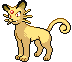

```
+ Level 1 - Icy Wind
+ Level 1 - Water Pulse
+ Level 12 - Hypnosis
+ Level 20 - Secret Power
+ Level 28 - Foul Play
```

**[#054 Psyduck](../pokemon/psyduck.md/)**


```
+ Level 1 - Petal Dance
+ Level 1 - Tri Attack
+ Level 12 - Hypnosis
+ Level 25 - Psybeam
```

**[#055 Golduck](../pokemon/golduck.md/)**


```
+ Level 12 - Hypnosis
+ Level 25 - Psybeam
+ Level 33 - Cross Chop
```

**[#057 Primeape](../pokemon/primeape.md/)**


```
+ Level 28 - Fire Punch
+ Level 28 - Thunder Punch
+ Level 28 - Ice Punch
```

**[#058 Growlithe](../pokemon/growlithe.md/)**


```
+ Level 11 - Double Kick
```

**[#059 Arcanine](../pokemon/arcanine.md/)**


```
+ Level 1 - Dragon Pulse
+ Level 25 - Crunch
+ Level 32 - Morning Sun
+ Level 47 - Close Combat
+ Level 56 - Flare Blitz
```

**[#060 Poliwag](../pokemon/poliwag.md/)**


```
+ Level 1 - Growth
+ Level 1 - Sweet Kiss
+ Level 1 - Lovely Kiss
+ Level 13 - Mud Shot
```

**[#061 Poliwhirl](../pokemon/poliwhirl.md/)**


```
+ Level 13 - Mud Shot
+ Level 25 - Metronome
```

**[#062 Poliwrath](../pokemon/poliwrath.md/)**


```
+ Level 1 - Vacuum Wave
+ Level 13 - Drain Punch
+ Level 22 - Ice Punch
+ Level 60 - Close Combat
```

**[#063 Abra](../pokemon/abra.md/)**

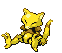

```
+ Level 1 - Foresight
+ Level 1 - Metronome
```

**[#064 Kadabra](../pokemon/kadabra.md/)**


```
+ Level 20 - Shock Wave
+ Level 32 - Gravity
```

**[#065 Alakazam](../pokemon/alakazam.md/)**


```
+ Level 1 - Gravity
+ Level 20 - Shock Wave
+ Level 32 - Gravity
+ Level 56 - Aura Sphere
```

**[#066 Machop](../pokemon/machop.md/)**


```
+ Level 1 - Thrash
+ Level 16 - Metronome
+ Level 52 - Close Combat
```

**[#067 Machoke](../pokemon/machoke.md/)**


```
+ Level 16 - Metronome
+ Level 59 - Close Combat
```

**[#068 Machamp](../pokemon/machamp.md/)**


```
+ Level 1 - Fire Punch
+ Level 1 - Thunder Punch
+ Level 1 - Ice Punch
+ Level 1 - Bullet Punch
+ Level 16 - Metronome
+ Level 59 - Close Combat
```

**[#069 Bellsprout](../pokemon/bellsprout.md/)**


```
+ Level 3 - Sweet Kiss
+ Level 5 - Lovely Kiss
+ Level 9 - Leech Life
+ Level 19 - Razor Leaf
+ Level 21 - Clear Smog
+ Level 51 - Power Whip
```

**[#070 Weepinbell](../pokemon/weepinbell.md/)**


```
+ Level 9 - Leech Life
+ Level 19 - Razor Leaf
+ Level 21 - Clear Smog
+ Level 51 - Power Whip
```

**[#071 Victreebel](../pokemon/victreebel.md/)**


```
+ Level 1 - Weather Ball
+ Level 17 - Sucker Punch
+ Level 37 - Crunch
```

**[#072 Tentacool](../pokemon/tentacool.md/)**


```
+ Level 1 - Confuse Ray
+ Level 59 - Acupressure
```

**[#073 Tentacruel](../pokemon/tentacruel.md/)**


```
+ Level 66 - Acupressure
```

**[#074 Geodude](../pokemon/geodude.md/)**


```
+ Level 1 - Rapid Spin
```

**[#075 Graveler](../pokemon/graveler.md/)**


```
+ Level 1 - Rapid Spin
```

**[#076 Golem](../pokemon/golem.md/)**


```
+ Level 1 - Rapid Spin
+ Level 1 - Fire Punch
+ Level 1 - Thunder Punch
= Level 18 - Bulldoze
= Level 36 - Steamroller
+ Level 70 - Hammer Arm
```

**[#077 Ponyta](../pokemon/ponyta.md/)**


```
+ Level 1 - Baton Pass
+ Level 23 - Double Kick
+ Level 27 - Low Kick
+ Level 35 - Hypnosis
```

**[#078 Rapidash](../pokemon/rapidash.md/)**


```
+ Level 1 - Baton Pass
+ Level 1 - Morning Sun
+ Level 23 - Double Kick
+ Level 27 - Low Kick
+ Level 35 - Hypnosis
+ Level 53 - Horn Drill
```

**[#079 Slowpoke](../pokemon/slowpoke.md/)**


```
+ Level 21 - Brine
```

**[#080 Slowbro](../pokemon/slowbro.md/)**


```
+ Level 21 - Brine
```

**[#199 Slowking](../pokemon/slowking.md/)**


```
+ Level 21 - Brine
+ Level 62 - Aura Sphere
```

**[#081 Magnemite](../pokemon/magnemite.md/)**


```
+ Level 1 - Agility
+ Level 25 - Signal Beam
```

**[#082 Magneton](../pokemon/magneton.md/)**


```
+ Level 25 - Signal Beam
= Level 30 - Tri Attack
```

**[#462 Magnezone](../pokemon/magnezone.md/)**


```
+ Level 25 - Signal Beam
```

**[#083 Farfetch'd](../pokemon/farfetchd.md/)**


```
+ Level 16 - Revenge
+ Level 28 - Leaf Blade
+ Level 35 - Sacred Sword
+ Level 52 - Close Combat
```

**[#084 Doduo](../pokemon/doduo.md/)**


```
+ Level 1 - Low Kick
+ Level 54 - Brave Bird
```

**[#085 Dodrio](../pokemon/dodrio.md/)**


```
+ Level 31 - Drill Run
+ Level 66 - Brave Bird
```

**[#088 Grimer](../pokemon/grimer.md/)**


```
+ Level 15 - Shadow Sneak
+ Level 25 - Shadow Punch
```

**[#089 Muk](../pokemon/muk.md/)**


```
+ Level 1 - Curse
+ Level 15 - Shadow Sneak
+ Level 25 - Shadow Punch
```

**[#090 Shellder](../pokemon/shellder.md/)**


```
= Level 7 - Supersonic
+ Level 10 - Bubble Beam
```

**[#091 Cloyster](../pokemon/cloyster.md/)**


```
+ Level 1 - Rock Blast
+ Level 63 - Shell Smash
+ Level 71 - Hydro Pump
```

**[#092 Gastly](../pokemon/gastly.md/)**


```
+ Level 17 - Ominous Wind
+ Level 24 - Clear Smog
+ Level 31 - Icy Wind
```

**[#093 Haunter](../pokemon/haunter.md/)**


```
+ Level 17 - Ominous Wind
+ Level 24 - Clear Smog
+ Level 36 - Icy Wind
```

**[#094 Gengar](../pokemon/gengar.md/)**


```
+ Level 1 - Metronome
+ Level 17 - Ominous Wind
+ Level 24 - Clear Smog
+ Level 36 - Icy Wind
+ Level 68 - Aura Sphere
```

**[#095 Onix](../pokemon/onix.md/)**


```
+ Level 3 - Coil
```

**[#208 Steelix](../pokemon/steelix.md/)**


```
+ Level 3 - Coil
```

**[#096 Drowzee](../pokemon/drowzee.md/)**


```
+ Level 1 - Amnesia
= Level 13 - Dream Eater
+ Level 19 - Drain Punch
+ Level 41 - Psycho Cut
```

**[#097 Hypno](../pokemon/hypno.md/)**


```
= Level 13 - Dream Eater
+ Level 19 - Drain Punch
+ Level 41 - Psycho Cut
```

**[#098 Krabby](../pokemon/krabby.md/)**


```
+ Level 49 - Superpower
```

**[#099 Kingler](../pokemon/kingler.md/)**


```
+ Level 70 - Superpower
```

**[#100 Voltorb](../pokemon/voltorb.md/)**


```
+ Level 1 - Agility
+ Level 24 - Signal Beam
```

**[#101 Electrode](../pokemon/electrode.md/)**


```
+ Level 24 - Signal Beam
```

**[#102 Exeggcute](../pokemon/exeggcute.md/)**


```
+ Level 1 - Sweet Scent
= Level 14 - Confusion
+ Level 25 - Synthesis
+ Level 27 - Giga Drain
```

**[#103 Exeggutor](../pokemon/exeggutor.md/)**


```
+ Level 1 - Nature Power
+ Level 1 - Low Kick
```

**[#104 Cubone](../pokemon/cubone.md/)**


```
+ Level 51 - Belly Drum
+ Level 55 - Perish Song
```

**[#105 Marowak](../pokemon/marowak.md/)**


```
+ Level 1 - Sing
+ Level 1 - Fire Punch
+ Level 1 - Thunder Punch
+ Level 64 - Belly Drum
+ Level 70 - Perish Song
```

**[#106 Hitmonlee](../pokemon/hitmonlee.md/)**


```
+ Level 65 - Bounce
```

**[#107 Hitmonchan](../pokemon/hitmonchan.md/)**


```
+ Level 36 - Drain Punch
```

**[#108 Lickitung](../pokemon/lickitung.md/)**


```
+ Level 61 - Belly Drum
+ Level 65 - Hammer Arm
```

**[#463 Lickilicky](../pokemon/lickilicky.md/)**


```
+ Level 65 - Belly Drum
+ Level 69 - Hammer Arm
```

**[#109 Koffing](../pokemon/koffing.md/)**


```
+ Level 59 - Pain Split
+ Level 63 - Destiny Bond
+ Level 67 - Gunk Shot
```

**[#110 Weezing](../pokemon/weezing.md/)**


```
+ Level 71 - Pain Split
+ Level 77 - Destiny Bond
+ Level 83 - Gunk Shot
```

**[#111 Rhyhorn](../pokemon/rhyhorn.md/)**


```
+ Level 27 - Crunch
+ Level 49 - Dragon Rush
+ Level 73 - Double-Edge
```

**[#112 Rhydon](../pokemon/rhydon.md/)**


```
+ Level 1 - Superpower
+ Level 27 - Crunch
+ Level 52 - Dragon Rush
+ Level 85 - Double-Edge
```

**[#464 Rhyperior](../pokemon/rhyperior.md/)**


```
+ Level 1 - Fire Fang
+ Level 1 - Thunder Fang
+ Level 1 - Ice Fang
+ Level 1 - Superpower
+ Level 27 - Crunch
+ Level 52 - Dragon Rush
+ Level 85 - Double-Edge
```

**[#440 Happiny](../pokemon/happiny.md/)**


```
+ Level 1 - Wish
+ Level 1 - Seismic Toss
+ Level 16 - Last Resort
```

**[#113 Chansey](../pokemon/chansey.md/)**


```
+ Level 1 - Sweet Scent
+ Level 25 - Counter
+ Level 29 - Aromatherapy
+ Level 58 - Gravity
```

**[#242 Blissey](../pokemon/blissey.md/)**


```
+ Level 25 - Counter
+ Level 29 - Aromatherapy
+ Level 58 - Gravity
```

**[#114 Tangela](../pokemon/tangela.md/)**


```
+ Level 1 - Synthesis
+ Level 17 - Nature Power
+ Level 31 - Giga Drain
```

**[#465 Tangrowth](../pokemon/tangrowth.md/)**


```
+ Level 1 - Synthesis
+ Level 17 - Nature Power
+ Level 31 - Giga Drain
+ Level 60 - Leaf Storm
```

**[#115 Kangaskhan](../pokemon/kangaskhan.md/)**


```
+ Level 1 - Fire Punch
+ Level 1 - Thunder Punch
+ Level 1 - Ice Punch
+ Level 1 - Feint Attack
+ Level 40 - Drain Punch
+ Level 61 - Double-Edge
```

**[#116 Horsea](../pokemon/horsea.md/)**


```
+ Level 1 - Haze
+ Level 1 - Dragon Rage
+ Level 21 - Octazooka
+ Level 32 - Dragon Breath
```

**[#117 Seadra](../pokemon/seadra.md/)**


```
+ Level 1 - Dragon Rage
+ Level 21 - Octazooka
+ Level 32 - Dragon Breath
```

**[#230 Kingdra](../pokemon/kingdra.md/)**


```
+ Level 1 - Dragon Rage
+ Level 21 - Octazooka
+ Level 32 - Dragon Breath
+ Level 65 - Outrage
```

**[#118 Goldeen](../pokemon/goldeen.md/)**


```
+ Level 1 - Swords Dance
+ Level 64 - Bounce
```

**[#119 Seaking](../pokemon/seaking.md/)**


```
+ Level 1 - Aqua Tail
+ Level 1 - Swords Dance
+ Level 33 - Body Slam
+ Level 81 - Bounce
```

**[#120 Staryu](../pokemon/staryu.md/)**


```
+ Level 22 - Signal Beam
```

**[#121 Starmie](../pokemon/starmie.md/)**


```
+ Level 1 - Twister
+ Level 46 - Pain Split
+ Level 64 - Aura Sphere
```

**[#439 Mime Jr.](../pokemon/mime-jr.md/)**


```
+ Level 13 - Hypnosis
+ Level 27 - Nasty Plot
```

**[#123 Scyther](../pokemon/scyther.md/)**


```
+ Level 1 - Sonic Boom
+ Level 1 - Night Slash
+ Level 65 - Bug Bite
```

**[#212 Scizor](../pokemon/scizor.md/)**


```
+ Level 1 - Crabhammer
+ Level 1 - Night Slash
+ Level 65 - Bug Bite
```

**[#238 Smoochum](../pokemon/smoochum.md/)**


```
+ Level 1 - Petal Dance
+ Level 30 - Metronome
+ Level 51 - Nasty Plot
```

**[#124 Jynx](../pokemon/jynx.md/)**


```
+ Level 1 - Petal Dance
+ Level 1 - Wish
+ Level 1 - Water Pulse
+ Level 65 - Nasty Plot
+ Level 71 - Psycho Boost
```

**[#239 Elekid](../pokemon/elekid.md/)**


```
+ Level 1 - Dizzy Punch
+ Level 30 - Pursuit
+ Level 38 - Cross Chop
```

**[#125 Electabuzz](../pokemon/electabuzz.md/)**


```
+ Level 30 - Zap Cannon
+ Level 41 - Cross Chop
```

**[#466 Electivire](../pokemon/electivire.md/)**


```
+ Level 1 - Ice Punch
- Level 32 - Circle Throw
+ Level 41 - Cross Chop
- Level 50 - Close Combat
- Level 62 - Volt Tackle
```

**[#240 Magby](../pokemon/magby.md/)**

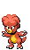

```
+ Level 30 - Feint Attack
+ Level 36 - Cross Chop
```

**[#126 Magmar](../pokemon/magmar.md/)**


```
+ Level 30 - Heat Wave
+ Level 41 - Cross Chop
```

**[#467 Magmortar](../pokemon/magmortar.md/)**


```
+ Level 1 - Nasty Plot
- Level 32 - Flare Blitz
+ Level 41 - Cross Chop
- Level 50 - Aura Sphere
- Level 62 - Magma Storm
```

**[#127 Pinsir](../pokemon/pinsir.md/)**


```
+ Level 1 - Rock Throw
+ Level 57 - Close Combat
+ Level 62 - Megahorn
+ Level 67 - Horn Leech
```

**[#128 Tauros](../pokemon/tauros.md/)**


```
+ Level 1 - Quick Attack
+ Level 63 - Double-Edge
+ Level 72 - Megahorn
= Level 81 - Giga Impact
```

**[#129 Magikarp](../pokemon/magikarp.md/)**


```
+ Level 1 - Bubble
+ Level 1 - Bounce
+ Level 1 - Reversal
```

**[#130 Gyarados](../pokemon/gyarados.md/)**


```
+ Level 50 - Crunch
+ Level 53 - Outrage
```

**[#131 Lapras](../pokemon/lapras.md/)**


```
+ Level 1 - Bite
+ Level 1 - Future Sight
+ Level 53 - Dragon Dance
+ Level 57 - Outrage
+ Level 61 - Aqua Tail
= Level 65 - Sheer Cold
+ Level 69 - Shell Smash
```

**[#133 Eevee](../pokemon/eevee.md/)**


```
+ Level 1 - Growth
= Level 13 - Growl
= Level 18 - Quick Attack
= Level 23 - Bite
+ Level 28 - Yawn
= Level 33 - Baton Pass
= Level 38 - Take Down
+ Level 43 - Wish
= Level 48 - Last Resort
= Level 53 - Trump Card
```

**[#134 Vaporeon](../pokemon/vaporeon.md/)**


```
+ Level 1 - Growth
= Level 13 - Water Gun
= Level 18 - Quick Attack
= Level 23 - Bite
+ Level 28 - Water Pulse
= Level 33 - Aurora Beam
= Level 38 - Aqua Ring
+ Level 43 - Scald
= Level 48 - Last Resort
= Level 53 - Haze
= Level 58 - Acid Armor
= Level 63 - Hydro Pump
= Level 68 - Muddy Water
+ Level 73 - Heal Bell
```

**[#135 Jolteon](../pokemon/jolteon.md/)**


```
+ Level 1 - Growth
= Level 13 - Thunder Shock
= Level 18 - Quick Attack
+ Level 23 - Bite
+ Level 28 - Shock Wave
= Level 33 - Pin Missile
= Level 38 - Thunder Fang
+ Level 43 - Electro Ball
= Level 48 - Last Resort
= Level 53 - Thunder Wave
= Level 58 - Agility
= Level 63 - Thunder
= Level 68 - Discharge
+ Level 73 - Volt Tackle
```

**[#136 Flareon](../pokemon/flareon.md/)**


```
+ Level 1 - Growth
= Level 13 - Ember
= Level 18 - Quick Attack
+ Level 23 - Double Kick
+ Level 28 - Flame Wheel
= Level 33 - Fire Spin
= Level 38 - Fire Fang
+ Level 43 - Superpower
= Level 48 - Last Resort
= Level 53 - Smog
= Level 58 - Scary Face
= Level 63 - Fire Blast
= Level 68 - Lava Plume
+ Level 73 - Flare Blitz
```

**[#196 Espeon](../pokemon/espeon.md/)**


```
+ Level 1 - Growth
= Level 13 - Confusion
= Level 18 - Quick Attack
+ Level 23 - Bite
+ Level 28 - Power Gem
= Level 33 - Psybeam
= Level 38 - Future Sight
+ Level 43 - Fake Tears
= Level 48 - Last Resort
= Level 53 - Psych Up
= Level 58 - Psychic
= Level 63 - Morning Sun
= Level 68 - Power Swap
+ Level 73 - Aura Sphere
```

**[#197 Umbreon](../pokemon/umbreon.md/)**


```
+ Level 1 - Growth
= Level 13 - Pursuit
= Level 18 - Quick Attack
+ Level 23 - Bite
+ Level 28 - Tickle
= Level 33 - Feint Attack
= Level 38 - Assurance
+ Level 43 - Foul Play
= Level 48 - Last Resort
= Level 53 - Mean Look
= Level 58 - Screech
= Level 63 - Moonlight
= Level 68 - Guard Swap
+ Level 73 - Power Trick
```

**[#470 Leafeon](../pokemon/leafeon.md/)**

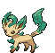

```
+ Level 1 - Growth
= Level 13 - Razor Leaf
= Level 18 - Quick Attack
= Level 23 - Synthesis
+ Level 28 - Aromatherapy
= Level 33 - Magical Leaf
= Level 38 - Giga Drain
+ Level 43 - Dragon Rush
= Level 48 - Last Resort
= Level 53 - Grass Whistle
= Level 58 - Sunny Day
= Level 63 - Leaf Blade
= Level 68 - Swords Dance
+ Level 73 - Wood Hammer
```

**[#471 Glaceon](../pokemon/glaceon.md/)**


```
+ Level 1 - Growth
= Level 13 - Icy Wind
= Level 18 - Quick Attack
= Level 23 - Bite
+ Level 28 - Aurora Beam
= Level 33 - Ice Shard
= Level 38 - Ice Fang
+ Level 43 - Earth Power
= Level 48 - Last Resort
= Level 53 - Mirror Coat
= Level 58 - Hail
= Level 63 - Blizzard
= Level 68 - Barrier
+ Level 73 - Sheer Cold
```

**[#137 Porygon](../pokemon/porygon.md/)**


```
+ Level 1 - Transform
+ Level 1 - Barrier
+ Level 67 - Gravity
```

**[#233 Porygon2](../pokemon/porygon2.md/)**


```
+ Level 1 - Transform
+ Level 72 - Gravity
```

**[#474 Porygon-Z](../pokemon/porygon-z.md/)**


```
+ Level 1 - Transform
+ Level 1 - Dark Pulse
+ Level 1 - Pain Split
+ Level 72 - Gravity
```

**[#138 Omanyte](../pokemon/omanyte.md/)**


```
+ Level 40 - Power Gem
+ Level 58 - Earth Power
```

**[#139 Omastar](../pokemon/omastar.md/)**


```
+ Level 40 - Power Gem
+ Level 83 - Earth Power
```

**[#142 Aerodactyl](../pokemon/aerodactyl.md/)**


```
+ Level 81 - Dragon Dance
+ Level 89 - Head Smash
= Level 97 - Giga Impact
```

**[#446 Munchlax](../pokemon/munchlax.md/)**


```
+ Level 1 - Sweet Kiss
+ Level 1 - Lovely Kiss
+ Level 62 - Slack Off
+ Level 67 - Double-Edge
+ Level 72 - Self Destruct
```

**[#143 Snorlax](../pokemon/snorlax.md/)**


```
+ Level 1 - Gunk Shot
+ Level 1 - Seed Bomb
+ Level 62 - Slack Off
+ Level 67 - Double-Edge
+ Level 72 - Self Destruct
```

**[#147 Dratini](../pokemon/dratini.md/)**


```
+ Level 1 - Hydro Pump
+ Level 61 - Dragon Pulse
= Level 65 - Hyper Beam
```

**[#148 Dragonair](../pokemon/dragonair.md/)**


```
+ Level 1 - Hydro Pump
+ Level 1 - Coil
+ Level 75 - Dragon Pulse
= Level 81 - Hyper Beam
```

**[#149 Dragonite](../pokemon/dragonite.md/)**


```
+ Level 1 - Hydro Pump
+ Level 1 - Extreme Speed
+ Level 75 - Dragon Pulse
= Level 89 - Hyper Beam
```

---

## Johto Pokémon

**[#152 Chikorita](../pokemon/chikorita.md/)**


```
+ Level 9 - Stun Spore
+ Level 9 - Sleep Powder
+ Level 15 - Nature Power
+ Level 48 - Leaf Storm
```

**[#153 Bayleef](../pokemon/bayleef.md/)**


```
+ Level 9 - Stun Spore
+ Level 9 - Sleep Powder
+ Level 15 - Nature Power
+ Level 58 - Leaf Storm
```

**[#154 Meganium](../pokemon/meganium.md/)**

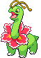

```
+ Level 1 - Grass Whistle
+ Level 9 - Stun Spore
+ Level 9 - Sleep Powder
+ Level 15 - Nature Power
+ Level 72 - Leaf Storm
```

**[#155 Cyndaquil](../pokemon/cyndaquil.md/)**


```
+ Level 16 - Extrasensory
+ Level 52 - Nature Power
```

**[#156 Quilava](../pokemon/quilava.md/)**


```
+ Level 16 - Extrasensory
+ Level 61 - Nature Power
```

**[#157 Typhlosion](../pokemon/typhlosion.md/)**


```
+ Level 1 - Earth Power
+ Level 1 - Thunder Punch
+ Level 16 - Extrasensory
+ Level 65 - Nature Power
```

**[#158 Totodile](../pokemon/totodile.md/)**


```
+ Level 54 - Dragon Dance
```

**[#159 Croconaw](../pokemon/croconaw.md/)**


```
+ Level 64 - Dragon Dance
```

**[#160 Feraligatr](../pokemon/feraligatr.md/)**


```
+ Level 1 - Submission
+ Level 1 - Ice Punch
+ Level 81 - Dragon Dance
```

**[#161 Sentret](../pokemon/sentret.md/)**


```
+ Level 1 - Dizzy Punch
+ Level 22 - Super Fang
```

**[#162 Furret](../pokemon/furret.md/)**


```
+ Level 25 - Super Fang
```

**[#163 Hoothoot](../pokemon/hoothoot.md/)**


```
+ Level 1 - Night Shade
+ Level 61 - Nasty Plot
```

**[#164 Noctowl](../pokemon/noctowl.md/)**


```
+ Level 1 - Ominous Wind
+ Level 1 - Silver Wind
+ Level 1 - Heat Wave
+ Level 72 - Nasty Plot
```

**[#166 Ledian](../pokemon/ledian.md/)**

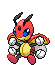

```
+ Level 18 - Fire Punch
+ Level 18 - Thunder Punch
+ Level 18 - Ice Punch
+ Level 18 - Drain Punch
+ Level 18 - Dizzy Punch
```

**[#167 Spinarak](../pokemon/spinarak.md/)**


```
+ Level 12 - Bug Bite
+ Level 17 - Electroweb
```

**[#168 Ariados](../pokemon/ariados.md/)**


```
+ Level 12 - Bug Bite
+ Level 17 - Electroweb
```

**[#170 Chinchou](../pokemon/chinchou.md/)**


```
+ Level 1 - Light Screen
```

**[#175 Togepi](../pokemon/togepi.md/)**


```
+ Level 1 - Extrasensory
+ Level 15 - Tri Attack
+ Level 27 - Stored Power
+ Level 31 - Soft Boiled
```

**[#176 Togetic](../pokemon/togetic.md/)**


```
+ Level 1 - Extrasensory
+ Level 15 - Tri Attack
+ Level 27 - Stored Power
+ Level 31 - Soft Boiled
```

**[#468 Togekiss](../pokemon/togekiss.md/)**


```
+ Level 1 - Heat Wave
+ Level 1 - Roost
+ Level 50 - Nasty Plot
```

**[#177 Natu](../pokemon/natu.md/)**


```
+ Level 1 - Safeguard
- Level 1 - Air Cutter
+ Level 14 - Confusion
+ Level 30 - Psycho Cut
+ Level 42 - Air Slash
```

**[#178 Xatu](../pokemon/xatu.md/)**


```
- Level 1 - Air Cutter
+ Level 14 - Confusion
+ Level 33 - Psycho Cut
+ Level 51 - Air Slash
```

**[#179 Mareep](../pokemon/mareep.md/)**


```
+ Level 1 - Charge
+ Level 16 - Shock Wave
+ Level 60 - Zap Cannon
```

**[#180 Flaaffy](../pokemon/flaaffy.md/)**


```
+ Level 1 - Charge
+ Level 17 - Shock Wave
+ Level 71 - Zap Cannon
```

**[#181 Ampharos](../pokemon/ampharos.md/)**


```
+ Level 1 - Tail Glow
+ Level 1 - Dragon Pulse
+ Level 1 - Charge
+ Level 17 - Shock Wave
+ Level 87 - Zap Cannon
```

**[#298 Azurill](../pokemon/azurill.md/)**


```
+ Level 21 - Sing
```

**[#183 Marill](../pokemon/marill.md/)**


```
+ Level 1 - Dizzy Punch
+ Level 21 - Aqua Jet
+ Level 25 - Ice Punch
+ Level 47 - Superpower
```

**[#184 Azumarill](../pokemon/azumarill.md/)**


```
+ Level 21 - Aqua Jet
+ Level 30 - Ice Punch
+ Level 61 - Superpower
```

**[#185 Sudowoodo](../pokemon/sudowoodo.md/)**


```
+ Level 1 - Fire Punch
+ Level 1 - Thunder Punch
+ Level 1 - Ice Punch
+ Level 53 - Self Destruct
```

**[#187 Hoppip](../pokemon/hoppip.md/)**


```
+ Level 1 - Agility
+ Level 52 - Cotton Guard
```

**[#188 Skiploom](../pokemon/skiploom.md/)**


```
+ Level 64 - Cotton Guard
```

**[#189 Jumpluff](../pokemon/jumpluff.md/)**


```
+ Level 74 - Cotton Guard
+ Level 79 - Aromatherapy
```

**[#190 Aipom](../pokemon/aipom.md/)**


```
+ Level 47 - Fake Out
```

**[#424 Ambipom](../pokemon/ambipom.md/)**


```
+ Level 1 - Fire Punch
+ Level 1 - Thunder Punch
+ Level 1 - Ice Punch
+ Level 47 - Fake Out
```

**[#191 Sunkern](../pokemon/sunkern.md/)**


```
= Level 4 - Mega Drain
= Level 7 - Ingrain
= Level 10 - Grass Whistle
= Level 13 - Leech Seed
= Level 16 - Endeavor
= Level 19 - Worry Seed
+ Level 20 - Nature Power
= Level 22 - Razor Leaf
= Level 25 - Synthesis
= Level 28 - Sunny Day
= Level 31 - Giga Drain
+ Level 32 - Earth Power
= Level 34 - Seed Bomb
+ Level 38 - Morning Sun
```

**[#192 Sunflora](../pokemon/sunflora.md/)**


```
= Level 4 - Mega Drain
= Level 7 - Ingrain
= Level 10 - Grass Whistle
= Level 13 - Leech Seed
= Level 16 - Bullet Seed
= Level 19 - Worry Seed
+ Level 20 - Nature Power
= Level 22 - Razor Leaf
= Level 25 - Petal Dance
= Level 28 - Sunny Day
= Level 31 - Solar Beam
+ Level 32 - Earth Power
= Level 34 - Leaf Storm
+ Level 38 - Fiery Dance
```

**[#193 Yanma](../pokemon/yanma.md/)**


```
+ Level 1 - Steel Wing
+ Level 20 - Air Cutter
+ Level 25 - Signal Beam
+ Level 36 - Giga Drain
```

**[#469 Yanmega](../pokemon/yanmega.md/)**


```
+ Level 20 - Air Cutter
+ Level 25 - Signal Beam
+ Level 36 - Giga Drain
```

**[#194 Wooper](../pokemon/wooper.md/)**


```
+ Level 1 - Belly Drum
+ Level 12 - Acid Spray
+ Level 26 - Aqua Tail
+ Level 51 - Recover
```

**[#195 Quagsire](../pokemon/quagsire.md/)**


```
+ Level 1 - Body Slam
+ Level 12 - Acid Spray
+ Level 28 - Aqua Tail
+ Level 58 - Recover
```

**[#198 Murkrow](../pokemon/murkrow.md/)**


```
+ Level 1 - Beat Up
+ Level 35 - Drill Peck
+ Level 71 - Brave Bird
```

**[#430 Honchkrow](../pokemon/honchkrow.md/)**


```
+ Level 1 - Heat Wave
+ Level 35 - Drill Peck
+ Level 85 - Brave Bird
```

**[#200 Misdreavus](../pokemon/misdreavus.md/)**


```
+ Level 60 - Nasty Plot
+ Level 64 - Hypnosis
+ Level 69 - Destiny Bond
```

**[#429 Mismagius](../pokemon/mismagius.md/)**


```
+ Level 1 - Inferno
+ Level 25 - Wonder Room
+ Level 35 - Icy Wind
+ Level 45 - Nasty Plot
+ Level 55 - Hypnosis
+ Level 65 - Destiny Bond
```

**[#201 Unown](../pokemon/unown.md/)**


```
+ Level 11 - Secret Power
+ Level 21 - Nature Power
+ Level 31 - Ancient Power
+ Level 41 - Cosmic Power
+ Level 51 - Earth Power
+ Level 61 - Stored Power
```

**[#202 Wobbuffet](../pokemon/wobbuffet.md/)**


```
+ Level 15 - Mimic
```

**[#203 Girafarig](../pokemon/girafarig.md/)**


```
+ Level 51 - Nasty Plot
```

**[#204 Pineco](../pokemon/pineco.md/)**


```
+ Level 26 - Counter
```

**[#205 Forretress](../pokemon/forretress.md/)**


```
+ Level 26 - Counter
```

**[#206 Dunsparce](../pokemon/dunsparce.md/)**


```
+ Level 1 - Horn Drill
```

**[#209 Snubbull](../pokemon/snubbull.md/)**


```
+ Level 1 - Lovely Kiss
+ Level 1 - Metronome
+ Level 53 - Close Combat
```

**[#210 Granbull](../pokemon/granbull.md/)**


```
+ Level 1 - Metronome
+ Level 61 - Close Combat
```

**[#211 Qwilfish](../pokemon/qwilfish.md/)**


```
+ Level 1 - Double-Edge
+ Level 61 - Pain Split
```

**[#214 Heracross](../pokemon/heracross.md/)**


```
+ Level 3 - Bug Bite
+ Level 61 - Horn Leech
+ Level 67 - Horn Drill
```

**[#215 Sneasel](../pokemon/sneasel.md/)**


```
+ Level 1 - Moonlight
+ Level 32 - Ice Punch
+ Level 56 - Crunch
```

**[#461 Weavile](../pokemon/weavile.md/)**

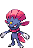

```
+ Level 1 - Fake Out
+ Level 32 - Ice Punch
+ Level 56 - Low Kick
```

**[#217 Ursaring](../pokemon/ursaring.md/)**


```
+ Level 1 - Fire Punch
+ Level 1 - Thunder Punch
+ Level 1 - Ice Punch
+ Level 1 - Drain Punch
+ Level 1 - Crunch
+ Level 30 - Close Combat
```

**[#218 Slugma](../pokemon/slugma.md/)**


```
+ Level 60 - Power Gem
```

**[#219 Magcargo](../pokemon/magcargo.md/)**


```
+ Level 74 - Power Gem
```

**[#220 Swinub](../pokemon/swinub.md/)**


```
+ Level 11 - Icicle Spear
+ Level 23 - Body Slam
+ Level 30 - Avalanche
+ Level 42 - Icicle Crash
```

**[#221 Piloswine](../pokemon/piloswine.md/)**


```
+ Level 11 - Icicle Spear
+ Level 23 - Body Slam
+ Level 30 - Avalanche
+ Level 52 - Icicle Crash
```

**[#473 Mamoswine](../pokemon/mamoswine.md/)**


```
+ Level 1 - Superpower
+ Level 1 - Ice Shard
+ Level 11 - Icicle Spear
+ Level 23 - Body Slam
+ Level 30 - Avalanche
+ Level 52 - Icicle Crash
```

**[#223 Remoraid](../pokemon/remoraid.md/)**

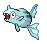

```
+ Level 1 - Mist
+ Level 1 - Amnesia
```

**[#224 Octillery](../pokemon/octillery.md/)**


```
+ Level 1 - Seed Bomb
+ Level 1 - Acid Spray
```

**[#225 Delibird](../pokemon/delibird.md/)**


```
+ Level 1 - Powder Snow
+ Level 1 - Pay Day
+ Level 8 - Acrobatics
+ Level 15 - Mist
+ Level 22 - Quick Attack
+ Level 29 - Baton Pass
+ Level 36 - Frost Breath
+ Level 43 - Seed Bomb
+ Level 50 - Fake Out
+ Level 57 - Blizzard
+ Level 64 - Nasty Plot
+ Level 71 - Hurricane
+ Level 78 - Tailwind
```

**[#458 Mantyke](../pokemon/mantyke.md/)**


```
+ Level 53 - Mirror Coat
```

**[#226 Mantine](../pokemon/mantine.md/)**

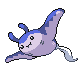

```
+ Level 1 - Gust
+ Level 53 - Mirror Coat
```

**[#227 Skarmory](../pokemon/skarmory.md/)**


```
+ Level 1 - Fury Cutter
+ Level 22 - Sky Drop
= Level 24 - Air Cutter
+ Level 26 - Roost
+ Level 37 - Drill Peck
+ Level 56 - Brave Bird
```

**[#228 Houndour](../pokemon/houndour.md/)**


```
+ Level 23 - Snarl
+ Level 38 - Dark Pulse
```

**[#229 Houndoom](../pokemon/houndoom.md/)**


```
+ Level 23 - Snarl
+ Level 43 - Dark Pulse
```

**[#231 Phanpy](../pokemon/phanpy.md/)**


```
+ Level 21 - Seed Bomb
```

**[#232 Donphan](../pokemon/donphan.md/)**


```
+ Level 1 - Counter
+ Level 21 - Ice Shard
+ Level 63 - Head Smash
```

**[#234 Stantler](../pokemon/stantler.md/)**


```
+ Level 45 - Horn Leech
+ Level 58 - Megahorn
```

**[#241 Miltank](../pokemon/miltank.md/)**


```
+ Level 1 - Mega Kick
+ Level 61 - Hammer Arm
+ Level 67 - Double-Edge
```

**[#243 Raikou](../pokemon/raikou.md/)**


```
+ Level 1 - Aura Sphere
+ Level 1 - Extreme Speed
+ Level 1 - Weather Ball
+ Level 1 - Zap Cannon
```

**[#244 Entei](../pokemon/entei.md/)**


```
+ Level 1 - Flare Blitz
+ Level 1 - Extreme Speed
+ Level 1 - Howl
+ Level 1 - Crush Claw
```

**[#245 Suicune](../pokemon/suicune.md/)**


```
+ Level 1 - Air Slash
+ Level 1 - Extreme Speed
+ Level 1 - Sheer Cold
+ Level 1 - Aqua Ring
```

**[#246 Larvitar](../pokemon/larvitar.md/)**


```
+ Level 1 - Stealth Rock
+ Level 25 - Iron Tail
```

**[#247 Pupitar](../pokemon/pupitar.md/)**


```
+ Level 1 - Stealth Rock
+ Level 25 - Iron Defense
```

**[#248 Tyranitar](../pokemon/tyranitar.md/)**


```
+ Level 1 - Fire Punch
+ Level 1 - Stealth Rock
+ Level 25 - Iron Tail
+ Level 55 - Dragon Dance
```

**[#251 Celebi](../pokemon/celebi.md/)**


```
+ Level 1 - Nasty Plot
```

---

## Hoenn Pokémon

**[#253 Grovyle](../pokemon/grovyle.md/)**


```
+ Level 16 - Magical Leaf
```

**[#254 Sceptile](../pokemon/sceptile.md/)**


```
+ Level 1 - Thunder Punch
+ Level 1 - Low Kick
+ Level 16 - Magical Leaf
+ Level 36 - Dragon Pulse
```

**[#255 Torchic](../pokemon/torchic.md/)**


```
+ Level 22 - Baton Pass
```

**[#256 Combusken](../pokemon/combusken.md/)**


```
+ Level 25 - Low Kick
```

**[#257 Blaziken](../pokemon/blaziken.md/)**


```
+ Level 1 - Thunder Punch
+ Level 1 - Night Slash
+ Level 25 - Low Kick
```

**[#258 Mudkip](../pokemon/mudkip.md/)**


```
+ Level 1 - Yawn
+ Level 21 - Ice Ball
```

**[#259 Marshtomp](../pokemon/marshtomp.md/)**


```
+ Level 1 - Yawn
+ Level 57 - Superpower
```

**[#260 Swampert](../pokemon/swampert.md/)**


```
+ Level 1 - Yawn
+ Level 1 - Counter
+ Level 1 - Mirror Coat
+ Level 77 - Superpower
```

**[#262 Mightyena](../pokemon/mightyena.md/)**


```
+ Level 1 - Super Fang
+ Level 20 - Crunch
+ Level 20 - Fire Fang
+ Level 20 - Thunder Fang
+ Level 20 - Ice Fang
```

**[#264 Linoone](../pokemon/linoone.md/)**


```
+ Level 1 - Super Fang
+ Level 1 - Rock Climb
+ Level 20 - Extreme Speed
```

**[#265 Wurmple](../pokemon/wurmple.md/)**

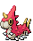

```
= Level 1 - Poison Sting
= Level 1 - Bug Bite
```

**[#267 Beautifly](../pokemon/beautifly.md/)**


```
+ Level 10 - Air Cutter
+ Level 10 - Struggle Bug
+ Level 17 - Sleep Powder
+ Level 49 - Air Slash
```

**[#269 Dustox](../pokemon/dustox.md/)**


```
+ Level 10 - Clear Smog
+ Level 10 - Struggle Bug
+ Level 17 - Reflect
+ Level 17 - Light Screen
+ Level 49 - Tailwind
```

**[#270 Lotad](../pokemon/lotad.md/)**


```
+ Level 9 - Water Gun
+ Level 13 - Leech Seed
+ Level 17 - Synthesis
+ Level 22 - Razor Leaf
```

**[#271 Lombre](../pokemon/lombre.md/)**


```
+ Level 9 - Water Gun
+ Level 13 - Leech Seed
+ Level 17 - Water Pulse
+ Level 22 - Razor Leaf
```

**[#272 Ludicolo](../pokemon/ludicolo.md/)**


```
+ Level 1 - Rain Dance
+ Level 1 - Teeter Dance
+ Level 1 - Fire Punch
+ Level 1 - Ice Punch
+ Level 1 - Thunder Punch
+ Level 1 - Drain Punch
+ Level 1 - Counter
+ Level 50 - Hydro Pump
```

**[#273 Seedot](../pokemon/seedot.md/)**


```
+ Level 1 - Bullet Seed
+ Level 1 - Quick Attack
+ Level 17 - Seed Bomb
+ Level 26 - Leech Seed
```

**[#274 Nuzleaf](../pokemon/nuzleaf.md/)**


```
+ Level 1 - Quick Attack
= Level 14 - Razor Leaf
+ Level 16 - Foul Play
+ Level 22 - Low Kick
+ Level 28 - Beat Up
+ Level 34 - Dark Pulse
```

**[#275 Shiftry](../pokemon/shiftry.md/)**


```
+ Level 1 - Hurricane
+ Level 1 - Silver Wind
+ Level 1 - Ominous Wind
+ Level 1 - Heat Wave
+ Level 1 - Icy Wind
+ Level 1 - Leaf Blade
+ Level 1 - Twister
+ Level 34 - Dark Pulse
```

**[#276 Taillow](../pokemon/taillow.md/)**


```
+ Level 16 - Mirror Move
+ Level 22 - Steel Wing
+ Level 59 - Brave Bird
```

**[#277 Swellow](../pokemon/swellow.md/)**


```
+ Level 1 - Superpower
+ Level 16 - Mirror Move
+ Level 22 - Extreme Speed
+ Level 69 - Brave Bird
```

**[#279 Pelipper](../pokemon/pelipper.md/)**


```
+ Level 1 - Shock Wave
```

**[#280 Ralts](../pokemon/ralts.md/)**


```
+ Level 15 - Psybeam
+ Level 19 - Shock Wave
+ Level 25 - Confuse Ray
```

**[#281 Kirlia](../pokemon/kirlia.md/)**


```
+ Level 15 - Psybeam
+ Level 19 - Shock Wave
+ Level 28 - Confuse Ray
```

**[#282 Gardevoir](../pokemon/gardevoir.md/)**


```
+ Level 15 - Psybeam
+ Level 19 - Shock Wave
+ Level 28 - Confuse Ray
+ Level 85 - Aura Sphere
```

**[#475 Gallade](../pokemon/gallade.md/)**


```
+ Level 1 - Sacred Sword
+ Level 1 - Fire Punch
+ Level 1 - Ice Punch
+ Level 1 - Thunder Punch
```

**[#283 Surskit](../pokemon/surskit.md/)**


```
+ Level 28 - Psybeam
+ Level 34 - Giga Drain
```

**[#284 Masquerain](../pokemon/masquerain.md/)**


```
+ Level 29 - Scald
+ Level 65 - Hydro Pump
+ Level 73 - Hurricane
```

**[#285 Shroomish](../pokemon/shroomish.md/)**


```
+ Level 13 - Bullet Seed
```

**[#286 Breloom](../pokemon/breloom.md/)**


```
+ Level 1 - Thunder Punch
+ Level 49 - Drain Punch
+ Level 53 - Spore
+ Level 57 - Focus Punch
```

**[#288 Vigoroth](../pokemon/vigoroth.md/)**


```
+ Level 18 - Night Slash
```

**[#289 Slaking](../pokemon/slaking.md/)**


```
+ Level 1 - Fire Punch
+ Level 1 - Ice Punch
+ Level 1 - Thunder Punch
+ Level 18 - Night Slash
+ Level 36 - Crush Claw
```

**[#290 Nincada](../pokemon/nincada.md/)**


```
+ Level 1 - Bug Bite
```

**[#291 Ninjask](../pokemon/ninjask.md/)**


```
+ Level 20 - Night Slash
+ Level 20 - Extreme Speed
```

**[#293 Whismur](../pokemon/whismur.md/)**


```
+ Level 1 - Fake Tears
```

**[#294 Loudred](../pokemon/loudred.md/)**


```
+ Level 1 - Fake Tears
```

**[#295 Exploud](../pokemon/exploud.md/)**


```
- Level 1 - Fire Punch
- Level 1 - Ice Punch
- Level 1 - Thunder Punch
+ Level 50 - Circle Throw
+ Level 67 - Hammer Arm
```

**[#297 Makuhita](../pokemon/makuhita.md/)**


```
+ Level 49 - Cross Chop
```

**[#297 Hariyama](../pokemon/hariyama.md/)**


```
+ Level 1 - Fire Punch
+ Level 1 - Ice Punch
+ Level 1 - Thunder Punch
+ Level 67 - Cross Chop
```

**[#299 Nosepass](../pokemon/nosepass.md/)**


```
+ Level 22 - Shock Wave
+ Level 28 - Ancient Power
= Level 37 - Earth Power
= Level 79 - Sandstorm
+ Level 85 - Head Smash
```

**[#476 Probopass](../pokemon/probopass.md/)**


```
+ Level 22 - Shock Wave
+ Level 28 - Ancient Power
= Level 37 - Earth Power
= Level 79 - Sandstorm
+ Level 85 - Head Smash
```

**[#300 Skitty](../pokemon/skitty.md/)**


```
+ Level 1 - Pay Day
```

**[#301 Delcatty](../pokemon/delcatty.md/)**


```
+ Level 25 - Wish
+ Level 35 - Captivate
+ Level 45 - Sucker Punch
+ Level 55 - Double-Edge
```

**[#302 Sableye](../pokemon/sableye.md/)**


```
+ Level 63 - Recover
+ Level 66 - Metal Burst
```

**[#303 Mawile](../pokemon/mawile.md/)**


```
+ Level 1 - Fire Fang
+ Level 1 - Ice Fang
+ Level 1 - Thunder Fang
+ Level 1 - Metal Claw
+ Level 21 - Thunder Punch
+ Level 21 - Ice Punch
+ Level 61 - Metal Burst
```

**[#306 Aggron](../pokemon/aggron.md/)**


```
+ Level 1 - Head Smash
+ Level 1 - Superpower
+ Level 1 - Bullet Punch
```

**[#307 Meditite](../pokemon/meditite.md/)**


```
= Level 20 - Force Palm
+ Level 28 - Psycho Cut
```

**[#308 Medicham](../pokemon/medicham.md/)**


```
= Level 20 - Force Palm
+ Level 28 - Psycho Cut
+ Level 37 - Drain Punch
+ Level 1 - Bullet Punch
```

**[#310 Manectric](../pokemon/manectric.md/)**


```
+ Level 26 - Flame Burst
```

**[#313 Volbeat](../pokemon/volbeat.md/)**

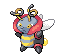

```
+ Level 15 - Thunder Shock
+ Level 19 - Struggle Bug
+ Level 23 - Shock Wave
+ Level 35 - Thunderbolt
+ Level 49 - Baton Pass
+ Level 53 - Tailwind
```

**[#314 Illumise](../pokemon/illumise.md/)**


```
+ Level 15 - Thunder Shock
+ Level 19 - Struggle Bug
+ Level 23 - Shock Wave
+ Level 31 - Quiver Dance
+ Level 35 - Thunderbolt
+ Level 49 - Baton Pass
+ Level 53 - Tailwind
```

**[#406 Budew](../pokemon/budew.md/)**


```
+ Level 19 - Extrasensory
+ Level 22 - Sleep Powder
+ Level 25 - Giga Drain
```

**[#315 Roselia](../pokemon/roselia.md/)**


```
+ Level 49 - Sleep Powder
+ Level 52 - Leaf Storm
+ Level 55 - Quiver Dance
```

**[#407 Roserade](../pokemon/roserade.md/)**


```
+ Level 55 - Petal Dance
```

**[#317 Swalot](../pokemon/swalot.md/)**


```
+ Level 1 - Seed Bomb
+ Level 1 - Pain Split
```

**[#318 Carvanha](../pokemon/carvanha.md/)**


```
+ Level 41 - Dark Pulse
+ Level 45 - Hydro Pump
```

**[#319 Sharpedo](../pokemon/sharpedo.md/)**


```
+ Level 1 - Super Fang
+ Level 1 - Zen Headbutt
+ Level 62 - Dark Pulse
+ Level 68 - Hydro Pump
```

**[#320 Wailmer](../pokemon/wailmer.md/)**


```
+ Level 53 - Fissure
```

**[#321 Wailord](../pokemon/wailord.md/)**


```
+ Level 1 - Zen Headbutt
+ Level 78 - Fissure
```

**[#323 Camerupt](../pokemon/camerupt.md/)**


```
+ Level 1 - Heat Wave
```

**[#324 Torkoal](../pokemon/torkoal.md/)**


```
+ Level 1 - Yawn
+ Level 58 - Earth Power
+ Level 68 – Eruption
+ Level 78 – Stealth Rock
```

**[#325 Spoink](../pokemon/spoink.md/)**


```
+ Level 27 - Extrasensory
+ Level 28 - Shock Wave
```

**[#326 Grumpig](../pokemon/grumpig.md/)**


```
+ Level 27 - Extrasensory
+ Level 28 - Shock Wave
```

**[#327 Spinda](../pokemon/spinda.md/)**


```
+ Level 1 - Fake Out
+ Level 1 - Metronome
+ Level 60 - Superpower
+ Level 63 - Psycho Boost
```

**[#328 Trapinch](../pokemon/trapinch.md/)**


```
+ Level 1 - Bug Bite
+ Level 35 - Giga Drain
```

**[#329 Vibrava](../pokemon/vibrava.md/)**


```
+ Level 35 - Dragon Dance
```

**[#330 Flygon](../pokemon/flygon.md/)**


```
+ Level 1 - Heat Wave
+ Level 1 - Giga Drain
+ Level 1 - Bug Buzz
+ Level 35 - Dragon Dance
+ Level 48 - Signal Beam
+ Level 51 - Earth Power
= Level 54 - Sandstorm
+ Level 57 - Dragon Pulse
= Level 61 - Dragon Tail
+ Level 65 - Quiver Dance
+ Level 69 - Outrage
= Level 73 - Hyper Beam
```

**[#331 Cacnea](../pokemon/cacnea.md/)**


```
+ Level 61 - Teeter Dance
```

**[#332 Cacturne](../pokemon/cacturne.md/)**


```
+ Level 1 - Nasty Plot
+ Level 1 - Thunder Punch
+ Level 33 - Seed Bomb
+ Level 33 - Dark Pulse
+ Level 77 - Teeter Dance
```

**[#333 Swablu](../pokemon/swablu.md/)**


```
+ Level 1 - Roost
```

**[#334 Altaria](../pokemon/altaria.md/)**


```
+ Level 1 - Roost
+ Level 42 - Hyper Voice
+ Level 50 - Outrage
```

**[#335 Zangoose](../pokemon/zangoose.md/)**


```
+ Level 1 - Fire Punch
+ Level 1 - Thunder Punch
+ Level 1 - Ice Punch
+ Level 1 - Night Slash
+ Level 57 - Final Gambit
+ Level 62 - Extreme Speed
```

**[#336 Seviper](../pokemon/seviper.md/)**


```
+ Level 67 - Gunk Shot
```

**[#337 Lunatone](../pokemon/lunatone.md/)**


```
+ Level 1 - Moonlight
+ Level 28 - Ancient Power
+ Level 37 - Earth Power
+ Level 48 - Hydro Pump
```

**[#338 Solrock](../pokemon/solrock.md/)**


```
+ Level 1 - Morning Sun
+ Level 28 - Zen Headbutt
+ Level 37 - Iron Head
+ Level 48 - Flare Blitz
```

**[#339 Barboach](../pokemon/barboach.md/)**


```
+ Level 51 - Dragon Dance
+ Level 54 - Hydro Pump
```

**[#340 Whiscash](../pokemon/whiscash.md/)**


```
+ Level 1 - Spark
+ Level 63 - Dragon Dance
+ Level 69 - Hydro Pump
```

**[#341 Corphish](../pokemon/corphish.md/)**


```
+ Level 50 - Dragon Dance
+ Level 56 - Superpower
```

**[#342 Crawdaunt](../pokemon/crawdaunt.md/)**


```
+ Level 1 - Avalanche
+ Level 61 - Dragon Dance
+ Level 70 - Superpower
```

**[#344 Claydol](../pokemon/claydol.md/)**


```
+ Level 1 - Gravity
```

**[#345 Lileep](../pokemon/lileep.md/)**


```
+ Level 71 - Earth Power
```

**[#346 Cradily](../pokemon/cradily.md/)**


```
+ Level 1 - Seed Bomb
+ Level 1 - Mirror Coat
+ Level 40 - Recover
+ Level 86 - Earth Power
```

**[#348 Armaldo](../pokemon/armaldo.md/)**


```
+ Level 1 - Aqua Tail
+ Level 1 - Superpower
+ Level 1 - Cross Poison
```

**[#349 Feebas](../pokemon/feebas.md/)**


```
+ Level 10 - Hypnosis
+ Level 20 - Brine
+ Level 25 - Dragon Pulse
```

**[#350 Milotic](../pokemon/milotic.md/)**


```
+ Level 53 - Mirror Coat
```

**[#352 Kecleon](../pokemon/kecleon.md/)**


```
+ Level 1 - Fake Out
+ Level 61 - Recover
```

**[#353 Shuppet](../pokemon/shuppet.md/)**


```
+ Level 1 - Shadow Sneak
+ Level 16 - Pain Split
+ Level 58 - Gunk Shot
```

**[#354 Banette](../pokemon/banette.md/)**


```
+ Level 1 - Shadow Sneak
+ Level 16 - Pain Split
+ Level 81 - Gunk Shot
```

**[#355 Duskull](../pokemon/duskull.md/)**


```
+ Level 49 - Trick
```

**[#356 Dusclops](../pokemon/dusclops.md/)**


```
+ Level 61 - Trick
```

**[#477 Dusknoir](../pokemon/dusknoir.md/)**


```
+ Level 61 - Trick
```

**[#357 Tropius](../pokemon/tropius.md/)**


```
+ Level 1 - Dragon Dance
+ Level 1 - Leaf Blade
+ Level 77 - Outrage
+ Level 81 - Hurricane
```

**[#433 Chingling](../pokemon/chingling.md/)**


```
+ Level 1 - Hypnosis
+ Level 1 - Recover
+ Level 30 - Hyper Voice
```

**[#358 Chimecho](../pokemon/chimecho.md/)**


```
+ Level 1 - Hypnosis
+ Level 1 - Recover
+ Level 30 - Hyper Voice
```

**[#359 Absol](../pokemon/absol.md/)**


```
+ Level 25 - Agility
+ Level 68 - Megahorn
+ Level 72 - Sucker Punch
+ Level 77 – Superpower
```

**[#362 Glalie](../pokemon/glalie.md/)**


```
- Level 37 - Avalanche
+ Level 42 - Rollout
+ Level 65 - Head Smash
+ Level 73 - Rock Wrecker
```

**[#478 Froslass](../pokemon/froslass.md/)**


```
- Level 37 - Ice Beam
```

**[#365 Walrein](../pokemon/walrein.md/)**


```
+ Level 1 - Curse
+ Level 1 - Super Fang
+ Level 1 - Aqua Tail
```

**[#366 Clamperl](../pokemon/clamperl.md/)**


```
+ Level 25 - Muddy Water
+ Level 30 - Barrier
= Level 35 - Shell Smash
```

**[#369 Relicanth](../pokemon/relicanth.md/)**


```
+ Level 1 - Zen Headbutt
```

**[#371 Bagon](../pokemon/bagon.md/)**


```
+ Level 61 - Dragon Dance
+ Level 65 - Outrage
```

**[#372 Shelgon](../pokemon/shelgon.md/)**

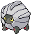

```
+ Level 66 - Dragon Dance
+ Level 72 - Outrage
```

**[#373 Salamence](../pokemon/salamence.md/)**


```
+ Level 1 - Hydro Pump
+ Level 1 - Roost
+ Level 75 - Dragon Dance
+ Level 85 - Outrage
```

**[#374 Beldum](../pokemon/beldum.md/)**


```
+ Level 1 - Zen Headbutt
+ Level 1 - Iron Head
+ Level 1 - Headbutt
```

**[#376 Metagross](../pokemon/metagross.md/)**


```
+ Level 1 - Thunder Punch
+ Level 1 - Ice Punch
```

---

## Sinnoh Pokémon

**[#387 Turtwig](../pokemon/turtwig.md/)**


```
+ Level 49 - Seed Bomb
```

**[#388 Grotle](../pokemon/grotle.md/)**


```
+ Level 57 - Seed Bomb
```

**[#389 Torterra](../pokemon/torterra.md/)**


```
+ Level 63 - Seed Bomb
+ Level 69 - Shell Smash
```

**[#392 Infernape](../pokemon/infernape.md/)**

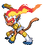

```
+ Level 1 - Fire Punch
+ Level 1 - Thunder Punch
+ Level 1 - Fake Out
```

**[#393 Piplup](../pokemon/piplup.md/)**


```
+ Level 13 - Brine
```

**[#394 Prinplup](../pokemon/prinplup.md/)**


```
+ Level 13 - Brine
```

**[#395 Empoleon](../pokemon/empoleon.md/)**


```
+ Level 13 - Brine
```

**[#396 Starly](../pokemon/starly.md/)**


```
+ Level 45 - Double-Edge
```

**[#397 Staravia](../pokemon/staravia.md/)**


```
+ Level 53 - Double-Edge
```

**[#398 Staraptor](../pokemon/staraptor.md/)**


```
+ Level 1 - Roost
+ Level 65 - Double-Edge
```

**[#399 Bidoof](../pokemon/bidoof.md/)**


```
+ Level 49 - Double-Edge
```

**[#400 Bibarel](../pokemon/bibarel.md/)**

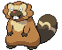

```
- Level 15 - Aqua Tail
+ Level 58 - Double-Edge
```

**[#401 Kricketot](../pokemon/kricketot.md/)**


```
= Level 1 - Struggle Bug
= Level 1 - Bug Bite
```

**[#403 Shinx](../pokemon/shinx.md/)**


```
= Level 1 - Bite
+ Level 17 - Thunder Wave
```

**[#404 Luxio](../pokemon/luxio.md/)**


```
= Level 1 - Bite
+ Level 15 - Double Kick
+ Level 18 - Night Slash
```

**[#405 Luxray](../pokemon/luxray.md/)**


```
= Level 1 - Bite
+ Level 1 - Fire Fang
+ Level 1 - Ice Fang
+ Level 15 - Double Kick
+ Level 18 - Night Slash
+ Level 30 - Dark Pulse
+ Level 70 - Volt Tackle
```

**[#408 Cranidos](../pokemon/cranidos.md/)**


```
+ Level 50 - Crunch
+ Level 55 - Hammer Arm
```

**[#409 Rampardos](../pokemon/rampardos.md/)**


```
+ Level 1 - Fire Punch
+ Level 1 - Thunder Punch
+ Level 64 - Crunch
+ Level 69 - Hammer Arm
```

**[#411 Bastiodon](../pokemon/bastiodon.md/)**


```
+ Level 1 - Magnet Rise
```

**[#412 Burmy](../pokemon/burmy.md/)**


```
+ Level 1 - String Shot
+ Level 1 - Snore
```

**[#414 Mothim](../pokemon/mothim.md/)**


```
+ Level 1 - Giga Drain
+ Level 20 - Air Cutter
+ Level 53 - Hurricane
```

**[#415 Combee](../pokemon/combee.md/)**


```
+ Level 16 - Tailwind
+ Level 19 - Endeavor
```

**[#416 Vespiquen](../pokemon/vespiquen.md/)**


```
+ Level 23 - Silver Wind
+ Level 29 - Acrobatics
```

**[#417 Pachirisu](../pokemon/pachirisu.md/)**


```
+ Level 53 - Fake Tears
+ Level 57 - Uproar
```

**[#418 Buizel](../pokemon/buizel.md/)**


```
+ Level 32 - Ice Punch
+ Level 40 - Tail Slap
```

**[#419 Floatzel](../pokemon/floatzel.md/)**


```
+ Level 1 - Low Kick
+ Level 34 - Ice Punch
+ Level 45 - Tail Slap
```

**[#421 Cherrim](../pokemon/cherrim.md/)**


```
+ Level 1 - Weather Ball
```

**[#422 Shellos](../pokemon/shellos.md/)**


```
+ Level 19 - Brine
+ Level 41 - Earth Power
```

**[#423 Gastrodon](../pokemon/gastrodon.md/)**


```
+ Level 1 - Counter
+ Level 1 - Mirror Coat
+ Level 19 - Brine
+ Level 47 - Earth Power
```

**[#425 Drifloon](../pokemon/drifloon.md/)**


```
+ Level 49 - Hypnosis
+ Level 52 - Destiny Bond
+ Level 55 - Tailwind
+ Level 58 - Hurricane
```

**[#426 Drifblim](../pokemon/drifblim.md/)**


```
+ Level 1 - Shock Wave
+ Level 28 - Air Cutter
+ Level 61 - Hypnosis
+ Level 66 - Destiny Bond
+ Level 71 - Tailwind
+ Level 76 - Hurricane
```

**[#427 Buneary](../pokemon/buneary.md/)**


```
+ Level 19 - Fake Out
+ Level 29 - Sky Uppercut
+ Level 39 - Heal Bell
```

**[#428 Lopunny](../pokemon/lopunny.md/)**


```
+ Level 19 - Fake Out
+ Level 29 - Sky Uppercut
+ Level 39 - Heal Bell
```

**[#431 Glameow](../pokemon/glameow.md/)**


```
+ Level 11 - Bite
+ Level 52 - Super Fang
```

**[#432 Purugly](../pokemon/purugly.md/)**


```
+ Level 11 - Bite
+ Level 68 - Super Fang
```

**[#434 Stunky](../pokemon/stunky.md/)**


```
+ Level 18 - Sucker Punch
+ Level 25 - Flame Burst
+ Level 55 - Foul Play
```

**[#435 Skuntank](../pokemon/skuntank.md/)**


```
+ Level 18 - Sucker Punch
+ Level 25 - Flame Burst
+ Level 71 - Foul Play
```

**[#436 Bronzor](../pokemon/bronzor.md/)**


```
+ Level 16 - Rollout
+ Level 23 - Curse
```

**[#437 Bronzong](../pokemon/bronzong.md/)**


```
+ Level 1 - Trick
+ Level 1 - Gravity
+ Level 16 - Rollout
+ Level 23 - Curse
```

**[#441 Chatot](../pokemon/chatot.md/)**


```
+ Level 1 - Nasty Plot
+ Level 61 - Hurricane
+ Level 65 - Heat Wave
```

**[#442 Spiritomb](../pokemon/spiritomb.md/)**


```
+ Level 1 - Icy Wind
+ Level 55 - Shadow Sneak
+ Level 61 - Pain Split
```

**[#443 Gible](../pokemon/gible.md/)**


```
+ Level 44 - Outrage
```

**[#444 Gabite](../pokemon/gabite.md/)**


```
+ Level 58 - Outrage
```

**[#445 Garchomp](../pokemon/garchomp.md/)**


```
+ Level 1 - Aqua Tail
+ Level 63 - Outrage
+ Level 69 - Extreme Speed
```

**[#447 Riolu](../pokemon/riolu.md/)**


```
+ Level 1 - Vacuum Wave
+ Level 22 - Crunch
+ Level 26 - Low Kick
+ Level 33 - High Jump Kick
```

**[#448 Lucario](../pokemon/lucario.md/)**


```
+ Level 1 - Blaze Kick
+ Level 1 - Thunder Punch
+ Level 1 - Ice Punch
```

**[#449 Hippopotas](../pokemon/hippopotas.md/)**


```
+ Level 56 - Slack Off
+ Level 63 - Superpower
```

**[#450 Hippowdon](../pokemon/hippowdon.md/)**


```
+ Level 70 - Slack Off
+ Level 80 - Superpower
```

**[#452 Drapion](../pokemon/drapion.md/)**


```
+ Level 1 - Aqua Tail
+ Level 40 - Night Slash
+ Level 40 - Storm Throw
```

**[#453 Croagunk](../pokemon/croagunk.md/)**


```
+ Level 26 - Drain Punch
+ Level 33 - Cross Chop
+ Level 55 - Gunk Shot
```

**[#454 Toxicroak](../pokemon/toxicroak.md/)**


```
+ Level 1 - Thunder Punch
+ Level 1 - Ice Punch
+ Level 26 - Drain Punch
+ Level 33 - Cross Chop
+ Level 70 - Gunk Shot
```

**[#455 Carnivine](../pokemon/carnivine.md/)**


```
+ Level 14 - Bullet Seed
+ Level 24 - Sleep Powder
+ Level 34 - Seed Bomb
+ Level 44 - Bug Bite
+ Level 54 - Leaf Storm
```

**[#457 Lumineon](../pokemon/lumineon.md/)**

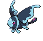

```
+ Level 1 - Ominous Wind
+ Level 1 - Psybeam
+ Level 31 - Quiver Dance
```

**[#459 Snover](../pokemon/snover.md/)**


```
+ Level 51 - Seed Bomb
```

**[#460 Abomasnow](../pokemon/abomasnow.md/)**


```
+ Level 69 - Seed Bomb
```

**[#479 Rotom](../pokemon/rotom.md/)**

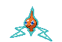

```
+ Level 1 - Signal Beam
```

**[#479 Rotom Fan](../pokemon/rotom-fan.md/)**


```
+ Level 1 - Hurricane
```

**[#479 Rotom Frost](../pokemon/rotom-frost.md/)**


```
+ Level 1 - Glaciate
```

**[#479 Rotom Heat](../pokemon/rotom-heat.md/)**


```
+ Level 1 - Lava Plume
```

**[#479 Rotom Wash](../pokemon/rotom-wash.md/)**


```
+ Level 1 - Scald
```

**[#479 Rotom Mow](../pokemon/rotom-mow.md/)**


```
+ Level 1 - Energy Ball
```

---

## Unova Pokémon

**[#494 Victini](../pokemon/victini.md/)**


```
+ Level 1 - Fusion Flare
+ Level 1 - Fusion Bolt
+ Level 1 - V-Create
```

**[#496 Servine](../pokemon/servine.md/)**


```
+ Level 17 - Twister
- Level 24 - Zen Headbutt
```

**[#497 Serperior](../pokemon/serperior.md/)**


```
+ Level 17 - Twister
+ Level 36 - Dragon Breath
- Level 24 - Zen Headbutt
- Level 44 - Iron Tail
- Level 50 - Dragon Pulse
- Level 56 - Power Whip
+ Level 62 - Outrage
+ Level 68 - Mirror Coat
= Level 74 - Leaf Storm
```

**[#499 Pignite](../pokemon/pignite.md/)**


```
- Level 17 - Magnitude
- Level 20 - Arm Thrust
- Level 28 - Sucker Punch
+ Level 34 - Bulldoze
+ Level 42 - Earthquake
```

**[#500 Emboar](../pokemon/emboar.md/)**


```
+ Level 1 - Superpower
+ Level 1 - Fire Punch
+ Level 1 - Thunder Punch
+ Level 1 - Focus Punch
- Level 17 - Magnitude
- Level 20 - Arm Thrust
- Level 28 - Sucker Punch
+ Level 34 - Bulldoze
+ Level 47 - Earthquake
```

**[#502 Dewott](../pokemon/dewott.md/)**


```
+ Level 17 - Karate Chop
+ Level 55 - Close Combat
```

**[#503 Samurott](../pokemon/samurott.md/)**


```
+ Level 1 - Secret Sword
+ Level 17 - Karate Chop
+ Level 36 - Sacred Sword
+ Level 69 - Close Combat
+ Level 76 - Shell Smash
```

**[#504 Patrat](../pokemon/patrat.md/)**


```
+ Level 39 - Zen Headbutt
```

**[#505 Watchog](../pokemon/watchog.md/)**


```
+ Level 46 - Zen Headbutt
```

**[#509 Purrloin](../pokemon/purrloin.md/)**


```
+ Level 8 - Feint Attack
= Level 17 - Night Slash
+ Level 37 - Foul Play
+ Level 50 - Dark Pulse
```

**[#510 Liepard](../pokemon/liepard.md/)**


```
+ Level 8 - Feint Attack
= Level 17 - Night Slash
+ Level 43 - Foul Play
+ Level 60 - Dark Pulse
```

**[#511 Pansage](../pokemon/pansage.md/)**


```
= Level 6 - Leer
= Level 8 - Vine Whip
+ Level 10 - Hone Claws
= Level 12 - Acrobatics
+ Level 14 - Magical Leaf
= Level 16 - Lick
= Level 18 - Leech Seed
= Level 20 - Seed Bomb
= Level 22 - Torment
= Level 24 - Crunch
= Level 26 - Fling
= Level 28 - Natural Gift
+ Level 30 - Grass Pledge
+ Level 32 - Low Kick
+ Level 34 - Nasty Plot
+ Level 36 - Grass Whistle
+ Level 38 - Power Whip
+ Level 40 - Leaf Storm
+ Level 42 - Frenzy Plant
+ Level 46 - Baton Pass
```

**[#512 Simisage](../pokemon/simisage.md/)**


```
+ Level 1 - Nasty Plot
+ Level 1 - Low Kick
+ Level 49 - Leaf Storm
```

**[#513 Pansear](../pokemon/pansear.md/)**


```
= Level 6 - Leer
= Level 8 - Incinerate
+ Level 10 - Hone Claws
= Level 12 - Acrobatics
+ Level 14 - Flame Burst
= Level 16 - Lick
= Level 18 - Yawn
+ Level 20 - Lava Plume
= Level 22 - Torment
= Level 24 - Crunch
= Level 26 - Fling
= Level 28 - Natural Gift
+ Level 30 - Fire Pledge
+ Level 32 - Low Kick
+ Level 34 - Nasty Plot
+ Level 36 - Sleep Talk
+ Level 38 - Fire Blast
+ Level 40 - Overheat
+ Level 42 - Blast Burn
+ Level 46 - Baton Pass
```

**[#514 Simisear](../pokemon/simisear.md/)**


```
+ Level 1 - Nasty Plot
+ Level 1 - Low Kick
+ Level 49 - Overheat
```

**[#515 Panpour](../pokemon/panpour.md/)**

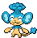

```
= Level 6 - Leer
= Level 8 - Water Gun
+ Level 10 - Hone Claws
= Level 12 - Acrobatics
+ Level 14 - Water Pulse
= Level 16 - Lick
= Level 18 - Tickle
= Level 20 - Scald
= Level 22 - Torment
= Level 24 - Crunch
= Level 26 - Fling
= Level 28 - Natural Gift
+ Level 30 - Water Pledge
+ Level 32 - Low Kick
+ Level 34 - Nasty Plot
+ Level 36 - Role Play
+ Level 38 - Hydro Pump
+ Level 40 - Water Spout
+ Level 42 - Hydro Cannon
+ Level 46 - Baton Pass
```

**[#516 Simipour](../pokemon/simipour.md/)**


```
+ Level 1 - Nasty Plot
+ Level 1 - Low Kick
+ Level 49 - Water Spout
```

**[#517 Munna](../pokemon/munna.md/)**

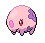

```
+ Level 21 - Baton Pass
+ Level 27 - Psyshock
```

**[#518 Musharna](../pokemon/musharna.md/)**


```
+ Level 39 - Psychic
```

**[#519 Pidove](../pokemon/pidove.md/)**

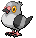

```
- Level 11 - Swift
```

**[#520 Tranquill](../pokemon/tranquill.md/)**


```
- Level 11 - Swift
- Level 36 - Hyper Voice
- Level 59 - Hurricane
```

**[#521 Unfezant](../pokemon/unfezant.md/)**


```
+ Level 1 - Heat Wave
+ Level 1 - Silver Wind
+ Level 1 - Ominous Wind
+ Level 1 - Hypnosis
+ Level 1 - Morning Sun
- Level 11 - Swift
- Level 38 - Hyper Voice
- Level 66 - Hurricane
```

**[#522 Blitzle](../pokemon/blitzle.md/)**


```
+ Level 13 - Double Kick
+ Level 47 - Volt Tackle
```

**[#523 Zebstrika](../pokemon/zebstrika.md/)**


```
+ Level 13 - Double Kick
+ Level 58 - Volt Tackle
```

**[#524 Roggenrola](../pokemon/roggenrola.md/)**


```
+ Level 12 - Magnitude
```

**[#525 Boldore](../pokemon/boldore.md/)**


```
+ Level 12 - Magnitude
```

**[#526 Gigalith](../pokemon/gigalith.md/)**


```
+ Level 1 - Gravity
+ Level 1 - Heavy Slam
+ Level 12 - Magnitude
```

**[#527 Woobat](../pokemon/woobat.md/)**


```
+ Level 52 - Stored Power
```

**[#528 Swoobat](../pokemon/swoobat.md/)**


```
+ Level 1 - Roost
+ Level 52 - Stored Power
```

**[#530 Excadrill](../pokemon/excadrill.md/)**


```
+ Level 1 - Iron Head
```

**[#531 Audino](../pokemon/audino.md/)**


```
+ Level 1 - Yawn
+ Level 1 - Heal Bell
+ Level 1 - Encore
+ Level 60 - Healing Wish
+ Level 65 - Wish
+ Level 70 - Gravity
```

**[#532 Timburr](../pokemon/timburr.md/)**

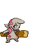

```
+ Level 53 - Drain Punch
```

**[#533 Gurdurr](../pokemon/gurdurr.md/)**


```
+ Level 61 - Drain Punch
```

**[#534 Conkeldurr](../pokemon/conkeldurr.md/)**


```
+ Level 1 - Fire Punch
+ Level 1 - Thunder Punch
+ Level 1 - Ice Punch
+ Level 1 - Mach Punch
+ Level 61 - Drain Punch
```

**[#535 Tympole](../pokemon/tympole.md/)**


```
+ Level 48 - Earth Power
```

**[#536 Palpitoad](../pokemon/palpitoad.md/)**


```
+ Level 55 - Earth Power
```

**[#537 Seismitoad](../pokemon/seismitoad.md/)**


```
+ Level 1 - Gunk Shot
+ Level 1 - Ice Punch
+ Level 64 - Earth Power
```

**[#538 Throh](../pokemon/throh.md/)**


```
+ Level 1 - Fire Punch
+ Level 1 - Thunder Punch
+ Level 1 - Ice Punch
+ Level 57 - Counter
```

**[#539 Sawk](../pokemon/sawk.md/)**


```
+ Level 1 - Fire Punch
+ Level 1 - Thunder Punch
+ Level 1 - Ice Punch
+ Level 57 - Low Kick
```

**[#541 Swadloon](../pokemon/swadloon.md/)**


```
+ Level 20 - Synthesis
```

**[#542 Leavanny](../pokemon/leavanny.md/)**


```
+ Level 25 - Screech
+ Level 54 - Me First
+ Level 58 - Agility
```

**[#543 Venipede](../pokemon/venipede.md/)**


```
+ Level 17 - Twineedle
```

**[#544 Whirlipede](../pokemon/whirlipede.md/)**


```
+ Level 17 - Twineedle
```

**[#545 Scolipede](../pokemon/scolipede.md/)**


```
+ Level 1 - Spikes
+ Level 1 - Toxic Spikes
+ Level 17 - Twineedle
+ Level 61 - Superpower
```

**[#547 Whimsicott](../pokemon/whimsicott.md/)**


```
+ Level 1 - Encore
+ Level 1 - Switcheroo
+ Level 1 - Tickle
+ Level 64 - Grass Whistle
```

**[#548 Petilil](../pokemon/petilil.md/)**


```
+ Level 15 - Extrasensory
```

**[#549 Lilligant](../pokemon/lilligant.md/)**


```
+ Level 1 - Charm
+ Level 1 - Sweet Scent
+ Level 1 - Ingrain
+ Level 64 - Earth Power
```

**[#550 Basculin](../pokemon/basculin-red-striped.md/)**


```
+ Level 1 - Revenge
+ Level 61 - Super Fang
```

**[#551 Sandile](../pokemon/sandile.md/)**


```
+ Level 49 - Sucker Punch
```

**[#552 Krokorok](../pokemon/krokorok.md/)**


```
+ Level 56 - Sucker Punch
```

**[#553 Krookodile](../pokemon/krookodile.md/)**


```
+ Level 1 - Fire Fang
+ Level 1 - Thunder Fang
+ Level 66 - Sucker Punch
```

**[#554 Darumaka](../pokemon/darumaka.md/)**


```
+ Level 1 - Yawn
```

**[#555 Darmanitan](../pokemon/darmanitan-standard.md/)**


```
+ Level 1 - Yawn
+ Level 61 - Focus Punch
```

**[#556 Maractus](../pokemon/maractus.md/)**


```
+ Level 24 - Spikes
+ Level 35 - Grass Whistle
+ Level 47 - Bounce
+ Level 53 - Wood Hammer
```

**[#557 Dwebble](../pokemon/dwebble.md/)**


```
+ Level 33 - Night Slash
```

**[#558 Crustle](../pokemon/crustle.md/)**


```
+ Level 33 - Night Slash
```

**[#559 Scraggy](../pokemon/scraggy.md/)**


```
+ Level 25 - Zen Headbutt
+ Level 57 - Dragon Dance
```

**[#560 Scrafty](../pokemon/scrafty.md/)**


```
+ Level 1 - Fire Punch
+ Level 1 - Thunder Punch
+ Level 1 - Ice Punch
+ Level 1 - Drain Punch
+ Level 25 - Zen Headbutt
= Level 39 - Crunch
- Level 51 - Sucker Punch
+ Level 72 - Dragon Dance
```

**[#561 Sigilyph](../pokemon/sigilyph.md/)**


```
+ Level 26 - Roost
+ Level 36 - Psycho Shift
+ Level 54 - Stored Power
+ Level 57 - Hurricane
```

**[#562 Yamask](../pokemon/yamask.md/)**


```
+ Level 23 - Pain Split
+ Level 27 - Nasty Plot
```

**[#563 Cofagrigus](../pokemon/cofagrigus.md/)**


```
+ Level 1 - Gravity
+ Level 1 - Disable
+ Level 23 - Pain Split
+ Level 27 - Nasty Plot
+ Level 63 - Metal Burst
```

**[#566 Archen](../pokemon/archen.md/)**


```
+ Level 54 - Earth Power
+ Level 57 - Head Smash
```

**[#567 Archeops](../pokemon/archeops.md/)**


```
+ Level 37 - Dragon Pulse
+ Level 66 - Earth Power
+ Level 71 - Head Smash
```

**[#568 Trubbish](../pokemon/trubbish.md/)**


```
+ Level 16 - Rollout
+ Level 21 - Curse
+ Level 27 - Rock Blast
+ Level 32 - Pain Split
+ Level 49 - Self Destruct
```

**[#569 Garbodor](../pokemon/garbodor.md/)**


```
+ Level 16 - Rollout
+ Level 21 - Curse
+ Level 27 - Rock Blast
+ Level 32 - Pain Split
+ Level 64 - Self Destruct
```

**[#571 Zoroark](../pokemon/zoroark.md/)**


```
+ Level 1 - Extrasensory
+ Level 1 - Counter
+ Level 1 - Low Kick
+ Level 30 - Dark Pulse
```

**[#572 Minccino](../pokemon/minccino.md/)**


```
+ Level 23 - Iron Tail
+ Level 29 - Aqua Tail
```

**[#573 Cinccino](../pokemon/cinccino.md/)**


```
+ Level 1 - Icicle Spear
+ Level 29 - Magic Coat
+ Level 46 - Endeavor
```

**[#574 Gothita](../pokemon/gothita.md/)**


```
+ Level 23 - Recover
+ Level 32 - Dark Pulse
+ Level 35 - Foul Play
+ Level 43 - Mirror Coat
```

**[#575 Gothorita](../pokemon/gothorita.md/)**


```
+ Level 23 - Recover
+ Level 32 - Dark Pulse
+ Level 37 - Foul Play
+ Level 47 - Mirror Coat
```

**[#576 Gothitelle](../pokemon/gothitelle.md/)**


```
+ Level 1 - Gravity
+ Level 1 - Metronome
+ Level 23 - Recover
+ Level 32 - Dark Pulse
+ Level 37 - Foul Play
+ Level 50 - Mirror Coat
```

**[#577 Solosis](../pokemon/solosis.md/)**


```
+ Level 23 - Shock Wave
+ Level 32 - Confuse Ray
+ Level 43 - Magic Coat
```

**[#578 Duosion](../pokemon/duosion.md/)**


```
+ Level 23 - Shock Wave
+ Level 32 - Confuse Ray
+ Level 47 - Magic Coat
```

**[#579 Reuniclus](../pokemon/reuniclus.md/)**


```
+ Level 1 - Gravity
+ Level 1 - Trick
+ Level 23 - Shock Wave
+ Level 32 - Confuse Ray
+ Level 50 - Magic Coat
```

**[#581 Swanna](../pokemon/swanna.md/)**


```
+ Level 1 - Heat Wave
+ Level 35 - Acrobatics
```

**[#582 Vanillite](../pokemon/vanillite.md/)**


```
+ Level 24 - Water Pulse
+ Level 29 - Ice Shard
+ Level 33 - Extrasensory
```

**[#583 Vanillish](../pokemon/vanillish.md/)**


```
+ Level 24 - Water Pulse
+ Level 29 - Ice Shard
+ Level 33 - Extrasensory
```

**[#584 Vanilluxe](../pokemon/vanilluxe.md/)**


```
+ Level 1 - Magnet Rise
+ Level 1 - Autotomize
+ Level 24 - Water Pulse
+ Level 29 - Ice Shard
+ Level 33 - Extrasensory
```

**[#586 Sawsbuck](../pokemon/sawsbuck.md/)**


```
+ Level 1 - Wood Hammer
```

**[#587 Emolga](../pokemon/emolga.md/)**


```
+ Level 1 - Covet
+ Level 24 - Roost
+ Level 28 - Iron Tail
+ Level 32 - Air Slash
+ Level 36 - Charm
+ Level 40 - Iron Tail
+ Level 44 - Baton Pass
```

**[#588 Karrablast](../pokemon/karrablast.md/)**


```
+ Level 60 - Megahorn
```

**[#589 Escavalier](../pokemon/escavalier.md/)**


```
+ Level 1 - Needle Arm
+ Level 1 - Drill Peck
+ Level 1 - Counter
+ Level 1 - Drill Run
+ Level 60 - Megahorn
```

**[#590 Foongus](../pokemon/foongus.md/)**


```
+ Level 22 - Stun Spore
+ Level 22 - Poison Powder
+ Level 26 - Defense Curl
+ Level 26 - Rollout
+ Level 30 - Body Slam
```

**[#591 Amoonguss](../pokemon/amoonguss.md/)**


```
+ Level 22 - Stun Spore
+ Level 22 - Poison Powder
+ Level 26 - Defense Curl
+ Level 26 - Rollout
+ Level 30 - Body Slam
+ Level 40 - Seed Bomb
```

**[#592 Frillish](../pokemon/frillish.md/)**


```
+ Level 1 - Confuse Ray
+ Level 1 - Pain Split
```

**[#593 Jellicent](../pokemon/jellicent.md/)**


```
+ Level 1 - Confuse Ray
+ Level 1 - Pain Split
```

**[#594 Alomomola](../pokemon/alomomola.md/)**


```
+ Level 1 - Pain Split
+ Level 1 - Mirror Coat
```

**[#597 Ferroseed](../pokemon/ferroseed.md/)**


```
+ Level 1 - Rapid Spin
+ Level 23 - Bullet Seed
+ Level 28 - Leech Seed
+ Level 32 - Seed Bomb
```

**[#598 Ferrothorn](../pokemon/ferrothorn.md/)**


```
+ Level 1 - Stealth Rock
+ Level 1 - Rapid Spin
+ Level 23 - Bullet Seed
+ Level 28 - Spikes
+ Level 32 - Seed Bomb
```

**[#599 Klink](../pokemon/klink.md/)**


```
+ Level 33 - Spark
```

**[#600 Klang](../pokemon/klang.md/)**


```
+ Level 33 - Spark
```

**[#601 Klinklang](../pokemon/klinklang.md/)**


```
+ Level 1 - Gravity
+ Level 33 - Spark
```

**[#604 Eelektross](../pokemon/eelektross.md/)**


```
+ Level 54 - Coil
+ Level 64 - Super Fang
```

**[#605 Elgyem](../pokemon/elgyem.md/)**


```
+ Level 59 - Nasty Plot
```

**[#606 Beheeyem](../pokemon/beheeyem.md/)**

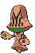

```
+ Level 1 - Power Swap
+ Level 1 - Guard Swap
= Level 37 – Psych Up
= Level 42 – Psychic
+ Level 73 - Nasty Plot
```

**[#608 Lampent](../pokemon/lampent.md/)**


```
+ Level 34 - Heat Wave
= Level 39 – Inferno
```

**[#612 Haxorus](../pokemon/haxorus.md/)**

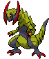

```
+ Level 1 - Fire Punch
+ Level 1 - Thunder Punch
+ Level 1 - Aqua Tail
+ Level 1 - Iron Tail
```

**[#613 Cubchoo](../pokemon/cubchoo.md/)**


```
+ Level 1 - Yawn
```

**[#614 Beartic](../pokemon/beartic.md/)**


```
+ Level 1 - Yawn
- Level 41 - Storm Throw
- Level 53 - Close Combat
```

**[#616 Shelmet](../pokemon/shelmet.md/)**


```
- Level 56 - Shell Smash
```

**[#617 Accelgor](../pokemon/accelgor.md/)**


```
+ Level 1 - Extreme Speed
+ Level 1 - Gunk Shot
+ Level 60 - Aura Sphere
```

**[#618 Stunfisk](../pokemon/stunfisk.md/)**


```
+ Level 52 - Earth Power
+ Level 58 - Pain Split
```

**[#620 Mienshao](../pokemon/mienshao.md/)**


```
+ Level 1 - Vacuum Wave
= Level 43 – U-turn
= Level 47 – Wide Guard
= Level 51 – Bounce
```

**[#621 Druddigon](../pokemon/druddigon.md/)**


```
+ Level 29 - Fire Fang
+ Level 29 - Thunder Fang
+ Level 33 - Glare
+ Level 37 - Sucker Punch
```

**[#623 Golurk](../pokemon/golurk.md/)**


```
+ Level 1 - Fire Punch
+ Level 1 - Thunder Punch
+ Level 1 - Ice Punch
= Level 36 – Heavy Slam
```

**[#624 Pawniard](../pokemon/pawniard.md/)**


```
+ Level 43 - Psycho Cut
+ Level 52 - Sucker Punch
```

**[#625 Bisharp](../pokemon/bisharp.md/)**


```
+ Level 1 - Revenge
+ Level 1 - Leaf Blade
= Level 40 – Metal Sound
= Level 43 – Embargo
+ Level 46 – Psycho Cut
= Level 48 – Iron Defense
= Level 52 – Night Slash
+ Level 54 – Sucker Punch
```

**[#626 Bouffalant](../pokemon/bouffalant.md/)**


```
+ Level 1 - Iron Head
+ Level 1 - Zen Headbutt
```

**[#628 Braviary](../pokemon/braviary.md/)**


```
+ Level 1 - Roost
+ Level 39 - Close Combat
= Level 44 – Air Slash
= Level 48 – Crush Claw
= Level 52 – Sky Drop
= Level 55 – Superpower
+ Level 75 - Extreme Speed
```

**[#630 Mandibuzz](../pokemon/mandibuzz.md/)**


```
+ Level 1 - Heat Wave
+ Level 1 - Roost
= Level 44 – Air Slash
= Level 48 – Dark Pulse
= Level 52 – Embargo
= Level 55 – Bone Rush
```

**[#631 Heatmor](../pokemon/heatmor.md/)**


```
+ Level 66 - Heat Wave
```

**[#632 Durant](../pokemon/durant.md/)**


```
+ Level 1 - Thunder Fang
```

**[#633 Deino](../pokemon/deino.md/)**


```
+ Level 35 - Dark Pulse
+ Level 45 - Earth Power
```

**[#634 Zweilous](../pokemon/zweilous.md/)**


```
+ Level 30 - Fire Fang
+ Level 30 - Ice Fang
+ Level 30 - Thunder Fang
= Level 33 – Dragon Pulse
+ Level 36 – Dark Pulse
= Level 40 - Work Up
= Level 44 – Dragon Rush
+ Level 47 – Earth Power
= Level 51 – Body Slam
- Level 55 - Head Smash
```

**[#635 Hydreigon](../pokemon/hydreigon.md/)**


```
+ Level 30 - Fire Fang
+ Level 30 - Ice Fang
+ Level 30 - Thunder Fang
= Level 33 – Dragon Pulse
+ Level 36 – Dark Pulse
= Level 40 - Work Up
= Level 44 – Dragon Rush
+ Level 47 – Earth Power
= Level 51 – Body Slam
```

**[#637 Volcarona](../pokemon/volcarona.md/)**


```
+ Level 1 - Morning Sun
= Level 45 – Quiver Dance
```

**[#638 Cobalion](../pokemon/cobalion.md/)**


```
+ Level 79 - Secret Sword
```

**[#639 Terrakion](../pokemon/terrakion.md/)**


```
+ Level 79 - Secret Sword
```

**[#640 Virizion](../pokemon/virizion.md/)**


```
+ Level 79 - Secret Sword
```

**[#643 Reshiram](../pokemon/reshiram.md/)**


```
- Level 64 - Fire Blast
= Level 71 - Blue Flare
```

**[#644 Zekrom](../pokemon/zekrom.md/)**


```
- Level 64 - Thunder
= Level 71 - Bolt Strike
```

**[#646 Kyurem](../pokemon/kyurem.md/)**


```
- Level 64 - Endeavor
= Level 71 - Blizzard
+ Level 78 - Ice Burn
+ Level 78 - Freeze Shock
```

**[#647 Keldeo](../pokemon/keldeo-ordinary.md/)**


```
+ Level 1 - Secret Sword
```

**[#648 Meloetta](../pokemon/meloetta-aria.md/)**


```
+ Level 1 - Relic Song
```

