---

## Evolution Changes

**The following Pokémon have received an edit to their evolution method:**

<pre><code>1. <a href="/bbvw-wiki/pokemon/poliwhirl.md/">Poliwhirl</a>
2. <a href="/bbvw-wiki/pokemon/kadabra.md/">Kadabra</a>
3. <a href="/bbvw-wiki/pokemon/machoke.md/">Machoke</a>
4. <a href="/bbvw-wiki/pokemon/graveler.md/">Graveler</a>
5. <a href="/bbvw-wiki/pokemon/slowpoke.md/">Slowpoke</a>
6. <a href="/bbvw-wiki/pokemon/haunter.md/">Haunter</a>
7. <a href="/bbvw-wiki/pokemon/onix.md/">Onix</a>
8. <a href="/bbvw-wiki/pokemon/rhydon.md/">Rhydon</a>
9. <a href="/bbvw-wiki/pokemon/seadra.md/">Seadra</a>
10. <a href="/bbvw-wiki/pokemon/scyther.md/">Scyther</a>
11. <a href="/bbvw-wiki/pokemon/electabuzz.md/">Electabuzz</a>
12. <a href="/bbvw-wiki/pokemon/magmar.md/">Magmar</a>
13. <a href="/bbvw-wiki/pokemon/porygon.md/">Porygon</a>
14. <a href="/bbvw-wiki/pokemon/porygon2.md/">Porygon2</a>
15. <a href="/bbvw-wiki/pokemon/feebas.md/">Feebas</a>
16. <a href="/bbvw-wiki/pokemon/dusclops.md/">Dusclops</a>
17. <a href="/bbvw-wiki/pokemon/clamperl.md/">Clamperl</a>
18. <a href="/bbvw-wiki/pokemon/happiny.md/">Happiny</a>
19. <a href="/bbvw-wiki/pokemon/boldore.md/">Boldore</a>
20. <a href="/bbvw-wiki/pokemon/gurdurr.md/">Gurdurr</a>
21. <a href="/bbvw-wiki/pokemon/karrablast.md/">Karrablast</a>
22. <a href="/bbvw-wiki/pokemon/shelmet.md/">Shelmet</a>
</code></pre>

**The following Pokémon have had their evolution levels adjusted:**

<pre><code>1. <a href="/bbvw-wiki/pokemon/scraggy.md/">Scraggy</a>
2. <a href="/bbvw-wiki/pokemon/elgyem.md/">Elgyem</a>
3. <a href="/bbvw-wiki/pokemon/litwick.md/">Litwick</a>
4. <a href="/bbvw-wiki/pokemon/mienfoo.md/">Mienfoo</a>
5. <a href="/bbvw-wiki/pokemon/golett.md/">Golett</a>
6. <a href="/bbvw-wiki/pokemon/pawniard.md/">Pawniard</a>
7. <a href="/bbvw-wiki/pokemon/rufflet.md/">Rufflet</a>
8. <a href="/bbvw-wiki/pokemon/vullaby.md/">Vullaby</a>
9. <a href="/bbvw-wiki/pokemon/deino.md/">Deino</a>
10. <a href="/bbvw-wiki/pokemon/larvesta.md/">Larvesta</a>
</code></pre>

**The following Pokémon have received an edit to their typing:**

<pre><code>1. <a href="/bbvw-wiki/pokemon/farfetchd.md/">Farfetch’d</a>
2. <a href="/bbvw-wiki/pokemon/masquerain.md/">Masquerain</a>
3. <a href="/bbvw-wiki/pokemon/volbeat.md/">Volbeat</a>
4. <a href="/bbvw-wiki/pokemon/illumise.md/">Illumise</a>
5. <a href="/bbvw-wiki/pokemon/glalie.md/">Glalie</a>
6. <a href="/bbvw-wiki/pokemon/luxio.md/">Luxio</a>
7. <a href="/bbvw-wiki/pokemon/luxray.md/">Luxray</a>
8. <a href="/bbvw-wiki/pokemon/electivire.md/">Electivire</a>
9. <a href="/bbvw-wiki/pokemon/serperior.md/">Serperior</a>
10. <a href="/bbvw-wiki/pokemon/pignite.md/">Pignite</a>
11. <a href="/bbvw-wiki/pokemon/emboar.md/">Emboar</a>
12. <a href="/bbvw-wiki/pokemon/dewott.md/">Dewott</a>
13. <a href="/bbvw-wiki/pokemon/samurott.md/">Samurott</a>
14. <a href="/bbvw-wiki/pokemon/cofagrigus.md/">Cofagrigus</a>
15. <a href="/bbvw-wiki/pokemon/gothita.md/">Gothita</a>
16. <a href="/bbvw-wiki/pokemon/gothorita.md/">Gothorita</a>
17. <a href="/bbvw-wiki/pokemon/gothitelle.md/">Gothitelle</a>
18. <a href="/bbvw-wiki/pokemon/beartic.md/">Beartic</a>
</code></pre>

Things unlisted haven’t been changed from the original Black & White. Abilities are the exception, and are listed regardless of change.

Use the Ctrl + F function to skip directly to them to see the new method.

---

## Kanto Pokémon

**[#001 Bulbasaur](../pokemon/bulbasaur.md/), [#002 Ivysaur](../pokemon/ivysaur.md/)**

<pre><code><b>Item:</b> Miracle Seed (50%)
<b>Ability One:</b> Overgrow
<b>Ability Two:</b> Chlorophyll
</code></pre>

**[#003 Venusaur](../pokemon/venusaur.md/)**

<pre><code><b>Item:</b> Miracle Seed (50%)
<b>TM:</b> Can now learn TM34, Sludge Wave.
<b>Ability One:</b> Overgrow
<b>Ability Two:</b> Chlorophyll
</code></pre>

**[#004 Charmander](../pokemon/charmander.md/), [#005 Charmeleon](../pokemon/charmeleon.md/), [#006 Charizard](../pokemon/charizard.md/)**

<pre><code><b>Item:</b> Charcoal (50%)
<b>Ability One:</b> Blaze
<b>Ability Two:</b> Solar Power
</code></pre>

**[#007 Squirtle](../pokemon/squirtle.md/), [#008 Wartortle](../pokemon/wartortle.md/), [#009 Blastoise](../pokemon/blastoise.md/)**

<pre><code><b>Item:</b> Mystic Water (50%)
<b>Ability One:</b> Torrent
<b>Ability Two:</b> Sturdy
</code></pre>

**[#010 Caterpie](../pokemon/caterpie.md/)**

<pre><code><b>Ability One:</b> Shield Dust
<b>Ability Two:</b> Suction Cups
</code></pre>

**[#011 Metapod](../pokemon/metapod.md/)**

<pre><code><b>Ability One:</b> Shed Skin
<b>Ability Two:</b> Battle Armor
</code></pre>

**[#012 Butterfree](../pokemon/butterfree.md/)**

<pre><code><b>Special Attack:</b> 80 → 95
<b>Speed:</b> 70 → 90
<b>Total:</b> 385 → 420
<b>Ability One:</b> Compound Eyes
<b>Ability Two:</b> Tinted Lens
</code></pre>

**[#013 Weedle](../pokemon/weedle.md/)**

<pre><code><b>Ability One:</b> Shield Dust
<b>Ability Two:</b> Poison Touch
</code></pre>

**[#014 Kakuna](../pokemon/kakuna.md/)**

<pre><code><b>Ability One:</b> Shed Skin
<b>Ability Two:</b> Battle Armor
</code></pre>

**[#015 Beedrill](../pokemon/beedrill.md/)**

<pre><code><b>Attack:</b> 80 → 95
<b>Speed:</b> 75 → 95
<b>Total:</b> 385 → 420
<b>Ability One:</b> Sniper
<b>Ability Two:</b> Poison Touch
</code></pre>

**[#016 Pidgey](../pokemon/pidgey.md/)**

<pre><code><b>Items:</b> Oran Berry (5%)
<b>TM:</b> Now able to learn TM62, Acrobatics.
<b>Ability One:</b> Big Pecks
<b>Ability Two:</b> Tangled Feet
</code></pre>

**[#017 Pidgeotto](../pokemon/pidgeotto.md/)**

<pre><code><b>Items:</b> Oran Berry (50%), Sitrus Berry (5%)
<b>TM:</b> Now able to learn TM62, Acrobatics.
<b>Ability One:</b> Big Pecks
<b>Ability Two:</b> Tangled Feet
</code></pre>

**[#018 Pidgeot](../pokemon/pidgeot.md/)**

<pre><code><b>HP:</b> 83 → 105
<b>Attack:</b> 80 → 90
<b>Defense:</b> 75 → 85
<b>Special Defense:</b> 70 → 80
<b>Total:</b> 469 → 521
<b>TM:</b> Now able to learn TM62, Acrobatics.
<b>Ability One:</b> Big Pecks
<b>Ability Two:</b> Tangled Feet
</code></pre>

**[#019 Rattata](../pokemon/rattata.md/)**

<pre><code><b>Ability One:</b> Hustle
<b>Ability Two:</b> Guts
<b>TM:</b> Can now learn TM01, Hone Claws.
</code></pre>

**[#020 Raticate](../pokemon/raticate.md/)**

<pre><code><b>HP:</b> 55 → 60
<b>Attack:</b> 81 → 87
<b>Speed:</b> 97 → 109
<b>Total:</b> 413 → 436
<b>Item:</b> Chilan Berry (50%)
<b>Ability One:</b> Hustle
<b>Ability Two:</b> Guts
<b>TM:</b> Can now learn TM01, Hone Claws.
</code></pre>

**[#021 Spearow](../pokemon/spearow.md/)**

<pre><code><b>Item:</b> Sharp Beak (5%)
<b>Ability One:</b> Keen Eye
<b>Ability Two:</b> Sniper
</code></pre>

**[#022 Fearow](../pokemon/fearow.md/)**

<pre><code><b>Attack:</b> 90 → 100
<b>Total:</b> 442 → 452
<b>Item:</b> Sharp Beak (50%)
<b>Ability One:</b> Keen Eye
<b>Ability Two:</b> Sniper
</code></pre>

**[#023 Ekans](../pokemon/ekans.md/)**

<pre><code><b>Catch Rate:</b> 200
<b>Item:</b> Kebia Berry (5%)
<b>Ability One:</b> Intimidate
<b>Ability Two:</b> Shed Skin
</code></pre>

**[#024 Arbok](../pokemon/arbok.md/)**

<pre><code><b>Attack:</b> 85 → 96
<b>Speed:</b> 80 → 87
<b>Special Attack:</b> 65 → 80
<b>Total:</b> 438 → 471
<b>Item:</b> Kebia Berry (50%)
<b>Ability One:</b> Intimidate
<b>Ability Two:</b> Shed Skin
</code></pre>

**[#025 Pikachu](../pokemon/pikachu.md/)**

<pre><code><b>Attack:</b> 55 → 80
<b>Speed:</b> 90 → 110
<b>Special Attack:</b> 50 → 85
<b>Total:</b> 300 → 380
<b>Item:</b> Light Ball (50%), Sitrus Berry (5%)
<b>HM:</b> Can now learn HM03, Surf.
<b>Ability One:</b> Static
<b>Ability Two:</b> Lightning Rod
</code></pre>

**[#026 Raichu](../pokemon/raichu.md/)**

<pre><code><b>Attack:</b> 90 → 100
<b>Speed:</b> 100 → 120
<b>Special Attack:</b> 90 → 100
<b>Special Defense:</b> 80 → 90
<b>Total:</b> 475 → 525
<b>HM:</b> Can now learn HM03, Surf.
<b>Ability One:</b> Static
<b>Ability Two:</b> Lightning Rod
</code></pre>

**[#027 Sandshrew](../pokemon/sandshrew.md/), [#028 Sandslash](../pokemon/sandslash.md/)**

<pre><code><b>Ability One:</b> Sand Veil
<b>Ability Two:</b> Sand Rush
</code></pre>

**[#029 Nidoran F](../pokemon/nidoran-f.md/)**

<pre><code><b>Item:</b> Pecha Berry (50%)
<b>Ability One:</b> Poison Point
<b>Ability Two:</b> Rivalry
</code></pre>

**[#030 Nidorina](../pokemon/nidorina.md/)**

<pre><code><b>Ability One:</b> Hustle
<b>Ability Two:</b> Rivalry
</code></pre>

**[#031 Nidoqueen](../pokemon/nidoqueen.md/)**

<pre><code><b>Attack:</b> 82 → 92
<b>Special Attack:</b> 75 → 90
<b>Total:</b> 495 → 520
<b>Ability One:</b> Sheer Force
<b>Ability Two:</b> Rivalry
</code></pre>

**[#032 Nidoran M](../pokemon/nidoran-m.md/)**

<pre><code><b>Item:</b> Pecha Berry (50%)
<b>Ability One:</b> Poison Point
<b>Ability Two:</b> Rivalry
</code></pre>

**[#033 Nidorino](../pokemon/nidorino.md/)**

<pre><code><b>Ability One:</b> Hustle
<b>Ability Two:</b> Rivalry
</code></pre>

**[#034 Nidoking](../pokemon/nidoking.md/)**

<pre><code><b>Attack:</b> 92 → 102
<b>Special Attack:</b> 85 → 95
<b>Total:</b> 495 → 520
<b>Ability One:</b> Sheer Force
<b>Ability Two:</b> Rivalry
</code></pre>

**[#035 Clefairy](../pokemon/clefairy.md/)**

<pre><code><b>Ability One:</b> Cute Charm
<b>Ability Two:</b> Magic Guard
</code></pre>

**[#036 Clefable](../pokemon/clefable.md/)**

<pre><code><b>HP:</b> 95 → 105
<b>Special Attack:</b> 83 → 93
<b>Special Defense:</b> 90 → 100
<b>Total:</b> 473 → 503
<b>Ability One:</b> Unaware
<b>Ability Two:</b> Magic Guard
</code></pre>

**[#037 Vulpix](../pokemon/vulpix.md/)**

<pre><code><b>Items:</b> Rawst Berry (50%), Occa Berry (5%)
<b>Ability One:</b> Flash Fire
<b>Ability Two:</b> Drought
</code></pre>

**[#038 Ninetales](../pokemon/ninetales.md/)**

<pre><code><b>Items:</b> Rawst Berry (50%), Occa Berry (5%)
<b>Ability One:</b> Flash Fire
<b>Ability Two:</b> Drought
</code></pre>

**[#039 Jigglypuff](../pokemon/jigglypuff.md/)**

<pre><code><b>HP:</b> 115 → 128
<b>Attack:</b> 45 → 65
<b>Special Attack:</b> 45 → 65
<b>Total:</b> 270 → 323
<b>Ability One:</b> Cute Charm
<b>Ability Two:</b> Friend Guard
</code></pre>

**[#040 Wigglytuff](../pokemon/wigglytuff.md/)**

<pre><code><b>Attack:</b> 70 → 83
<b>Defense:</b> 45 → 60
<b>Special Attack:</b> 75 → 95
<b>Special Defense:</b> 50 → 80
<b>Total:</b> 425 → 503
<b>Ability One:</b> Cute Charm
<b>Ability Two:</b> Frisk
</code></pre>

**[#041 Zubat](../pokemon/zubat.md/)**

<pre><code><b>Base Happiness:</b> 140
<b>Ability One:</b> Inner Focus
<b>Ability Two:</b> Infiltrator
</code></pre>

**[#042 Golbat](../pokemon/golbat.md/)**

<pre><code><b>Base Happiness:</b> 140
<b>Ability One:</b> Inner Focus
<b>Ability Two:</b> Infiltrator
</code></pre>

**[#043 Oddish](../pokemon/oddish.md/)**

<pre><code><b>Ability One:</b> Chlorophyll
<b>Ability Two:</b> Run Away
</code></pre>

**[#044 Gloom](../pokemon/gloom.md/)**

<pre><code><b>Ability One:</b> Chlorophyll
<b>Ability Two:</b> Stench
</code></pre>

**[#045 Vileplume](../pokemon/vileplume.md/)**

<pre><code><b>HP:</b> 75 → 85
<b>Special Attack:</b> 100 → 110
<b>Special Defense:</b> 90 → 100
<b>Total:</b> 480 → 510
<b>Ability One:</b> Chlorophyll
<b>Ability Two:</b> Effect Spore
</code></pre>

**[#046 Paras](../pokemon/paras.md/)**

<pre><code><b>Ability One:</b> Effect Spore
<b>Ability Two:</b> Dry Skin
</code></pre>

**[#047 Parasect](../pokemon/parasect.md/)**

<pre><code><b>HP:</b> 60 → 80
<b>Attack:</b> 95 → 110
<b>Defense:</b> 80 → 100
<b>Special Defense:</b> 80 → 90
<b>Speed:</b> 30 → 40
<b>Total:</b> 405 → 480
<b>Ability One:</b> Effect Spore
<b>Ability Two:</b> Dry Skin
</code></pre>

**[#048 Venonat](../pokemon/venonat.md/)**

<pre><code><b>Ability One:</b> Compound Eyes
<b>Ability Two:</b> Tinted Lens
</code></pre>

**[#049 Venomoth](../pokemon/venomoth.md/)**

<pre><code><b>Special Attack:</b> 90 → 100
<b>Speed:</b> 90 → 100
<b>Total:</b> 450 → 470
<b>Ability One:</b> Wonder Skin
<b>Ability Two:</b> Tinted Lens
</code></pre>

**[#050 Diglett](../pokemon/diglett.md/)**

<pre><code><b>Ability One:</b> Sand Force
<b>Ability Two:</b> Arena Trap
</code></pre>

**[#051 Dugtrio](../pokemon/dugtrio.md/)**

<pre><code><b>Attack:</b> 80 → 105
<b>Total:</b> 405 → 430
<b>Ability One:</b> Sand Force
<b>Ability Two:</b> Arena Trap
</code></pre>

**[#052 Meowth](../pokemon/meowth.md/)**

<pre><code><b>Ability One:</b> Pickup
<b>Ability Two:</b> Technician
</code></pre>

**[#053 Persian](../pokemon/persian.md/)**

<pre><code><b>Special Attack:</b> 65 → 85
<b>Total:</b> 440 → 460
<b>Ability One:</b> Limber
<b>Ability Two:</b> Technician
</code></pre>

**[#054 Psyduck](../pokemon/psyduck.md/), [#055 Golduck](../pokemon/golduck.md/)**

<pre><code><b>Ability One:</b> Swift Swim
<b>Ability Two:</b> Cloud Nine
</code></pre>

**[#056 Mankey](../pokemon/mankey.md/)**

<pre><code><b>Ability One:</b> Defiant
<b>Ability Two:</b> Anger Point
</code></pre>

**[#057 Primeape](../pokemon/primeape.md/)**

<pre><code><b>Attack:</b> 105 → 115
<b>Speed:</b> 95 → 110
<b>Total:</b> 455 → 480
<b>Ability One:</b> Defiant
<b>Ability Two:</b> Anger Point
</code></pre>

**[#058 Growlithe](../pokemon/growlithe.md/)**

<pre><code><b>Ability One:</b> Intimidate
<b>Ability Two:</b> Justified
</code></pre>

**[#059 Arcanine](../pokemon/arcanine.md/)**

<pre><code><b>Ability One:</b> Intimidate
<b>Ability Two:</b> Justified
</code></pre>

**[#060 Poliwag](../pokemon/poliwag.md/)**

<pre><code><b>Ability One:</b> Water Absorb
<b>Ability Two:</b> Swift Swim
</code></pre>

**[#061 Poliwhirl](../pokemon/poliwhirl.md/)**

<pre><code><b>Evolution (Politoed):</b> Level Up at Night with King's Rock equipped.
<b>Ability One:</b> Water Absorb
<b>Ability Two:</b> Swift Swim
</code></pre>

**[#062 Poliwrath](../pokemon/poliwrath.md/)**

<pre><code><b>Attack:</b> 85 → 105
<b>Total:</b> 500 → 520
<b>Ability One:</b> Water Absorb
<b>Ability Two:</b> Swift Swim
</code></pre>

**[#063 Abra](../pokemon/abra.md/)**

<pre><code><b>Ability One:</b> Synchronize
<b>Ability Two:</b> Magic Guard
</code></pre>

**[#064 Kadabra](../pokemon/kadabra.md/)**

<pre><code><b>Evolution:</b> Level 36.
<b>Ability One:</b> Synchronize
<b>Ability Two:</b> Magic Guard
</code></pre>

**[#065 Alakazam](../pokemon/alakazam.md/)**

<pre><code><b>Ability One:</b> Synchronize
<b>Ability Two:</b> Magic Guard
</code></pre>

**[#066 Machop](../pokemon/machop.md/)**

<pre><code><b>Ability One:</b> Guts
<b>Ability Two:</b> No Guard
</code></pre>

**[#067 Machoke](../pokemon/machoke.md/)**

<pre><code><b>Evolution:</b> Level 39.
<b>Ability One:</b> Guts
<b>Ability Two:</b> No Guard
</code></pre>

**[#068 Machamp](../pokemon/machamp.md/)**

<pre><code><b>Ability One:</b> Guts
<b>Ability Two:</b> No Guard
</code></pre>

**[#069 Bellsprout](../pokemon/bellsprout.md/)**

<pre><code><b>Ability One:</b> Chlorophyll
<b>Ability Two:</b> Limber
</code></pre>

**[#070 Weepinbell](../pokemon/weepinbell.md/)**

<pre><code><b>Ability One:</b> Chlorophyll
<b>Ability Two:</b> Gluttony
</code></pre>

**[#071 Victreebel](../pokemon/victreebel.md/)**

<pre><code><b>HP:</b> 80 → 90
<b>Attack:</b> 105 → 115
<b>Speed:</b> 70 → 80
<b>Total:</b> 480 → 510
<b>Ability One:</b> Chlorophyll
<b>Ability Two:</b> Intimidate
</code></pre>

**[#072 Tentacool](../pokemon/tentacool.md/), [#073 Tentacruel](../pokemon/tentacruel.md/)**

<pre><code><b>Ability One:</b> Clear Body
<b>Ability Two:</b> Liquid Ooze
</code></pre>

**[#074 Geodude](../pokemon/geodude.md/)**

<pre><code><b>Ability One:</b> Rock Head
<b>Ability Two:</b> Sturdy
</code></pre>

**[#075 Graveler](../pokemon/graveler.md/)**

<pre><code><b>Evolution:</b> Level 36.
<b>Ability One:</b> Rock Head
<b>Ability Two:</b> Sturdy
</code></pre>

**[#076 Golem](../pokemon/golem.md/)**

<pre><code><b>HP:</b> 80 → 90
<b>Total:</b> 485 → 495
<b>Ability One:</b> Rock Head
<b>Ability Two:</b> Sturdy
</code></pre>

**[#077 Ponyta](../pokemon/ponyta.md/), [#078 Rapidash](../pokemon/rapidash.md/)**

<pre><code><b>Ability One:</b> Flame Body
<b>Ability Two:</b> Flash Fire
</code></pre>

**[#079 Slowpoke](../pokemon/slowpoke.md/)**

<pre><code><b>Evolution (Slowbro):</b> Level 37 or Level Up with a Shellder in the party.
<b>Evolution (Slowking):</b> Level Up at Day with King's Rock.
<b>Ability One:</b> Regenerator
<b>Ability Two:</b> Drizzle
</code></pre>

**[#080 Slowbro](../pokemon/slowbro.md/)**

<pre><code><b>Ability One:</b> Regenerator
<b>Ability Two:</b> Drizzle
</code></pre>

**[#081 Magnemite](../pokemon/magnemite.md/), [#082 Magneton](../pokemon/magneton.md/)**

<pre><code><b>Ability One:</b> Magnet Pull
<b>Ability Two:</b> Analytic
</code></pre>

**[#083 Farfetch'd](../pokemon/farfetchd.md/)**

<pre><code><b>Type:</b> Fighting / Flying
<b>HP:</b> 52 → 70
<b>Attack:</b> 65 → 105
<b>Defense:</b> 55 → 70
<b>Special Attack:</b> 58 → 50
<b>Special Defense:</b> 62 → 70
<b>Speed:</b> 60 → 110
<b>Total:</b> 352 → 475
<b>Base EXP:</b> 123 → 192
<b>Item:</b> Stick (50%)
<b>Ability One:</b> Defiant
<b>Ability Two:</b> Super Luck
</code></pre>

**[#084 Doduo](../pokemon/doduo.md/)**

<pre><code><b>Ability One:</b> Tangled Feet
<b>Ability Two:</b> Early Bird
</code></pre>

**[#085 Dodrio](../pokemon/dodrio.md/)**

<pre><code><b>Ability One:</b> Anger Point
<b>Ability Two:</b> Early Bird
</code></pre>

**[#086 Seel](../pokemon/seel.md/)**

<pre><code><b>Ability One:</b> Thick Fat
<b>Ability Two:</b> Hydration
</code></pre>

**[#087 Dewgong](../pokemon/dewgong.md/)**

<pre><code><b>Special Attack:</b> 70 → 85
<b>Total:</b> 475 → 490
<b>Ability One:</b> Thick Fat
<b>Ability Two:</b> Hydration
</code></pre>

**[#088 Grimer](../pokemon/grimer.md/), [#089 Muk](../pokemon/muk.md/)**

<pre><code><b>Item:</b> Toxic Orb (50%)
<b>Ability One:</b> Stench
<b>Ability Two:</b> Poison Touch
</code></pre>

**[#090 Shellder](../pokemon/shellder.md/)**

<pre><code><b>Ability One:</b> Overcoat
<b>Ability Two:</b> Skill Link
</code></pre>

**[#091 Cloyster](../pokemon/cloyster.md/)**

<pre><code><b>Ability One:</b> Overcoat
<b>Ability Two:</b> Skill Link
</code></pre>

**[#092 Gastly](../pokemon/gastly.md/)**

<pre><code><b>TM:</b> Can now learn TM34, Sludge Wave.
<b>Ability One:</b> Levitate
<b>Ability Two:</b> Levitate
</code></pre>

**[#093 Haunter](../pokemon/haunter.md/)**

<pre><code><b>TM:</b> Can now learn TM34, Sludge Wave.
<b>Evolution:</b> Level 36.
<b>Ability One:</b> Levitate
<b>Ability Two:</b> Levitate
</code></pre>

**[#094 Gengar](../pokemon/gengar.md/)**

<pre><code><b>TM:</b> Can now learn TM34, Sludge Wave.
<b>Ability One:</b> Levitate
<b>Ability Two:</b> Levitate
</code></pre>

**[#095 Onix](../pokemon/onix.md/)**

<pre><code><b>Attack:</b> 45 → 70
<b>Total:</b> 385 → 410
<b>Evolution:</b> Level Up at Night with Metal Coat equipped.
<b>Ability One:</b> Weak Armor
<b>Ability Two:</b> Sturdy
</code></pre>

**[#096 Drowzee](../pokemon/drowzee.md/), [#097 Hypno](../pokemon/hypno.md/)**

<pre><code><b>Ability One:</b> Insomnia
<b>Ability Two:</b> Forewarn
</code></pre>

**[#098 Krabby](../pokemon/krabby.md/), [#099 Kingler](../pokemon/kingler.md/)**

<pre><code><b>HM:</b> Can now learn HM05, Waterfall.
<b>Ability One:</b> Hyper Cutter
<b>Ability Two:</b> Sheer Force
</code></pre>

**[#100 Voltorb](../pokemon/voltorb.md/), [#101 Electrode](../pokemon/electrode.md/)**

<pre><code><b>Ability One:</b> Aftermath
<b>Ability Two:</b> Static
</code></pre>

**[#102 Exeggcute](../pokemon/exeggcute.md/)**

<pre><code><b>Ability One:</b> Chlorophyll
<b>Ability Two:</b> Harvest
</code></pre>

**[#103 Exeggutor](../pokemon/exeggutor.md/)**

<pre><code><b>Ability One:</b> Chlorophyll
<b>Ability Two:</b> Harvest
</code></pre>

**[#104 Cubone](../pokemon/cubone.md/)**

<pre><code><b>Item:</b> Thick Club (50%)
<b>Ability One:</b> Rock Head
<b>Ability Two:</b> Mold Breaker
</code></pre>

**[#105 Marowak](../pokemon/marowak.md/)**

<pre><code><b>Speed:</b> 45 → 70
<b>Total:</b> 425 → 450
<b>Ability One:</b> Rock Head
<b>Ability Two:</b> Mold Breaker
</code></pre>

**[#106 Hitmonlee](../pokemon/hitmonlee.md/)**

<pre><code><b>Ability One:</b> Unburden
<b>Ability Two:</b> Reckless
</code></pre>

**[#107 Hitmonchan](../pokemon/hitmonchan.md/)**

<pre><code><b>Ability One:</b> Inner Focus
<b>Ability Two:</b> Iron Fist
</code></pre>

**[#108 Lickitung](../pokemon/lickitung.md/)**

<pre><code><b>Ability One:</b> Cloud Nine
<b>Ability Two:</b> Gluttony
</code></pre>

**[#109 Koffing](../pokemon/koffing.md/)**

<pre><code><b>TM:</b> Can now learn TM34, Sludge Wave.
<b>Ability One:</b> Levitate
<b>Ability Two:</b> Levitate
</code></pre>

**[#110 Weezing](../pokemon/weezing.md/)**

<pre><code><b>TM:</b> Can now learn TM34, Sludge Wave.
<b>Special Attack:</b> 85 → 95
<b>Total:</b> 490 → 500
<b>Ability One:</b> Levitate
<b>Ability Two:</b> Levitate
</code></pre>

**[#111 Rhyhorn](../pokemon/rhyhorn.md/)**

<pre><code><b>Ability One:</b> Reckless
<b>Ability Two:</b> Rock Head
</code></pre>

**[#112 Rhydon](../pokemon/rhydon.md/)**

<pre><code><b>Evolution:</b> Use the Protector.
<b>Ability One:</b> Reckless
<b>Ability Two:</b> Rock Head
</code></pre>

**[#113 Chansey](../pokemon/chansey.md/)**

<pre><code><b>Item:</b> Lucky Egg (0%)
<b>Base Happiness:</b> 160
<b>Ability One:</b> Natural Cure
<b>Ability Two:</b> Serene Grace
</code></pre>

**[#114 Tangela](../pokemon/tangela.md/)**

<pre><code><b>Ability One:</b> Chlorophyll
<b>Ability Two:</b> Regenerator
</code></pre>

**[#115 Kangaskhan](../pokemon/kangaskhan.md/)**

<pre><code><b>Ability One:</b> Early Bird
<b>Ability Two:</b> Scrappy
</code></pre>

**[#116 Horsea](../pokemon/horsea.md/)**

<pre><code><b>TM:</b> Now learns TM79, Frost Breath.
<b>Ability One:</b> Swift Swim
<b>Ability Two:</b> Sniper
</code></pre>

**[#117 Seadra](../pokemon/seadra.md/)**

<pre><code><b>TM:</b> Now learns TM79, Frost Breath.
<b>Evolution:</b> Use the Dragon Scale.
<b>Ability One:</b> Poison Point
<b>Ability Two:</b> Poison Touch
</code></pre>

**[#118 Goldeen](../pokemon/goldeen.md/)**

<pre><code><b>Ability One:</b> Swift Swim
<b>Ability Two:</b> Lightning Rod
</code></pre>

**[#119 Seaking](../pokemon/seaking.md/)**

<pre><code><b>Attack:</b> 92 → 112
<b>Speed:</b> 68 → 88
<b>Total:</b> 450 → 490
<b>Ability One:</b> Swift Swim
<b>Ability Two:</b> Lightning Rod
</code></pre>

**[#120 Staryu](../pokemon/staryu.md/), [#121 Starmie](../pokemon/starmie.md/)**

<pre><code><b>Ability One:</b> Regenerator
<b>Ability Two:</b> Natural Cure
</code></pre>

**[#122 Mr. Mime](../pokemon/mr-mime.md/)**

<pre><code><b>Speed:</b> 90 → 100
<b>Total:</b> 460 → 470
<b>Ability One:</b> Technician
<b>Ability Two:</b> Filter
</code></pre>

**[#123 Scyther](../pokemon/scyther.md/)**

<pre><code><b>Evolution:</b> Level Up at Day with a Metal Coat equipped.
<b>TM:</b> Can now learn TM62, Acrobatics.
<b>Ability One:</b> Swarm
<b>Ability Two:</b> Technician
</code></pre>

**[#124 Jynx](../pokemon/jynx.md/)**

<pre><code><b>Special Attack:</b> 115 → 125
<b>Speed:</b> 95 → 100
<b>Total:</b> 455 → 470
<b>Ability One:</b> Trace
<b>Ability Two:</b> Dry Skin
</code></pre>

**[#125 Electabuzz](../pokemon/electabuzz.md/)**

<pre><code><b>Evolution:</b> Use the Electirizer.
<b>Ability One:</b> Static
<b>Ability Two:</b> Vital Spirit
</code></pre>

**[#126 Magmar](../pokemon/magmar.md/)**

<pre><code><b>Evolution:</b> Use the Magmarizer.
<b>Ability One:</b> Flame Body
<b>Ability Two:</b> Vital Spirit
</code></pre>

**[#127 Pinsir](../pokemon/pinsir.md/)**

<pre><code><b>Ability One:</b> Moxie
<b>Ability Two:</b> Mold Breaker
</code></pre>

**[#128 Tauros](../pokemon/tauros.md/)**

<pre><code><b>Attack:</b> 100 → 110
<b>Total:</b> 490 → 500
<b>Ability One:</b> Intimidate
<b>Ability Two:</b> Sheer Force
</code></pre>

**[#129 Magikarp](../pokemon/magikarp.md/)**

<pre><code><b>Ability One:</b> Swift Swim
<b>Ability Two:</b> Rattled
</code></pre>

**[#130 Gyarados](../pokemon/gyarados.md/)**

<pre><code><b>Ability One:</b> Intimidate
<b>Ability Two:</b> Moxie
</code></pre>

**[#131 Lapras](../pokemon/lapras.md/)**

<pre><code><b>Ability One:</b> Water Absorb
<b>Ability Two:</b> Shell Armor
</code></pre>

**[#132 Ditto](../pokemon/ditto.md/)**

<pre><code><b>Ability One:</b> Imposter
<b>Ability Two:</b> Imposter
</code></pre>

**[#133 Eevee](../pokemon/eevee.md/)**

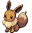

<pre><code><b>Base Happiness:</b> 200
<b>TM:</b> Can now learn TM86, Grass Knot.
<b>Ability One:</b> Anticipation
<b>Ability Two:</b> Adaptability
</code></pre>

**[#134 Vaporeon](../pokemon/vaporeon.md/)**

<pre><code><b>Base Happiness:</b> 200
<b>TM:</b> Can now learn TM86, Grass Knot.
<b>Ability One:</b> Water Absorb
<b>Ability Two:</b> Hydration
</code></pre>

**[#135 Jolteon](../pokemon/jolteon.md/)**

<pre><code><b>Base Happiness:</b> 200
<b>TM:</b> Can now learn TM86, Grass Knot.
<b>Ability One:</b> Volt Absorb
<b>Ability Two:</b> Lightning Rod
</code></pre>

**[#136 Flareon](../pokemon/flareon.md/)**

<pre><code><b>Base Happiness:</b> 200
<b>HP:</b> 65 → 110
<b>Attack:</b> 130 → 130
<b>Defense:</b> 60 → 65
<b>Special Attack:</b> 95 → 60
<b>Special Defense:</b> 110 → 65
<b>Speed:</b> 65 → 95
<b>TM:</b> Can now learn TM71, Stone Edge, TM80, Rock Slide, TM86 Grass Knot and TM93, Wild Charge.
<b>Ability One:</b> Flash Fire
<b>Ability Two:</b> Sheer Force
</code></pre>

**[#137 Porygon](../pokemon/porygon.md/)**

<pre><code><b>Evolution:</b> Use the Up-Grade.
<b>Ability One:</b> Trace
<b>Ability Two:</b> Download
</code></pre>

**[#138 Omanyte](../pokemon/omanyte.md/)**

<pre><code><b>Ability One:</b> Swift Swim
<b>Ability Two:</b> Shell Armor
</code></pre>

**[#139 Omastar](../pokemon/omastar.md/)**

<pre><code><b>Ability One:</b> Swift Swim
<b>Ability Two:</b> Iron Barbs
</code></pre>

**[#140 Kabuto](../pokemon/kabuto.md/)**

<pre><code><b>Ability One:</b> Swift Swim
<b>Ability Two:</b> Battle Armor
</code></pre>

**[#141 Kabutops](../pokemon/kabutops.md/)**

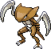

<pre><code><b>Ability One:</b> Swift Swim
<b>Ability Two:</b> Hyper Cutter
</code></pre>

**[#142 Aerodactyl](../pokemon/aerodactyl.md/)**

<pre><code><b>Ability One:</b> Rock Head
<b>Ability Two:</b> Pressure
</code></pre>

**[#143 Snorlax](../pokemon/snorlax.md/)**

<pre><code><b>Ability One:</b> Gluttony
<b>Ability Two:</b> Thick Fat
</code></pre>

**[#144 Articuno](../pokemon/articuno.md/)**

<pre><code><b>Item:</b> Petaya Berry (100%)
<b>Ability One:</b> Pressure
<b>Ability Two:</b> Snow Cloak
</code></pre>

**[#145 Zapdos](../pokemon/zapdos.md/)**

<pre><code><b>Item:</b> Salac Berry (100%)
<b>Ability One:</b> Pressure
<b>Ability Two:</b> Lightning Rod
</code></pre>

**[#146 Moltres](../pokemon/moltres.md/)**

<pre><code><b>Item:</b> Liechi Berry (100%)
<b>Ability One:</b> Pressure
<b>Ability Two:</b> Flame Body
</code></pre>

**[#147 Dratini](../pokemon/dratini.md/)**

<pre><code><b>Ability One:</b> Shed Skin
<b>Ability Two:</b> Marvel Scale
</code></pre>

**[#148 Dragonair](../pokemon/dragonair.md/)**

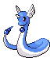

<pre><code><b>Ability One:</b> Shed Skin
<b>Ability Two:</b> Marvel Scale
</code></pre>

**[#149 Dragonite](../pokemon/dragonite.md/)**

<pre><code><b>Ability One:</b> Multiscale
<b>Ability Two:</b> Marvel Scale
</code></pre>

**[#150 Mewtwo](../pokemon/mewtwo.md/)**

<pre><code><b>Item:</b> Apicot Berry (100%)
<b>Ability One:</b> Pressure
<b>Ability Two:</b> Unnerve
</code></pre>

**[#151 Mew](../pokemon/mew.md/)**

<pre><code><b>Ability One:</b> Synchronize
<b>Ability Two:</b> Magic Guard
</code></pre>

---

## Johto Pokémon

**[#152 Chikorita](../pokemon/chikorita.md/), [#153 Bayleef](../pokemon/bayleef.md/), [#154 Meganium](../pokemon/meganium.md/)**

<pre><code><b>Item:</b> Miracle Seed (50%)
<b>Ability One:</b> Overgrow
<b>Ability Two:</b> Natural Cure
</code></pre>

**[#155 Cyndaquil](../pokemon/cyndaquil.md/), [#156 Quilava](../pokemon/quilava.md/), [#157 Typhlosion](../pokemon/typhlosion.md/)**

<pre><code><b>Item:</b> Charcoal (50%)
<b>Ability One:</b> Blaze
<b>Ability Two:</b> Flash Fire
</code></pre>

**[#158 Totodile](../pokemon/totodile.md/), [#159 Croconaw](../pokemon/croconaw.md/), [#160 Feraligatr.](../pokemon/feraligatr.md/)**

<pre><code><b>Item:</b> Mystic Water (50%)
<b>Ability One:</b> Torrent
<b>Ability Two:</b> Sheer Force
</code></pre>

**[#161 Sentret](../pokemon/sentret.md/)**

<pre><code><b>Ability One:</b> Frisk
<b>Ability Two:</b> Keen Eye
</code></pre>

**[#162 Furret](../pokemon/furret.md/)**

<pre><code><b>Attack:</b> 76 → 86
<b>Speed:</b> 90 → 100
<b>Total:</b> 415 → 435
<b>Ability One:</b> Frisk
<b>Ability Two:</b> Keen Eye
</code></pre>

**[#163 Hoothoot](../pokemon/hoothoot.md/)**

<pre><code><b>Ability One:</b> Insomnia
<b>Ability Two:</b> Tinted Lens
</code></pre>

**[#164 Noctowl](../pokemon/noctowl.md/)**

<pre><code><b>Special Attack:</b> 76 → 96
<b>Total:</b> 442 → 462
<b>Ability One:</b> Insomnia
<b>Ability Two:</b> Tinted Lens
</code></pre>

**[#165 Ledyba](../pokemon/ledyba.md/)**

<pre><code><b>Attack:</b> 20 → 40
<b>Special Attack:</b> 40 → 20
<b>Ability One:</b> Rattled
<b>Ability Two:</b> Early Bird
</code></pre>

**[#166 Ledian](../pokemon/ledian.md/)**

<pre><code><b>Attack:</b> 35 → 95
<b>Special Attack:</b> 55 → 35
<b>Total:</b> 390 → 430
<b>Ability One:</b> Iron Fist
<b>Ability Two:</b> Early Bird
</code></pre>

**[#167 Spinarak](../pokemon/spinarak.md/)**

<pre><code><b>Ability One:</b> Sniper
<b>Ability Two:</b> Insomnia
</code></pre>

**[#168 Ariados](../pokemon/ariados.md/)**

<pre><code><b>Speed:</b> 40 → 80
<b>Total:</b> 390 → 430
<b>Ability One:</b> Sniper
<b>Ability Two:</b> Insomnia
</code></pre>

**[#169 Crobat](../pokemon/crobat.md/)**

<pre><code><b>Base Happiness:</b> 140
<b>Ability One:</b> Inner Focus
<b>Ability Two:</b> Infiltrator
</code></pre>

**[#170 Chinchou](../pokemon/chinchou.md/)**

<pre><code><b>Ability One:</b> Volt Absorb
<b>Ability Two:</b> Water Absorb
</code></pre>

**[#171 Lanturn](../pokemon/lanturn.md/)**

<pre><code><b>Special Attack:</b> 76 → 86
<b>Special Defense:</b> 76 → 86
<b>Total:</b> 460 → 480
<b>Ability One:</b> Volt Absorb
<b>Ability Two:</b> Water Absorb
</code></pre>

**[#172 Pichu](../pokemon/pichu.md/)**

<pre><code><b>Base Happiness:</b> 200
<b>HM:</b> Can now learn HM03, Surf.
<b>Ability One:</b> Static
<b>Ability Two:</b> Lightning Rod
</code></pre>

**[#173 Cleffa](../pokemon/cleffa.md/)**

<pre><code><b>Base Happiness:</b> 200
<b>Ability One:</b> Friend Guard
<b>Ability Two:</b> Magic Guard
</code></pre>

**[#174 Igglybuff](../pokemon/igglybuff.md/)**

<pre><code><b>Base Happiness:</b> 200
<b>Ability One:</b> Cute Charm
<b>Ability Two:</b> Friend Guard
</code></pre>

**[#175 Togepi](../pokemon/togepi.md/)**

<pre><code><b>Base Happiness:</b> 200
<b>Ability One:</b> Super Luck
<b>Ability Two:</b> Serene Grace
</code></pre>

**[#176 Togetic](../pokemon/togetic.md/)**

<pre><code><b>Ability One:</b> Super Luck
<b>Ability Two:</b> Serene Grace
</code></pre>

**[#177 Natu](../pokemon/natu.md/)**

<pre><code><b>Ability One:</b> Synchronize
<b>Ability Two:</b> Magic Bounce
</code></pre>

**[#178 Xatu](../pokemon/xatu.md/)**

<pre><code><b>Special Attack:</b> 95 → 100
<b>Speed:</b> 95 → 100
<b>Total:</b> 470 → 480
<b>Ability One:</b> Synchronize
<b>Ability Two:</b> Magic Bounce
</code></pre>

**[#179 Mareep](../pokemon/mareep.md/), [#180 Flaaffy](../pokemon/flaaffy.md/)**

<pre><code><b>Ability One:</b> Static
<b>Ability Two:</b> Overcoat
</code></pre>

**[#181 Ampharos](../pokemon/ampharos.md/)**

<pre><code><b>TM:</b> Can now learn TM91, Flash Cannon.
<b>Ability One:</b> Static
<b>Ability Two:</b> Overcoat
</code></pre>

**[#182 Bellossom](../pokemon/bellossom.md/)**

<pre><code><b>HP:</b> 75 → 85
<b>Special Attack:</b> 90 → 100
<b>Special Defense:</b> 100 → 110
<b>Total:</b> 480 → 510
<b>Ability One:</b> Chlorophyll
<b>Ability Two:</b> Own Tempo
</code></pre>

**[#183 Marill](../pokemon/marill.md/)**

<pre><code><b>Special Attack:</b> 20 → 50
<b>Total:</b> 250 → 280
<b>Ability One:</b> Sap Sipper
<b>Ability Two:</b> Huge Power
</code></pre>

**[#184 Azumarill](../pokemon/azumarill.md/)**

<pre><code><b>HP:</b> 100 → 110
<b>Special Attack:</b> 50 → 90
<b>Total:</b> 410 → 450
<b>Ability One:</b> Sap Sipper
<b>Ability Two:</b> Huge Power
</code></pre>

**[#185 Sudowoodo](../pokemon/sudowoodo.md/)**

<pre><code><b>HP:</b> 70 → 85
<b>Attack:</b> 100 → 115
<b>Defense:</b> 115 → 130
<b>Special Defense:</b> 65 → 80
<b>Total:</b> 410 → 470
<b>Ability One:</b> Sturdy
<b>Ability Two:</b> Rattled
</code></pre>

**[#186 Politoed](../pokemon/politoed.md/)**

<pre><code><b>Ability One:</b> Water Absorb
<b>Ability Two:</b> Drizzle
</code></pre>

**[#187 Hoppip](../pokemon/hoppip.md/), [#188 Skiploom](../pokemon/skiploom.md/), [#189 Jumpluff](../pokemon/jumpluff.md/)**

<pre><code><b>Ability One:</b> Chlorophyll
<b>Ability Two:</b> Prankster
</code></pre>

**[#190 Aipom](../pokemon/aipom.md/)**

<pre><code><b>Ability One:</b> Skill Link
<b>Ability Two:</b> Pickup
</code></pre>

**[#191 Sunkern](../pokemon/sunkern.md/)**

<pre><code><b>Ability One:</b> Chlorophyll
<b>Ability Two:</b> Simple
</code></pre>

**[#192 Sunflora](../pokemon/sunflora.md/)**

<pre><code><b>Defense:</b> 55 → 85
<b>Special Attack:</b> 105 → 135
<b>Special Defense:</b> 85 → 95
<b>Total:</b> 425 → 495
<b>Base EXP:</b> 149 → 209
<b>Ability One:</b> Chlorophyll
<b>Ability Two:</b> Simple
</code></pre>

**[#193 Yanma](../pokemon/yanma.md/)**

<pre><code><b>Ability One:</b> Speed Boost
<b>Ability Two:</b> Compound Eyes
</code></pre>

**[#194 Wooper](../pokemon/wooper.md/)**

<pre><code><b>Ability One:</b> Unaware
<b>Ability Two:</b> Water Absorb
</code></pre>

**[#195 Quagsire](../pokemon/quagsire.md/)**

<pre><code><b>Attack:</b> 85 → 95
<b>Defense:</b> 85 → 95
<b>Total:</b> 430 → 450
<b>Ability One:</b> Unaware
<b>Ability Two:</b> Water Absorb
</code></pre>

**[#196 Espeon](../pokemon/espeon.md/)**

<pre><code><b>Ability One:</b> Synchronize
<b>Ability Two:</b> Magic Bounce
</code></pre>

**[#197 Umbreon](../pokemon/umbreon.md/)**

<pre><code><b>TM:</b> Can now learn TM86, Grass Knot.
<b>Ability One:</b> Synchronize
<b>Ability Two:</b> Prankster
</code></pre>

**[#198 Murkrow](../pokemon/murkrow.md/)**

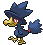

<pre><code><b>Ability One:</b> Prankster
<b>Ability Two:</b> Super Luck
</code></pre>

**[#199 Slowking](../pokemon/slowking.md/)**

<pre><code><b>Ability One:</b> Regenerator
<b>Ability Two:</b> Drizzle
</code></pre>

**[#200 Misdreavus](../pokemon/misdreavus.md/)**

<pre><code><b>Ability One:</b> Levitate
<b>Ability Two:</b> Levitate
</code></pre>

**[#201 Unown](../pokemon/unown.md/)**

<pre><code><b>Attack:</b> 72 → 112
<b>Special Attack:</b> 72 → 112
<b>Speed:</b> 48 → 88
<b>Total:</b> 336 → 456
<b>Base EXP:</b> 118 → 196
<b>Ability One:</b> Levitate
<b>Ability Two:</b> Levitate
</code></pre>

**[#202 Wobbuffet](../pokemon/wobbuffet.md/)**

<pre><code><b>Ability One:</b> Shadow Tag
<b>Ability Two:</b> Telepathy
</code></pre>

**[#203 Girafarig](../pokemon/girafarig.md/)**

<pre><code><b>Special Attack:</b> 90 → 110
<b>Speed:</b> 85 → 105
<b>Total:</b> 455 → 495
<b>Base EXP:</b> 159 → 205
<b>Ability One:</b> Sap Sipper
<b>Ability Two:</b> Early Bird
</code></pre>

**[#204 Pineco](../pokemon/pineco.md/), [#205 Forretress](../pokemon/forretress.md/)**

<pre><code><b>Ability One:</b> Sturdy
<b>Ability Two:</b> Overcoat
</code></pre>

**[#206 Dunsparce](../pokemon/dunsparce.md/)**

<pre><code><b>HP:</b> 100 → 120
<b>Attack:</b> 70 → 90
<b>Total:</b> 415 → 455
<b>Ability One:</b> Serene Grace
<b>Ability Two:</b> Rattled
</code></pre>

**[#207 Gligar](../pokemon/gligar.md/)**

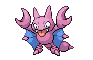

<pre><code><b>Ability One:</b> Hyper Cutter
<b>Ability Two:</b> Immunity
</code></pre>

**[#208 Steelix](../pokemon/steelix.md/)**

<pre><code><b>Attack:</b> 85 → 90
<b>Total:</b> 510 → 515
<b>Ability One:</b> Sheer Force
<b>Ability Two:</b> Sturdy
</code></pre>

**[#209 Snubbull](../pokemon/snubbull.md/)**

<pre><code><b>Ability One:</b> Intimidate
<b>Ability Two:</b> Rattled
</code></pre>

**[#210 Granbull](../pokemon/granbull.md/)**

<pre><code><b>HP:</b> 90 → 105
<b>Total:</b> 450 → 465
<b>Ability One:</b> Intimidate
<b>Ability Two:</b> Rattled
</code></pre>

**[#211 Qwilfish](../pokemon/qwilfish.md/)**

<pre><code><b>Special Attack:</b> 55 → 95
<b>Total:</b> 430 → 470
<b>Ability One:</b> Poison Touch
<b>Ability Two:</b> Intimidate
</code></pre>

**[#212 Scizor](../pokemon/scizor.md/)**

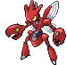

<pre><code><b>Ability One:</b> Swarm
<b>Ability Two:</b> Technician
</code></pre>

**[#213 Shuckle](../pokemon/shuckle.md/)**

<pre><code><b>Ability One:</b> Sturdy
<b>Ability Two:</b> Solid Rock
</code></pre>

**[#214 Heracross](../pokemon/heracross.md/)**

<pre><code><b>Ability One:</b> Moxie
<b>Ability Two:</b> Guts
</code></pre>

**[#215 Sneasel](../pokemon/sneasel.md/)**

<pre><code><b>TM:</b> Now learns TM79, Frost Breath.
<b>Ability One:</b> Pickpocket
<b>Ability Two:</b> Technician
</code></pre>

**[#216 Teddiursa](../pokemon/teddiursa.md/)**

<pre><code><b>Ability One:</b> Pickup
<b>Ability Two:</b> Honey Gather
</code></pre>

**[#217 Ursaring](../pokemon/ursaring.md/)**

<pre><code><b>Ability One:</b> Pickup
<b>Ability Two:</b> Sheer Force
</code></pre>

**[#218 Slugma](../pokemon/slugma.md/)**

<pre><code><b>Item:</b> Flame Orb (50%)
<b>Ability One:</b> Magma Armor
<b>Ability Two:</b> Flame Body
</code></pre>

**[#219 Magcargo](../pokemon/magcargo.md/)**

<pre><code><b>Item:</b> Flame Orb (50%)
<b>Defense:</b> 120 → 135
<b>Special Attack:</b> 80 → 115
<b>Special Defense:</b> 80 → 115
<b>Total:</b> 410 → 495
<b>Base EXP:</b> 144 → 205
<b>Ability One:</b> Solid Rock
<b>Ability Two:</b> Flame Body
</code></pre>

**[#220 Swinub](../pokemon/swinub.md/), [#221 Piloswine](../pokemon/piloswine.md/)**

<pre><code><b>Ability One:</b> Thick Fat
<b>Ability Two:</b> Snow Cloak
</code></pre>

**[#222 Corsola](../pokemon/corsola.md/)**

<pre><code><b>Defense:</b> 85 → 115
<b>Special Attack:</b> 65 → 105
<b>Special Defense:</b> 85 → 110
<b>Total:</b> 380 → 475
<b>Base EXP:</b> 133 → 205
<b>Ability One:</b> Regenerator
<b>Ability Two:</b> Natural Cure
</code></pre>

**[#223 Remoraid](../pokemon/remoraid.md/), [#224 Octillery](../pokemon/octillery.md/)**

<pre><code><b>TM:</b> Now learn TM79, Frost Breath.
<b>Ability One:</b> Moody
<b>Ability Two:</b> Sniper
</code></pre>

**[#225 Delibird](../pokemon/delibird.md/)**

<pre><code><b>HP:</b> 45 → 50
<b>Attack:</b> 55 → 95
<b>Defense:</b> 45 → 55
<b>Special Attack:</b> 65 → 105
<b>Special Defense:</b> 45 → 55
<b>Speed:</b> 75 → 115
<b>Total:</b> 330 → 475
<b>Base EXP:</b> 116 → 201
<b>TM:</b> Can now learn TM62 Acrobatics and TM89 U-turn.
<b>Ability One:</b> Vital Spirit
<b>Ability Two:</b> Technician
</code></pre>

**[#226 Mantine](../pokemon/mantine.md/)**

<pre><code><b>HM:</b> Can now learn HM02, Fly.
<b>Ability One:</b> Swift Swim
<b>Ability Two:</b> Water Absorb
</code></pre>

**[#227 Skarmory](../pokemon/skarmory.md/)**

<pre><code><b>Ability One:</b> Light Metal
<b>Ability Two:</b> Sturdy
</code></pre>

**[#228 Houndour](../pokemon/houndour.md/), [#229 Houndoom](../pokemon/houndoom.md/)**

<pre><code><b>Ability One:</b> Intimidate
<b>Ability Two:</b> Flash Fire
</code></pre>

**[#230 Kingdra](../pokemon/kingdra.md/)**

<pre><code><b>TM:</b> Now learns TM79, Frost Breath.
<b>Ability One:</b> Swift Swim
<b>Ability Two:</b> Sniper
</code></pre>

**[#231 Phanpy](../pokemon/phanpy.md/)**

<pre><code><b>Ability One:</b> Pickup
<b>Ability Two:</b> Sand Veil
</code></pre>

**[#232 Donphan](../pokemon/donphan.md/)**

<pre><code><b>Ability One:</b> Sturdy
<b>Ability Two:</b> Sand Force
</code></pre>

**[#233 Porygon2](../pokemon/porygon2.md/)**

<pre><code><b>Evolution:</b> Use the Dubious Disc.
<b>Ability One:</b> Trace
<b>Ability Two:</b> Download
</code></pre>

**[#234 Stantler](../pokemon/stantler.md/)**

<pre><code><b>Attack:</b> 95 → 100
<b>Total:</b> 465 → 470
<b>Ability One:</b> Intimidate
<b>Ability Two:</b> Sap Sipper
</code></pre>

**[#235 Smeargle](../pokemon/smeargle.md/)**

<pre><code><b>Speed:</b> 75 → 115
<b>Total:</b> 250 → 290
<b>Base EXP:</b> 88 → 111
<b>Ability One:</b> Moody
<b>Ability Two:</b> Technician
</code></pre>

**[#236 Tyrogue](../pokemon/tyrogue.md/)**

<pre><code><b>Ability One:</b> Guts
<b>Ability Two:</b> Vital Spirit
</code></pre>

**[#237 Hitmontop](../pokemon/hitmontop.md/)**

<pre><code><b>Ability One:</b> Intimidate
<b>Ability Two:</b> Technician
</code></pre>

**[#238 Smoochum](../pokemon/smoochum.md/)**

<pre><code><b>Ability One:</b> Trace
<b>Ability Two:</b> Hydration
</code></pre>

**[#239 Elekid](../pokemon/elekid.md/)**

<pre><code><b>Ability One:</b> Static
<b>Ability Two:</b> Vital Spirit
</code></pre>

**[#240 Magby](../pokemon/magby.md/)**

<pre><code><b>Ability One:</b> Flame Body
<b>Ability Two:</b> Vital Spirit
</code></pre>

**[#241 Miltank](../pokemon/miltank.md/)**

<pre><code><b>Attack:</b> 80 → 90
<b>Total:</b> 490 → 500
<b>Ability One:</b> Thick Fat
<b>Ability Two:</b> Scrappy
</code></pre>

**[#242 Blissey](../pokemon/blissey.md/)**

<pre><code><b>Ability One:</b> Natural Cure
<b>Ability Two:</b> Serene Grace
</code></pre>

**[#243 Raikou](../pokemon/raikou.md/)**

<pre><code><b>Item:</b> Micle Berry (100%)
<b>Ability One:</b> Pressure
<b>Ability Two:</b> Volt Absorb
</code></pre>

**[#244 Entei](../pokemon/entei.md/)**

<pre><code><b>Item:</b> Custap Berry (100%)
<b>Ability One:</b> Pressure
<b>Ability Two:</b> Flash Fire
</code></pre>

**[#245 Suicune](../pokemon/suicune.md/)**

<pre><code><b>Item:</b> Rowap Berry (100%)
<b>Ability One:</b> Pressure
<b>Ability Two:</b> Water Absorb
</code></pre>

**[#246 Larvitar](../pokemon/larvitar.md/)**

<pre><code><b>Ability One:</b> Guts
<b>Ability Two:</b> Hustle
</code></pre>

**[#247 Pupitar](../pokemon/pupitar.md/)**

<pre><code><b>Ability One:</b> Shed Skin
<b>Ability Two:</b> Battle Armor
</code></pre>

**[#248 Tyranitar](../pokemon/tyranitar.md/)**

<pre><code><b>Ability One:</b> Sand Stream
<b>Ability Two:</b> Battle Armor
</code></pre>

**[#249 Lugia](../pokemon/lugia.md/)**

<pre><code><b>Item:</b> Ganlon Berry (100%)
<b>Ability One:</b> Pressure
<b>Ability Two:</b> Multiscale
</code></pre>

**[#250 Ho-oh](../pokemon/ho-oh.md/)**

<pre><code><b>Ability One:</b> Pressure
<b>Ability Two:</b> Regenerator
</code></pre>

**[#251 Celebi](../pokemon/celebi.md/)**

<pre><code><b>Item:</b> Jaboca Berry (100%)
<b>Ability One:</b> Natural Cure
<b>Ability Two:</b> Magic Guard
</code></pre>

---

## Hoenn Pokémon

**[#252 Treecko](../pokemon/treecko.md/), [#253 Grovyle](../pokemon/grovyle.md/), [#254 Sceptile](../pokemon/sceptile.md/)**

<pre><code><b>Item:</b> Miracle Seed (50%)
<b>Ability One:</b> Overgrow
<b>Ability Two:</b> Adaptability
</code></pre>

**[#255 Torchic](../pokemon/torchic.md/), [#256 Combusken](../pokemon/combusken.md/), [#257 Blaziken](../pokemon/blaziken.md/)**

<pre><code><b>Item:</b> Charcoal (50%)
<b>Ability One:</b> Blaze
<b>Ability Two:</b> Speed Boost
</code></pre>

**[#258 Mudkip](../pokemon/mudkip.md/), [#259 Marshtomp](../pokemon/marshtomp.md/), [#260 Swampert](../pokemon/swampert.md/)**

<pre><code><b>Item:</b> Mystic Water (50%)
<b>Ability One:</b> Torrent
<b>Ability Two:</b> Mold Breaker
</code></pre>

**[#261 Poochyena](../pokemon/poochyena.md/)**

<pre><code><b>Ability One:</b> Rattled
<b>Ability Two:</b> Quick Feet
</code></pre>

**[#262 Mightyena](../pokemon/mightyena.md/)**

<pre><code><b>Attack:</b> 90 → 105
<b>Total:</b> 420 → 435
<b>Ability One:</b> Intimidate
<b>Ability Two:</b> Moxie
</code></pre>

**[#263 Zigzagoon](../pokemon/zigzagoon.md/)**

<pre><code><b>Ability One:</b> Pickup
<b>Ability Two:</b> Gluttony
</code></pre>

**[#264 Linoone](../pokemon/linoone.md/)**

<pre><code><b>Attack:</b> 70 → 85
<b>Total:</b> 420 → 435
<b>Ability One:</b> Pickup
<b>Ability Two:</b> Quick Feet
</code></pre>

**[#265 Wurmple](../pokemon/wurmple.md/)**

<pre><code><b>Ability One:</b> Shield Dust
<b>Ability Two:</b> Run Away
</code></pre>

**[#266 Silcoon](../pokemon/silcoon.md/)**

<pre><code><b>Ability One:</b> Shed Skin
<b>Ability Two:</b> Battle Armor
</code></pre>

**[#267 Beautifly](../pokemon/beautifly.md/)**

<pre><code><b>Special Attack:</b> 90 → 105
<b>Speed:</b> 65 → 85
<b>Total:</b> 385 → 420
<b>Ability One:</b> Swarm
<b>Ability Two:</b> Shield Dust
</code></pre>

**[#268 Silcoon](../pokemon/silcoon.md/)**

<pre><code><b>Ability One:</b> Shed Skin
<b>Ability Two:</b> Battle Armor
</code></pre>

**[#269 Dustox](../pokemon/dustox.md/)**

<pre><code><b>Special Defense:</b> 90 → 105
<b>Speed:</b> 65 → 85
<b>Total:</b> 385 → 420
<b>Ability One:</b> Shield Dust
<b>Ability Two:</b> Compound Eyes
</code></pre>

**[#270 Lotad](../pokemon/lotad.md/)**

<pre><code><b>Ability One:</b> Swift Swim
<b>Ability Two:</b> Rain Dish
</code></pre>

**[#271 Lombre](../pokemon/lombre.md/)**

<pre><code><b>Ability One:</b> Swift Swim
<b>Ability Two:</b> Rain Dish
</code></pre>

**[#272 Ludicolo](../pokemon/ludicolo.md/)**

<pre><code><b>Ability One:</b> Swift Swim
<b>Ability Two:</b> Rain Dish
</code></pre>

**[#273 Seedot](../pokemon/seedot.md/)**

<pre><code><b>Ability One:</b> Pickpocket
<b>Ability Two:</b> Early Bird
</code></pre>

**[#274 Nuzleaf](../pokemon/nuzleaf.md/)**

<pre><code><b>Ability One:</b> Pickpocket
<b>Ability Two:</b> Early Bird
</code></pre>

**[#275 Shiftry](../pokemon/shiftry.md/)**

<pre><code><b>Ability One:</b> Pickpocket
<b>Ability Two:</b> Early Bird
</code></pre>

**[#276 Taillow](../pokemon/taillow.md/)**

<pre><code><b>TM:</b> Now learns TM62 Acrobatics.
<b>Ability One:</b> Unburden
<b>Ability Two:</b> Scrappy
</code></pre>

**[#277 Swellow](../pokemon/swellow.md/)**

<pre><code><b>HP:</b> 60 → 70
<b>Attack:</b> 85 → 100
<b>Total:</b> 430 → 455
<b>TM:</b> Now learns TM62 Acrobatics.
<b>Ability One:</b> Unburden
<b>Ability Two:</b> Scrappy
</code></pre>

**[#278 Wingull](../pokemon/wingull.md/)**

<pre><code><b>Ability One:</b> Keen Eye
<b>Ability Two:</b> Infiltrator
</code></pre>

**[#279 Pelipper](../pokemon/pelipper.md/)**

<pre><code><b>Defense:</b> 100 → 120
<b>Special Attack:</b> 85 → 100
<b>Stat Total:</b> 430 → 465
<b>Ability One:</b> Keen Eye
<b>Ability Two:</b> Rain Dish
</code></pre>

**[#280 Ralts](../pokemon/ralts.md/)**

<pre><code><b>Special Attack:</b> 45 → 65
<b>Total:</b> 198 → 218
<b>Ability One:</b> Synchronize
<b>Ability Two:</b> Trace
</code></pre>

**[#281 Kirlia](../pokemon/kirlia.md/)**

<pre><code><b>Special Attack:</b> 65 → 95
<b>Total:</b> 278 → 308
<b>Ability One:</b> Synchronize
<b>Ability Two:</b> Trace
</code></pre>

**[#282 Gardevoir](../pokemon/gardevoir.md/)**

<pre><code><b>Ability One:</b> Synchronize
<b>Ability Two:</b> Trace
</code></pre>

**[#283 Surskit](../pokemon/surskit.md/)**

<pre><code><b>Ability One:</b> Swift Swim
<b>Ability Two:</b> Rain Dish
<b>HM:</b> Can now learn HM03, Surf.
</code></pre>

**[#284 Masquerain](../pokemon/masquerain.md/)**

<pre><code><b>Type:</b> Bug / Water
<b>HP:</b> 70 → 70
<b>Attack:</b> 60 → 60
<b>Defense:</b> 62 → 62
<b>Special Attack:</b> 80 → 100
<b>Special Defense:</b> 82 → 102
<b>Speed:</b> 60 → 90
<b>Total:</b> 414 → 484
<b>Base EXP:</b> 145 → 200
<b>HM:</b> Can now learn HM03, Surf and HM05, Waterfall.
<b>Ability One:</b> Levitate
<b>Ability Two:</b> Levitate
</code></pre>

**[#285 Shroomish](../pokemon/shroomish.md/)**

<pre><code><b>Ability One:</b> Effect Spore
<b>Ability Two:</b> Poison Heal
</code></pre>

**[#286 Breloom](../pokemon/breloom.md/)**

<pre><code><b>Ability One:</b> Technician
<b>Ability Two:</b> Poison Heal
</code></pre>

**[#287 Slakoth](../pokemon/slakoth.md/)**

<pre><code><b>Ability One:</b> Truant
<b>Ability Two:</b> Slow Start
</code></pre>

**[#288 Vigoroth](../pokemon/vigoroth.md/)**

<pre><code><b>Attack:</b> 80 → 100
<b>Total:</b> 440 → 460
<b>Ability One:</b> Vital Spirit
<b>Ability Two:</b> Sheer Force
</code></pre>

**[#289 Slaking](../pokemon/slaking.md/)**

<pre><code><b>Ability One:</b> Truant
<b>Ability Two:</b> Slow Start
</code></pre>

**[#290 Nincada](../pokemon/nincada.md/)**

<pre><code><b>Ability One:</b> Compound Eyes
<b>Ability Two:</b> Anticipation
</code></pre>

**[#291 Ninjask](../pokemon/ninjask.md/)**

<pre><code><b>Ability One:</b> Speed Boost
<b>Ability Two:</b> Infiltrator
</code></pre>

**[#292 Shedinja](../pokemon/shedinja.md/)**

<pre><code><b>Ability One:</b> Wonder Guard
<b>Ability Two:</b> Wonder Guard
</code></pre>

**[#293 Whismur](../pokemon/whismur.md/)**

<pre><code><b>Ability One:</b> Soundproof
<b>Ability Two:</b> Rattled
</code></pre>

**[#294 Loudred](../pokemon/loudred.md/), [#295 Exploud](../pokemon/exploud.md/)**

<pre><code><b>Ability One:</b> Soundproof
<b>Ability Two:</b> Scrappy
</code></pre>

**[#296 Makuhita](../pokemon/makuhita.md/), [#297 Hariyama](../pokemon/hariyama.md/)**

<pre><code><b>Ability One:</b> Thick Fat
<b>Ability Two:</b> Sheer Force
</code></pre>

**[#298 Azurill](../pokemon/azurill.md/)**

<pre><code><b>Ability One:</b> Sap Sipper
<b>Ability Two:</b> Huge Power
</code></pre>

**[#299 Nosepass](../pokemon/nosepass.md/)**

<pre><code><b>Ability One:</b> Sturdy
<b>Ability Two:</b> Magnet Pull
</code></pre>

**[#300 Skitty](../pokemon/skitty.md/)**

<pre><code><b>Ability One:</b> Normalize
<b>Ability Two:</b> Wonder Skin
</code></pre>

**[#301 Delcatty](../pokemon/delcatty.md/)**

<pre><code><b>Attack:</b> 65 → 75
<b>Special Attack:</b> 55 → 95
<b>Speed:</b> 70 → 90
<b>Total:</b> 380 → 450
<b>Ability One:</b> Normalize
<b>Ability Two:</b> Wonder Skin
</code></pre>

**[#302 Sableye](../pokemon/sableye.md/)**

<pre><code><b>HP:</b> 50 → 70
<b>Attack:</b> 75 → 95
<b>Defense:</b> 75 → 95
<b>Special Defense:</b> 65 → 85
<b>Total:</b> 380 → 460
<b>Base EXP:</b> 133 → 197
<b>Ability One:</b> Prankster
<b>Ability Two:</b> Analytic
</code></pre>

**[#303 Mawile](../pokemon/mawile.md/)**

<pre><code><b>HP:</b> 50 → 70
<b>Attack:</b> 85 → 105
<b>Defense:</b> 85 → 90
<b>Special Defense:</b> 55 → 90
<b>Total:</b> 380 → 460
<b>Base EXP:</b> 133 → 197
<b>Ability One:</b> Sheer Force
<b>Ability Two:</b> Intimidate
</code></pre>

**[#304 Aron](../pokemon/aron.md/), [#305 Lairon](../pokemon/lairon.md/), [#306 Aggron](../pokemon/aggron.md/)**

<pre><code><b>Ability One:</b> Sturdy
<b>Ability Two:</b> Rock Head
</code></pre>

**[#307 Meditite](../pokemon/meditite.md/), [#308 Medicham](../pokemon/medicham.md/)**

<pre><code><b>Ability One:</b> Pure Power
<b>Ability Two:</b> Telepathy
</code></pre>

**[#309 Electrike](../pokemon/electrike.md/), [#310 Manectric](../pokemon/manectric.md/)**

<pre><code><b>Ability One:</b> Static
<b>Ability Two:</b> Lightning Rod
</code></pre>

**[#311 Plusle](../pokemon/plusle.md/)**

<pre><code><b>Ability One:</b> Plus
<b>Ability Two:</b> Plus
</code></pre>

**[#312 Minun](../pokemon/minun.md/)**

<pre><code><b>Ability One:</b> Minus
<b>Ability Two:</b> Minus
</code></pre>

**[#313 Volbeat](../pokemon/volbeat.md/)**

<pre><code><b>Type:</b> Bug / Electric
<b>HP:</b> 65 → 80
<b>Attack:</b> 73 → 30
<b>Defense:</b> 55 → 60
<b>Special Attack:</b> 47 → 90
<b>Special Defense:</b> 75 → 80
<b>Speed:</b> 85 → 90
<b>Stat Total:</b> 400 → 430
<b>Base EXP:</b> 140 → 195
<b>Ability One:</b> Prankster
<b>Ability Two:</b> Swarm
</code></pre>

**[#314 Illumise](../pokemon/illumise.md/)**

<pre><code><b>Type:</b> Bug / Electric
<b>HP:</b> 65 → 80
<b>Attack:</b> 73 → 30
<b>Defense:</b> 55 → 60
<b>Special Attack:</b> 47 → 80
<b>Special Defense:</b> 75 → 90
<b>Speed:</b> 85 → 90
<b>Stat Total:</b> 400 → 430
<b>Base EXP:</b> 140 → 195
<b>Ability One:</b> Prankster
<b>Ability Two:</b> Tinted Lens
</code></pre>

**[#315 Roselia](../pokemon/roselia.md/)**

<pre><code><b>Ability One:</b> Natural Cure
<b>Ability Two:</b> Poison Point
</code></pre>

**[#316 Gulpin](../pokemon/gulpin.md/)**

<pre><code><b>Ability One:</b> Liquid Ooze
<b>Ability Two:</b> Gluttony
</code></pre>

**[#317 Swalot](../pokemon/swalot.md/)**

<pre><code><b>Special Attack:</b> 73 → 103
<b>Total:</b> 467 → 497
<b>Ability One:</b> Liquid Ooze
<b>Ability Two:</b> Gluttony
</code></pre>

**[#318 Carvanha](../pokemon/carvanha.md/), [#319 Sharpedo](../pokemon/sharpedo.md/)**

<pre><code><b>Ability One:</b> Rough Skin
<b>Ability Two:</b> Speed Boost
</code></pre>

**[#320 Wailmer](../pokemon/wailmer.md/), [#321 Wailord](../pokemon/wailord.md/)**

<pre><code><b>Ability One:</b> Thick Fat
<b>Ability Two:</b> Drizzle
</code></pre>

**[#322 Numel](../pokemon/numel.md/)**

<pre><code><b>Ability One:</b> Own Tempo
<b>Ability Two:</b> Simple
</code></pre>

**[#323 Camerupt](../pokemon/camerupt.md/)**

<pre><code><b>Ability One:</b> Drought
<b>Ability Two:</b> Solid Rock
</code></pre>

**[#324 Torkoal](../pokemon/torkoal.md/)**

<pre><code><b>Attack:</b> 85 → 100
<b>Special Attack:</b> 85 → 100
<b>Total:</b> 470 → 500
<b>Ability One:</b> White Smoke
<b>Ability Two:</b> Sturdy
</code></pre>

**[#325 Spoink](../pokemon/spoink.md/), [#326 Grumpig](../pokemon/grumpig.md/)**

<pre><code><b>Ability One:</b> Thick Fat
<b>Ability Two:</b> Own Tempo
</code></pre>

**[#327 Spinda](../pokemon/spinda.md/)**

<pre><code><b>HP:</b> 60 → 80
<b>Attack:</b> 60 → 80
<b>Defense:</b> 60 → 80
<b>Special Attack:</b> 60 → 80
<b>Special Defense:</b> 60 → 80
<b>Speed:</b> 60 → 80
<b>Total:</b> 360 → 480
<b>Base EXP:</b> 126 → 200
<b>Ability One:</b> Own Tempo
<b>Ability Two:</b> Contrary
</code></pre>

**[#328 Trapinch](../pokemon/trapinch.md/)**

<pre><code><b>Ability One:</b> Hyper Cutter
<b>Ability Two:</b> Sheer Force
</code></pre>

**[#329 Vibrava](../pokemon/vibrava.md/)**

<pre><code><b>Ability One:</b> Levitate
<b>Ability Two:</b> Levitate
</code></pre>

**[#330 Flygon](../pokemon/flygon.md/)**

<pre><code><b>Attack:</b> 100 → 110
<b>Defense:</b> 80 → 75
<b>Special Attack:</b> 80 → 110
<b>Special Defense:</b> 80 → 75
<b>Total:</b> 520 → 550
<b>Base EXP:</b> 234 → 243
<b>Ability One:</b> Levitate
<b>Ability Two:</b> Levitate
</code></pre>

**[#331 Cacnea](../pokemon/cacnea.md/), [#332 Cacturne](../pokemon/cacturne.md/)**

<pre><code><b>Ability One:</b> Sand Veil
<b>Ability Two:</b> Water Absorb
</code></pre>

**[#333 Swablu](../pokemon/swablu.md/)**

<pre><code><b>TM:</b> Now learns TM62 Acrobatics.
<b>Ability One:</b> Natural Cure
<b>Ability Two:</b> Cloud Nine
</code></pre>

**[#334 Altaria](../pokemon/altaria.md/)**

<pre><code><b>Special Attack:</b> 70 → 100
<b>Total:</b> 490 → 520
<b>Base EXP:</b> 172 → 203
<b>TM:</b> Now learns TM58 Sky Drop and TM62 Acrobatics.
<b>Ability One:</b> Natural Cure
<b>Ability Two:</b> Cloud Nine
</code></pre>

**[#335 Zangoose](../pokemon/zangoose.md/)**

<pre><code><b>Ability One:</b> Immunity
<b>Ability Two:</b> Toxic Boost
</code></pre>

**[#336 Seviper](../pokemon/seviper.md/)**

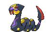

<pre><code><b>Ability One:</b> Shed Skin
<b>Ability Two:</b> Infiltrator
</code></pre>

**[#337 Lunatone](../pokemon/lunatone.md/)**

<pre><code><b>Special Attack:</b> 95 → 115
<b>Total:</b> 440 → 460
<b>Ability One:</b> Levitate
<b>Ability Two:</b> Levitate
</code></pre>

**[#338 Solrock](../pokemon/solrock.md/)**

<pre><code><b>Attack:</b> 95 → 115
<b>Total:</b> 440 → 460
<b>Ability One:</b> Levitate
<b>Ability Two:</b> Levitate
</code></pre>

**[#339 Barboach](../pokemon/barboach.md/)**

<pre><code><b>Ability One:</b> Forewarn
<b>Ability Two:</b> Simple
</code></pre>

**[#340 Whiscash](../pokemon/whiscash.md/)**

<pre><code><b>Attack:</b> 78 → 98
<b>Total:</b> 468 → 488
<b>Ability One:</b> Forewarn
<b>Ability Two:</b> Simple
</code></pre>

**[#341 Corphish](../pokemon/corphish.md/), [#342 Crawdaunt](../pokemon/crawdaunt.md/)**

<pre><code><b>Ability One:</b> Hyper Cutter
<b>Ability Two:</b> Adaptability
</code></pre>

**[#343 Baltoy](../pokemon/baltoy.md/)**

<pre><code><b>Ability One:</b> Levitate
<b>Ability Two:</b> Levitate
</code></pre>

**[#344 Claydol](../pokemon/claydol.md/)**

<pre><code><b>Item:</b> Life Orb (5%)
<b>HM:</b> Can now learn HM02, Fly.
<b>Ability One:</b> Levitate
<b>Ability Two:</b> Levitate
</code></pre>

**[#345 Lileep](../pokemon/lileep.md/), [#346 Cradily](../pokemon/cradily.md/)**

<pre><code><b>Ability One:</b> Suction Cups
<b>Ability Two:</b> Storm Drain
</code></pre>

**[#347 Anorith](../pokemon/anorith.md/), [#348 Armaldo](../pokemon/armaldo.md/)**

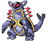

<pre><code><b>Ability One:</b> Battle Armor
<b>Ability Two:</b> Swift Swim
</code></pre>

**[#349 Feebas](../pokemon/feebas.md/)**

<pre><code><b>Evolution:</b> Use the Prism Scale.
<b>Ability One:</b> Swift Swim
<b>Ability Two:</b> Adaptability
</code></pre>

**[#350 Milotic](../pokemon/milotic.md/)**

<pre><code><b>Ability One:</b> Marvel Scale
<b>Ability Two:</b> Multiscale
</code></pre>

**[#351 Castform](../pokemon/castform.md/)**

<pre><code><b>HP:</b> 60 → 80
<b>Attack:</b> 60 → 80
<b>Special Attack:</b> 60 → 100
<b>Speed:</b> 60 → 100
<b>Total:</b> 360 → 500
<b>Base EXP:</b> 147 → 202
<b>Ability One:</b> Forecast
<b>Ability Two:</b> Forecast
</code></pre>

**[#352 Kecleon](../pokemon/kecleon.md/)**

<pre><code><b>HP:</b> 60 → 100
<b>Total:</b> 440 → 480
<b>Ability One:</b> Color Change
<b>Ability Two:</b> Color Change
</code></pre>

**[#353 Shuppet](../pokemon/shuppet.md/)**

<pre><code><b>Ability One:</b> Insomnia
<b>Ability Two:</b> Cursed Body
</code></pre>

**[#354 Banette](../pokemon/banette.md/)**

<pre><code><b>Attack:</b> 115 → 130
<b>Speed:</b> 65 → 80
<b>Total:</b> 455 → 485
<b>Ability One:</b> Insomnia
<b>Ability Two:</b> Cursed Body
</code></pre>

**[#355 Duskull](../pokemon/duskull.md/)**

<pre><code><b>Ability One:</b> Levitate
<b>Ability Two:</b> Levitate
</code></pre>

**[#356 Dusclops](../pokemon/dusclops.md/)**

<pre><code><b>Evolution:</b> Use the Reaper Cloth.
<b>Ability One:</b> Pressure
<b>Ability Two:</b> Cursed Body
</code></pre>

**[#357 Tropius](../pokemon/tropius.md/)**

<pre><code><b>HP:</b> 99 → 110
<b>Attack:</b> 68 → 85
<b>Defense:</b> 83 → 90
<b>Special Attack:</b> 72 → 90
<b>Special Defense:</b> 87 → 90
<b>Speed:</b> 51 → 70
<b>Total:</b> 460 → 535
<b>Base EXP:</b> 161 → 238
<b>Ability One:</b> Chlorophyll
<b>Ability Two:</b> Harvest
</code></pre>

**[#358 Chimecho](../pokemon/chimecho.md/)**

<pre><code><b>HP:</b> 65 → 70
<b>Defense:</b> 70 → 80
<b>Special Attack:</b> 95 → 110
<b>Special Defense:</b> 80 → 100
<b>Speed:</b> 65 → 90
<b>Total:</b> 425 → 500
<b>Base EXP:</b> 149 → 199
<b>Ability One:</b> Levitate
<b>Ability Two:</b> Levitate
</code></pre>

**[#359 Absol](../pokemon/absol.md/)**

<pre><code><b>Ability One:</b> Justified
<b>Ability Two:</b> Super Luck
</code></pre>

**[#360 Wynaut](../pokemon/wynaut.md/)**

<pre><code><b>Ability One:</b> Shadow Tag
<b>Ability Two:</b> Telepathy
</code></pre>

**[#361 Snorunt](../pokemon/snorunt.md/)**

<pre><code><b>Ability One:</b> Ice Body
<b>Ability Two:</b> Moody
</code></pre>

**[#362 Glalie](../pokemon/glalie.md/)**

<pre><code><b>Type:</b> Ice / Rock
<b>TM:</b> Can now learn TM23 Smack Down, TM37 Sandstorm, TM69 Rock Polish, TM71 Stone Edge and TM80 Rock Slide.
<b>HP:</b> 80 → 100
<b>Attack:</b> 80 → 100
<b>Defense:</b> 80 → 120
<b>Special Attack:</b> 80 → 60
<b>Special Defense:</b> 80 → 60
<b>Speed:</b> 80 → 60
<b>Total:</b> 480 → 500
<b>Base EXP:</b> 168 → 189
<b>Ability One:</b> Solid Rock
<b>Ability Two:</b> Moody
</code></pre>

**[#363 Spheal](../pokemon/spheal.md/), [#364 Sealeo](../pokemon/sealeo.md/), [#365 Walrein](../pokemon/walrein.md/)**

<pre><code><b>Ability One:</b> Thick Fat
<b>Ability Two:</b> Ice Body
</code></pre>

**[#366 Clamperl](../pokemon/clamperl.md/)**

<pre><code><b>Evolution (Huntail):</b> Level Up at Night with a Deep Sea Tooth equipped.
<b>Evolution (Gorebyss):</b> Level Up at Night with a Deep Sea Scale equipped.
<b>Ability One:</b> Shell Armor
<b>Ability Two:</b> Rattled
</code></pre>

**[#367 Huntail](../pokemon/huntail.md/)**

<pre><code><b>Ability One:</b> Swift Swim
<b>Ability Two:</b> Sheer Force
</code></pre>

**[#368 Gorebyss](../pokemon/gorebyss.md/)**

<pre><code><b>Ability One:</b> Swift Swim
<b>Ability Two:</b> Storm Drain
</code></pre>

**[#369 Relicanth](../pokemon/relicanth.md/)**

<pre><code><b>Ability One:</b> Sturdy
<b>Ability Two:</b> Rock Head
</code></pre>

**[#370 Luvdisc](../pokemon/luvdisc.md/)**

<pre><code><b>HP:</b> 43 → 50
<b>Attack:</b> 30 → 35
<b>Defense:</b> 55 → 60
<b>Special Attack:</b> 40 → 100
<b>Special Defense:</b> 65 → 80
<b>Speed:</b> 97 → 125
<b>Total:</b> 330 → 450
<b>Base EXP:</b> 116 → 200
<b>Item:</b> Heart Scale (100%)
<b>Ability One:</b> Swift Swim
<b>Ability Two:</b> Hydration
</code></pre>

**[#371 Bagon](../pokemon/bagon.md/)**

<pre><code><b>Ability One:</b> Rock Head
<b>Ability Two:</b> Sheer Force
</code></pre>

**[#372 Shelgon](../pokemon/shelgon.md/)**

<pre><code><b>Ability One:</b> Rock Head
<b>Ability Two:</b> Overcoat
</code></pre>

**[#373 Salamence](../pokemon/salamence.md/)**

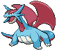

<pre><code><b>Ability One:</b> Intimidate
<b>Ability Two:</b> Moxie
</code></pre>

**[#374 Beldum](../pokemon/beldum.md/), [#375 Metang](../pokemon/metang.md/)**

<pre><code><b>Ability One:</b> Levitate
<b>Ability Two:</b> Levitate
</code></pre>

**[#376 Metagross](../pokemon/metagross.md/)**

<pre><code><b>HM:</b> Can now learn HM02, Fly.
<b>Ability One:</b> Iron Fist
<b>Ability Two:</b> Analytic
</code></pre>

**[#377 Regirock](../pokemon/regirock.md/)**

<pre><code><b>Ability One:</b> Clear Body
<b>Ability Two:</b> Solid Rock
</code></pre>

**[#378 Regice](../pokemon/regice.md/)**

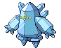

<pre><code><b>Ability One:</b> Clear Body
<b>Ability Two:</b> Heatproof
</code></pre>

**[#379 Registeel](../pokemon/registeel.md/)**

<pre><code><b>Ability One:</b> Clear Body
<b>Ability Two:</b> Sturdy
</code></pre>

**[#380 Latias](../pokemon/latias.md/)**

<pre><code><b>Ability One:</b> Levitate
<b>Ability Two:</b> Levitate
</code></pre>

**[#381 Latios](../pokemon/latios.md/)**

<pre><code><b>Ability One:</b> Levitate
<b>Ability Two:</b> Levitate
</code></pre>

**[#382 Kyogre](../pokemon/kyogre.md/)**

<pre><code><b>Ability One:</b> Drizzle
<b>Ability Two:</b> Drizzle
</code></pre>

**[#383 Groudon](../pokemon/groudon.md/)**

<pre><code><b>Ability One:</b> Drought
<b>Ability Two:</b> Drought
</code></pre>

**[#384 Rayquaza](../pokemon/rayquaza.md/)**

<pre><code><b>Ability One:</b> Air Lock
<b>Ability Two:</b> Air Lock
</code></pre>

**[#385 Jirachi](../pokemon/jirachi.md/)**

<pre><code><b>Ability One:</b> Serene Grace
<b>Ability Two:</b> Magic Guard
</code></pre>

**[#386 Deoxys](../pokemon/deoxys-normal.md/)**

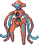

<pre><code><b>Ability One:</b> Pressure
<b>Ability Two:</b> Pressure
</code></pre>

---

## Sinnoh Pokémon

**[#387 Turtwig](../pokemon/turtwig.md/), [#388 Grotle](../pokemon/grotle.md/), [#389 Torterra](../pokemon/torterra.md/)**

<pre><code><b>Item:</b> Miracle Seed (50%)
<b>Ability One:</b> Overgrow
<b>Ability Two:</b> Sturdy
</code></pre>

**[#390 Chimchar](../pokemon/chimchar.md/), [#391 Monferno](../pokemon/monferno.md/), [#392 Infernape](../pokemon/infernape.md/)**

<pre><code><b>Item:</b> Charcoal (50%)
<b>Ability One:</b> Blaze
<b>Ability Two:</b> Iron Fist
</code></pre>

**[#393 Piplup](../pokemon/piplup.md/), [#394 Prinplup](../pokemon/prinplup.md/), [#395 Empoleon](../pokemon/empoleon.md/)**

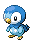

<pre><code><b>Item:</b> Mystic Water (50%)
<b>Ability One:</b> Torrent
<b>Ability Two:</b> Defiant
</code></pre>

**[#396 Starly](../pokemon/starly.md/)**

<pre><code><b>TM:</b> Now learns TM62, Acrobatics.
<b>Ability One:</b> Keen Eye
<b>Ability Two:</b> Keen Eye
</code></pre>

**[#397 Staravia](../pokemon/staravia.md/)**

<pre><code><b>TM:</b> Now learns TM62, Acrobatics.
<b>Ability One:</b> Intimidate
<b>Ability Two:</b> Reckless
</code></pre>

**[#398 Staraptor](../pokemon/staraptor.md/)**

<pre><code><b>TM:</b> Now learns TM62, Acrobatics.
<b>HP:</b> 85 → 100
<b>Defense:</b> 70 → 80
<b>Total:</b> 475 → 500
<b>Ability One:</b> Intimidate
<b>Ability Two:</b> Reckless
</code></pre>

**[#399 Bidoof](../pokemon/bidoof.md/)**

<pre><code><b>Ability One:</b> Simple
<b>Ability Two:</b> Moody
</code></pre>

**[#400 Bibarel](../pokemon/bibarel.md/)**

<pre><code><b>HP:</b> 79 → 89
<b>Attack:</b> 85 → 95
<b>Special Attack:</b> 55 → 60
<b>Total:</b> 410 → 435
<b>Ability One:</b> Simple
<b>Ability Two:</b> Moody
</code></pre>

**[#401 Kricketot](../pokemon/kricketot.md/)**

<pre><code><b>Ability One:</b> Shed Skin
<b>Ability Two:</b> Run Away
</code></pre>

**[#402 Kricketune](../pokemon/kricketune.md/)**

<pre><code><b>Attack:</b> 85 → 104
<b>Speed:</b> 65 → 87
<b>Total:</b> 384 → 425
<b>Base EXP:</b> 134 → 158
<b>Ability One:</b> Swarm
<b>Ability Two:</b> Technician
</code></pre>

**[#403 Shinx](../pokemon/shinx.md/)**

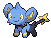

<pre><code><b>Ability One:</b> Guts
<b>Ability Two:</b> Intimidate
</code></pre>

**[#404 Luxio](../pokemon/luxio.md/)**

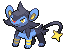

<pre><code><b>Type:</b> Electric / Dark
<b>Ability One:</b> Guts
<b>Ability Two:</b> Intimidate
</code></pre>

**[#405 Luxray](../pokemon/luxray.md/)**

<pre><code><b>Type:</b> Electric / Dark
<b>Speed:</b> 70 → 82
<b>Total:</b> 523 → 535
<b>Ability One:</b> Guts
<b>Ability Two:</b> Intimidate
</code></pre>

**[#406 Budew](../pokemon/budew.md/)**

<pre><code><b>Base Happiness:</b> 200
<b>Ability One:</b> Natural Cure
<b>Ability Two:</b> Leaf Guard
</code></pre>

**[#407 Roserade](../pokemon/roserade.md/)**

<pre><code><b>Defense:</b> 55 → 65
<b>Speed:</b> 90 → 100
<b>Total:</b> 505 → 525
<b>Ability One:</b> Natural Cure
<b>Ability Two:</b> Technician
</code></pre>

**[#408 Cranidos](../pokemon/cranidos.md/), [#409 Rampardos](../pokemon/rampardos.md/)**

<pre><code><b>Ability One:</b> Mold Breaker
<b>Ability Two:</b> Sheer Force
</code></pre>

**[#410 Shieldon](../pokemon/shieldon.md/), [#411 Bastiodon](../pokemon/bastiodon.md/)**

<pre><code><b>Ability One:</b> Sturdy
<b>Ability Two:</b> Soundproof
</code></pre>

**[#412 Burmy](../pokemon/burmy.md/)**

<pre><code><b>Ability One:</b> Shed Skin
<b>Ability Two:</b> Overcoat
</code></pre>

**[#413 Wormadam (Plant)](../pokemon/wormadam-plant.md/)**

<pre><code><b>Special Attack:</b> 79 → 99
<b>Special Defense:</b> 105 → 125
<b>Total:</b> 424 → 464
<b>Ability One:</b> Anticipation
<b>Ability Two:</b> Leaf Guard
</code></pre>

**[#413 Wormadam (Sandy)](../pokemon/wormadam-sandy.md/)**

<pre><code><b>Attack:</b> 79 → 99
<b>Defense:</b> 105 → 125
<b>Total:</b> 424 → 464
<b>Ability One:</b> Anticipation
<b>Ability Two:</b> Sand Veil
</code></pre>

**[#413 Wormadam (Trash)](../pokemon/wormadam-trash.md/)**

<pre><code><b>Defense:</b> 95 → 115
<b>Special Defense:</b> 95 → 115
<b>Total:</b> 424 → 464
<b>Ability One:</b> Anticipation
<b>Ability Two:</b> Sturdy
</code></pre>

**[#414 Mothim](../pokemon/mothim.md/)**

<pre><code><b>Special Attack:</b> 94 → 104
<b>Special Defense:</b> 66 → 96
<b>Total:</b> 424 → 464
<b>Ability One:</b> Swarm
<b>Ability Two:</b> Tinted Lens
</code></pre>

**[#415 Combee](../pokemon/combee.md/)**

<pre><code><b>Ability One:</b> Honey Gather
<b>Ability Two:</b> Hustle
</code></pre>

**[#416 Vespiquen](../pokemon/vespiquen.md/)**

<pre><code><b>Ability One:</b> Pressure
<b>Ability Two:</b> Intimidate
</code></pre>

**[#417 Pachirisu](../pokemon/pachirisu.md/)**

<pre><code><b>Special Attack:</b> 45 → 100
<b>Total:</b> 405 → 460
<b>Base EXP:</b> 142 → 161
<b>Ability One:</b> Volt Absorb
<b>Ability Two:</b> Pickup
</code></pre>

**[#418 Buizel](../pokemon/buizel.md/), [#419 Floatzel](../pokemon/floatzel.md/)**

<pre><code><b>Ability One:</b> Swift Swim
<b>Ability Two:</b> Technician
</code></pre>

**[#420 Cherubi](../pokemon/cherubi.md/)**

<pre><code><b>Ability One:</b> Chlorophyll
<b>Ability Two:</b> Healer
</code></pre>

**[#421 Cherrim](../pokemon/cherrim.md/)**

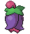

<pre><code><b>Special Attack:</b> 87 → 107
<b>Speed:</b> 85 → 95
<b>Total:</b> 450 → 480
<b>Ability One:</b> Flower Gift
<b>Ability Two:</b> Flower Gift
</code></pre>

**[#422 Shellos](../pokemon/shellos.md/), [#423 Gastrodon](../pokemon/gastrodon.md/)**

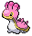

<pre><code><b>Ability One:</b> Sticky Hold
<b>Ability Two:</b> Storm Drain
</code></pre>

**[#424 Ambipom](../pokemon/ambipom.md/)**

<pre><code><b>Ability One:</b> Technician
<b>Ability Two:</b> Pickup
</code></pre>

**[#425 Drifloon](../pokemon/drifloon.md/), [#426 Drifblim](../pokemon/drifblim.md/)**

<pre><code><b>Ability One:</b> Flare Boost
<b>Ability Two:</b> Unburden
</code></pre>

**[#427 Buneary](../pokemon/buneary.md/)**

<pre><code><b>Base Happiness:</b> 140
<b>Ability One:</b> Klutz
<b>Ability Two:</b> Limber
</code></pre>

**[#428 Lopunny](../pokemon/lopunny.md/)**

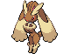

<pre><code><b>Ability One:</b> Cute Charm
<b>Ability Two:</b> Limber
</code></pre>

**[#429 Mismagius](../pokemon/mismagius.md/)**

<pre><code><b>HP:</b> 60 → 70
<b>Attack:</b> 60 → 70
<b>Defense:</b> 60 → 70
<b>Total:</b> 495 → 525
<b>Base EXP:</b> 173 → 201
<b>Ability One:</b> Levitate
<b>Ability Two:</b> Levitate
</code></pre>

**[#430 Honchkrow](../pokemon/honchkrow.md/)**

<pre><code><b>HP:</b> 100 → 120
<b>Total:</b> 505 → 525
<b>Base EXP:</b> 177 → 205
<b>Ability One:</b> Moxie
<b>Ability Two:</b> Super Luck
</code></pre>

**[#431 Glameow](../pokemon/glameow.md/)**

<pre><code><b>Ability One:</b> Limber
<b>Ability Two:</b> Own Tempo
</code></pre>

**[#432 Purugly](../pokemon/purugly.md/)**

<pre><code><b>HP:</b> 71 → 89
<b>Attack:</b> 82 → 91
<b>Total:</b> 452 → 479
<b>Base EXP:</b> 158 → 168
<b>Ability One:</b> Thick Fat
<b>Ability Two:</b> Defiant
</code></pre>

**[#433 Chingling](../pokemon/chingling.md/)**

<pre><code><b>Base Happiness:</b> 200
<b>Ability One:</b> Levitate
<b>Ability Two:</b> Levitate
</code></pre>

**[#434 Stunky](../pokemon/stunky.md/), [#435 Skuntank](../pokemon/skuntank.md/)**

<pre><code><b>Ability One:</b> Stench
<b>Ability Two:</b> Aftermath
</code></pre>

**[#436 Bronzor](../pokemon/bronzor.md/)**

<pre><code><b>Ability One:</b> Levitate
<b>Ability Two:</b> Heatproof
</code></pre>

**[#437 Bronzong](../pokemon/bronzong.md/)**

<pre><code><b>HM:</b> Can now learn HM02, Fly.
<b>Ability One:</b> Levitate
<b>Ability Two:</b> Heatproof
</code></pre>

**[#438 Bonsly](../pokemon/bonsly.md/)**

<pre><code><b>Ability One:</b> Sturdy
<b>Ability Two:</b> Rattled
</code></pre>

**[#439 Mime Jr.](../pokemon/mime-jr.md/)**

<pre><code><b>Ability One:</b> Technician
<b>Ability Two:</b> Filter
</code></pre>

**[#440 Happiny](../pokemon/happiny.md/)**

<pre><code><b>Evolution:</b> Use the Oval Stone.
<b>Base Happiness:</b> 160
<b>Ability One:</b> Natural Cure
<b>Ability Two:</b> Friend Guard
</code></pre>

**[#441 Chatot](../pokemon/chatot.md/)**

<pre><code><b>Defense:</b> 45 → 56
<b>Special Attack:</b> 92 → 112
<b>Special Defense:</b> 42 → 55
<b>Speed:</b> 91 → 111
<b>Total:</b> 411 → 475
<b>Base EXP:</b> 144 → 192
<b>Ability One:</b> Moody
<b>Ability Two:</b> Tangled Feet
</code></pre>

**[#442 Spiritomb](../pokemon/spiritomb.md/)**

<pre><code><b>Ability One:</b> Pressure
<b>Ability Two:</b> Cursed Body
</code></pre>

**[#443 Gible](../pokemon/gible.md/), [#444 Gabite](../pokemon/gabite.md/)**

<pre><code><b>Ability One:</b> Sand Veil
<b>Ability Two:</b> Rough Skin
</code></pre>

**[#445 Garchomp](../pokemon/garchomp.md/)**

<pre><code><b>HM:</b> Can now learn HM02, Fly.
<b>Ability One:</b> Sand Veil
<b>Ability Two:</b> Rough Skin
</code></pre>

**[#446 Munchlax](../pokemon/munchlax.md/)**

<pre><code><b>Base Happiness:</b> 180
<b>Ability One:</b> Gluttony
<b>Ability Two:</b> Thick Fat
</code></pre>

**[#447 Riolu](../pokemon/riolu.md/)**

<pre><code><b>Base Happiness:</b> 180
<b>Ability One:</b> Steadfast
<b>Ability Two:</b> Prankster
</code></pre>

**[#448 Lucario](../pokemon/lucario.md/)**

<pre><code><b>Ability One:</b> Steadfast
<b>Ability Two:</b> Justified
</code></pre>

**[#449 Hippopotas](../pokemon/hippopotas.md/), [#450 Hippowdon](../pokemon/hippowdon.md/)**

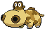

<pre><code><b>Ability One:</b> Sand Stream
<b>Ability Two:</b> Sand Force
</code></pre>

**[#451 Skorupi](../pokemon/skorupi.md/), [#452 Drapion](../pokemon/drapion.md/)**

<pre><code><b>Ability One:</b> Battle Armor
<b>Ability Two:</b> Sniper
</code></pre>

**[#453 Croagunk](../pokemon/croagunk.md/), [#454 Toxicroak](../pokemon/toxicroak.md/)**

<pre><code><b>Ability One:</b> Poison Touch
<b>Ability Two:</b> Dry Skin
</code></pre>

**[#455 Carnivine](../pokemon/carnivine.md/)**

<pre><code><b>Attack:</b> 100 → 120
<b>Speed:</b> 46 → 86
<b>Total:</b> 420 → 480
<b>Ability One:</b> Levitate
<b>Ability Two:</b> Levitate
</code></pre>

**[#456 Finneon](../pokemon/finneon.md/)**

<pre><code><b>Ability One:</b> Swift Swim
<b>Ability Two:</b> Storm Drain
</code></pre>

**[#457 Lumineon](../pokemon/lumineon.md/)**

<pre><code><b>Special Attack:</b> 69 → 89
<b>Speed:</b> 91 → 101
<b>Total:</b> 460 → 490
<b>Ability One:</b> Swift Swim
<b>Ability Two:</b> Storm Drain
</code></pre>

**[#458 Mantyke](../pokemon/mantyke.md/)**

<pre><code><b>Ability One:</b> Swift Swim
<b>Ability Two:</b> Water Absorb
</code></pre>

**[#459 Snover](../pokemon/snover.md/), [#460 Abomasnow](../pokemon/abomasnow.md/)**

<pre><code><b>Ability One:</b> Snow Warning
<b>Ability Two:</b> Soundproof
</code></pre>

**[#461 Weavile](../pokemon/weavile.md/)**

<pre><code><b>TM:</b> Now learns TM79, Frost Breath.
<b>Ability One:</b> Pickpocket
<b>Ability Two:</b> Technician
</code></pre>

**[#462 Magnezone](../pokemon/magnezone.md/)**

<pre><code><b>Ability One:</b> Magnet Pull
<b>Ability Two:</b> Analytic
</code></pre>

**[#463 Lickilicky](../pokemon/lickilicky.md/)**

<pre><code><b>Ability One:</b> Thick Fat
<b>Ability Two:</b> Gluttony
</code></pre>

**[#464 Rhyperior](../pokemon/rhyperior.md/)**

<pre><code><b>Ability One:</b> Reckless
<b>Ability Two:</b> Solid Rock
</code></pre>

**[#465 Tangrowth](../pokemon/tangrowth.md/)**

<pre><code><b>Ability One:</b> Chlorophyll
<b>Ability Two:</b> Regenerator
</code></pre>

**[#466 Electivire](../pokemon/electivire.md/)**

<pre><code><b>Type:</b> Electric / Fighting
<b>Ability One:</b> Motor Drive
<b>Ability Two:</b> Vital Spirit
</code></pre>

**[#467 Magmortar](../pokemon/magmortar.md/)**

<pre><code><b>Ability One:</b> Flame Body
<b>Ability Two:</b> Vital Spirit
</code></pre>

**[#468 Togekiss](../pokemon/togekiss.md/)**

<pre><code><b>Ability One:</b> Super Luck
<b>Ability Two:</b> Serene Grace
</code></pre>

**[#469 Yanmega](../pokemon/yanmega.md/)**

<pre><code><b>HM:</b> Can now learn HM02, Fly.
<b>Ability One:</b> Speed Boost
<b>Ability Two:</b> Tinted Lens
</code></pre>

**[#470 Leafeon](../pokemon/leafeon.md/)**

<pre><code><b>Ability One:</b> Leaf Guard
<b>Ability Two:</b> Natural Cure
</code></pre>

**[#471 Glaceon](../pokemon/glaceon.md/)**

<pre><code><b>TM:</b> Can now learn TM86, Grass Knot.
<b>Ability One:</b> Snow Cloak
<b>Ability Two:</b> Serene Grace
</code></pre>

**[#472 Gliscor](../pokemon/gliscor.md/)**

<pre><code><b>HM:</b> Can now learn HM02, Fly.
<b>Ability One:</b> Hyper Cutter
<b>Ability Two:</b> Poison Heal
</code></pre>

**[#473 Mamoswine](../pokemon/mamoswine.md/)**

<pre><code><b>Ability One:</b> Thick Fat
<b>Ability Two:</b> Snow Cloak
</code></pre>

**[#474 Porygon-Z](../pokemon/porygon-z.md/)**

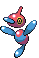

<pre><code><b>Ability One:</b> Adaptability
<b>Ability Two:</b> Download
</code></pre>

**[#475 Gallade](../pokemon/gallade.md/)**

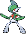

<pre><code><b>Ability One:</b> Justified
<b>Ability Two:</b> Trace
</code></pre>

**[#476 Probopass](../pokemon/probopass.md/)**

<pre><code><b>Ability One:</b> Sturdy
<b>Ability Two:</b> Magnet Pull
</code></pre>

**[#477 Dusknoir](../pokemon/dusknoir.md/)**

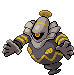

<pre><code><b>Ability One:</b> Pressure
<b>Ability Two:</b> Cursed Body
</code></pre>

**[#478 Froslass](../pokemon/froslass.md/)**

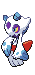

<pre><code><b>Special Attack:</b> 80 → 100
<b>Total:</b> 480 → 500
<b>Base EXP:</b> 168 → 189
<b>Ability One:</b> Levitate
<b>Ability Two:</b> Levitate
</code></pre>

**[#479 Rotom](../pokemon/rotom.md/)**

<pre><code><b>Speed:</b> 91 → 111
<b>Total:</b> 440 → 460
<b>Ability One:</b> Levitate
<b>Ability Two:</b> Levitate
</code></pre>

**[#479 Rotom Fan](../pokemon/rotom-fan.md/)**

<pre><code><b>Ability One:</b> Speed Boost
<b>Ability Two:</b> Motor Drive
</code></pre>

**[#480 Uxie](../pokemon/uxie.md/)**

<pre><code><b>Ability One:</b> Levitate
<b>Ability Two:</b> Levitate
</code></pre>

**[#481 Mesprit](../pokemon/mesprit.md/)**

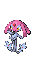

<pre><code><b>Ability One:</b> Levitate
<b>Ability Two:</b> Levitate
</code></pre>

**[#482 Azelf](../pokemon/azelf.md/)**

<pre><code><b>Ability One:</b> Levitate
<b>Ability Two:</b> Levitate
</code></pre>

**[#483 Dialga](../pokemon/dialga.md/)**

<pre><code><b>Ability One:</b> Pressure
<b>Ability Two:</b> Telepathy
</code></pre>

**[#484 Palkia](../pokemon/palkia.md/)**

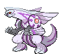

<pre><code><b>Ability One:</b> Pressure
<b>Ability Two:</b> Telepathy
</code></pre>

**[#485 Heatran](../pokemon/heatran.md/)**

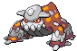

<pre><code><b>Ability One:</b> Flash Fire
<b>Ability Two:</b> Flame Body
</code></pre>

**[#486 Regigigas](../pokemon/regigigas.md/)**

<pre><code><b>Ability One:</b> Sheer Force
<b>Ability Two:</b> Sheer Force
</code></pre>

**[#487 Giratina (Altered)](../pokemon/giratina-altered.md/)**

<pre><code><b>Ability One:</b> Pressure
<b>Ability Two:</b> Telepathy
</code></pre>

**[#488 Cresselia](../pokemon/cresselia.md/)**

<pre><code><b>Ability One:</b> Levitate
<b>Ability Two:</b> Levitate
</code></pre>

**[#489 Phione](../pokemon/phione.md/)**

<pre><code><b>HP:</b> 80 → 90
<b>Attack:</b> 80 → 90
<b>Defense:</b> 80 → 90
<b>Special Attack:</b> 80 → 90
<b>Special Defense:</b> 80 → 90
<b>Speed:</b> 80 → 90
<b>Total:</b> 480 → 540
<b>Base EXP:</b> 216 → 255
<b>Ability One:</b> Hydration
<b>Ability Two:</b> Magic Guard
</code></pre>

**[#490 Manaphy](../pokemon/manaphy.md/)**

<pre><code><b>Item:</b> Lansat Berry (100%)
<b>Ability One:</b> Hydration
<b>Ability Two:</b> Magic Guard
</code></pre>

**[#491 Darkrai](../pokemon/darkrai.md/)**

<pre><code><b>Ability One:</b> Bad Dreams
<b>Ability Two:</b> Bad Dreams
</code></pre>

**[#492 Shaymin](../pokemon/shaymin-land.md/)**

<pre><code><b>Item:</b> Starf Berry (100%)
</code></pre>

**[#493 Arceus](../pokemon/arceus.md/)**

<pre><code><b>Item:</b> Enigma Berry (100%)
<b>Base EXP:</b> 324 → 511
<b>Ability One:</b> Multitype
<b>Ability Two:</b> Multitype
</code></pre>

---

## Unova Pokémon

**[#494 Victini](../pokemon/victini.md/)**

<pre><code><b>Ability One:</b> Victory Star
<b>Ability Two:</b> Victory Star
</code></pre>

**[#495 Snivy](../pokemon/snivy.md/)**

<pre><code><b>Item:</b> Miracle Seed (50%)
<b>Base EXP:</b> 28 → 50
<b>Base Happiness:</b> 0
<b>Ability One:</b> Overgrow
<b>Ability Two:</b> Contrary
</code></pre>

**[#496 Servine](../pokemon/servine.md/)**

<pre><code><b>Item:</b> Miracle Seed (50%)
<b>Base Happiness:</b> 0
<b>Ability One:</b> Overgrow
<b>Ability Two:</b> Contrary
</code></pre>

**[#497 Serperior](../pokemon/serperior.md/)**

<pre><code><b>TM:</b> Can now learn TM26 Earthquake.
<b>Tutor:</b> Can now learn Draco Meteor.
<b>Item:</b> Miracle Seed (50%)
<b>Type:</b> Grass / Dragon
<b>Base Happiness:</b> 0
<b>HP:</b> 75 → 82
<b>Total:</b> 528 → 535
<b>Ability One:</b> Overgrow
<b>Ability Two:</b> Contrary
</code></pre>

**[#498 Tepig](../pokemon/tepig.md/)**

<pre><code><b>Item:</b> Charcoal (50%)
<b>Base EXP:</b> 28 → 50
<b>Ability One:</b> Blaze
<b>Ability Two:</b> Adaptability
</code></pre>

**[#499 Pignite](../pokemon/pignite.md/)**

<pre><code><b>Item:</b> Charcoal (50%)
<b>Type:</b> Fire / Ground
<b>Ability One:</b> Blaze
<b>Ability Two:</b> Adaptability
</code></pre>

**[#500 Emboar](../pokemon/emboar.md/)**

<pre><code><b>Item:</b> Charcoal (50%)
<b>HP:</b> 110 → 120
<b>Attack:</b> 123 → 130
<b>Defense:</b> 65 → 80
<b>Special Attack:</b> 100 → 70
<b>Special Defense:</b> 65 → 80
<b>Speed:</b> 65 → 55
<b>Total:</b> 528 → 535
<b>Type:</b> Fire / Ground
<b>Ability One:</b> Blaze
<b>Ability Two:</b> Adaptability
</code></pre>

**[#501 Oshawott](../pokemon/oshawott.md/)**

<pre><code><b>Item:</b> Mystic Water (50%)
<b>Base EXP:</b> 28 → 50
<b>Ability One:</b> Torrent
<b>Ability Two:</b> Vital Spirit
</code></pre>

**[#502 Dewott](../pokemon/dewott.md/)**

<pre><code><b>Item:</b> Mystic Water (50%)
<b>Type:</b> Water / Fighting
<b>Ability One:</b> Torrent
<b>Ability Two:</b> Vital Spirit
</code></pre>

**[#503 Samurott](../pokemon/samurott.md/)**

<pre><code><b>TM:</b> Can now learn TM26 Earthquake.
<b>Item:</b> Mystic Water (50%)
<b>Special Attack:</b> 108 → 105
<b>Speed:</b> 70 → 80
<b>Total:</b> 528 → 535
<b>Type:</b> Water / Fighting
<b>Ability One:</b> Torrent
<b>Ability Two:</b> Vital Spirit
</code></pre>

**[#504 Patrat](../pokemon/patrat.md/)**

<pre><code><b>Ability One:</b> Analytic
<b>Ability Two:</b> Keen Eye
</code></pre>

**[#505 Watchog](../pokemon/watchog.md/)**

<pre><code><b>Special Attack:</b> 60 → 85
<b>Total:</b> 420 → 435
<b>Ability One:</b> Analytic
<b>Ability Two:</b> Keen Eye
</code></pre>

**[#506 Lillipup](../pokemon/lillipup.md/)**

<pre><code><b>Ability One:</b> Vital Spirit
<b>Ability Two:</b> Pickup
</code></pre>

**[#507 Herdier](../pokemon/herdier.md/)**

<pre><code><b>Ability One:</b> Intimidate
<b>Ability Two:</b> Scrappy
</code></pre>

**[#508 Stoutland](../pokemon/stoutland.md/)**

<pre><code><b>HP:</b> 85 → 105
<b>Attack:</b> 100 → 110
<b>Total:</b> 490 → 520
<b>Ability One:</b> Intimidate
<b>Ability Two:</b> Scrappy
</code></pre>

**[#509 Purrloin](../pokemon/purrloin.md/)**

<pre><code><b>Ability One:</b> Limber
<b>Ability Two:</b> Prankster
</code></pre>

**[#510 Liepard](../pokemon/liepard.md/)**

<pre><code><b>TM:</b> Can now learn TM43, Flame Charge and TM93, Wild Charge.
<b>Attack:</b> 88 → 98
<b>Special Attack:</b> 88 → 98
<b>Total:</b> 446 → 466
<b>Ability One:</b> Limber
<b>Ability Two:</b> Prankster
</code></pre>

**[#511 Pansage](../pokemon/pansage.md/)**

<pre><code><b>Tutor:</b> Can now learn Grass Pledge and Frenzy Plant.
<b>Ability One:</b> Gluttony
<b>Ability Two:</b> Overgrow
</code></pre>

**[#512 Simisage](../pokemon/simisage.md/)**

<pre><code><b>Tutor:</b> Can now learn Grass Pledge and Frenzy Plant.
<b>Ability One:</b> Unburden
<b>Ability Two:</b> Overgrow
</code></pre>

**[#513 Pansear](../pokemon/pansear.md/)**

<pre><code><b>Tutor:</b> Can now learn Fire Pledge and Blast Burn.
<b>Ability One:</b> Gluttony
<b>Ability Two:</b> Blaze
</code></pre>

**[#514 Simisear](../pokemon/simisear.md/)**

<pre><code><b>Tutor:</b> Can now learn Fire Pledge and Blast Burn.
<b>Ability One:</b> Unburden
<b>Ability Two:</b> Blaze
</code></pre>

**[#515 Panpour](../pokemon/panpour.md/)**

<pre><code><b>Tutor:</b> Can now learn Water Pledge and Hydro Cannon.
<b>Ability One:</b> Gluttony
<b>Ability Two:</b> Torrent
</code></pre>

**[#516 Simipour](../pokemon/simipour.md/)**

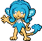

<pre><code><b>Tutor:</b> Can now learn Water Pledge and Hydro Cannon.
<b>Ability One:</b> Unburden
<b>Ability Two:</b> Torrent
</code></pre>

**[#517 Munna](../pokemon/munna.md/)**

<pre><code><b>Ability One:</b> Telepathy
<b>Ability Two:</b> Analytic
<b>Ability Three (DW):</b> Magic Bounce
</code></pre>

**[#518 Musharna](../pokemon/musharna.md/)**

<pre><code><b>Ability One:</b> Telepathy
<b>Ability Two:</b> Analytic
<b>Ability Three (DW):</b> Magic Bounce
</code></pre>

**[#519 Pidove](../pokemon/pidove.md/)**

<pre><code><b>Attack:</b> 55 → 36
<b>Defense:</b> 50 → 30
<b>Special Attack:</b> 36 → 55
<b>Special Defense:</b> 30 → 50
<b>Ability One:</b> Rivalry
<b>Ability Two:</b> Super Luck
</code></pre>

**[#520 Tranquill](../pokemon/tranquill.md/)**

<pre><code><b>Attack:</b> 77 → 50
<b>Defense:</b> 62 → 42
<b>Special Attack:</b> 50 → 77
<b>Special Defense:</b> 42 → 62
<b>Ability One:</b> Rivalry
<b>Ability Two:</b> Super Luck
</code></pre>

**[#521 Unfezant](../pokemon/unfezant.md/)**

<pre><code><b>Attack:</b> 105 → 65
<b>Defense:</b> 80 → 55
<b>Special Attack:</b> 65 → 115
<b>Special Defense:</b> 55 → 100
<b>Speed:</b> 93 → 103
<b>Total:</b> 478 → 518
<b>Ability One:</b> Serene Grace
<b>Ability Two:</b> Super Luck
</code></pre>

**[#522 Blitzle](../pokemon/blitzle.md/)**

<pre><code><b>Ability One:</b> Lightning Rod
<b>Ability Two:</b> Sap Sipper
</code></pre>

**[#523 Zebstrika](../pokemon/zebstrika.md/)**

<pre><code><b>Ability One:</b> Lightning Rod
<b>Ability Two:</b> Sap Sipper
</code></pre>

**[#524 Roggenrola](../pokemon/roggenrola.md/)**

<pre><code><b>Ability One:</b> Sturdy
<b>Ability Two:</b> Sand Force
</code></pre>

**[#525 Boldore](../pokemon/boldore.md/)**

<pre><code><b>Evolution:</b> Level 36.
<b>Ability One:</b> Sturdy
<b>Ability Two:</b> Sand Force
</code></pre>

**[#526 Gigalith](../pokemon/gigalith.md/)**

<pre><code><b>Ability One:</b> Sturdy
<b>Ability Two:</b> Sand Force
</code></pre>

**[#527 Woobat](../pokemon/woobat.md/)**

<pre><code><b>Base Happiness:</b> 180
<b>Ability One:</b> Unaware
<b>Ability Two:</b> Klutz
</code></pre>

**[#528 Swoobat](../pokemon/swoobat.md/)**

<pre><code><b>Base Happiness:</b> 180
<b>HP:</b> 67 → 77
<b>Attack:</b> 57 → 67
<b>Special Attack:</b> 77 → 107
<b>Special Defense:</b> 55 → 65
<b>Total:</b> 425 → 485
<b>Base EXP:</b> 149 → 199
<b>Ability One:</b> Unaware
<b>Ability Two:</b> Simple
</code></pre>

**[#529 Drilbur](../pokemon/drilbur.md/), [#530 Excadrill](../pokemon/excadrill.md/)**

<pre><code><b>Ability One:</b> Sand Rush
<b>Ability Two:</b> Mold Breaker
</code></pre>

**[#531 Audino](../pokemon/audino.md/)**

<pre><code><b>Base EXP:</b> 390 → 400
<b>Ability One:</b> Serene Grace
<b>Ability Two:</b> Regenerator
</code></pre>

**[#532 Timburr](../pokemon/timburr.md/)**

<pre><code><b>Ability One:</b> Guts
<b>Ability Two:</b> Iron Fist
</code></pre>

**[#533 Gurdurr](../pokemon/gurdurr.md/)**

<pre><code><b>Evolution:</b> Level 36.
<b>Ability One:</b> Guts
<b>Ability Two:</b> Iron Fist
</code></pre>

**[#534 Conkeldurr](../pokemon/conkeldurr.md/)**

<pre><code><b>Ability One:</b> Guts
<b>Ability Two:</b> Iron Fist
</code></pre>

**[#535 Tympole](../pokemon/tympole.md/), [#536 Palpitoad](../pokemon/palpitoad.md/)**

<pre><code><b>TM:</b> Can now learn TM13 Ice Beam and TM14 Blizzard.
<b>Ability One:</b> Water Absorb
<b>Ability Two:</b> Hydration
</code></pre>

**[#537 Seismitoad](../pokemon/seismitoad.md/)**

<pre><code><b>TM:</b> Can now learn TM13 Ice Beam and TM14 Blizzard.
<b>Attack:</b> 85 → 95
<b>Special Attack:</b> 85 → 95
<b>Total:</b> 499 → 519
<b>Ability One:</b> Water Absorb
<b>Ability Two:</b> Poison Touch
</code></pre>

**[#538 Throh](../pokemon/throh.md/)**

<pre><code><b>Item:</b> Black Belt (50%)
<b>Item:</b> Expert Belt (5%)
<b>Ability One:</b> Guts
<b>Ability Two:</b> Mold Breaker
</code></pre>

**[#539 Sawk](../pokemon/sawk.md/)**

<pre><code><b>Item:</b> Black Belt (50%)
<b>Item:</b> Expert Belt (5%)
<b>Ability One:</b> Sturdy
<b>Ability Two:</b> Mold Breaker
</code></pre>

**[#540 Sewaddle](../pokemon/sewaddle.md/)**

<pre><code><b>Base Happiness:</b> 180
<b>Ability One:</b> Swarm
<b>Ability Two:</b> Chlorophyll
</code></pre>

**[#541 Swadloon](../pokemon/swadloon.md/)**

<pre><code><b>Base Happiness:</b> 180
<b>Ability One:</b> Leaf Guard
<b>Ability Two:</b> Overcoat
</code></pre>

**[#542 Leavanny](../pokemon/leavanny.md/)**

<pre><code><b>Base Happiness:</b> 180
<b>Ability One:</b> Swarm
<b>Ability Two:</b> Chlorophyll
</code></pre>

**[#543 Venipede](../pokemon/venipede.md/)**

<pre><code><b>Ability One:</b> Poison Point
<b>Ability Two:</b> Swarm
</code></pre>

**[#544 Whirlipede](../pokemon/whirlipede.md/)**

<pre><code><b>Ability One:</b> Battle Armor
<b>Ability Two:</b> Swarm
</code></pre>

**[#545 Scolipede](../pokemon/scolipede.md/)**

<pre><code><b>Ability One:</b> Poison Touch
<b>Ability Two:</b> Swarm
</code></pre>

**[#546 Cottonee](../pokemon/cottonee.md/), [#547 Whimsicott](../pokemon/whimsicott.md/)**

<pre><code><b>Ability One:</b> Prankster
<b>Ability Two:</b> Infiltrator
</code></pre>

**[#548 Petilil](../pokemon/petilil.md/)**

<pre><code><b>TM:</b> Now learns TM29 Psychic and TM30 Shadow Ball.
<b>Ability One:</b> Chlorophyll
<b>Ability Two:</b> Leaf Guard
</code></pre>

**[#549 Lilligant](../pokemon/lilligant.md/)**

<pre><code><b>TM:</b> Now learns TM29 Psychic, TM30 Shadow Ball, and TM52 Focus Blast.
<b>Ability One:</b> Chlorophyll
<b>Ability Two:</b> Own Tempo
</code></pre>

**[#550 Basculin (Red Striped)](../pokemon/basculin-red-striped.md/)**

<pre><code><b>Attack:</b> 92 → 102
<b>Speed:</b> 98 → 108
<b>Total:</b> 460 → 480
<b>Ability One:</b> Reckless
<b>Ability Two:</b> Adaptability
</code></pre>

**[#550 Basculin (Blue Striped)](../pokemon/basculin-blue-striped.md/)**

<pre><code><b>Attack:</b> 92 → 102
<b>Speed:</b> 98 → 108
<b>Total:</b> 460 → 480
<b>Ability One:</b> Rock Head
<b>Ability Two:</b> Adaptability
</code></pre>

**[#551 Sandile](../pokemon/sandile.md/)**

<pre><code><b>Ability One:</b> Anger Point
<b>Ability Two:</b> Moxie
</code></pre>

**[#552 Krokorok](../pokemon/krokorok.md/)**

<pre><code><b>Ability One:</b> Anger Point
<b>Ability Two:</b> Moxie
</code></pre>

**[#553 Krookodile](../pokemon/krookodile.md/)**

<pre><code><b>Ability One:</b> Intimidate
<b>Ability Two:</b> Moxie
</code></pre>

**[#554 Darumaka](../pokemon/darumaka.md/)**

<pre><code><b>Ability One:</b> Hustle
<b>Ability Two:</b> Rattled
</code></pre>

**[#555 Darmanitan](../pokemon/darmanitan-standard.md/)**

<pre><code><b>Ability One:</b> Sheer Force
<b>Ability Two:</b> Iron Fist
</code></pre>

**[#556 Maractus](../pokemon/maractus.md/)**

<pre><code><b>TM:</b> Can now learn TM55, Scald.
<b>Attack:</b> 86 → 101
<b>Special Attack:</b> 106 → 116
<b>Total:</b> 461 → 486
<b>Ability One:</b> Water Absorb
<b>Ability Two:</b> Storm Drain
</code></pre>

**[#557 Dwebble](../pokemon/dwebble.md/), [#558 Crustle](../pokemon/crustle.md/)**

<pre><code><b>Ability One:</b> Sturdy
<b>Ability Two:</b> Shell Armor
</code></pre>

**[#559 Scraggy](../pokemon/scraggy.md/), [#560 Scrafty](../pokemon/scrafty.md/)**

<pre><code><b>Ability One:</b> Shed Skin
<b>Ability Two:</b> Moxie
<b>Evolution:</b> Level 35 [Scraggy]
</code></pre>

**[#561 Sigilyph](../pokemon/sigilyph.md/)**

<pre><code><b>Special Attack:</b> 103 → 108
<b>Speed:</b> 97 → 102
<b>Total:</b> 490 → 500
<b>Base EXP:</b> 172 → 200
<b>Ability One:</b> Tinted Lens
<b>Ability Two:</b> Magic Guard
</code></pre>

**[#562 Yamask](../pokemon/yamask.md/)**

<pre><code><b>Ability One:</b> Mummy
<b>Ability Two:</b> Mummy
</code></pre>

**[#563 Cofagrigus](../pokemon/cofagrigus.md/)**

<pre><code><b>Type:</b> Ghost / Steel
<b>TM:</b> Can now learn TM91, Flash Cannon.
<b>Ability One:</b> Mummy
<b>Ability Two:</b> Mummy
</code></pre>

**[#564 Tirtouga](../pokemon/tirtouga.md/), [#565 Carracosta](../pokemon/carracosta.md/)**

<pre><code><b>Ability One:</b> Solid Rock
<b>Ability Two:</b> Sturdy
</code></pre>

**[#566 Archen](../pokemon/archen.md/), [#567 Archeops](../pokemon/archeops.md/)**

<pre><code><b>Ability One:</b> Defeatist
<b>Ability Two:</b> Defeatist
</code></pre>

**[#568 Trubbish](../pokemon/trubbish.md/)**

<pre><code><b>Ability One:</b> Stench
<b>Ability Two:</b> Sticky Hold
</code></pre>

**[#569 Garbodor](../pokemon/garbodor.md/)**

<pre><code><b>Special Attack:</b> 60 → 80
<b>Total:</b> 474 → 494
<b>Ability One:</b> Stench
<b>Ability Two:</b> Aftermath
</code></pre>

**[#570 Zorua](../pokemon/zorua.md/)**

<pre><code><b>Ability One:</b> Illusion
<b>Ability Two:</b> Illusion
</code></pre>

**[#571 Zoroark](../pokemon/zoroark.md/)**

<pre><code><b>Ability One:</b> Illusion
<b>Ability Two:</b> Illusion
</code></pre>

**[#572 Minccino](../pokemon/minccino.md/)**

<pre><code><b>Ability One:</b> Skill Link
<b>Ability Two:</b> Technician
</code></pre>

**[#573 Cinccino](../pokemon/cinccino.md/)**

<pre><code><b>Attack:</b> 95 → 105
<b>Total:</b> 470 → 480
<b>Ability One:</b> Skill Link
<b>Ability Two:</b> Technician
</code></pre>

**[#574 Gothita](../pokemon/gothita.md/)**

<pre><code><b>Type:</b> Psychic / Dark
<b>TM:</b> Now learns TM61 Will-O-Wisp.
<b>Ability One:</b> Frisk
<b>Ability Two:</b> Magic Bounce
</code></pre>

**[#575 Gothorita](../pokemon/gothorita.md/)**

<pre><code><b>Type:</b> Psychic / Dark
<b>TM:</b> Now learns TM61 Will-O-Wisp.
<b>Ability One:</b> Frisk
<b>Ability Two:</b> Magic Bounce
</code></pre>

**[#576 Gothitelle](../pokemon/gothitelle.md/)**

<pre><code><b>Type:</b> Psychic / Dark
<b>Attack:</b> 55 → 45
<b>Special Attack:</b> 95 → 115
<b>Total:</b> 490 → 500
<b>TM:</b> Now learns TM52 Focus Blast and TM61 Will-O-Wisp.
<b>Ability One:</b> Shadow Tag
<b>Ability Two:</b> Magic Bounce
</code></pre>

**[#577 Solosis](../pokemon/solosis.md/), [#578 Duosion](../pokemon/duosion.md/)**

<pre><code><b>Ability One:</b> Regenerator
<b>Ability Two:</b> Magic Guard
</code></pre>

**[#579 Reuniclus](../pokemon/reuniclus.md/)**

<pre><code><b>Defense:</b> 75 → 85
<b>Total:</b> 490 → 500
<b>Ability One:</b> Regenerator
<b>Ability Two:</b> Magic Guard
</code></pre>

**[#580 Ducklett](../pokemon/ducklett.md/)**

<pre><code><b>Ability One:</b> Hydration
<b>Ability Two:</b> Big Pecks
</code></pre>

**[#581 Swanna](../pokemon/swanna.md/)**

<pre><code><b>Attack:</b> 87 → 97
<b>Special Attack:</b> 87 → 97
<b>Speed:</b> 98 → 108
<b>Total:</b> 473 → 503
<b>TM:</b> Can now learn TM62, Acrobatics.
<b>Ability One:</b> Hydration
<b>Ability Two:</b> Big Pecks
</code></pre>

**[#582 Vanillite](../pokemon/vanillite.md/), [#583 Vanillish](../pokemon/vanillish.md/)**

<pre><code><b>TM:</b> Can now learn TM30, Shadow Ball, TM53, Energy Ball and TM86, Grass Knot.
<b>Ability One:</b> Ice Body
<b>Ability Two:</b> Weak Armor
</code></pre>

**[#584 Vanilluxe](../pokemon/vanilluxe.md/)**

<pre><code><b>HP:</b> 71 → 70
<b>Attack:</b> 95 → 70
<b>Defense:</b> 85 → 80
<b>Special Attack:</b> 110 → 145
<b>Special Defense:</b> 95 → 90
<b>Speed:</b> 79 → 80
<b>Total:</b> 535 → 535
<b>TM:</b> Can now learn TM30, Shadow Ball, TM53, Energy Ball and TM86, Grass Knot.
<b>Ability One:</b> Ice Body
<b>Ability Two:</b> Weak Armor
</code></pre>

**[#585 Deerling](../pokemon/deerling.md/)**

<pre><code><b>Ability One:</b> Chlorophyll
<b>Ability Two:</b> Serene Grace
</code></pre>

**[#586 Sawsbuck](../pokemon/sawsbuck.md/)**

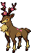

<pre><code><b>Attack:</b> 100 → 115
<b>Speed:</b> 95 → 105
<b>Total:</b> 475 → 500
<b>Ability One:</b> Chlorophyll
<b>Ability Two:</b> Serene Grace
</code></pre>

**[#587 Emolga](../pokemon/emolga.md/)**

<pre><code><b>Attack:</b> 75 → 95
<b>Special Attack:</b> 75 → 95
<b>Total:</b> 428 → 468
<b>Ability One:</b> Static
<b>Ability Two:</b> Motor Drive
</code></pre>

**[#588 Karrablast](../pokemon/karrablast.md/)**

<pre><code><b>Evolution:</b> Level Up with Shelmet in the party.
<b>Ability One:</b> Swarm
<b>Ability Two:</b> No Guard
</code></pre>

**[#589 Escavalier](../pokemon/escavalier.md/)**

<pre><code><b>Ability One:</b> Swarm
<b>Ability Two:</b> No Guard
<b>TM:</b> Can now learn TM74, Gyro Ball.
</code></pre>

**[#590 Foongus](../pokemon/foongus.md/), [#591 Amoonguss](../pokemon/amoonguss.md/)**

<pre><code><b>Ability One:</b> Effect Spore
<b>Ability Two:</b> Regenerator
</code></pre>

**[#592 Frillish](../pokemon/frillish.md/), [#593 Jellicent](../pokemon/jellicent.md/)**

<pre><code><b>Ability One:</b> Water Absorb
<b>Ability Two:</b> Cursed Body
</code></pre>

**[#594 Alomomola](../pokemon/alomomola.md/)**

<pre><code><b>Attack:</b> 75 → 90
<b>Total:</b> 470 → 485
<b>Ability One:</b> Regenerator
<b>Ability Two:</b> Hydration
</code></pre>

**[#595 Joltik](../pokemon/joltik.md/)**

<pre><code><b>Ability One:</b> Compound Eyes
<b>Ability Two:</b> Swarm
</code></pre>

**[#596 Galvantula](../pokemon/galvantula.md/)**

<pre><code><b>Special Attack:</b> 97 → 107
<b>Speed:</b> 108 → 118
<b>Total:</b> 472 → 492
<b>Ability One:</b> Compound Eyes
<b>Ability Two:</b> Swarm
</code></pre>

**[#597 Ferroseed](../pokemon/ferroseed.md/), [#598 Ferrothorn](../pokemon/ferrothorn.md/)**

<pre><code><b>Ability One:</b> Iron Barbs
<b>Ability Two:</b> Iron Barbs
</code></pre>

**[#599 Klink](../pokemon/klink.md/), [#600 Klang](../pokemon/klang.md/)**

<pre><code><b>TM:</b> Can now learn TM80 Rock Slide, TM93, Wild Charge.
<b>Ability One:</b> Motor Drive
<b>Ability Two:</b> Clear Body
</code></pre>

**[#601 Klinklang](../pokemon/klinklang.md/)**

<pre><code><b>Attack:</b> 100 → 115
<b>Total:</b> 520 → 535
<b>TM:</b> Can now learn TM26 Earthquake, TM71 Stone Edge, TM80 Rock Slide, TM93, Wild Charge.
<b>Ability One:</b> Motor Drive
<b>Ability Two:</b> Clear Body
</code></pre>

**[#602 Tynamo](../pokemon/tynamo.md/), [#603 Eelektrik](../pokemon/eelektrik.md/), [#604 Eelektross](../pokemon/eelektross.md/)**

<pre><code><b>Ability One:</b> Levitate
<b>Ability Two:</b> Levitate
</code></pre>

**[#605 Elgyem](../pokemon/elgyem.md/)**

<pre><code><b>Evolution:</b> Level 35
<b>Ability One:</b> Analytic
<b>Ability Two:</b> Synchronize
</code></pre>

**[#606 Beheeyem](../pokemon/beheeyem.md/)**

<pre><code><b>Defense:</b> 75 → 95
<b>Total:</b> 485 → 505
<b>Ability One:</b> Analytic
<b>Ability Two:</b> Synchronize
</code></pre>

**[#607 Litwick](../pokemon/litwick.md/)**

<pre><code><b>Evolution:</b> Level 34
<b>Ability One:</b> Flash Fire
<b>Ability Two:</b> Flame Body
</code></pre>

**[#608 Lampent](../pokemon/lampent.md/), [#609 Chandelure](../pokemon/chandelure.md/)**

<pre><code><b>Ability One:</b> Levitate
<b>Ability Two:</b> Levitate
</code></pre>

**[#610 Axew](../pokemon/axew.md/), [#611 Fraxure](../pokemon/fraxure.md/), [#612 Haxorus](../pokemon/haxorus.md/)**

<pre><code><b>Ability One:</b> Rivalry
<b>Ability Two:</b> Mold Breaker
</code></pre>

**[#613 Cubchoo](../pokemon/cubchoo.md/)**

<pre><code><b>Ability One:</b> Snow Cloak
<b>Ability Two:</b> Rattled
</code></pre>

**[#614 Beartic](../pokemon/beartic.md/)**

<pre><code><b>Type:</b> Ice / Fighting
<b>HP:</b> 95 → 110
<b>Defense:</b> 80 → 85
<b>Special Defense:</b> 80 → 85
<b>Speed:</b> 50 → 60
<b>Total:</b> 485 → 520
<b>TM:</b> Can now learn TM26, Earthquake.
<b>HM:</b> Can now learn HM05, Waterfall.
<b>Ability One:</b> Sheer Force
<b>Ability Two:</b> Swift Swim
</code></pre>

**[#615 Cryogonal](../pokemon/cryogonal.md/)**

<pre><code><b>Defense:</b> 30 → 60
<b>Special Attack:</b> 95 → 100
<b>Total:</b> 485 → 520
<b>Ability One:</b> Levitate
<b>Ability Two:</b> Levitate
</code></pre>

**[#616 Shelmet](../pokemon/shelmet.md/)**

<pre><code><b>Evolution:</b> Level Up with a Karrablast in the party.
<b>Ability One:</b> Hydration
<b>Ability Two:</b> Overcoat
</code></pre>

**[#617 Accelgor](../pokemon/accelgor.md/)**

<pre><code><b>Ability One:</b> Hydration
<b>Ability Two:</b> Unburden
</code></pre>

**[#618 Stunfisk](../pokemon/stunfisk.md/)**

<pre><code><b>Special Attack:</b> 81 → 101
<b>Total:</b> 471 → 491
<b>Ability One:</b> Static
<b>Ability Two:</b> Limber
</code></pre>

**[#619 Mienfoo](../pokemon/mienfoo.md/), [#620 Mienshao](../pokemon/mienshao.md/)**

<pre><code><b>Evolution:</b> Level 39
<b>Ability One:</b> Reckless
<b>Ability Two:</b> Regenerator
</code></pre>

**[#621 Druddigon](../pokemon/druddigon.md/)**

<pre><code><b>HM:</b> Can now learn HM02, Fly.
<b>Ability One:</b> Rough Skin
<b>Ability Two:</b> Sheer Force
</code></pre>

**[#622 Golett](../pokemon/golett.md/)**

<pre><code><b>Evolution:</b> Level 36
<b>Ability One:</b> Iron Fist
<b>Ability Two:</b> Klutz
</code></pre>

**[#623 Golurk](../pokemon/golurk.md/)**

<pre><code><b>HP:</b> 89 → 99
<b>Defense:</b> 80 → 90
<b>Special Defense:</b> 80 → 90
<b>Total:</b> 483 → 513
<b>Ability One:</b> Iron Fist
<b>Ability Two:</b> No Guard
</code></pre>

**[#624 Pawniard](../pokemon/pawniard.md/)**

<pre><code><b>Evolution:</b> Level 37
<b>Ability One:</b> Defiant
<b>Ability Two:</b> Pressure
</code></pre>

**[#625 Bisharp](../pokemon/bisharp.md/)**

<pre><code><b>Speed:</b> 70 → 90
<b>Total:</b> 490 → 510
<b>Ability One:</b> Defiant
<b>Ability Two:</b> Pressure
</code></pre>

**[#626 Bouffalant](../pokemon/bouffalant.md/)**

<pre><code><b>Ability One:</b> Reckless
<b>Ability Two:</b> Sap Sipper
</code></pre>

**[#627 Rufflet](../pokemon/rufflet.md/)**

<pre><code><b>Evolution:</b> Level 39 [Rufflet]
<b>Ability One:</b> Hustle
<b>Ability Two:</b> Sheer Force
</code></pre>

**[#628 Braviary](../pokemon/braviary.md/)**

<pre><code><b>Ability One:</b> Defiant
<b>Ability Two:</b> Sheer Force
</code></pre>

**[#629 Vullaby](../pokemon/vullaby.md/), [#630 Mandibuzz](../pokemon/mandibuzz.md/)**

<pre><code><b>Evolution:</b> Level 39 [Vullaby]
<b>Ability One:</b> Big Pecks
<b>Ability Two:</b> Overcoat
</code></pre>

**[#631 Heatmor](../pokemon/heatmor.md/)**

<pre><code><b>Attack:</b> 97 → 100
<b>Defense:</b> 66 → 70
<b>Special Attack:</b> 105 → 115
<b>Special Defense:</b> 66 → 70
<b>Speed:</b> 65 → 70
<b>Total:</b> 484 → 510
<b>Base EXP:</b> 169 → 200
<b>Ability One:</b> White Smoke
<b>Ability Two:</b> Moody
</code></pre>

**[#632 Durant](../pokemon/durant.md/)**

<pre><code><b>HP:</b> 58 → 75
<b>Attack:</b> 109 → 111
<b>Special Defense:</b> 48 → 55
<b>Total:</b> 484 → 510
<b>Base EXP:</b> 169 → 200
<b>Ability One:</b> Swarm
<b>Ability Two:</b> Hustle
</code></pre>

**[#633 Deino](../pokemon/deino.md/)**

<pre><code><b>Evolution:</b> Level 30
<b>Ability One:</b> Hustle
<b>Ability Two:</b> Intimidate
</code></pre>

**[#634 Zweilous](../pokemon/zweilous.md/)**

<pre><code><b>Evolution:</b> Level 55
<b>Ability One:</b> Hustle
<b>Ability Two:</b> Intimidate
</code></pre>

**[#635 Hydreigon](../pokemon/hydreigon.md/)**

<pre><code><b>Ability One:</b> Levitate
<b>Ability Two:</b> Levitate
</code></pre>

**[#636 Larvesta](../pokemon/larvesta.md/)**

<pre><code><b>Evolution:</b> Level 45
<b>Ability One:</b> Flame Body
<b>Ability Two:</b> Swarm
</code></pre>

**[#637 Volcarona](../pokemon/volcarona.md/)**

<pre><code><b>TM:</b> Can now learn TM24 Thunderbolt and TM25 Thunder.
<b>Ability One:</b> Drought
<b>Ability Two:</b> Drought
</code></pre>

**[#638 Cobalion](../pokemon/cobalion.md/)**

<pre><code><b>Ability One:</b> Justified
<b>Ability Two:</b> Justified
</code></pre>

**[#639 Terrakion](../pokemon/terrakion.md/)**

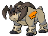

<pre><code><b>Ability One:</b> Justified
<b>Ability Two:</b> Justified
</code></pre>

**[#640 Virizion](../pokemon/virizion.md/)**

<pre><code><b>Ability One:</b> Justified
<b>Ability Two:</b> Justified
</code></pre>

**[#641 Tornadus](../pokemon/tornadus-incarnate.md/)**

<pre><code><b>Ability One:</b> Prankster
<b>Ability Two:</b> Defiant
</code></pre>

**[#642 Thundurus](../pokemon/thundurus-incarnate.md/)**

<pre><code><b>Ability One:</b> Prankster
<b>Ability Two:</b> Defiant
</code></pre>

**[#643 Reshiram](../pokemon/reshiram.md/)**

<pre><code><b>TM:</b> Can now learn TM26 Earthquake.
<b>Ability One:</b> TurboBlaze
<b>Ability Two:</b> TurboBlaze
</code></pre>

**[#644 Zekrom](../pokemon/zekrom.md/)**

<pre><code><b>TM:</b> Can now learn TM26 Earthquake.
<b>Ability One:</b> TeraVolt
<b>Ability Two:</b> TeraVolt
</code></pre>

**[#645 Landorus](../pokemon/landorus-incarnate.md/)**

<pre><code><b>Ability One:</b> Sand Force
<b>Ability Two:</b> Sheer Force
</code></pre>

**[#646 Kyurem](../pokemon/kyurem.md/)**

<pre><code><b>TM:</b> Can now learn TM26 Earthquake and TM79 Frost Breath.
<b>Ability One:</b> Snow Warning
<b>Ability Two:</b> Snow Warning
</code></pre>

**[#647 Keldeo](../pokemon/keldeo-ordinary.md/)**

<pre><code><b>TM:</b> Can now learn TM13 Ice Beam and TM14 Blizzard.
<b>Ability One:</b> Justified
<b>Ability Two:</b> Justified
</code></pre>

**[#648 Meloetta](../pokemon/meloetta-aria.md/)**

<pre><code><b>Ability One:</b> Serene Grace
<b>Ability Two:</b> Magic Guard
</code></pre>

**[#649 Genesect](../pokemon/genesect.md/)**

<pre><code><b>Ability One:</b> Download
<b>Ability Two:</b> Download
</code></pre>

