---

## Evolution Changes

**The following Pokémon have received an edit to their evolution method:**

```
1. Poliwhirl
2. Kadabra
3. Machoke
4. Graveler
5. Slowpoke
6. Haunter
7. Onix
8. Rhydon
9. Seadra
10. Scyther
11. Electabuzz
12. Magmar
13. Porygon
14. Porygon2
15. Feebas
16. Dusclops
17. Clamperl
18. Happiny
19. Boldore
20. Gurdurr
21. Karrablast
22. Shelmet
```

**The following Pokémon have had their evolution levels adjusted:**

```
1. Scraggy
2. Elgyem
3. Litwick
4. Mienfoo
5. Golett
6. Pawniard
7. Rufflet
8. Vullaby
9. Deino
10. Larvesta
```

**The following Pokémon have received an edit to their typing:**

```
1. Farfetch’d
2. Masquerain
3. Volbeat
4. Illumise
5. Glalie
6. Luxio
7. Luxray
8. Electivire
9. Serperior
10. Pignite
11. Emboar
12. Dewott
13. Samurott
14. Cofagrigus
15. Gothita
16. Gothorita
17. Gothitelle
18. Beartic
```

Things unlisted haven’t been changed from the original Black & White. Abilities are the exception, and are listed regardless of change.

Use the Ctrl + F function to skip directly to them to see the new method.

---

## Kanto Pokémon

**#001 Bulbasaur, #002 Ivysaur**


<pre><code><b>Item:</b> Miracle Seed (50%)
<b>Ability One:</b> Overgrow
<b>Ability Two:</b> Chlorophyll
</code></pre>

**#003 Venusaur**


<pre><code><b>Item:</b> Miracle Seed (50%)
<b>TM:</b> Can now learn TM34, Sludge Wave.
<b>Ability One:</b> Overgrow
<b>Ability Two:</b> Chlorophyll
</code></pre>

**#004 Charmander, #005 Charmeleon, #006 Charizard**


<pre><code><b>Item:</b> Charcoal (50%)
<b>Ability One:</b> Blaze
<b>Ability Two:</b> Solar Power
</code></pre>

**#007 Squirtle, #008 Wartortle, #009 Blastoise**


<pre><code><b>Item:</b> Mystic Water (50%)
<b>Ability One:</b> Torrent
<b>Ability Two:</b> Sturdy
</code></pre>

**#010 Caterpie**


<pre><code><b>Ability One:</b> Shield Dust
<b>Ability Two:</b> Suction Cups
</code></pre>

**#011 Metapod**


<pre><code><b>Ability One:</b> Shed Skin
<b>Ability Two:</b> Battle Armor
</code></pre>

**#012 Butterfree**


<pre><code><b>Special Attack:</b> 80 → 95
<b>Speed:</b> 70 → 90
<b>Total:</b> 385 → 420
<b>Ability One:</b> Compoundeyes
<b>Ability Two:</b> Tinted Lens
</code></pre>

**#013 Weedle**


<pre><code><b>Ability One:</b> Shield Dust
<b>Ability Two:</b> Poison Touch
</code></pre>

**#014 Kakuna**


<pre><code><b>Ability One:</b> Shed Skin
<b>Ability Two:</b> Battle Armor
</code></pre>

**#015 Beedrill**


<pre><code><b>Attack:</b> 80 → 95
<b>Speed:</b> 75 → 95
<b>Total:</b> 385 → 420
<b>Ability One:</b> Sniper
<b>Ability Two:</b> Poison Touch
</code></pre>

**#016 Pidgey**


<pre><code><b>Items:</b> Oran Berry (5%)
<b>TM:</b> Now able to learn TM62, Acrobatics.
<b>Ability One:</b> Big Pecks
<b>Ability Two:</b> Tangled Feet
</code></pre>

**#017 Pidgeotto**


<pre><code><b>Items:</b> Oran Berry (50%), Sitrus Berry (5%)
<b>TM:</b> Now able to learn TM62, Acrobatics.
<b>Ability One:</b> Big Pecks
<b>Ability Two:</b> Tangled Feet
</code></pre>

**#018 Pidgeot**


<pre><code><b>HP:</b> 83 → 105
<b>Attack:</b> 80 → 90
<b>Defense:</b> 75 → 85
<b>Special Defense:</b> 70 → 80
<b>Total:</b> 469 → 521
<b>TM:</b> Now able to learn TM62, Acrobatics.
<b>Ability One:</b> Big Pecks
<b>Ability Two:</b> Tangled Feet
</code></pre>

**#019 Rattata**


<pre><code><b>Ability One:</b> Hustle
<b>Ability Two:</b> Guts
<b>TM:</b> Can now learn TM01, Hone Claws.
</code></pre>

**#020 Raticate**


<pre><code><b>HP:</b> 55 → 60
<b>Attack:</b> 81 → 87
<b>Speed:</b> 97 → 109
<b>Total:</b> 413 → 436
<b>Item:</b> Chilan Berry (50%)
<b>Ability One:</b> Hustle
<b>Ability Two:</b> Guts
<b>TM:</b> Can now learn TM01, Hone Claws.
</code></pre>

**#021 Spearow**


<pre><code><b>Item:</b> Sharp Beak (5%)
<b>Ability One:</b> Keen Eye
<b>Ability Two:</b> Sniper
</code></pre>

**#022 Fearow**


<pre><code><b>Attack:</b> 90 → 100
<b>Total:</b> 442 → 452
<b>Item:</b> Sharp Beak (50%)
<b>Ability One:</b> Keen Eye
<b>Ability Two:</b> Sniper
</code></pre>

**#023 Ekans**


<pre><code><b>Catch Rate:</b> 200
<b>Item:</b> Kebia Berry (5%)
<b>Ability One:</b> Intimidate
<b>Ability Two:</b> Shed Skin
</code></pre>

**#024 Arbok**


<pre><code><b>Attack:</b> 85 → 96
<b>Speed:</b> 80 → 87
<b>Special Attack:</b> 65 → 80
<b>Total:</b> 438 → 471
<b>Item:</b> Kebia Berry (50%)
<b>Ability One:</b> Intimidate
<b>Ability Two:</b> Shed Skin
</code></pre>

**#025 Pikachu**


<pre><code><b>Attack:</b> 55 → 80
<b>Speed:</b> 90 → 110
<b>Special Attack:</b> 50 → 85
<b>Total:</b> 300 → 380
<b>Item:</b> Light Ball (50%), Sitrus Berry (5%)
<b>HM:</b> Can now learn HM03, Surf.
<b>Ability One:</b> Static
<b>Ability Two:</b> LightningRod
</code></pre>

**#026 Raichu**


<pre><code><b>Attack:</b> 90 → 100
<b>Speed:</b> 100 → 120
<b>Special Attack:</b> 90 → 100
<b>Special Defense:</b> 80 → 90
<b>Total:</b> 475 → 525
<b>HM:</b> Can now learn HM03, Surf.
<b>Ability One:</b> Static
<b>Ability Two:</b> LightningRod
</code></pre>

**#027 Sandshrew, #028 Sandslash**


<pre><code><b>Ability One:</b> Sand Veil
<b>Ability Two:</b> Sand Rush
</code></pre>

**#029 Nidoran F**


<pre><code><b>Item:</b> Pecha Berry (50%)
<b>Ability One:</b> Poison Point
<b>Ability Two:</b> Rivalry
</code></pre>

**#030 Nidorina**


<pre><code><b>Ability One:</b> Hustle
<b>Ability Two:</b> Rivalry
</code></pre>

**#031 Nidoqueen**


<pre><code><b>Attack:</b> 82 → 92
<b>Special Attack:</b> 75 → 90
<b>Total:</b> 495 → 520
<b>Ability One:</b> Sheer Force
<b>Ability Two:</b> Rivalry
</code></pre>

**#032 Nidoran M**


<pre><code><b>Item:</b> Pecha Berry (50%)
<b>Ability One:</b> Poison Point
<b>Ability Two:</b> Rivalry
</code></pre>

**#033 Nidorino**


<pre><code><b>Ability One:</b> Hustle
<b>Ability Two:</b> Rivalry
</code></pre>

**#034 Nidoking**


<pre><code><b>Attack:</b> 92 → 102
<b>Special Attack:</b> 85 → 95
<b>Total:</b> 495 → 520
<b>Ability One:</b> Sheer Force
<b>Ability Two:</b> Rivalry
</code></pre>

**#035 Clefairy**


<pre><code><b>Ability One:</b> Cute Charm
<b>Ability Two:</b> Magic Guard
</code></pre>

**#036 Clefable**


<pre><code><b>HP:</b> 95 → 105
<b>Special Attack:</b> 83 → 93
<b>Special Defense:</b> 90 → 100
<b>Total:</b> 473 → 503
<b>Ability One:</b> Unaware
<b>Ability Two:</b> Magic Guard
</code></pre>

**#037 Vulpix**


<pre><code><b>Items:</b> Rawst Berry (50%), Occa Berry (5%)
<b>Ability One:</b> Flash Fire
<b>Ability Two:</b> Drought
</code></pre>

**#038 Ninetales**


<pre><code><b>Items:</b> Rawst Berry (50%), Occa Berry (5%)
<b>Ability One:</b> Flash Fire
<b>Ability Two:</b> Drought
</code></pre>

**#039 Jigglypuff**


<pre><code><b>HP:</b> 115 → 128
<b>Attack:</b> 45 → 65
<b>Special Attack:</b> 45 → 65
<b>Total:</b> 270 → 323
<b>Ability One:</b> Cute Charm
<b>Ability Two:</b> Friend Guard
</code></pre>

**#040 Wigglytuff**


<pre><code><b>Attack:</b> 70 → 83
<b>Defense:</b> 45 → 60
<b>Special Attack:</b> 75 → 95
<b>Special Defense:</b> 50 → 80
<b>Total:</b> 425 → 503
<b>Ability One:</b> Cute Charm
<b>Ability Two:</b> Frisk
</code></pre>

**#041 Zubat**


<pre><code><b>Base Happiness:</b> 140
<b>Ability One:</b> Inner Focus
<b>Ability Two:</b> Infiltrator
</code></pre>

**#042 Golbat**


<pre><code><b>Base Happiness:</b> 140
<b>Ability One:</b> Inner Focus
<b>Ability Two:</b> Infiltrator
</code></pre>

**#043 Oddish**


<pre><code><b>Ability One:</b> Chlorophyll
<b>Ability Two:</b> Run Away
</code></pre>

**#044 Gloom**


<pre><code><b>Ability One:</b> Chlorophyll
<b>Ability Two:</b> Stench
</code></pre>

**#045 Vileplume**


<pre><code><b>HP:</b> 75 → 85
<b>Special Attack:</b> 100 → 110
<b>Special Defense:</b> 90 → 100
<b>Total:</b> 480 → 510
<b>Ability One:</b> Chlorophyll
<b>Ability Two:</b> Effect Spore
</code></pre>

**#046 Paras**


<pre><code><b>Ability One:</b> Effect Spore
<b>Ability Two:</b> Dry Skin
</code></pre>

**#047 Parasect**


<pre><code><b>HP:</b> 60 → 80
<b>Attack:</b> 95 → 110
<b>Defense:</b> 80 → 100
<b>Special Defense:</b> 80 → 90
<b>Speed:</b> 30 → 40
<b>Total:</b> 405 → 480
<b>Ability One:</b> Effect Spore
<b>Ability Two:</b> Dry Skin
</code></pre>

**#048 Venonat**


<pre><code><b>Ability One:</b> Compoundeyes
<b>Ability Two:</b> Tinted Lens
</code></pre>

**#049 Venomoth**


<pre><code><b>Special Attack:</b> 90 → 100
<b>Speed:</b> 90 → 100
<b>Total:</b> 450 → 470
<b>Ability One:</b> Wonder Skin
<b>Ability Two:</b> Tinted Lens
</code></pre>

**#050 Diglett**


<pre><code><b>Ability One:</b> Sand Force
<b>Ability Two:</b> Arena Trap
</code></pre>

**#051 Dugtrio**


<pre><code><b>Attack:</b> 80 → 105
<b>Total:</b> 405 → 430
<b>Ability One:</b> Sand Force
<b>Ability Two:</b> Arena Trap
</code></pre>

**#052 Meowth**


<pre><code><b>Ability One:</b> Pickup
<b>Ability Two:</b> Technician
</code></pre>

**#053 Persian**


<pre><code><b>Special Attack:</b> 65 → 85
<b>Total:</b> 440 → 460
<b>Ability One:</b> Limber
<b>Ability Two:</b> Technician
</code></pre>

**#054 Psyduck, #055 Golduck**


<pre><code><b>Ability One:</b> Swift Swim
<b>Ability Two:</b> Cloud Nine
</code></pre>

**#056 Mankey**


<pre><code><b>Ability One:</b> Defiant
<b>Ability Two:</b> Anger Point
</code></pre>

**#057 Primeape**


<pre><code><b>Attack:</b> 105 → 115
<b>Speed:</b> 95 → 110
<b>Total:</b> 455 → 480
<b>Ability One:</b> Defiant
<b>Ability Two:</b> Anger Point
</code></pre>

**#058 Growlithe**


<pre><code><b>Ability One:</b> Intimidate
<b>Ability Two:</b> Justified
</code></pre>

**#059 Arcanine**


<pre><code><b>Ability One:</b> Intimidate
<b>Ability Two:</b> Justified
</code></pre>

**#060 Poliwag**


<pre><code><b>Ability One:</b> Water Absorb
<b>Ability Two:</b> Swift Swim
</code></pre>

**#061 Poliwhirl**


<pre><code><b>Evolution (Politoed):</b> Level Up at Night with King's Rock equipped.
<b>Ability One:</b> Water Absorb
<b>Ability Two:</b> Swift Swim
</code></pre>

**#062 Poliwrath**


<pre><code><b>Attack:</b> 85 → 105
<b>Total:</b> 500 → 520
<b>Ability One:</b> Water Absorb
<b>Ability Two:</b> Swift Swim
</code></pre>

**#063 Abra**


<pre><code><b>Ability One:</b> Synchronize
<b>Ability Two:</b> Magic Guard
</code></pre>

**#064 Kadabra**


<pre><code><b>Evolution:</b> Level 36.
<b>Ability One:</b> Synchronize
<b>Ability Two:</b> Magic Guard
</code></pre>

**#065 Alakazam**


<pre><code><b>Ability One:</b> Synchronize
<b>Ability Two:</b> Magic Guard
</code></pre>

**#066 Machop**


<pre><code><b>Ability One:</b> Guts
<b>Ability Two:</b> No Guard
</code></pre>

**#067 Machoke**


<pre><code><b>Evolution:</b> Level 39.
<b>Ability One:</b> Guts
<b>Ability Two:</b> No Guard
</code></pre>

**#068 Machamp**


<pre><code><b>Ability One:</b> Guts
<b>Ability Two:</b> No Guard
</code></pre>

**#069 Bellsprout**


<pre><code><b>Ability One:</b> Chlorophyll
<b>Ability Two:</b> Limber
</code></pre>

**#070 Weepinbell**


<pre><code><b>Ability One:</b> Chlorophyll
<b>Ability Two:</b> Gluttony
</code></pre>

**#071 Victreebel**


<pre><code><b>HP:</b> 80 → 90
<b>Attack:</b> 105 → 115
<b>Speed:</b> 70 → 80
<b>Total:</b> 480 → 510
<b>Ability One:</b> Chlorophyll
<b>Ability Two:</b> Intimidate
</code></pre>

**#072 Tentacool, #073 Tentacruel**


<pre><code><b>Ability One:</b> Clear Body
<b>Ability Two:</b> Liquid Ooze
</code></pre>

**#074 Geodude**


<pre><code><b>Ability One:</b> Rock Head
<b>Ability Two:</b> Sturdy
</code></pre>

**#075 Graveler**


<pre><code><b>Evolution:</b> Level 36.
<b>Ability One:</b> Rock Head
<b>Ability Two:</b> Sturdy
</code></pre>

**#076 Golem**


<pre><code><b>HP:</b> 80 → 90
<b>Total:</b> 485 → 495
<b>Ability One:</b> Rock Head
<b>Ability Two:</b> Sturdy
</code></pre>

**#077 Ponyta, #078 Rapidash**


<pre><code><b>Ability One:</b> Flame Body
<b>Ability Two:</b> Flash Fire
</code></pre>

**#079 Slowpoke**


<pre><code><b>Evolution (Slowbro):</b> Level 37 or Level Up with a Shellder in the party.
<b>Evolution (Slowking):</b> Level Up at Day with King's Rock.
<b>Ability One:</b> Regenerator
<b>Ability Two:</b> Drizzle
</code></pre>

**#080 Slowbro**


<pre><code><b>Ability One:</b> Regenerator
<b>Ability Two:</b> Drizzle
</code></pre>

**#081 Magnemite, #082 Magneton**


<pre><code><b>Ability One:</b> Magnet Pull
<b>Ability Two:</b> Analytic
</code></pre>

**#083 Farfetch'd**


<pre><code><b>Type:</b> Fighting / Flying
<b>HP:</b> 52 → 70
<b>Attack:</b> 65 → 105
<b>Defense:</b> 55 → 70
<b>Special Attack:</b> 58 → 50
<b>Special Defense:</b> 62 → 70
<b>Speed:</b> 60 → 110
<b>Total:</b> 352 → 475
<b>Base EXP:</b> 123 → 192
<b>Item:</b> Stick (50%)
<b>Ability One:</b> Defiant
<b>Ability Two:</b> Super Luck
</code></pre>

**#084 Doduo**


<pre><code><b>Ability One:</b> Tangled Feet
<b>Ability Two:</b> Early Bird
</code></pre>

**#085 Dodrio**


<pre><code><b>Ability One:</b> Anger Point
<b>Ability Two:</b> Early Bird
</code></pre>

**#086 Seel**


<pre><code><b>Ability One:</b> Thick Fat
<b>Ability Two:</b> Hydration
</code></pre>

**#087 Dewgong**


<pre><code><b>Special Attack:</b> 70 → 85
<b>Total:</b> 475 → 490
<b>Ability One:</b> Thick Fat
<b>Ability Two:</b> Hydration
</code></pre>

**#088 Grimer, #089 Muk**


<pre><code><b>Item:</b> Toxic Orb (50%)
<b>Ability One:</b> Stench
<b>Ability Two:</b> Poison Touch
</code></pre>

**#090 Shellder**


<pre><code><b>Ability One:</b> Overcoat
<b>Ability Two:</b> Skill Link
</code></pre>

**#091 Cloyster**


<pre><code><b>Ability One:</b> Overcoat
<b>Ability Two:</b> Skill Link
</code></pre>

**#092 Gastly**


<pre><code><b>TM:</b> Can now learn TM34, Sludge Wave.
<b>Ability One:</b> Levitate
<b>Ability Two:</b> Levitate
</code></pre>

**#093 Haunter**


<pre><code><b>TM:</b> Can now learn TM34, Sludge Wave.
<b>Evolution:</b> Level 36.
<b>Ability One:</b> Levitate
<b>Ability Two:</b> Levitate
</code></pre>

**#094 Gengar**


<pre><code><b>TM:</b> Can now learn TM34, Sludge Wave.
<b>Ability One:</b> Levitate
<b>Ability Two:</b> Levitate
</code></pre>

**#095 Onix**


<pre><code><b>Attack:</b> 45 → 70
<b>Total:</b> 385 → 410
<b>Evolution:</b> Level Up at Night with Metal Coat equipped.
<b>Ability One:</b> Weak Armor
<b>Ability Two:</b> Sturdy
</code></pre>

**#096 Drowzee, #097 Hypno**


<pre><code><b>Ability One:</b> Insomnia
<b>Ability Two:</b> Forewarn
</code></pre>

**#098 Krabby, #099 Kingler**


<pre><code><b>HM:</b> Can now learn HM05, Waterfall.
<b>Ability One:</b> Hyper Cutter
<b>Ability Two:</b> Sheer Force
</code></pre>

**#100 Voltorb, #101 Electrode**


<pre><code><b>Ability One:</b> Aftermath
<b>Ability Two:</b> Static
</code></pre>

**#102 Exeggcute**


<pre><code><b>Ability One:</b> Chlorophyll
<b>Ability Two:</b> Harvest
</code></pre>

**#103 Exeggutor**


<pre><code><b>Ability One:</b> Chlorophyll
<b>Ability Two:</b> Harvest
</code></pre>

**#104 Cubone**


<pre><code><b>Item:</b> Thick Club (50%)
<b>Ability One:</b> Rock Head
<b>Ability Two:</b> Mold Breaker
</code></pre>

**#105 Marowak**


<pre><code><b>Speed:</b> 45 → 70
<b>Total:</b> 425 → 450
<b>Ability One:</b> Rock Head
<b>Ability Two:</b> Mold Breaker
</code></pre>

**#106 Hitmonlee**


<pre><code><b>Ability One:</b> Unburden
<b>Ability Two:</b> Reckless
</code></pre>

**#107 Hitmonchan**


<pre><code><b>Ability One:</b> Inner Focus
<b>Ability Two:</b> Iron Fist
</code></pre>

**#108 Lickitung**


<pre><code><b>Ability One:</b> Cloud Nine
<b>Ability Two:</b> Gluttony
</code></pre>

**#109 Koffing**


<pre><code><b>TM:</b> Can now learn TM34, Sludge Wave.
<b>Ability One:</b> Levitate
<b>Ability Two:</b> Levitate
</code></pre>

**#110 Weezing**


<pre><code><b>TM:</b> Can now learn TM34, Sludge Wave.
<b>Special Attack:</b> 85 → 95
<b>Total:</b> 490 → 500
<b>Ability One:</b> Levitate
<b>Ability Two:</b> Levitate
</code></pre>

**#111 Rhyhorn**


<pre><code><b>Ability One:</b> Reckless
<b>Ability Two:</b> Rock Head
</code></pre>

**#112 Rhydon**


<pre><code><b>Evolution:</b> Use the Protector.
<b>Ability One:</b> Reckless
<b>Ability Two:</b> Rock Head
</code></pre>

**#113 Chansey**


<pre><code><b>Item:</b> Lucky Egg (0%)
<b>Base Happiness:</b> 160
<b>Ability One:</b> Natural Cure
<b>Ability Two:</b> Serene Grace
</code></pre>

**#114 Tangela**


<pre><code><b>Ability One:</b> Chlorophyll
<b>Ability Two:</b> Regenerator
</code></pre>

**#115 Kangaskhan**


<pre><code><b>Ability One:</b> Early Bird
<b>Ability Two:</b> Scrappy
</code></pre>

**#116 Horsea**


<pre><code><b>TM:</b> Now learns TM79, Frost Breath.
<b>Ability One:</b> Swift Swim
<b>Ability Two:</b> Sniper
</code></pre>

**#117 Seadra**


<pre><code><b>TM:</b> Now learns TM79, Frost Breath.
<b>Evolution:</b> Use the Dragon Scale.
<b>Ability One:</b> Poison Point
<b>Ability Two:</b> Poison Touch
</code></pre>

**#118 Goldeen**


<pre><code><b>Ability One:</b> Swift Swim
<b>Ability Two:</b> LightningRod
</code></pre>

**#119 Seaking**


<pre><code><b>Attack:</b> 92 → 112
<b>Speed:</b> 68 → 88
<b>Total:</b> 450 → 490
<b>Ability One:</b> Swift Swim
<b>Ability Two:</b> LightningRod
</code></pre>

**#120 Staryu, #121 Starmie**


<pre><code><b>Ability One:</b> Regenerator
<b>Ability Two:</b> Natural Cure
</code></pre>

**#122 Mr. Mime**


<pre><code><b>Speed:</b> 90 → 100
<b>Total:</b> 460 → 470
<b>Ability One:</b> Technician
<b>Ability Two:</b> Filter
</code></pre>

**#123 Scyther**


<pre><code><b>Evolution:</b> Level Up at Day with a Metal Coat equipped.
<b>TM:</b> Can now learn TM62, Acrobatics.
<b>Ability One:</b> Swarm
<b>Ability Two:</b> Technician
</code></pre>

**#124 Jynx**


<pre><code><b>Special Attack:</b> 115 → 125
<b>Speed:</b> 95 → 100
<b>Total:</b> 455 → 470
<b>Ability One:</b> Trace
<b>Ability Two:</b> Dry Skin
</code></pre>

**#125 Electabuzz**


<pre><code><b>Evolution:</b> Use the Electirizer.
<b>Ability One:</b> Static
<b>Ability Two:</b> Vital Spirit
</code></pre>

**#126 Magmar**


<pre><code><b>Evolution:</b> Use the Magmarizer.
<b>Ability One:</b> Flame Body
<b>Ability Two:</b> Vital Spirit
</code></pre>

**#127 Pinsir**


<pre><code><b>Ability One:</b> Moxie
<b>Ability Two:</b> Mold Breaker
</code></pre>

**#128 Tauros**


<pre><code><b>Attack:</b> 100 → 110
<b>Total:</b> 490 → 500
<b>Ability One:</b> Intimidate
<b>Ability Two:</b> Sheer Force
</code></pre>

**#129 Magikarp**


<pre><code><b>Ability One:</b> Swift Swim
<b>Ability Two:</b> Rattled
</code></pre>

**#130 Gyarados**


<pre><code><b>Ability One:</b> Intimidate
<b>Ability Two:</b> Moxie
</code></pre>

**#131 Lapras**


<pre><code><b>Ability One:</b> Water Absorb
<b>Ability Two:</b> Shell Armor
</code></pre>

**#132 Ditto**


<pre><code><b>Ability One:</b> Imposter
<b>Ability Two:</b> Imposter
</code></pre>

**#133 Eevee**


<pre><code><b>Base Happiness:</b> 200
<b>TM:</b> Can now learn TM86, Grass Knot.
<b>Ability One:</b> Anticipation
<b>Ability Two:</b> Adaptability
</code></pre>

**#134 Vaporeon**


<pre><code><b>Base Happiness:</b> 200
<b>TM:</b> Can now learn TM86, Grass Knot.
<b>Ability One:</b> Water Absorb
<b>Ability Two:</b> Hydration
</code></pre>

**#135 Jolteon**


<pre><code><b>Base Happiness:</b> 200
<b>TM:</b> Can now learn TM86, Grass Knot.
<b>Ability One:</b> Volt Absorb
<b>Ability Two:</b> LightningRod
</code></pre>

**#136 Flareon**


<pre><code><b>Base Happiness:</b> 200
<b>HP:</b> 65 → 110
<b>Attack:</b> 130 → 130
<b>Defense:</b> 60 → 65
<b>Special Attack:</b> 95 → 60
<b>Special Defense:</b> 110 → 65
<b>Speed:</b> 65 → 95
<b>TM:</b> Can now learn TM71, Stone Edge, TM80, Rock Slide, TM86 Grass Knot and TM93, Wild Charge.
<b>Ability One:</b> Flash Fire
<b>Ability Two:</b> Sheer Force
</code></pre>

**#137 Porygon**


<pre><code><b>Evolution:</b> Use the Up-Grade.
<b>Ability One:</b> Trace
<b>Ability Two:</b> Download
</code></pre>

**#138 Omanyte**


<pre><code><b>Ability One:</b> Swift Swim
<b>Ability Two:</b> Shell Armor
</code></pre>

**#139 Omastar**


<pre><code><b>Ability One:</b> Swift Swim
<b>Ability Two:</b> Iron Barbs
</code></pre>

**#140 Kabuto**


<pre><code><b>Ability One:</b> Swift Swim
<b>Ability Two:</b> Battle Armor
</code></pre>

**#141 Kabutops**


<pre><code><b>Ability One:</b> Swift Swim
<b>Ability Two:</b> Hyper Cutter
</code></pre>

**#142 Aerodactyl**


<pre><code><b>Ability One:</b> Rock Head
<b>Ability Two:</b> Pressure
</code></pre>

**#143 Snorlax**


<pre><code><b>Ability One:</b> Gluttony
<b>Ability Two:</b> Thick Fat
</code></pre>

**#144 Articuno**


<pre><code><b>Item:</b> Petaya Berry (100%)
<b>Ability One:</b> Pressure
<b>Ability Two:</b> Snow Cloak
</code></pre>

**#145 Zapdos**


<pre><code><b>Item:</b> Salac Berry (100%)
<b>Ability One:</b> Pressure
<b>Ability Two:</b> LightningRod
</code></pre>

**#146 Moltres**


<pre><code><b>Item:</b> Liechi Berry (100%)
<b>Ability One:</b> Pressure
<b>Ability Two:</b> Flame Body
</code></pre>

**#147 Dratini**


<pre><code><b>Ability One:</b> Shed Skin
<b>Ability Two:</b> Marvel Scale
</code></pre>

**#148 Dragonair**


<pre><code><b>Ability One:</b> Shed Skin
<b>Ability Two:</b> Marvel Scale
</code></pre>

**#149 Dragonite**


<pre><code><b>Ability One:</b> Multiscale
<b>Ability Two:</b> Marvel Scale
</code></pre>

**#150 Mewtwo**


<pre><code><b>Item:</b> Apicot Berry (100%)
<b>Ability One:</b> Pressure
<b>Ability Two:</b> Unnerve
</code></pre>

**#151 Mew**


<pre><code><b>Ability One:</b> Synchronize
<b>Ability Two:</b> Magic Guard
</code></pre>

---

## Johto Pokémon

**#152 Chikorita, #153 Bayleef, #154 Meganium**


<pre><code><b>Item:</b> Miracle Seed (50%)
<b>Ability One:</b> Overgrow
<b>Ability Two:</b> Natural Cure
</code></pre>

**#155 Cyndaquil, #156 Quilava, #157 Typhlosion**


<pre><code><b>Item:</b> Charcoal (50%)
<b>Ability One:</b> Blaze
<b>Ability Two:</b> Flash Fire
</code></pre>

**#158 Totodile, #159 Croconaw, #160 Feraligatr.**


<pre><code><b>Item:</b> Mystic Water (50%)
<b>Ability One:</b> Torrent
<b>Ability Two:</b> Sheer Force
</code></pre>

**#161 Sentret**


<pre><code><b>Ability One:</b> Frisk
<b>Ability Two:</b> Keen Eye
</code></pre>

**#162 Furret**


<pre><code><b>Attack:</b> 76 → 86
<b>Speed:</b> 90 → 100
<b>Total:</b> 415 → 435
<b>Ability One:</b> Frisk
<b>Ability Two:</b> Keen Eye
</code></pre>

**#163 Hoothoot**


<pre><code><b>Ability One:</b> Insomnia
<b>Ability Two:</b> Tinted Lens
</code></pre>

**#164 Noctowl**


<pre><code><b>Special Attack:</b> 76 → 96
<b>Total:</b> 442 → 462
<b>Ability One:</b> Insomnia
<b>Ability Two:</b> Tinted Lens
</code></pre>

**#165 Ledyba**


<pre><code><b>Attack:</b> 20 → 40
<b>Special Attack:</b> 40 → 20
<b>Ability One:</b> Rattled
<b>Ability Two:</b> Early Bird
</code></pre>

**#166 Ledian**


<pre><code><b>Attack:</b> 35 → 95
<b>Special Attack:</b> 55 → 35
<b>Total:</b> 390 → 430
<b>Ability One:</b> Iron Fist
<b>Ability Two:</b> Early Bird
</code></pre>

**#167 Spinarak**


<pre><code><b>Ability One:</b> Sniper
<b>Ability Two:</b> Insomnia
</code></pre>

**#168 Ariados**


<pre><code><b>Speed:</b> 40 → 80
<b>Total:</b> 390 → 430
<b>Ability One:</b> Sniper
<b>Ability Two:</b> Insomnia
</code></pre>

**#169 Crobat**

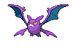

<pre><code><b>Base Happiness:</b> 140
<b>Ability One:</b> Inner Focus
<b>Ability Two:</b> Infiltrator
</code></pre>

**#170 Chinchou**


<pre><code><b>Ability One:</b> Volt Absorb
<b>Ability Two:</b> Water Absorb
</code></pre>

**#171 Lanturn**


<pre><code><b>Special Attack:</b> 76 → 86
<b>Special Defense:</b> 76 → 86
<b>Total:</b> 460 → 480
<b>Ability One:</b> Volt Absorb
<b>Ability Two:</b> Water Absorb
</code></pre>

**#172 Pichu**


<pre><code><b>Base Happiness:</b> 200
<b>HM:</b> Can now learn HM03, Surf.
<b>Ability One:</b> Static
<b>Ability Two:</b> LightningRod
</code></pre>

**#173 Cleffa**


<pre><code><b>Base Happiness:</b> 200
<b>Ability One:</b> Friend Guard
<b>Ability Two:</b> Magic Guard
</code></pre>

**#174 Igglybuff**


<pre><code><b>Base Happiness:</b> 200
<b>Ability One:</b> Cute Charm
<b>Ability Two:</b> Friend Guard
</code></pre>

**#175 Togepi**


<pre><code><b>Base Happiness:</b> 200
<b>Ability One:</b> Super Luck
<b>Ability Two:</b> Serene Grace
</code></pre>

**#176 Togetic**


<pre><code><b>Ability One:</b> Super Luck
<b>Ability Two:</b> Serene Grace
</code></pre>

**#177 Natu**


<pre><code><b>Ability One:</b> Synchronize
<b>Ability Two:</b> Magic Bounce
</code></pre>

**#178 Xatu**


<pre><code><b>Special Attack:</b> 95 → 100
<b>Speed:</b> 95 → 100
<b>Total:</b> 470 → 480
<b>Ability One:</b> Synchronize
<b>Ability Two:</b> Magic Bounce
</code></pre>

**#179 Mareep, #180 Flaaffy**


<pre><code><b>Ability One:</b> Static
<b>Ability Two:</b> Overcoat
</code></pre>

**#181 Ampharos**


<pre><code><b>TM:</b> Can now learn TM91, Flash Cannon.
<b>Ability One:</b> Static
<b>Ability Two:</b> Overcoat
</code></pre>

**#182 Bellossom**


<pre><code><b>HP:</b> 75 → 85
<b>Special Attack:</b> 90 → 100
<b>Special Defense:</b> 100 → 110
<b>Total:</b> 480 → 510
<b>Ability One:</b> Chlorophyll
<b>Ability Two:</b> Own Tempo
</code></pre>

**#183 Marill**


<pre><code><b>Special Attack:</b> 20 → 50
<b>Total:</b> 250 → 280
<b>Ability One:</b> Sap Sipper
<b>Ability Two:</b> Huge Power
</code></pre>

**#184 Azumarill**


<pre><code><b>HP:</b> 100 → 110
<b>Special Attack:</b> 50 → 90
<b>Total:</b> 410 → 450
<b>Ability One:</b> Sap Sipper
<b>Ability Two:</b> Huge Power
</code></pre>

**#185 Sudowoodo**


<pre><code><b>HP:</b> 70 → 85
<b>Attack:</b> 100 → 115
<b>Defense:</b> 115 → 130
<b>Special Defense:</b> 65 → 80
<b>Total:</b> 410 → 470
<b>Ability One:</b> Sturdy
<b>Ability Two:</b> Rattled
</code></pre>

**#186 Politoed**


<pre><code><b>Ability One:</b> Water Absorb
<b>Ability Two:</b> Drizzle
</code></pre>

**#187 Hoppip, #188 Skiploom, #189 Jumpluff**


<pre><code><b>Ability One:</b> Chlorophyll
<b>Ability Two:</b> Prankster
</code></pre>

**#190 Aipom**


<pre><code><b>Ability One:</b> Skill Link
<b>Ability Two:</b> Pickup
</code></pre>

**#191 Sunkern**


<pre><code><b>Ability One:</b> Chlorophyll
<b>Ability Two:</b> Simple
</code></pre>

**#192 Sunflora**


<pre><code><b>Defense:</b> 55 → 85
<b>Special Attack:</b> 105 → 135
<b>Special Defense:</b> 85 → 95
<b>Total:</b> 425 → 495
<b>Base EXP:</b> 149 → 209
<b>Ability One:</b> Chlorophyll
<b>Ability Two:</b> Simple
</code></pre>

**#193 Yanma**


<pre><code><b>Ability One:</b> Speed Boost
<b>Ability Two:</b> Compoundeyes
</code></pre>

**#194 Wooper**


<pre><code><b>Ability One:</b> Unaware
<b>Ability Two:</b> Water Absorb
</code></pre>

**#195 Quagsire**


<pre><code><b>Attack:</b> 85 → 95
<b>Defense:</b> 85 → 95
<b>Total:</b> 430 → 450
<b>Ability One:</b> Unaware
<b>Ability Two:</b> Water Absorb
</code></pre>

**#196 Espeon**


<pre><code><b>Ability One:</b> Synchronize
<b>Ability Two:</b> Magic Bounce
</code></pre>

**#197 Umbreon**


<pre><code><b>TM:</b> Can now learn TM86, Grass Knot.
<b>Ability One:</b> Synchronize
<b>Ability Two:</b> Prankster
</code></pre>

**#198 Murkrow**


<pre><code><b>Ability One:</b> Prankster
<b>Ability Two:</b> Super Luck
</code></pre>

**#199 Slowking**


<pre><code><b>Ability One:</b> Regenerator
<b>Ability Two:</b> Drizzle
</code></pre>

**#200 Misdreavus**


<pre><code><b>Ability One:</b> Levitate
<b>Ability Two:</b> Levitate
</code></pre>

**#201 Unown**


<pre><code><b>Attack:</b> 72 → 112
<b>Special Attack:</b> 72 → 112
<b>Speed:</b> 48 → 88
<b>Total:</b> 336 → 456
<b>Base EXP:</b> 118 → 196
<b>Ability One:</b> Levitate
<b>Ability Two:</b> Levitate
</code></pre>

**#202 Wobbuffet**


<pre><code><b>Ability One:</b> Shadow Tag
<b>Ability Two:</b> Telepathy
</code></pre>

**#203 Girafarig**


<pre><code><b>Special Attack:</b> 90 → 110
<b>Speed:</b> 85 → 105
<b>Total:</b> 455 → 495
<b>Base EXP:</b> 159 → 205
<b>Ability One:</b> Sap Sipper
<b>Ability Two:</b> Early Bird
</code></pre>

**#204 Pineco, #205 Forretress**


<pre><code><b>Ability One:</b> Sturdy
<b>Ability Two:</b> Overcoat
</code></pre>

**#206 Dunsparce**


<pre><code><b>HP:</b> 100 → 120
<b>Attack:</b> 70 → 90
<b>Total:</b> 415 → 455
<b>Ability One:</b> Serene Grace
<b>Ability Two:</b> Rattled
</code></pre>

**#207 Gligar**


<pre><code><b>Ability One:</b> Hyper Cutter
<b>Ability Two:</b> Immunity
</code></pre>

**#208 Steelix**


<pre><code><b>Attack:</b> 85 → 90
<b>Total:</b> 510 → 515
<b>Ability One:</b> Sheer Force
<b>Ability Two:</b> Sturdy
</code></pre>

**#209 Snubbull**


<pre><code><b>Ability One:</b> Intimidate
<b>Ability Two:</b> Rattled
</code></pre>

**#210 Granbull**


<pre><code><b>HP:</b> 90 → 105
<b>Total:</b> 450 → 465
<b>Ability One:</b> Intimidate
<b>Ability Two:</b> Rattled
</code></pre>

**#211 Qwilfish**


<pre><code><b>Special Attack:</b> 55 → 95
<b>Total:</b> 430 → 470
<b>Ability One:</b> Poison Touch
<b>Ability Two:</b> Intimidate
</code></pre>

**#212 Scizor**


<pre><code><b>Ability One:</b> Swarm
<b>Ability Two:</b> Technician
</code></pre>

**#213 Shuckle**


<pre><code><b>Ability One:</b> Sturdy
<b>Ability Two:</b> Solid Rock
</code></pre>

**#214 Heracross**


<pre><code><b>Ability One:</b> Moxie
<b>Ability Two:</b> Guts
</code></pre>

**#215 Sneasel**


<pre><code><b>TM:</b> Now learns TM79, Frost Breath.
<b>Ability One:</b> Pickpocket
<b>Ability Two:</b> Technician
</code></pre>

**#216 Teddiursa**


<pre><code><b>Ability One:</b> Pickup
<b>Ability Two:</b> Honey Gather
</code></pre>

**#217 Ursaring**


<pre><code><b>Ability One:</b> Pickup
<b>Ability Two:</b> Sheer Force
</code></pre>

**#218 Slugma**


<pre><code><b>Item:</b> Flame Orb (50%)
<b>Ability One:</b> Magma Armor
<b>Ability Two:</b> Flame Body
</code></pre>

**#219 Magcargo**


<pre><code><b>Item:</b> Flame Orb (50%)
<b>Defense:</b> 120 → 135
<b>Special Attack:</b> 80 → 115
<b>Special Defense:</b> 80 → 115
<b>Total:</b> 410 → 495
<b>Base EXP:</b> 144 → 205
<b>Ability One:</b> Solid Rock
<b>Ability Two:</b> Flame Body
</code></pre>

**#220 Swinub, #221 Piloswine**


<pre><code><b>Ability One:</b> Thick Fat
<b>Ability Two:</b> Snow Cloak
</code></pre>

**#222 Corsola**


<pre><code><b>Defense:</b> 85 → 115
<b>Special Attack:</b> 65 → 105
<b>Special Defense:</b> 85 → 110
<b>Total:</b> 380 → 475
<b>Base EXP:</b> 133 → 205
<b>Ability One:</b> Regenerator
<b>Ability Two:</b> Natural Cure
</code></pre>

**#223 Remoraid, #224 Octillery**


<pre><code><b>TM:</b> Now learn TM79, Frost Breath.
<b>Ability One:</b> Moody
<b>Ability Two:</b> Sniper
</code></pre>

**#225 Delibird**


<pre><code><b>HP:</b> 45 → 50
<b>Attack:</b> 55 → 95
<b>Defense:</b> 45 → 55
<b>Special Attack:</b> 65 → 105
<b>Special Defense:</b> 45 → 55
<b>Speed:</b> 75 → 115
<b>Total:</b> 330 → 475
<b>Base EXP:</b> 116 → 201
<b>TM:</b> Can now learn TM62 Acrobatics and TM89 U-turn.
<b>Ability One:</b> Vital Spirit
<b>Ability Two:</b> Technician
</code></pre>

**#226 Mantine**


<pre><code><b>HM:</b> Can now learn HM02, Fly.
<b>Ability One:</b> Swift Swim
<b>Ability Two:</b> Water Absorb
</code></pre>

**#227 Skarmory**


<pre><code><b>Ability One:</b> Light Metal
<b>Ability Two:</b> Sturdy
</code></pre>

**#228 Houndour, #229 Houndoom**


<pre><code><b>Ability One:</b> Intimidate
<b>Ability Two:</b> Flash Fire
</code></pre>

**#230 Kingdra**


<pre><code><b>TM:</b> Now learns TM79, Frost Breath.
<b>Ability One:</b> Swift Swim
<b>Ability Two:</b> Sniper
</code></pre>

**#231 Phanpy**


<pre><code><b>Ability One:</b> Pickup
<b>Ability Two:</b> Sand Veil
</code></pre>

**#232 Donphan**


<pre><code><b>Ability One:</b> Sturdy
<b>Ability Two:</b> Sand Force
</code></pre>

**#233 Porygon2**


<pre><code><b>Evolution:</b> Use the Dubious Disc.
<b>Ability One:</b> Trace
<b>Ability Two:</b> Download
</code></pre>

**#234 Stantler**


<pre><code><b>Attack:</b> 95 → 100
<b>Total:</b> 465 → 470
<b>Ability One:</b> Intimidate
<b>Ability Two:</b> Sap Sipper
</code></pre>

**#235 Smeargle**


<pre><code><b>Speed:</b> 75 → 115
<b>Total:</b> 250 → 290
<b>Base EXP:</b> 88 → 111
<b>Ability One:</b> Moody
<b>Ability Two:</b> Technician
</code></pre>

**#236 Tyrogue**


<pre><code><b>Ability One:</b> Guts
<b>Ability Two:</b> Vital Spirit
</code></pre>

**#237 Hitmontop**


<pre><code><b>Ability One:</b> Intimidate
<b>Ability Two:</b> Technician
</code></pre>

**#238 Smoochum**


<pre><code><b>Ability One:</b> Trace
<b>Ability Two:</b> Hydration
</code></pre>

**#239 Elekid**


<pre><code><b>Ability One:</b> Static
<b>Ability Two:</b> Vital Spirit
</code></pre>

**#240 Magby**


<pre><code><b>Ability One:</b> Flame Body
<b>Ability Two:</b> Vital Spirit
</code></pre>

**#241 Miltank**


<pre><code><b>Attack:</b> 80 → 90
<b>Total:</b> 490 → 500
<b>Ability One:</b> Thick Fat
<b>Ability Two:</b> Scrappy
</code></pre>

**#242 Blissey**


<pre><code><b>Ability One:</b> Natural Cure
<b>Ability Two:</b> Serene Grace
</code></pre>

**#243 Raikou**


<pre><code><b>Item:</b> Micle Berry (100%)
<b>Ability One:</b> Pressure
<b>Ability Two:</b> Volt Absorb
</code></pre>

**#244 Entei**

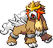

<pre><code><b>Item:</b> Custap Berry (100%)
<b>Ability One:</b> Pressure
<b>Ability Two:</b> Flash Fire
</code></pre>

**#245 Suicune**


<pre><code><b>Item:</b> Rowap Berry (100%)
<b>Ability One:</b> Pressure
<b>Ability Two:</b> Water Absorb
</code></pre>

**#246 Larvitar**


<pre><code><b>Ability One:</b> Guts
<b>Ability Two:</b> Hustle
</code></pre>

**#247 Pupitar**


<pre><code><b>Ability One:</b> Shed Skin
<b>Ability Two:</b> Battle Armor
</code></pre>

**#248 Tyranitar**


<pre><code><b>Ability One:</b> Sand Stream
<b>Ability Two:</b> Battle Armor
</code></pre>

**#249 Lugia**


<pre><code><b>Item:</b> Ganlon Berry (100%)
<b>Ability One:</b> Pressure
<b>Ability Two:</b> Multiscale
</code></pre>

**#250 Ho-oh**


<pre><code><b>Ability One:</b> Pressure
<b>Ability Two:</b> Regenerator
</code></pre>

**#251 Celebi**


<pre><code><b>Item:</b> Jaboca Berry (100%)
<b>Ability One:</b> Natural Cure
<b>Ability Two:</b> Magic Guard
</code></pre>

---

## Hoenn Pokémon

**#252 Treecko, #253 Grovyle, #254 Sceptile**


<pre><code><b>Item:</b> Miracle Seed (50%)
<b>Ability One:</b> Overgrow
<b>Ability Two:</b> Adaptability
</code></pre>

**#255 Torchic, #256 Combusken, #257 Blaziken**


<pre><code><b>Item:</b> Charcoal (50%)
<b>Ability One:</b> Blaze
<b>Ability Two:</b> Speed Boost
</code></pre>

**#258 Mudkip, #259 Marshtomp, #260 Swampert**


<pre><code><b>Item:</b> Mystic Water (50%)
<b>Ability One:</b> Torrent
<b>Ability Two:</b> Mold Breaker
</code></pre>

**#261 Poochyena**

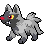

<pre><code><b>Ability One:</b> Rattled
<b>Ability Two:</b> Quick Feet
</code></pre>

**#262 Mightyena**


<pre><code><b>Attack:</b> 90 → 105
<b>Total:</b> 420 → 435
<b>Ability One:</b> Intimidate
<b>Ability Two:</b> Moxie
</code></pre>

**#263 Zigzagoon**


<pre><code><b>Ability One:</b> Pickup
<b>Ability Two:</b> Gluttony
</code></pre>

**#264 Linoone**


<pre><code><b>Attack:</b> 70 → 85
<b>Total:</b> 420 → 435
<b>Ability One:</b> Pickup
<b>Ability Two:</b> Quick Feet
</code></pre>

**#265 Wurmple**


<pre><code><b>Ability One:</b> Shield Dust
<b>Ability Two:</b> Run Away
</code></pre>

**#266 Silcoon**


<pre><code><b>Ability One:</b> Shed Skin
<b>Ability Two:</b> Battle Armor
</code></pre>

**#267 Beautifly**


<pre><code><b>Special Attack:</b> 90 → 105
<b>Speed:</b> 65 → 85
<b>Total:</b> 385 → 420
<b>Ability One:</b> Swarm
<b>Ability Two:</b> Shield Dust
</code></pre>

**#268 Silcoon**


<pre><code><b>Ability One:</b> Shed Skin
<b>Ability Two:</b> Battle Armor
</code></pre>

**#269 Dustox**


<pre><code><b>Special Defense:</b> 90 → 105
<b>Speed:</b> 65 → 85
<b>Total:</b> 385 → 420
<b>Ability One:</b> Shield Dust
<b>Ability Two:</b> Compoundeyes
</code></pre>

**#270 Lotad**


<pre><code><b>Ability One:</b> Swift Swim
<b>Ability Two:</b> Rain Dish
</code></pre>

**#271 Lombre**

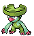

<pre><code><b>Ability One:</b> Swift Swim
<b>Ability Two:</b> Rain Dish
</code></pre>

**#272 Ludicolo**


<pre><code><b>Ability One:</b> Swift Swim
<b>Ability Two:</b> Rain Dish
</code></pre>

**#273 Seedot**


<pre><code><b>Ability One:</b> Pickpocket
<b>Ability Two:</b> Early Bird
</code></pre>

**#274 Nuzleaf**


<pre><code><b>Ability One:</b> Pickpocket
<b>Ability Two:</b> Early Bird
</code></pre>

**#275 Shiftry**


<pre><code><b>Ability One:</b> Pickpocket
<b>Ability Two:</b> Early Bird
</code></pre>

**#276 Taillow**


<pre><code><b>TM:</b> Now learns TM62 Acrobatics.
<b>Ability One:</b> Unburden
<b>Ability Two:</b> Scrappy
</code></pre>

**#277 Swellow**


<pre><code><b>HP:</b> 60 → 70
<b>Attack:</b> 85 → 100
<b>Total:</b> 430 → 455
<b>TM:</b> Now learns TM62 Acrobatics.
<b>Ability One:</b> Unburden
<b>Ability Two:</b> Scrappy
</code></pre>

**#278 Wingull**


<pre><code><b>Ability One:</b> Keen Eye
<b>Ability Two:</b> Infiltrator
</code></pre>

**#279 Pelipper**


<pre><code><b>Defense:</b> 100 → 120
<b>Special Attack:</b> 85 → 100
<b>Stat Total:</b> 430 → 465
<b>Ability One:</b> Keen Eye
<b>Ability Two:</b> Rain Dish
</code></pre>

**#280 Ralts**


<pre><code><b>Special Attack:</b> 45 → 65
<b>Total:</b> 198 → 218
<b>Ability One:</b> Synchronize
<b>Ability Two:</b> Trace
</code></pre>

**#281 Kirlia**


<pre><code><b>Special Attack:</b> 65 → 95
<b>Total:</b> 278 → 308
<b>Ability One:</b> Synchronize
<b>Ability Two:</b> Trace
</code></pre>

**#282 Gardevoir**


<pre><code><b>Ability One:</b> Synchronize
<b>Ability Two:</b> Trace
</code></pre>

**#283 Surskit**


<pre><code><b>Ability One:</b> Swift Swim
<b>Ability Two:</b> Rain Dish
<b>HM:</b> Can now learn HM03, Surf.
</code></pre>

**#284 Masquerain**


<pre><code><b>Type:</b> Bug / Water
<b>HP:</b> 70 → 70
<b>Attack:</b> 60 → 60
<b>Defense:</b> 62 → 62
<b>Special Attack:</b> 80 → 100
<b>Special Defense:</b> 82 → 102
<b>Speed:</b> 60 → 90
<b>Total:</b> 414 → 484
<b>Base EXP:</b> 145 → 200
<b>HM:</b> Can now learn HM03, Surf and HM05, Waterfall.
<b>Ability One:</b> Levitate
<b>Ability Two:</b> Levitate
</code></pre>

**#285 Shroomish**


<pre><code><b>Ability One:</b> Effect Spore
<b>Ability Two:</b> Poison Heal
</code></pre>

**#286 Breloom**


<pre><code><b>Ability One:</b> Technician
<b>Ability Two:</b> Poison Heal
</code></pre>

**#287 Slakoth**


<pre><code><b>Ability One:</b> Truant
<b>Ability Two:</b> Slow Start
</code></pre>

**#288 Vigoroth**


<pre><code><b>Attack:</b> 80 → 100
<b>Total:</b> 440 → 460
<b>Ability One:</b> Vital Spirit
<b>Ability Two:</b> Sheer Force
</code></pre>

**#289 Slaking**


<pre><code><b>Ability One:</b> Truant
<b>Ability Two:</b> Slow Start
</code></pre>

**#290 Nincada**


<pre><code><b>Ability One:</b> Compoundeyes
<b>Ability Two:</b> Anticipation
</code></pre>

**#291 Ninjask**


<pre><code><b>Ability One:</b> Speed Boost
<b>Ability Two:</b> Infiltrator
</code></pre>

**#292 Shedinja**


<pre><code><b>Ability One:</b> Wonder Guard
<b>Ability Two:</b> Wonder Guard
</code></pre>

**#293 Whismur**


<pre><code><b>Ability One:</b> Soundproof
<b>Ability Two:</b> Rattled
</code></pre>

**#294 Loudred, #295 Exploud**


<pre><code><b>Ability One:</b> Soundproof
<b>Ability Two:</b> Scrappy
</code></pre>

**#296 Makuhita, #297 Hariyama**


<pre><code><b>Ability One:</b> Thick Fat
<b>Ability Two:</b> Sheer Force
</code></pre>

**#298 Azurill**


<pre><code><b>Ability One:</b> Sap Sipper
<b>Ability Two:</b> Huge Power
</code></pre>

**#299 Nosepass**

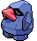

<pre><code><b>Ability One:</b> Sturdy
<b>Ability Two:</b> Magnet Pull
</code></pre>

**#300 Skitty**


<pre><code><b>Ability One:</b> Normalize
<b>Ability Two:</b> Wonder Skin
</code></pre>

**#301 Delcatty**

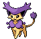

<pre><code><b>Attack:</b> 65 → 75
<b>Special Attack:</b> 55 → 95
<b>Speed:</b> 70 → 90
<b>Total:</b> 380 → 450
<b>Ability One:</b> Normalize
<b>Ability Two:</b> Wonder Skin
</code></pre>

**#302 Sableye**


<pre><code><b>HP:</b> 50 → 70
<b>Attack:</b> 75 → 95
<b>Defense:</b> 75 → 95
<b>Special Defense:</b> 65 → 85
<b>Total:</b> 380 → 460
<b>Base EXP:</b> 133 → 197
<b>Ability One:</b> Prankster
<b>Ability Two:</b> Analytic
</code></pre>

**#303 Mawile**


<pre><code><b>HP:</b> 50 → 70
<b>Attack:</b> 85 → 105
<b>Defense:</b> 85 → 90
<b>Special Defense:</b> 55 → 90
<b>Total:</b> 380 → 460
<b>Base EXP:</b> 133 → 197
<b>Ability One:</b> Sheer Force
<b>Ability Two:</b> Intimidate
</code></pre>

**#304 Aron, #305 Lairon, #306 Aggron**


<pre><code><b>Ability One:</b> Sturdy
<b>Ability Two:</b> Rock Head
</code></pre>

**#307 Meditite, #308 Medicham**


<pre><code><b>Ability One:</b> Pure Power
<b>Ability Two:</b> Telepathy
</code></pre>

**#309 Electrike, #310 Manectric**

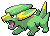


<pre><code><b>Ability One:</b> Static
<b>Ability Two:</b> Lightningrod
</code></pre>

**#311 Plusle**


<pre><code><b>Ability One:</b> Plus
<b>Ability Two:</b> Plus
</code></pre>

**#312 Minun**


<pre><code><b>Ability One:</b> Minus
<b>Ability Two:</b> Minus
</code></pre>

**#313 Volbeat**


<pre><code><b>Type:</b> Bug / Electric
<b>HP:</b> 65 → 80
<b>Attack:</b> 73 → 30
<b>Defense:</b> 55 → 60
<b>Special Attack:</b> 47 → 90
<b>Special Defense:</b> 75 → 80
<b>Speed:</b> 85 → 90
<b>Stat Total:</b> 400 → 430
<b>Base EXP:</b> 140 → 195
<b>Ability One:</b> Prankster
<b>Ability Two:</b> Swarm
</code></pre>

**#314 Illumise**


<pre><code><b>Type:</b> Bug / Electric
<b>HP:</b> 65 → 80
<b>Attack:</b> 73 → 30
<b>Defense:</b> 55 → 60
<b>Special Attack:</b> 47 → 80
<b>Special Defense:</b> 75 → 90
<b>Speed:</b> 85 → 90
<b>Stat Total:</b> 400 → 430
<b>Base EXP:</b> 140 → 195
<b>Ability One:</b> Prankster
<b>Ability Two:</b> Tinted Lens
</code></pre>

**#315 Roselia**


<pre><code><b>Ability One:</b> Natural Cure
<b>Ability Two:</b> Poison Point
</code></pre>

**#316 Gulpin**


<pre><code><b>Ability One:</b> Liquid Ooze
<b>Ability Two:</b> Gluttony
</code></pre>

**#317 Swalot**


<pre><code><b>Special Attack:</b> 73 → 103
<b>Total:</b> 467 → 497
<b>Ability One:</b> Liquid Ooze
<b>Ability Two:</b> Gluttony
</code></pre>

**#318 Carvanha, #319 Sharpedo**


<pre><code><b>Ability One:</b> Rough Skin
<b>Ability Two:</b> Speed Boost
</code></pre>

**#320 Wailmer, #321 Wailord**


<pre><code><b>Ability One:</b> Thick Fat
<b>Ability Two:</b> Drizzle
</code></pre>

**#322 Numel**


<pre><code><b>Ability One:</b> Own Tempo
<b>Ability Two:</b> Simple
</code></pre>

**#323 Camerupt**


<pre><code><b>Ability One:</b> Drought
<b>Ability Two:</b> Solid Rock
</code></pre>

**#324 Torkoal**


<pre><code><b>Attack:</b> 85 → 100
<b>Special Attack:</b> 85 → 100
<b>Total:</b> 470 → 500
<b>Ability One:</b> White Smoke
<b>Ability Two:</b> Sturdy
</code></pre>

**#325 Spoink, #326 Grumpig**


<pre><code><b>Ability One:</b> Thick Fat
<b>Ability Two:</b> Own Tempo
</code></pre>

**#327 Spinda**


<pre><code><b>HP:</b> 60 → 80
<b>Attack:</b> 60 → 80
<b>Defense:</b> 60 → 80
<b>Special Attack:</b> 60 → 80
<b>Special Defense:</b> 60 → 80
<b>Speed:</b> 60 → 80
<b>Total:</b> 360 → 480
<b>Base EXP:</b> 126 → 200
<b>Ability One:</b> Own Tempo
<b>Ability Two:</b> Contrary
</code></pre>

**#328 Trapinch**


<pre><code><b>Ability One:</b> Hyper Cutter
<b>Ability Two:</b> Sheer Force
</code></pre>

**#329 Vibrava**


<pre><code><b>Ability One:</b> Levitate
<b>Ability Two:</b> Levitate
</code></pre>

**#330 Flygon**


<pre><code><b>Attack:</b> 100 → 110
<b>Defense:</b> 80 → 75
<b>Special Attack:</b> 80 → 110
<b>Special Defense:</b> 80 → 75
<b>Total:</b> 520 → 550
<b>Base EXP:</b> 234 → 243
<b>Ability One:</b> Levitate
<b>Ability Two:</b> Levitate
</code></pre>

**#331 Cacnea, #332 Cacturne**


<pre><code><b>Ability One:</b> Sand Veil
<b>Ability Two:</b> Water Absorb
</code></pre>

**#333 Swablu**


<pre><code><b>TM:</b> Now learns TM62 Acrobatics.
<b>Ability One:</b> Natural Cure
<b>Ability Two:</b> Cloud Nine
</code></pre>

**#334 Altaria**


<pre><code><b>Special Attack:</b> 70 → 100
<b>Total:</b> 490 → 520
<b>Base EXP:</b> 172 → 203
<b>TM:</b> Now learns TM58 Sky Drop and TM62 Acrobatics.
<b>Ability One:</b> Natural Cure
<b>Ability Two:</b> Cloud Nine
</code></pre>

**#335 Zangoose**


<pre><code><b>Ability One:</b> Immunity
<b>Ability Two:</b> Toxic Boost
</code></pre>

**#336 Seviper**


<pre><code><b>Ability One:</b> Shed Skin
<b>Ability Two:</b> Infiltrator
</code></pre>

**#337 Lunatone**


<pre><code><b>Special Attack:</b> 95 → 115
<b>Total:</b> 440 → 460
<b>Ability One:</b> Levitate
<b>Ability Two:</b> Levitate
</code></pre>

**#338 Solrock**


<pre><code><b>Attack:</b> 95 → 115
<b>Total:</b> 440 → 460
<b>Ability One:</b> Levitate
<b>Ability Two:</b> Levitate
</code></pre>

**#339 Barboach**


<pre><code><b>Ability One:</b> Forewarn
<b>Ability Two:</b> Simple
</code></pre>

**#340 Whiscash**


<pre><code><b>Attack:</b> 78 → 98
<b>Total:</b> 468 → 488
<b>Ability One:</b> Forewarn
<b>Ability Two:</b> Simple
</code></pre>

**#341 Corphish, #342 Crawdaunt**


<pre><code><b>Ability One:</b> Hyper Cutter
<b>Ability Two:</b> Adaptability
</code></pre>

**#343 Baltoy**


<pre><code><b>Ability One:</b> Levitate
<b>Ability Two:</b> Levitate
</code></pre>

**#344 Claydol**


<pre><code><b>Item:</b> Life Orb (5%)
<b>HM:</b> Can now learn HM02, Fly.
<b>Ability One:</b> Levitate
<b>Ability Two:</b> Levitate
</code></pre>

**#345 Lileep, #346 Cradily**


<pre><code><b>Ability One:</b> Suction Cups
<b>Ability Two:</b> Storm Drain
</code></pre>

**#347 Anorith, #348 Armaldo**


<pre><code><b>Ability One:</b> Battle Armor
<b>Ability Two:</b> Swift Swim
</code></pre>

**#349 Feebas**


<pre><code><b>Evolution:</b> Use the Prism Scale.
<b>Ability One:</b> Swift Swim
<b>Ability Two:</b> Adaptability
</code></pre>

**#350 Milotic**


<pre><code><b>Ability One:</b> Marvel Scale
<b>Ability Two:</b> Multiscale
</code></pre>

**#351 Castform**


<pre><code><b>HP:</b> 60 → 80
<b>Attack:</b> 60 → 80
<b>Special Attack:</b> 60 → 100
<b>Speed:</b> 60 → 100
<b>Total:</b> 360 → 500
<b>Base EXP:</b> 147 → 202
<b>Ability One:</b> Forecast
<b>Ability Two:</b> Forecast
</code></pre>

**#352 Kecleon**


<pre><code><b>HP:</b> 60 → 100
<b>Total:</b> 440 → 480
<b>Ability One:</b> Colour Change
<b>Ability Two:</b> Colour Change
</code></pre>

**#353 Shuppet**

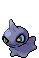

<pre><code><b>Ability One:</b> Insomnia
<b>Ability Two:</b> Cursed Body
</code></pre>

**#354 Banette**


<pre><code><b>Attack:</b> 115 → 130
<b>Speed:</b> 65 → 80
<b>Total:</b> 455 → 485
<b>Ability One:</b> Insomnia
<b>Ability Two:</b> Cursed Body
</code></pre>

**#355 Duskull**


<pre><code><b>Ability One:</b> Levitate
<b>Ability Two:</b> Levitate
</code></pre>

**#356 Dusclops**


<pre><code><b>Evolution:</b> Use the Reaper Cloth.
<b>Ability One:</b> Pressure
<b>Ability Two:</b> Cursed Body
</code></pre>

**#357 Tropius**


<pre><code><b>HP:</b> 99 → 110
<b>Attack:</b> 68 → 85
<b>Defense:</b> 83 → 90
<b>Special Attack:</b> 72 → 90
<b>Special Defense:</b> 87 → 90
<b>Speed:</b> 51 → 70
<b>Total:</b> 460 → 535
<b>Base EXP:</b> 161 → 238
<b>Ability One:</b> Chlorophyll
<b>Ability Two:</b> Harvest
</code></pre>

**#358 Chimecho**


<pre><code><b>HP:</b> 65 → 70
<b>Defense:</b> 70 → 80
<b>Special Attack:</b> 95 → 110
<b>Special Defense:</b> 80 → 100
<b>Speed:</b> 65 → 90
<b>Total:</b> 425 → 500
<b>Base EXP:</b> 149 → 199
<b>Ability One:</b> Levitate
<b>Ability Two:</b> Levitate
</code></pre>

**#359 Absol**


<pre><code><b>Ability One:</b> Justified
<b>Ability Two:</b> Super Luck
</code></pre>

**#360 Wynaut**


<pre><code><b>Ability One:</b> Shadow Tag
<b>Ability Two:</b> Telepathy
</code></pre>

**#361 Snorunt**


<pre><code><b>Ability One:</b> Ice Body
<b>Ability Two:</b> Moody
</code></pre>

**#362 Glalie**


<pre><code><b>Type:</b> Ice / Rock
<b>TM:</b> Can now learn TM23 Smack Down, TM37 Sandstorm, TM69 Rock Polish, TM71 Stone Edge and TM80 Rock Slide.
<b>HP:</b> 80 → 100
<b>Attack:</b> 80 → 100
<b>Defense:</b> 80 → 120
<b>Special Attack:</b> 80 → 60
<b>Special Defense:</b> 80 → 60
<b>Speed:</b> 80 → 60
<b>Total:</b> 480 → 500
<b>Base EXP:</b> 168 → 189
<b>Ability One:</b> Solid Rock
<b>Ability Two:</b> Moody
</code></pre>

**#363 Spheal, #364 Sealeo, #365 Walrein**


<pre><code><b>Ability One:</b> Thick Fat
<b>Ability Two:</b> Ice Body
</code></pre>

**#366 Clamperl**


<pre><code><b>Evolution (Huntail):</b> Level Up at Night with a Deep Sea Tooth equipped.
<b>Evolution (Gorebyss):</b> Level Up at Night with a Deep Sea Scale equipped.
<b>Ability One:</b> Shell Armor
<b>Ability Two:</b> Rattled
</code></pre>

**#367 Huntail**


<pre><code><b>Ability One:</b> Swift Swim
<b>Ability Two:</b> Sheer Force
</code></pre>

**#368 Gorebyss**


<pre><code><b>Ability One:</b> Swift Swim
<b>Ability Two:</b> Storm Drain
</code></pre>

**#369 Relicanth**


<pre><code><b>Ability One:</b> Sturdy
<b>Ability Two:</b> Rock Head
</code></pre>

**#370 Luvdisc**


<pre><code><b>HP:</b> 43 → 50
<b>Attack:</b> 30 → 35
<b>Defense:</b> 55 → 60
<b>Special Attack:</b> 40 → 100
<b>Special Defense:</b> 65 → 80
<b>Speed:</b> 97 → 125
<b>Total:</b> 330 → 450
<b>Base EXP:</b> 116 → 200
<b>Item:</b> Heart Scale (100%)
<b>Ability One:</b> Swift Swim
<b>Ability Two:</b> Hydration
</code></pre>

**#371 Bagon**


<pre><code><b>Ability One:</b> Rock Head
<b>Ability Two:</b> Sheer Force
</code></pre>

**#372 Shelgon**


<pre><code><b>Ability One:</b> Rock Head
<b>Ability Two:</b> Overcoat
</code></pre>

**#373 Salamence**


<pre><code><b>Ability One:</b> Intimidate
<b>Ability Two:</b> Moxie
</code></pre>

**#374 Beldum, #375 Metang**


<pre><code><b>Ability One:</b> Levitate
<b>Ability Two:</b> Levitate
</code></pre>

**#376 Metagross**


<pre><code><b>HM:</b> Can now learn HM02, Fly.
<b>Ability One:</b> Iron Fist
<b>Ability Two:</b> Analytic
</code></pre>

**#377 Regirock**


<pre><code><b>Ability One:</b> Clear Body
<b>Ability Two:</b> Solid Rock
</code></pre>

**#378 Regice**


<pre><code><b>Ability One:</b> Clear Body
<b>Ability Two:</b> Heatproof
</code></pre>

**#379 Registeel**


<pre><code><b>Ability One:</b> Clear Body
<b>Ability Two:</b> Sturdy
</code></pre>

**#380 Latias**


<pre><code><b>Ability One:</b> Levitate
<b>Ability Two:</b> Levitate
</code></pre>

**#381 Latios**

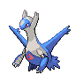

<pre><code><b>Ability One:</b> Levitate
<b>Ability Two:</b> Levitate
</code></pre>

**#382 Kyogre**


<pre><code><b>Ability One:</b> Drizzle
<b>Ability Two:</b> Drizzle
</code></pre>

**#383 Groudon**


<pre><code><b>Ability One:</b> Drought
<b>Ability Two:</b> Drought
</code></pre>

**#384 Rayquaza**


<pre><code><b>Ability One:</b> Air Lock
<b>Ability Two:</b> Air Lock
</code></pre>

**#385 Jirachi**


<pre><code><b>Ability One:</b> Serene Grace
<b>Ability Two:</b> Magic Guard
</code></pre>

**#386 Deoxys**


<pre><code><b>Ability One:</b> Pressure
<b>Ability Two:</b> Pressure
</code></pre>

---

## Sinnoh Pokémon

**#387 Turtwig, #388 Grotle, #389 Torterra**


<pre><code><b>Item:</b> Miracle Seed (50%)
<b>Ability One:</b> Overgrow
<b>Ability Two:</b> Sturdy
</code></pre>

**#390 Chimchar, #391 Monferno, #392 Infernape**


<pre><code><b>Item:</b> Charcoal (50%)
<b>Ability One:</b> Blaze
<b>Ability Two:</b> Iron Fist
</code></pre>

**#393 Piplup, #394 Prinplup, #395 Empoleon**


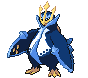

<pre><code><b>Item:</b> Mystic Water (50%)
<b>Ability One:</b> Torrent
<b>Ability Two:</b> Defiant
</code></pre>

**#396 Starly**


<pre><code><b>TM:</b> Now learns TM62, Acrobatics.
<b>Ability One:</b> Keen Eye
<b>Ability Two:</b> Keen Eye
</code></pre>

**#397 Staravia**


<pre><code><b>TM:</b> Now learns TM62, Acrobatics.
<b>Ability One:</b> Intimidate
<b>Ability Two:</b> Reckless
</code></pre>

**#398 Staraptor**


<pre><code><b>TM:</b> Now learns TM62, Acrobatics.
<b>HP:</b> 85 → 100
<b>Defense:</b> 70 → 80
<b>Total:</b> 475 → 500
<b>Ability One:</b> Intimidate
<b>Ability Two:</b> Reckless
</code></pre>

**#399 Bidoof**


<pre><code><b>Ability One:</b> Simple
<b>Ability Two:</b> Moody
</code></pre>

**#400 Bibarel**


<pre><code><b>HP:</b> 79 → 89
<b>Attack:</b> 85 → 95
<b>Special Attack:</b> 55 → 60
<b>Total:</b> 410 → 435
<b>Ability One:</b> Simple
<b>Ability Two:</b> Moody
</code></pre>

**#401 Kricketot**

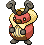

<pre><code><b>Ability One:</b> Shed Skin
<b>Ability Two:</b> Run Away
</code></pre>

**#402 Kricketune**

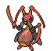

<pre><code><b>Attack:</b> 85 → 104
<b>Speed:</b> 65 → 87
<b>Total:</b> 384 → 425
<b>Base EXP:</b> 134 → 158
<b>Ability One:</b> Swarm
<b>Ability Two:</b> Technician
</code></pre>

**#403 Shinx**


<pre><code><b>Ability One:</b> Guts
<b>Ability Two:</b> Intimidate
</code></pre>

**#404 Luxio**


<pre><code><b>Type:</b> Electric / Dark
<b>Ability One:</b> Guts
<b>Ability Two:</b> Intimidate
</code></pre>

**#405 Luxray**


<pre><code><b>Type:</b> Electric / Dark
<b>Speed:</b> 70 → 82
<b>Total:</b> 523 → 535
<b>Ability One:</b> Guts
<b>Ability Two:</b> Intimidate
</code></pre>

**#406 Budew**


<pre><code><b>Base Happiness:</b> 200
<b>Ability One:</b> Natural Cure
<b>Ability Two:</b> Leaf Guard
</code></pre>

**#407 Roserade**


<pre><code><b>Defense:</b> 55 → 65
<b>Speed:</b> 90 → 100
<b>Total:</b> 505 → 525
<b>Ability One:</b> Natural Cure
<b>Ability Two:</b> Technician
</code></pre>

**#408 Cranidos, #409 Rampardos**


<pre><code><b>Ability One:</b> Mold Breaker
<b>Ability Two:</b> Sheer Force
</code></pre>

**#410 Shieldon, #411 Bastiodon**


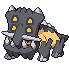

<pre><code><b>Ability One:</b> Sturdy
<b>Ability Two:</b> Soundproof
</code></pre>

**#412 Burmy**


<pre><code><b>Ability One:</b> Shed Skin
<b>Ability Two:</b> Overcoat
</code></pre>

**#413 Wormadam (Plant)**


<pre><code><b>Special Attack:</b> 79 → 99
<b>Special Defense:</b> 105 → 125
<b>Total:</b> 424 → 464
<b>Ability One:</b> Anticipation
<b>Ability Two:</b> Leaf Guard
</code></pre>

**#413 Wormadam (Sandy)**


<pre><code><b>Attack:</b> 79 → 99
<b>Defense:</b> 105 → 125
<b>Total:</b> 424 → 464
<b>Ability One:</b> Anticipation
<b>Ability Two:</b> Sand Veil
</code></pre>

**#413 Wormadam (Trash)**


<pre><code><b>Defense:</b> 95 → 115
<b>Special Defense:</b> 95 → 115
<b>Total:</b> 424 → 464
<b>Ability One:</b> Anticipation
<b>Ability Two:</b> Sturdy
</code></pre>

**#414 Mothim**


<pre><code><b>Special Attack:</b> 94 → 104
<b>Special Defense:</b> 66 → 96
<b>Total:</b> 424 → 464
<b>Ability One:</b> Swarm
<b>Ability Two:</b> Tinted Lens
</code></pre>

**#415 Combee**


<pre><code><b>Ability One:</b> Honey Gather
<b>Ability Two:</b> Hustle
</code></pre>

**#416 Vespiquen**


<pre><code><b>Ability One:</b> Pressure
<b>Ability Two:</b> Intimidate
</code></pre>

**#417 Pachirisu**


<pre><code><b>Special Attack:</b> 45 → 100
<b>Total:</b> 405 → 460
<b>Base EXP:</b> 142 → 161
<b>Ability One:</b> Volt Absorb
<b>Ability Two:</b> Pickup
</code></pre>

**#418 Buizel, #419 Floatzel**


<pre><code><b>Ability One:</b> Swift Swim
<b>Ability Two:</b> Technician
</code></pre>

**#420 Cherubi**


<pre><code><b>Ability One:</b> Chlorophyll
<b>Ability Two:</b> Healer
</code></pre>

**#421 Cherrim**


<pre><code><b>Special Attack:</b> 87 → 107
<b>Speed:</b> 85 → 95
<b>Total:</b> 450 → 480
<b>Ability One:</b> Flower Gift
<b>Ability Two:</b> Flower Gift
</code></pre>

**#422 Shellos, #423 Gastrodon**


<pre><code><b>Ability One:</b> Sticky Hold
<b>Ability Two:</b> Storm Drain
</code></pre>

**#424 Ambipom**


<pre><code><b>Ability One:</b> Technician
<b>Ability Two:</b> Pickup
</code></pre>

**#425 Drifloon, #426 Drifblim**


<pre><code><b>Ability One:</b> Flare Boost
<b>Ability Two:</b> Unburden
</code></pre>

**#427 Buneary**


<pre><code><b>Base Happiness:</b> 140
<b>Ability One:</b> Klutz
<b>Ability Two:</b> Limber
</code></pre>

**#428 Lopunny**


<pre><code><b>Ability One:</b> Cute Charm
<b>Ability Two:</b> Limber
</code></pre>

**#429 Mismagius**


<pre><code><b>HP:</b> 60 → 70
<b>Attack:</b> 60 → 70
<b>Defense:</b> 60 → 70
<b>Total:</b> 495 → 525
<b>Base EXP:</b> 173 → 201
<b>Ability One:</b> Levitate
<b>Ability Two:</b> Levitate
</code></pre>

**#430 Honchkrow**


<pre><code><b>HP:</b> 100 → 120
<b>Total:</b> 505 → 525
<b>Base EXP:</b> 177 → 205
<b>Ability One:</b> Moxie
<b>Ability Two:</b> Super Luck
</code></pre>

**#431 Glameow**


<pre><code><b>Ability One:</b> Limber
<b>Ability Two:</b> Own Tempo
</code></pre>

**#432 Purugly**


<pre><code><b>HP:</b> 71 → 89
<b>Attack:</b> 82 → 91
<b>Total:</b> 452 → 479
<b>Base EXP:</b> 158 → 168
<b>Ability One:</b> Thick Fat
<b>Ability Two:</b> Defiant
</code></pre>

**#433 Chingling**


<pre><code><b>Base Happiness:</b> 200
<b>Ability One:</b> Levitate
<b>Ability Two:</b> Levitate
</code></pre>

**#434 Stunky, #435 Skuntank**


<pre><code><b>Ability One:</b> Stench
<b>Ability Two:</b> Aftermath
</code></pre>

**#436 Bronzor**


<pre><code><b>Ability One:</b> Levitate
<b>Ability Two:</b> Heatproof
</code></pre>

**#437 Bronzong**


<pre><code><b>HM:</b> Can now learn HM02, Fly.
<b>Ability One:</b> Levitate
<b>Ability Two:</b> Heatproof
</code></pre>

**#438 Bonsly**


<pre><code><b>Ability One:</b> Sturdy
<b>Ability Two:</b> Rattled
</code></pre>

**#439 Mime Jr.**


<pre><code><b>Ability One:</b> Technician
<b>Ability Two:</b> Filter
</code></pre>

**#440 Happiny**


<pre><code><b>Evolution:</b> Use the Oval Stone.
<b>Base Happiness:</b> 160
<b>Ability One:</b> Natural Cure
<b>Ability Two:</b> Friend Guard
</code></pre>

**#441 Chatot**

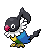

<pre><code><b>Defense:</b> 45 → 56
<b>Special Attack:</b> 92 → 112
<b>Special Defense:</b> 42 → 55
<b>Speed:</b> 91 → 111
<b>Total:</b> 411 → 475
<b>Base EXP:</b> 144 → 192
<b>Ability One:</b> Moody
<b>Ability Two:</b> Tangled Feet
</code></pre>

**#442 Spiritomb**


<pre><code><b>Ability One:</b> Pressure
<b>Ability Two:</b> Cursed Body
</code></pre>

**#443 Gible, #444 Gabite**


<pre><code><b>Ability One:</b> Sand Veil
<b>Ability Two:</b> Rough Skin
</code></pre>

**#445 Garchomp**


<pre><code><b>HM:</b> Can now learn HM02, Fly.
<b>Ability One:</b> Sand Veil
<b>Ability Two:</b> Rough Skin
</code></pre>

**#446 Munchlax**


<pre><code><b>Base Happiness:</b> 180
<b>Ability One:</b> Gluttony
<b>Ability Two:</b> Thick Fat
</code></pre>

**#447 Riolu**


<pre><code><b>Base Happiness:</b> 180
<b>Ability One:</b> Steadfast
<b>Ability Two:</b> Prankster
</code></pre>

**#448 Lucario**


<pre><code><b>Ability One:</b> Steadfast
<b>Ability Two:</b> Justified
</code></pre>

**#449 Hippopotas, #450 Hippowdon**


<pre><code><b>Ability One:</b> Sand Stream
<b>Ability Two:</b> Sand Force
</code></pre>

**#451 Skorupi, #452 Drapion**


<pre><code><b>Ability One:</b> Battle Armor
<b>Ability Two:</b> Sniper
</code></pre>

**#453 Croagunk, #454 Toxicroak**


<pre><code><b>Ability One:</b> Poison Touch
<b>Ability Two:</b> Dry Skin
</code></pre>

**#455 Carnivine**


<pre><code><b>Attack:</b> 100 → 120
<b>Speed:</b> 46 → 86
<b>Total:</b> 420 → 480
<b>Ability One:</b> Levitate
<b>Ability Two:</b> Levitate
</code></pre>

**#456 Finneon**


<pre><code><b>Ability One:</b> Swift Swim
<b>Ability Two:</b> Storm Drain
</code></pre>

**#457 Lumineon**


<pre><code><b>Special Attack:</b> 69 → 89
<b>Speed:</b> 91 → 101
<b>Total:</b> 460 → 490
<b>Ability One:</b> Swift Swim
<b>Ability Two:</b> Storm Drain
</code></pre>

**#458 Mantyke**


<pre><code><b>Ability One:</b> Swift Swim
<b>Ability Two:</b> Water Absorb
</code></pre>

**#459 Snover, #460 Abomasnow**


<pre><code><b>Ability One:</b> Snow Warning
<b>Ability Two:</b> Soundproof
</code></pre>

**#461 Weavile**


<pre><code><b>TM:</b> Now learns TM79, Frost Breath.
<b>Ability One:</b> Pickpocket
<b>Ability Two:</b> Technician
</code></pre>

**#462 Magnezone**


<pre><code><b>Ability One:</b> Magnet Pull
<b>Ability Two:</b> Analytic
</code></pre>

**#463 Lickilicky**


<pre><code><b>Ability One:</b> Thick Fat
<b>Ability Two:</b> Gluttony
</code></pre>

**#464 Rhyperior**


<pre><code><b>Ability One:</b> Reckless
<b>Ability Two:</b> Solid Rock
</code></pre>

**#465 Tangrowth**


<pre><code><b>Ability One:</b> Chlorophyll
<b>Ability Two:</b> Regenerator
</code></pre>

**#466 Electivire**


<pre><code><b>Type:</b> Electric / Fighting
<b>Ability One:</b> Motor Drive
<b>Ability Two:</b> Vital Spirit
</code></pre>

**#467 Magmortar**

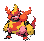

<pre><code><b>Ability One:</b> Flame Body
<b>Ability Two:</b> Vital Spirit
</code></pre>

**#468 Togekiss**


<pre><code><b>Ability One:</b> Super Luck
<b>Ability Two:</b> Serene Grace
</code></pre>

**#469 Yanmega**


<pre><code><b>HM:</b> Can now learn HM02, Fly.
<b>Ability One:</b> Speed Boost
<b>Ability Two:</b> Tinted Lens
</code></pre>

**#470 Leafeon**


<pre><code><b>Ability One:</b> Leaf Guard
<b>Ability Two:</b> Natural Cure
</code></pre>

**#471 Glaceon**


<pre><code><b>TM:</b> Can now learn TM86, Grass Knot.
<b>Ability One:</b> Snow Cloak
<b>Ability Two:</b> Serene Grace
</code></pre>

**#472 Gliscor**


<pre><code><b>HM:</b> Can now learn HM02, Fly.
<b>Ability One:</b> Hyper Cutter
<b>Ability Two:</b> Poison Heal
</code></pre>

**#473 Mamoswine**


<pre><code><b>Ability One:</b> Thick Fat
<b>Ability Two:</b> Snow Cloak
</code></pre>

**#474 Porygon-Z**


<pre><code><b>Ability One:</b> Adaptability
<b>Ability Two:</b> Download
</code></pre>

**#475 Gallade**


<pre><code><b>Ability One:</b> Justified
<b>Ability Two:</b> Trace
</code></pre>

**#476 Probopass**


<pre><code><b>Ability One:</b> Sturdy
<b>Ability Two:</b> Magnet Pull
</code></pre>

**#477 Dusknoir**


<pre><code><b>Ability One:</b> Pressure
<b>Ability Two:</b> Cursed Body
</code></pre>

**#478 Froslass**


<pre><code><b>Special Attack:</b> 80 → 100
<b>Total:</b> 480 → 500
<b>Base EXP:</b> 168 → 189
<b>Ability One:</b> Levitate
<b>Ability Two:</b> Levitate
</code></pre>

**#479 Rotom**


<pre><code><b>Speed:</b> 91 → 111
<b>Total:</b> 440 → 460
<b>Ability One:</b> Levitate
<b>Ability Two:</b> Levitate
</code></pre>

**#479 Rotom Fan**


<pre><code><b>Ability One:</b> Speed Boost
<b>Ability Two:</b> Motor Drive
</code></pre>

**#480 Uxie**


<pre><code><b>Ability One:</b> Levitate
<b>Ability Two:</b> Levitate
</code></pre>

**#481 Mesprit**


<pre><code><b>Ability One:</b> Levitate
<b>Ability Two:</b> Levitate
</code></pre>

**#482 Azelf**


<pre><code><b>Ability One:</b> Levitate
<b>Ability Two:</b> Levitate
</code></pre>

**#483 Dialga**


<pre><code><b>Ability One:</b> Pressure
<b>Ability Two:</b> Telepathy
</code></pre>

**#484 Palkia**


<pre><code><b>Ability One:</b> Pressure
<b>Ability Two:</b> Telepathy
</code></pre>

**#485 Heatran**


<pre><code><b>Ability One:</b> Flash Fire
<b>Ability Two:</b> Flame Body
</code></pre>

**#486 Regigigas**


<pre><code><b>Ability One:</b> Sheer Force
<b>Ability Two:</b> Sheer Force
</code></pre>

**#487 Giratina (Altered)**


<pre><code><b>Ability One:</b> Pressure
<b>Ability Two:</b> Telepathy
</code></pre>

**#488 Cresselia**


<pre><code><b>Ability One:</b> Levitate
<b>Ability Two:</b> Levitate
</code></pre>

**#489 Phione**


<pre><code><b>HP:</b> 80 → 90
<b>Attack:</b> 80 → 90
<b>Defense:</b> 80 → 90
<b>Special Attack:</b> 80 → 90
<b>Special Defense:</b> 80 → 90
<b>Speed:</b> 80 → 90
<b>Total:</b> 480 → 540
<b>Base EXP:</b> 216 → 255
<b>Ability One:</b> Hydration
<b>Ability Two:</b> Magic Guard
</code></pre>

**#490 Manaphy**


<pre><code><b>Item:</b> Lansat Berry (100%)
<b>Ability One:</b> Hydration
<b>Ability Two:</b> Magic Guard
</code></pre>

**#491 Darkrai**


<pre><code><b>Ability One:</b> Bad Dreams
<b>Ability Two:</b> Bad Dreams
</code></pre>

**#492 Shaymin**


<pre><code><b>Item:</b> Starf Berry (100%)
</code></pre>

**#493 Arceus**


<pre><code><b>Item:</b> Enigma Berry (100%)
<b>Base EXP:</b> 324 → 511
<b>Ability One:</b> Multitype
<b>Ability Two:</b> Multitype
</code></pre>

---

## Unova Pokémon

**#494 Victini**


<pre><code><b>Ability One:</b> Victory Star
<b>Ability Two:</b> Victory Star
</code></pre>

**#495 Snivy**


<pre><code><b>Item:</b> Miracle Seed (50%)
<b>Base EXP:</b> 28 → 50
<b>Base Happiness:</b> 0
<b>Ability One:</b> Overgrow
<b>Ability Two:</b> Contrary
</code></pre>

**#496 Servine**


<pre><code><b>Item:</b> Miracle Seed (50%)
<b>Base Happiness:</b> 0
<b>Ability One:</b> Overgrow
<b>Ability Two:</b> Contrary
</code></pre>

**#497 Serperior**


<pre><code><b>TM:</b> Can now learn TM26 Earthquake.
<b>Tutor:</b> Can now learn Draco Meteor.
<b>Item:</b> Miracle Seed (50%)
<b>Type:</b> Grass / Dragon
<b>Base Happiness:</b> 0
<b>HP:</b> 75 → 82
<b>Total:</b> 528 → 535
<b>Ability One:</b> Overgrow
<b>Ability Two:</b> Contrary
</code></pre>

**#498 Tepig**

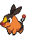

<pre><code><b>Item:</b> Charcoal (50%)
<b>Base EXP:</b> 28 → 50
<b>Ability One:</b> Blaze
<b>Ability Two:</b> Adaptability
</code></pre>

**#499 Pignite**

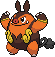

<pre><code><b>Item:</b> Charcoal (50%)
<b>Type:</b> Fire / Ground
<b>Ability One:</b> Blaze
<b>Ability Two:</b> Adaptability
</code></pre>

**#500 Emboar**


<pre><code><b>Item:</b> Charcoal (50%)
<b>HP:</b> 110 → 120
<b>Attack:</b> 123 → 130
<b>Defense:</b> 65 → 80
<b>Special Attack:</b> 100 → 70
<b>Special Defense:</b> 65 → 80
<b>Speed:</b> 65 → 55
<b>Total:</b> 528 → 535
<b>Type:</b> Fire / Ground
<b>Ability One:</b> Blaze
<b>Ability Two:</b> Adaptability
</code></pre>

**#501 Oshawott**


<pre><code><b>Item:</b> Mystic Water (50%)
<b>Base EXP:</b> 28 → 50
<b>Ability One:</b> Torrent
<b>Ability Two:</b> Vital Spirit
</code></pre>

**#502 Dewott**


<pre><code><b>Item:</b> Mystic Water (50%)
<b>Type:</b> Water / Fighting
<b>Ability One:</b> Torrent
<b>Ability Two:</b> Vital Spirit
</code></pre>

**#503 Samurott**


<pre><code><b>TM:</b> Can now learn TM26 Earthquake.
<b>Item:</b> Mystic Water (50%)
<b>Special Attack:</b> 108 → 105
<b>Speed:</b> 70 → 80
<b>Total:</b> 528 → 535
<b>Type:</b> Water / Fighting
<b>Ability One:</b> Torrent
<b>Ability Two:</b> Vital Spirit
</code></pre>

**#504 Patrat**


<pre><code><b>Ability One:</b> Analytic
<b>Ability Two:</b> Keen Eye
</code></pre>

**#505 Watchog**


<pre><code><b>Special Attack:</b> 60 → 85
<b>Total:</b> 420 → 435
<b>Ability One:</b> Analytic
<b>Ability Two:</b> Keen Eye
</code></pre>

**#506 Lillipup**


<pre><code><b>Ability One:</b> Vital Spirit
<b>Ability Two:</b> Pickup
</code></pre>

**#507 Herdier**


<pre><code><b>Ability One:</b> Intimidate
<b>Ability Two:</b> Scrappy
</code></pre>

**#508 Stoutland**


<pre><code><b>HP:</b> 85 → 105
<b>Attack:</b> 100 → 110
<b>Total:</b> 490 → 520
<b>Ability One:</b> Intimidate
<b>Ability Two:</b> Scrappy
</code></pre>

**#509 Purrloin**


<pre><code><b>Ability One:</b> Limber
<b>Ability Two:</b> Prankster
</code></pre>

**#510 Liepard**


<pre><code><b>TM:</b> Can now learn TM43, Flame Charge and TM93, Wild Charge.
<b>Attack:</b> 88 → 98
<b>Special Attack:</b> 88 → 98
<b>Total:</b> 446 → 466
<b>Ability One:</b> Limber
<b>Ability Two:</b> Prankster
</code></pre>

**#511 Pansage**


<pre><code><b>Tutor:</b> Can now learn Grass Pledge and Frenzy Plant.
<b>Ability One:</b> Gluttony
<b>Ability Two:</b> Overgrow
</code></pre>

**#512 Simisage**


<pre><code><b>Tutor:</b> Can now learn Grass Pledge and Frenzy Plant.
<b>Ability One:</b> Unburden
<b>Ability Two:</b> Overgrow
</code></pre>

**#513 Pansear**


<pre><code><b>Tutor:</b> Can now learn Fire Pledge and Blast Burn.
<b>Ability One:</b> Gluttony
<b>Ability Two:</b> Blaze
</code></pre>

**#514 Simisear**


<pre><code><b>Tutor:</b> Can now learn Fire Pledge and Blast Burn.
<b>Ability One:</b> Unburden
<b>Ability Two:</b> Blaze
</code></pre>

**#515 Panpour**


<pre><code><b>Tutor:</b> Can now learn Water Pledge and Hydro Cannon.
<b>Ability One:</b> Gluttony
<b>Ability Two:</b> Torrent
</code></pre>

**#516 Simipour**


<pre><code><b>Tutor:</b> Can now learn Water Pledge and Hydro Cannon.
<b>Ability One:</b> Unburden
<b>Ability Two:</b> Torrent
</code></pre>

**#517 Munna**


<pre><code><b>Ability One:</b> Telepathy
<b>Ability Two:</b> Analytic
<b>Ability Three (DW):</b> Magic Bounce
</code></pre>

**#518 Musharna**


<pre><code><b>Ability One:</b> Telepathy
<b>Ability Two:</b> Analytic
<b>Ability Three (DW):</b> Magic Bounce
</code></pre>

**#519 Pidove**


<pre><code><b>Attack:</b> 55 → 36
<b>Defense:</b> 50 → 30
<b>Special Attack:</b> 36 → 55
<b>Special Defense:</b> 30 → 50
<b>Ability One:</b> Rivalry
<b>Ability Two:</b> Super Luck
</code></pre>

**#520 Tranquill**


<pre><code><b>Attack:</b> 77 → 50
<b>Defense:</b> 62 → 42
<b>Special Attack:</b> 50 → 77
<b>Special Defense:</b> 42 → 62
<b>Ability One:</b> Rivalry
<b>Ability Two:</b> Super Luck
</code></pre>

**#521 Unfezant**


<pre><code><b>Attack:</b> 105 → 65
<b>Defense:</b> 80 → 55
<b>Special Attack:</b> 65 → 115
<b>Special Defense:</b> 55 → 100
<b>Speed:</b> 93 → 103
<b>Total:</b> 478 → 518
<b>Ability One:</b> Serene Grace
<b>Ability Two:</b> Super Luck
</code></pre>

**#522 Blitzle**


<pre><code><b>Ability One:</b> LightningRod
<b>Ability Two:</b> Sap Sipper
</code></pre>

**#523 Zebstrika**


<pre><code><b>Ability One:</b> LightningRod
<b>Ability Two:</b> Sap Sipper
</code></pre>

**#524 Roggenrola**


<pre><code><b>Ability One:</b> Sturdy
<b>Ability Two:</b> Sand Force
</code></pre>

**#525 Boldore**


<pre><code><b>Evolution:</b> Level 36.
<b>Ability One:</b> Sturdy
<b>Ability Two:</b> Sand Force
</code></pre>

**#526 Gigalith**


<pre><code><b>Ability One:</b> Sturdy
<b>Ability Two:</b> Sand Force
</code></pre>

**#527 Woobat**


<pre><code><b>Base Happiness:</b> 180
<b>Ability One:</b> Unaware
<b>Ability Two:</b> Klutz
</code></pre>

**#528 Swoobat**


<pre><code><b>Base Happiness:</b> 180
<b>HP:</b> 67 → 77
<b>Attack:</b> 57 → 67
<b>Special Attack:</b> 77 → 107
<b>Special Defense:</b> 55 → 65
<b>Total:</b> 425 → 485
<b>Base EXP:</b> 149 → 199
<b>Ability One:</b> Unaware
<b>Ability Two:</b> Simple
</code></pre>

**#529 Drilbur, #530 Excadrill**


<pre><code><b>Ability One:</b> Sand Rush
<b>Ability Two:</b> Mold Breaker
</code></pre>

**#531 Audino**


<pre><code><b>Base EXP:</b> 390 → 400
<b>Ability One:</b> Serene Grace
<b>Ability Two:</b> Regenerator
</code></pre>

**#532 Timburr**


<pre><code><b>Ability One:</b> Guts
<b>Ability Two:</b> Iron Fist
</code></pre>

**#533 Gurdurr**


<pre><code><b>Evolution:</b> Level 36.
<b>Ability One:</b> Guts
<b>Ability Two:</b> Iron Fist
</code></pre>

**#534 Conkeldurr**


<pre><code><b>Ability One:</b> Guts
<b>Ability Two:</b> Iron Fist
</code></pre>

**#535 Tympole, #536 Palpitoad**


<pre><code><b>TM:</b> Can now learn TM13 Ice Beam and TM14 Blizzard.
<b>Ability One:</b> Water Absorb
<b>Ability Two:</b> Hydration
</code></pre>

**#537 Seismitoad**


<pre><code><b>TM:</b> Can now learn TM13 Ice Beam and TM14 Blizzard.
<b>Attack:</b> 85 → 95
<b>Special Attack:</b> 85 → 95
<b>Total:</b> 499 → 519
<b>Ability One:</b> Water Absorb
<b>Ability Two:</b> Poison Touch
</code></pre>

**#538 Throh**


<pre><code><b>Item:</b> Black Belt (50%)
<b>Item:</b> Expert Belt (5%)
<b>Ability One:</b> Guts
<b>Ability Two:</b> Mold Breaker
</code></pre>

**#539 Sawk**


<pre><code><b>Item:</b> Black Belt (50%)
<b>Item:</b> Expert Belt (5%)
<b>Ability One:</b> Sturdy
<b>Ability Two:</b> Mold Breaker
</code></pre>

**#540 Sewaddle**


<pre><code><b>Base Happiness:</b> 180
<b>Ability One:</b> Swarm
<b>Ability Two:</b> Chlorophyll
</code></pre>

**#541 Swadloon**


<pre><code><b>Base Happiness:</b> 180
<b>Ability One:</b> Leaf Guard
<b>Ability Two:</b> Overcoat
</code></pre>

**#542 Leavanny**


<pre><code><b>Base Happiness:</b> 180
<b>Ability One:</b> Swarm
<b>Ability Two:</b> Chlorophyll
</code></pre>

**#543 Venipede**


<pre><code><b>Ability One:</b> Poison Point
<b>Ability Two:</b> Swarm
</code></pre>

**#544 Whirlipede**


<pre><code><b>Ability One:</b> Battle Armor
<b>Ability Two:</b> Swarm
</code></pre>

**#545 Scolipede**


<pre><code><b>Ability One:</b> Poison Touch
<b>Ability Two:</b> Swarm
</code></pre>

**#546 Cottonee, #547 Whimsicott**


<pre><code><b>Ability One:</b> Prankster
<b>Ability Two:</b> Infiltrator
</code></pre>

**#548 Petilil**


<pre><code><b>TM:</b> Now learns TM29 Psychic and TM30 Shadow Ball.
<b>Ability One:</b> Chlorophyll
<b>Ability Two:</b> Leaf Guard
</code></pre>

**#549 Lilligant**


<pre><code><b>TM:</b> Now learns TM29 Psychic, TM30 Shadow Ball, and TM52 Focus Blast.
<b>Ability One:</b> Chlorophyll
<b>Ability Two:</b> Own Tempo
</code></pre>

**#550 Basculin (Red Striped)**

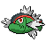

<pre><code><b>Attack:</b> 92 → 102
<b>Speed:</b> 98 → 108
<b>Total:</b> 460 → 480
<b>Ability One:</b> Reckless
<b>Ability Two:</b> Adaptability
</code></pre>

**#550 Basculin (Blue Striped)**


<pre><code><b>Attack:</b> 92 → 102
<b>Speed:</b> 98 → 108
<b>Total:</b> 460 → 480
<b>Ability One:</b> Rock Head
<b>Ability Two:</b> Adaptability
</code></pre>

**#551 Sandile**


<pre><code><b>Ability One:</b> Anger Point
<b>Ability Two:</b> Moxie
</code></pre>

**#552 Krokorok**


<pre><code><b>Ability One:</b> Anger Point
<b>Ability Two:</b> Moxie
</code></pre>

**#553 Krookodile**


<pre><code><b>Ability One:</b> Intimidate
<b>Ability Two:</b> Moxie
</code></pre>

**#554 Darumaka**


<pre><code><b>Ability One:</b> Hustle
<b>Ability Two:</b> Rattled
</code></pre>

**#555 Darmanitan**


<pre><code><b>Ability One:</b> Sheer Force
<b>Ability Two:</b> Iron Fist
</code></pre>

**#556 Maractus**


<pre><code><b>TM:</b> Can now learn TM55, Scald.
<b>Attack:</b> 86 → 101
<b>Special Attack:</b> 106 → 116
<b>Total:</b> 461 → 486
<b>Ability One:</b> Water Absorb
<b>Ability Two:</b> Storm Drain
</code></pre>

**#557 Dwebble, #558 Crustle**


<pre><code><b>Ability One:</b> Sturdy
<b>Ability Two:</b> Shell Armor
</code></pre>

**#559 Scraggy, #560 Scrafty**


<pre><code><b>Ability One:</b> Shed Skin
<b>Ability Two:</b> Moxie
<b>Evolution:</b> Level 35 [Scraggy]
</code></pre>

**#561 Sigilyph**


<pre><code><b>Special Attack:</b> 103 → 108
<b>Speed:</b> 97 → 102
<b>Total:</b> 490 → 500
<b>Base EXP:</b> 172 → 200
<b>Ability One:</b> Tinted Lens
<b>Ability Two:</b> Magic Guard
</code></pre>

**#562 Yamask**


<pre><code><b>Ability One:</b> Mummy
<b>Ability Two:</b> Mummy
</code></pre>

**#563 Cofagrigus**


<pre><code><b>Type:</b> Ghost / Steel
<b>TM:</b> Can now learn TM91, Flash Cannon.
<b>Ability One:</b> Mummy
<b>Ability Two:</b> Mummy
</code></pre>

**#564 Tirtouga, #565 Carracosta**


<pre><code><b>Ability One:</b> Solid Rock
<b>Ability Two:</b> Sturdy
</code></pre>

**#566 Archen, #567 Archeops**


<pre><code><b>Ability One:</b> Defeatist
<b>Ability Two:</b> Defeatist
</code></pre>

**#568 Trubbish**


<pre><code><b>Ability One:</b> Stench
<b>Ability Two:</b> Sticky Hold
</code></pre>

**#569 Garbodor**

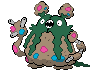

<pre><code><b>Special Attack:</b> 60 → 80
<b>Total:</b> 474 → 494
<b>Ability One:</b> Stench
<b>Ability Two:</b> Aftermath
</code></pre>

**#570 Zorua**


<pre><code><b>Ability One:</b> Illusion
<b>Ability Two:</b> Illusion
</code></pre>

**#571 Zoroark**


<pre><code><b>Ability One:</b> Illusion
<b>Ability Two:</b> Illusion
</code></pre>

**#572 Minccino**


<pre><code><b>Ability One:</b> Skill Link
<b>Ability Two:</b> Technician
</code></pre>

**#573 Cinccino**


<pre><code><b>Attack:</b> 95 → 105
<b>Total:</b> 470 → 480
<b>Ability One:</b> Skill Link
<b>Ability Two:</b> Technician
</code></pre>

**#574 Gothita**


<pre><code><b>Type:</b> Psychic / Dark
<b>TM:</b> Now learns TM61 Will-O-Wisp.
<b>Ability One:</b> Frisk
<b>Ability Two:</b> Magic Bounce
</code></pre>

**#575 Gothorita**


<pre><code><b>Type:</b> Psychic / Dark
<b>TM:</b> Now learns TM61 Will-O-Wisp.
<b>Ability One:</b> Frisk
<b>Ability Two:</b> Magic Bounce
</code></pre>

**#576 Gothitelle**


<pre><code><b>Type:</b> Psychic / Dark
<b>Attack:</b> 55 → 45
<b>Special Attack:</b> 95 → 115
<b>Total:</b> 490 → 500
<b>TM:</b> Now learns TM52 Focus Blast and TM61 Will-O-Wisp.
<b>Ability One:</b> Shadow Tag
<b>Ability Two:</b> Magic Bounce
</code></pre>

**#577 Solosis, #578 Duosion**


<pre><code><b>Ability One:</b> Regenerator
<b>Ability Two:</b> Magic Guard
</code></pre>

**#579 Reuniclus**


<pre><code><b>Defense:</b> 75 → 85
<b>Total:</b> 490 → 500
<b>Ability One:</b> Regenerator
<b>Ability Two:</b> Magic Guard
</code></pre>

**#580 Ducklett**


<pre><code><b>Ability One:</b> Hydration
<b>Ability Two:</b> Big Pecks
</code></pre>

**#581 Swanna**


<pre><code><b>Attack:</b> 87 → 97
<b>Special Attack:</b> 87 → 97
<b>Speed:</b> 98 → 108
<b>Total:</b> 473 → 503
<b>TM:</b> Can now learn TM62, Acrobatics.
<b>Ability One:</b> Hydration
<b>Ability Two:</b> Big Pecks
</code></pre>

**#582 Vanillite, #583 Vanillish**


<pre><code><b>TM:</b> Can now learn TM30, Shadow Ball, TM53, Energy Ball and TM86, Grass Knot.
<b>Ability One:</b> Ice Body
<b>Ability Two:</b> Weak Armor
</code></pre>

**#584 Vanilluxe**


<pre><code><b>HP:</b> 71 → 70
<b>Attack:</b> 95 → 70
<b>Defense:</b> 85 → 80
<b>Special Attack:</b> 110 → 145
<b>Special Defense:</b> 95 → 90
<b>Speed:</b> 79 → 80
<b>Total:</b> 535 → 535
<b>TM:</b> Can now learn TM30, Shadow Ball, TM53, Energy Ball and TM86, Grass Knot.
<b>Ability One:</b> Ice Body
<b>Ability Two:</b> Weak Armor
</code></pre>

**#585 Deerling**


<pre><code><b>Ability One:</b> Chlorophyll
<b>Ability Two:</b> Serene Grace
</code></pre>

**#586 Sawsbuck**


<pre><code><b>Attack:</b> 100 → 115
<b>Speed:</b> 95 → 105
<b>Total:</b> 475 → 500
<b>Ability One:</b> Chlorophyll
<b>Ability Two:</b> Serene Grace
</code></pre>

**#587 Emolga**


<pre><code><b>Attack:</b> 75 → 95
<b>Special Attack:</b> 75 → 95
<b>Total:</b> 428 → 468
<b>Ability One:</b> Static
<b>Ability Two:</b> Motor Drive
</code></pre>

**#588 Karrablast**


<pre><code><b>Evolution:</b> Level Up with Shelmet in the party.
<b>Ability One:</b> Swarm
<b>Ability Two:</b> No Guard
</code></pre>

**#589 Escavalier**


<pre><code><b>Ability One:</b> Swarm
<b>Ability Two:</b> No Guard
<b>TM:</b> Can now learn TM74, Gyro Ball.
</code></pre>

**#590 Foongus, #591 Amoonguss**


<pre><code><b>Ability One:</b> Effect Spore
<b>Ability Two:</b> Regenerator
</code></pre>

**#592 Frillish, #593 Jellicent**


<pre><code><b>Ability One:</b> Water Absorb
<b>Ability Two:</b> Cursed Body
</code></pre>

**#594 Alomomola**


<pre><code><b>Attack:</b> 75 → 90
<b>Total:</b> 470 → 485
<b>Ability One:</b> Regenerator
<b>Ability Two:</b> Hydration
</code></pre>

**#595 Joltik**


<pre><code><b>Ability One:</b> Compoundeyes
<b>Ability Two:</b> Swarm
</code></pre>

**#596 Galvantula**


<pre><code><b>Special Attack:</b> 97 → 107
<b>Speed:</b> 108 → 118
<b>Total:</b> 472 → 492
<b>Ability One:</b> Compoundeyes
<b>Ability Two:</b> Swarm
</code></pre>

**#597 Ferroseed, #598 Ferrothorn**


<pre><code><b>Ability One:</b> Iron Barbs
<b>Ability Two:</b> Iron Barbs
</code></pre>

**#599 Klink, #600 Klang**


<pre><code><b>TM:</b> Can now learn TM80 Rock Slide, TM93, Wild Charge.
<b>Ability One:</b> Motor Drive
<b>Ability Two:</b> Clear Body
</code></pre>

**#601 Klinklang**


<pre><code><b>Attack:</b> 100 → 115
<b>Total:</b> 520 → 535
<b>TM:</b> Can now learn TM26 Earthquake, TM71 Stone Edge, TM80 Rock Slide, TM93, Wild Charge.
<b>Ability One:</b> Motor Drive
<b>Ability Two:</b> Clear Body
</code></pre>

**#602 Tynamo, #603 Eelektrik, #604 Eelektross**


<pre><code><b>Ability One:</b> Levitate
<b>Ability Two:</b> Levitate
</code></pre>

**#605 Elgyem**


<pre><code><b>Evolution:</b> Level 35
<b>Ability One:</b> Analytic
<b>Ability Two:</b> Synchronize
</code></pre>

**#606 Beheeyem**


<pre><code><b>Defense:</b> 75 → 95
<b>Total:</b> 485 → 505
<b>Ability One:</b> Analytic
<b>Ability Two:</b> Synchronize
</code></pre>

**#607 Litwick**


<pre><code><b>Evolution:</b> Level 34
<b>Ability One:</b> Flash Fire
<b>Ability Two:</b> Flame Body
</code></pre>

**#608 Lampent, #609 Chandelure**


<pre><code><b>Ability One:</b> Levitate
<b>Ability Two:</b> Levitate
</code></pre>

**#610 Axew, #611 Fraxure, #612 Haxorus**


<pre><code><b>Ability One:</b> Rivalry
<b>Ability Two:</b> Mold Breaker
</code></pre>

**#613 Cubchoo**


<pre><code><b>Ability One:</b> Snow Cloak
<b>Ability Two:</b> Rattled
</code></pre>

**#614 Beartic**


<pre><code><b>Type:</b> Ice / Fighting
<b>HP:</b> 95 → 110
<b>Defense:</b> 80 → 85
<b>Special Defense:</b> 80 → 85
<b>Speed:</b> 50 → 60
<b>Total:</b> 485 → 520
<b>TM:</b> Can now learn TM26, Earthquake.
<b>HM:</b> Can now learn HM05, Waterfall.
<b>Ability One:</b> Sheer Force
<b>Ability Two:</b> Swift Swim
</code></pre>

**#615 Cryogonal**


<pre><code><b>Defense:</b> 30 → 60
<b>Special Attack:</b> 95 → 100
<b>Total:</b> 485 → 520
<b>Ability One:</b> Levitate
<b>Ability Two:</b> Levitate
</code></pre>

**#616 Shelmet**


<pre><code><b>Evolution:</b> Level Up with a Karrablast in the party.
<b>Ability One:</b> Hydration
<b>Ability Two:</b> Overcoat
</code></pre>

**#617 Accelgor**


<pre><code><b>Ability One:</b> Hydration
<b>Ability Two:</b> Unburuden
</code></pre>

**#618 Stunfisk**


<pre><code><b>Special Attack:</b> 81 → 101
<b>Total:</b> 471 → 491
<b>Ability One:</b> Static
<b>Ability Two:</b> Limber
</code></pre>

**#619 Mienfoo, #620 Mienshao**


<pre><code><b>Evolution:</b> Level 39
<b>Ability One:</b> Reckless
<b>Ability Two:</b> Regenerator
</code></pre>

**#621 Druddigon**


<pre><code><b>HM:</b> Can now learn HM02, Fly.
<b>Ability One:</b> Rough Skin
<b>Ability Two:</b> Sheer Force
</code></pre>

**#622 Golett**


<pre><code><b>Evolution:</b> Level 36
<b>Ability One:</b> Iron Fist
<b>Ability Two:</b> Klutz
</code></pre>

**#623 Golurk**


<pre><code><b>HP:</b> 89 → 99
<b>Defense:</b> 80 → 90
<b>Special Defense:</b> 80 → 90
<b>Total:</b> 483 → 513
<b>Ability One:</b> Iron Fist
<b>Ability Two:</b> No Guard
</code></pre>

**#624 Pawniard**


<pre><code><b>Evolution:</b> Level 37
<b>Ability One:</b> Defiant
<b>Ability Two:</b> Pressure
</code></pre>

**#625 Bisharp**


<pre><code><b>Speed:</b> 70 → 90
<b>Total:</b> 490 → 510
<b>Ability One:</b> Defiant
<b>Ability Two:</b> Pressure
</code></pre>

**#626 Bouffalant**


<pre><code><b>Ability One:</b> Reckless
<b>Ability Two:</b> Sap Sipper
</code></pre>

**#627 Rufflet**


<pre><code><b>Evolution:</b> Level 39 [Rufflet]
<b>Ability One:</b> Hustle
<b>Ability Two:</b> Sheer Force
</code></pre>

**#628 Braviary**


<pre><code><b>Ability One:</b> Defiant
<b>Ability Two:</b> Sheer Force
</code></pre>

**#629 Vullaby, #630 Mandibuzz**


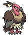

<pre><code><b>Evolution:</b> Level 39 [Vullaby]
<b>Ability One:</b> Big Pecks
<b>Ability Two:</b> Overcoat
</code></pre>

**#631 Heatmor**


<pre><code><b>Attack:</b> 97 → 100
<b>Defense:</b> 66 → 70
<b>Special Attack:</b> 105 → 115
<b>Special Defense:</b> 66 → 70
<b>Speed:</b> 65 → 70
<b>Total:</b> 484 → 510
<b>Base EXP:</b> 169 → 200
<b>Ability One:</b> White Smoke
<b>Ability Two:</b> Moody
</code></pre>

**#632 Durant**


<pre><code><b>HP:</b> 58 → 75
<b>Attack:</b> 109 → 111
<b>Special Defense:</b> 48 → 55
<b>Total:</b> 484 → 510
<b>Base EXP:</b> 169 → 200
<b>Ability One:</b> Swarm
<b>Ability Two:</b> Hustle
</code></pre>

**#633 Deino**


<pre><code><b>Evolution:</b> Level 30
<b>Ability One:</b> Hustle
<b>Ability Two:</b> Intimidate
</code></pre>

**#634 Zweilous**


<pre><code><b>Evolution:</b> Level 55
<b>Ability One:</b> Hustle
<b>Ability Two:</b> Intimidate
</code></pre>

**#635 Hydreigon**


<pre><code><b>Ability One:</b> Levitate
<b>Ability Two:</b> Levitate
</code></pre>

**#636 Larvesta**


<pre><code><b>Evolution:</b> Level 45
<b>Ability One:</b> Flame Body
<b>Ability Two:</b> Swarm
</code></pre>

**#637 Volcarona**


<pre><code><b>TM:</b> Can now learn TM24 Thunderbolt and TM25 Thunder.
<b>Ability One:</b> Drought
<b>Ability Two:</b> Drought
</code></pre>

**#638 Cobalion**


<pre><code><b>Ability One:</b> Justified
<b>Ability Two:</b> Justified
</code></pre>

**#639 Terrakion**


<pre><code><b>Ability One:</b> Justified
<b>Ability Two:</b> Justified
</code></pre>

**#640 Virizion**


<pre><code><b>Ability One:</b> Justified
<b>Ability Two:</b> Justified
</code></pre>

**#641 Tornadus**


<pre><code><b>Ability One:</b> Prankster
<b>Ability Two:</b> Defiant
</code></pre>

**#642 Thundurus**


<pre><code><b>Ability One:</b> Prankster
<b>Ability Two:</b> Defiant
</code></pre>

**#643 Reshiram**


<pre><code><b>TM:</b> Can now learn TM26 Earthquake.
<b>Ability One:</b> TurboBlaze
<b>Ability Two:</b> TurboBlaze
</code></pre>

**#644 Zekrom**


<pre><code><b>TM:</b> Can now learn TM26 Earthquake.
<b>Ability One:</b> TeraVolt
<b>Ability Two:</b> TeraVolt
</code></pre>

**#645 Landorus**

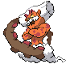

<pre><code><b>Ability One:</b> Sand Force
<b>Ability Two:</b> Sheer Force
</code></pre>

**#646 Kyurem**


<pre><code><b>TM:</b> Can now learn TM26 Earthquake and TM79 Frost Breath.
<b>Ability One:</b> Snow Warning
<b>Ability Two:</b> Snow Warning
</code></pre>

**#647 Keldeo**


<pre><code><b>TM:</b> Can now learn TM13 Ice Beam and TM14 Blizzard.
<b>Ability One:</b> Justified
<b>Ability Two:</b> Justified
</code></pre>

**#648 Meloetta**


<pre><code><b>Ability One:</b> Serene Grace
<b>Ability Two:</b> Magic Guard
</code></pre>

**#649 Genesect**


<pre><code><b>Ability One:</b> Download
<b>Ability Two:</b> Download
</code></pre>

