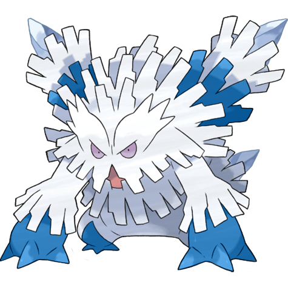
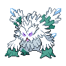
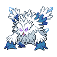

# #10060 Abomasnow Mega (Frost Tree Pokémon)

| Official Artwork | Shiny Artwork |
| --- | --- |
|  |  |

They appear when the snow flowers bloom. When the petals fall, they retreat to places unknown again.

---

## Media

### Sprites

| Front | Front Shiny |
| --- | --- |
|  |  |

### Cries

Latest (Gen VI+):

<audio controls>
  <source src='../assets/cries/10060/latest.ogg' type='audio/ogg'>
  Your browser does not support the audio element.
</audio>

Legacy:

<audio controls>
  <source src='../assets/cries/10060/legacy.ogg' type='audio/ogg'>
  Your browser does not support the audio element.
</audio>

---

## Pokédex Data

| National № | Type(s) | Height | Weight | Abilities | Local № |
|------------|---------|--------|--------|-----------|---------|
| #10060 | {: width='48'} {: width='48'} | 2.7 m | 185.0 kg | 1. Snow-Warning | #N/A |

---

## Base Stats
---

## Base Stats
|   | HP | Attack | Defense | Sp. Atk | Sp. Def | Speed |
|---|----|--------|---------|---------|---------|-------|
| **Base** | 90 | 132 | 105 | 132 | 105 | 30 |
| **Min** | 290 | 242 | 193 | 242 | 193 | 58 |
| **Max** | 384 | 399 | 339 | 399 | 339 | 174 |

The ranges shown above are for a level 100 Pokémon. Maximum values are based on a beneficial nature, 252 EVs, 31 IVs; minimum values are based on a hindering nature, 0 EVs, 0 IVs.

---

## Forms & Evolutions

!!! warning "WARNING"

    Some forms may not be available in Blaze Black/Volt White. Also information on evolutions may not be 100% accurate; it is currently quite complex to track generational evolution data.

### Forms

1. [Abomasnow](abomasnow.md/)
2. [Abomasnow-Mega](abomasnow-mega.md/)

### Evolution Line

1. [Snover](snover.md/)
1. Level Up: [Abomasnow](abomasnow.md/)

---

## Training

| EV Yield | Catch Rate | Base Friendship | Base Exp. | Growth Rate | Held Items |
|----------|------------|-----------------|-----------|-------------|------------|
| 1 Attack 1 Special Attack | 60 | 50 | 208 | Slow |  |

---

## Breeding

| Egg Groups | Egg Cycles | Gender | Dimorphic | Color | Shape |
|------------|------------|--------|-----------|-------|-------|
| 1. Monster 2. Plant | 20 | 50.0% Male 50.0% Female | True | White | Upright |

---

## Moves

!!! warning "WARNING"

    Specific move information may be incorrect. However, the general movepool should be accurate (including changes to learnset).

### Level Up Moves

Lv. | Move | Type | Cat. | Power | Acc. | PP
--- | --- | --- | --- | --- | --- | ---
| 1 | Ice Punch | {: width='48'} | {: width='36'} | 80 | 100 | 15 |
| 1 | Icy Wind | {: width='48'} | {: width='36'} | 55 | 95 | 15 |
| 1 | Leer | {: width='48'} | {: width='36'} | — | 100 | 30 |
| 1 | Powder Snow | {: width='48'} | {: width='36'} | 40 | 100 | 25 |
| 1 | Razor Leaf | {: width='48'} | {: width='36'} | 55 | 95 | 25 |
| 5 | Razor Leaf | {: width='48'} | {: width='36'} | 55 | 95 | 25 |
| 9 | Icy Wind | {: width='48'} | {: width='36'} | 55 | 95 | 15 |
| 13 | Grass Whistle | {: width='48'} | {: width='36'} | — | 55 | 15 |
| 17 | Swagger | {: width='48'} | {: width='36'} | — | 85 | 15 |
| 21 | Mist | {: width='48'} | {: width='36'} | — | — | 30 |
| 26 | Ice Shard | {: width='48'} | {: width='36'} | 40 | 100 | 30 |
| 31 | Ingrain | {: width='48'} | {: width='36'} | — | — | 20 |
| 36 | Wood Hammer | {: width='48'} | {: width='36'} | 120 | 100 | 15 |
| 47 | Blizzard | {: width='48'} | {: width='36'} | 110 | 70 | 5 |
| 58 | Sheer Cold | {: width='48'} | {: width='36'} | — | 30 | 5 |

### TM Moves

TM | Move | Type | Cat. | Power | Acc. | PP
--- | --- | --- | --- | --- | --- | ---
| TM06 | Toxic | {: width='48'} | {: width='36'} | — | 90 | 10 |
| TM07 | Hail | {: width='48'} | {: width='36'} | — | — | 10 |
| TM10 | Hidden Power | {: width='48'} | {: width='36'} | 60 | 100 | 15 |
| TM100 | Confide | {: width='48'} | {: width='36'} | — | — | 20 |
| TM13 | Ice Beam | {: width='48'} | {: width='36'} | 90 | 100 | 10 |
| TM14 | Blizzard | {: width='48'} | {: width='36'} | 110 | 70 | 5 |
| TM15 | Hyper Beam | {: width='48'} | {: width='36'} | 150 | 90 | 5 |
| TM16 | Light Screen | {: width='48'} | {: width='36'} | — | — | 30 |
| TM17 | Protect | {: width='48'} | {: width='36'} | — | — | 10 |
| TM18 | Rain Dance | {: width='48'} | {: width='36'} | — | — | 5 |
| TM20 | Safeguard | {: width='48'} | {: width='36'} | — | — | 25 |
| TM21 | Frustration | {: width='48'} | {: width='36'} | — | 100 | 20 |
| TM22 | Solar Beam | {: width='48'} | {: width='36'} | 120 | 100 | 10 |
| TM26 | Earthquake | {: width='48'} | {: width='36'} | 100 | 100 | 10 |
| TM27 | Return | {: width='48'} | {: width='36'} | — | 100 | 20 |
| TM30 | Shadow Ball | {: width='48'} | {: width='36'} | 90 | 100 | 15 |
| TM31 | Brick Break | {: width='48'} | {: width='36'} | 75 | 100 | 15 |
| TM32 | Double Team | {: width='48'} | {: width='36'} | — | — | 15 |
| TM39 | Rock Tomb | {: width='48'} | {: width='36'} | 60 | 95 | 15 |
| TM42 | Facade | {: width='48'} | {: width='36'} | 70 | 100 | 20 |
| TM44 | Rest | {: width='48'} | {: width='36'} | — | — | 5 |
| TM45 | Attract | {: width='48'} | {: width='36'} | — | 100 | 15 |
| TM48 | Round | {: width='48'} | {: width='36'} | 60 | 100 | 15 |
| TM52 | Focus Blast | {: width='48'} | {: width='36'} | 120 | 70 | 5 |
| TM53 | Energy Ball | {: width='48'} | {: width='36'} | 90 | 100 | 10 |
| TM56 | Fling | {: width='48'} | {: width='36'} | — | 100 | 10 |
| TM68 | Giga Impact | {: width='48'} | {: width='36'} | 150 | 90 | 5 |
| TM75 | Swords Dance | {: width='48'} | {: width='36'} | — | — | 20 |
| TM78 | Bulldoze | {: width='48'} | {: width='36'} | 80 | 100 | 20 |
| TM79 | Frost Breath | {: width='48'} | {: width='36'} | 60 | 90 | 10 |
| TM80 | Rock Slide | {: width='48'} | {: width='36'} | 80 | 95 | 10 |
| TM86 | Grass Knot | {: width='48'} | {: width='36'} | — | 100 | 20 |
| TM87 | Swagger | {: width='48'} | {: width='36'} | — | 85 | 15 |
| TM88 | Sleep Talk | {: width='48'} | {: width='36'} | — | — | 10 |
| TM90 | Substitute | {: width='48'} | {: width='36'} | — | — | 10 |

### Egg Moves

Abomasnow Mega cannot learn any moves by breeding.
### Tutor Moves

Move | Type | Cat. | Power | Acc. | PP
--- | --- | --- | --- | --- | ---
| Ice Punch | {: width='48'} | {: width='36'} | 80 | 100 | 15 |
| Snore | {: width='48'} | {: width='36'} | 50 | 100 | 15 |
| Icy Wind | {: width='48'} | {: width='36'} | 55 | 95 | 15 |
| Outrage | {: width='48'} | {: width='36'} | 120 | 100 | 10 |
| Giga Drain | {: width='48'} | {: width='36'} | 75 | 100 | 10 |
| Iron Tail | {: width='48'} | {: width='36'} | 100 | 75 | 15 |
| Synthesis | {: width='48'} | {: width='36'} | — | — | 5 |
| Focus Punch | {: width='48'} | {: width='36'} | 150 | 100 | 20 |
| Role Play | {: width='48'} | {: width='36'} | — | — | 10 |
| Block | {: width='48'} | {: width='36'} | — | — | 5 |
| Water Pulse | {: width='48'} | {: width='36'} | 60 | 100 | 20 |
| Worry Seed | {: width='48'} | {: width='36'} | — | 100 | 10 |
| Seed Bomb | {: width='48'} | {: width='36'} | 80 | 100 | 15 |
| Stomping Tantrum | {: width='48'} | {: width='36'} | 75 | 100 | 10 |

