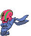

# #617 Accelgor (Shell Out Pokémon)

| Official Artwork | Shiny Artwork |
|------------------|---------------|
|  |  |

**Blaze Black:** When its body dries out, it weakens. So, to prevent dehydration, it wraps itself in many layers of thin membrane.

**Volt White:** Having removed its heavy shell, it becomes very light and can fight with ninja-like movements.

---

## Media

### Default Sprites

| Front | Shiny | Back | Shiny |
|-------|-------|------|-------|
|  |  |  |  |

### Cries

Latest (Gen VI+):

<audio controls>
<source src='../../assets/cries/accelgor/latest.ogg' type='audio/ogg'>
  Your browser does not support the audio element.
</audio>

Legacy:

<audio controls>
<source src='../../assets/cries/accelgor/legacy.ogg' type='audio/ogg'>
  Your browser does not support the audio element.
</audio>

---

## Pokédex Data

| National № | Type(s) | Height | Weight | Abilities | Local № |
|------------|---------|--------|--------|-----------|---------|
| #617 | {: width="48"} | 0.8 m / 2.6 ft | 25.3 kg / 55.8 lbs | 1. Hydration 2. Unburden | N/A |

---

## Base Stats
|   | HP | Attack | Defense | Sp. Atk | Sp. Def | Speed |
|---|----|--------|---------|---------|---------|-------|
| **Base** | 80 | 70 | 40 | 100 | 60 | 145 |
| **Min** | 270 | 130 | 76 | 184 | 112 | 265 |
| **Max** | 364 | 262 | 196 | 328 | 240 | 427 |

The ranges shown above are for a level 100 Pokémon. Maximum values are based on a beneficial nature, 252 EVs, 31 IVs; minimum values are based on a hindering nature, 0 EVs, 0 IVs.

---

## Forms & Evolutions

!!! warning "WARNING"

    Information on evolutions may not be 100% accurate; differences between evolution methods across generations are not accounted for.

### Forms

Accelgor has no alternate forms.

### Evolution Line

1. [Shelmet](shelmet.md/)
    1. Trade: [Accelgor](accelgor.md/)

---

## Training

| EV Yield | Catch Rate | Base Friendship | Base Exp. | Growth Rate | Held Items |
|----------|------------|-----------------|-----------|-------------|------------|
| 2 Spd | 75 | 50 | 173 | Medium | N/A |

---

## Breeding

| Egg Groups | Egg Cycles | Gender | Dimorphic | Color | Shape |
|------------|------------|--------|-----------|-------|-------|
| 1. Bug | 15 | 50.0% Male 50.0% Female | False | Red | Arms |

---

## Moves

!!! warning "WARNING"

    Specific move information may be incorrect. However, the general movepool should be accurate; this includes changes made in Blaze Black and Volt White.

### Level Up Moves

| Lv. | Move | Type | Cat. | Power | Acc. | PP |
| --- | --- | --- | --- | --- | --- | --- |
| 1 | Acid Spray | {: width="48"} | {: width="36"} | 40 | 100 | 20 |
| 1 | Double Team | {: width="48"} | {: width="36"} | — | — | 15 |
| 1 | Extreme Speed | {: width="48"} | {: width="36"} | 80 | 100 | 5 |
| 1 | Gunk Shot | {: width="48"} | {: width="36"} | 120 | 80 | 5 |
| 1 | Leech Life | {: width="48"} | {: width="36"} | 80 | 100 | 10 |
| 1 | Quick Attack | {: width="48"} | {: width="36"} | 40 | 100 | 30 |
| 4 | Acid Spray | {: width="48"} | {: width="36"} | 40 | 100 | 20 |
| 8 | Double Team | {: width="48"} | {: width="36"} | — | — | 15 |
| 13 | Quick Attack | {: width="48"} | {: width="36"} | 40 | 100 | 30 |
| 16 | Struggle Bug | {: width="48"} | {: width="36"} | 50 | 100 | 20 |
| 20 | Mega Drain | {: width="48"} | {: width="36"} | 50 | 100 | 15 |
| 25 | Swift | {: width="48"} | {: width="36"} | 60 | — | 20 |
| 28 | Me First | {: width="48"} | {: width="36"} | — | — | 20 |
| 32 | Agility | {: width="48"} | {: width="36"} | — | — | 30 |
| 37 | Giga Drain | {: width="48"} | {: width="36"} | 75 | 100 | 10 |
| 40 | U Turn | {: width="48"} | {: width="36"} | 70 | 100 | 20 |
| 44 | Bug Buzz | {: width="48"} | {: width="36"} | 90 | 100 | 10 |
| 49 | Recover | {: width="48"} | {: width="36"} | — | — | 5 |
| 52 | Power Swap | {: width="48"} | {: width="36"} | — | — | 10 |
| 56 | Final Gambit | {: width="48"} | {: width="36"} | — | 100 | 5 |
| 60 | Aura Sphere | {: width="48"} | {: width="36"} | 80 | — | 20 |

### TM Moves

| TM | Move | Type | Cat. | Power | Acc. | PP |
| --- | --- | --- | --- | --- | --- | --- |
| TM06 | Toxic | {: width="48"} | {: width="36"} | — | 90 | 10 |
| TM09 | Venoshock | {: width="48"} | {: width="36"} | 65 | 100 | 10 |
| TM10 | Hidden Power | {: width="48"} | {: width="36"} | 60 | 100 | 15 |
| TM15 | Hyper Beam | {: width="48"} | {: width="36"} | 150 | 90 | 5 |
| TM17 | Protect | {: width="48"} | {: width="36"} | — | — | 10 |
| TM18 | Rain Dance | {: width="48"} | {: width="36"} | — | — | 5 |
| TM21 | Frustration | {: width="48"} | {: width="36"} | — | 100 | 20 |
| TM27 | Return | {: width="48"} | {: width="36"} | — | 100 | 20 |
| TM32 | Double Team | {: width="48"} | {: width="36"} | — | — | 15 |
| TM36 | Sludge Bomb | {: width="48"} | {: width="36"} | 90 | 100 | 10 |
| TM37 | Sandstorm | {: width="48"} | {: width="36"} | — | — | 10 |
| TM42 | Facade | {: width="48"} | {: width="36"} | 70 | 100 | 20 |
| TM44 | Rest | {: width="48"} | {: width="36"} | — | — | 5 |
| TM45 | Attract | {: width="48"} | {: width="36"} | — | 100 | 15 |
| TM48 | Round | {: width="48"} | {: width="36"} | 60 | 100 | 15 |
| TM52 | Focus Blast | {: width="48"} | {: width="36"} | 120 | 70 | 5 |
| TM53 | Energy Ball | {: width="48"} | {: width="36"} | 90 | 100 | 10 |
| TM68 | Giga Impact | {: width="48"} | {: width="36"} | 150 | 90 | 5 |
| TM76 | Struggle Bug | {: width="48"} | {: width="36"} | 50 | 100 | 20 |
| TM87 | Swagger | {: width="48"} | {: width="36"} | — | 85 | 15 |
| TM89 | U Turn | {: width="48"} | {: width="36"} | 70 | 100 | 20 |
| TM90 | Substitute | {: width="48"} | {: width="36"} | — | — | 10 |

### Egg Moves

Accelgor cannot learn any moves by breeding.
### Tutor Moves

Accelgor cannot learn any moves from tutors.
