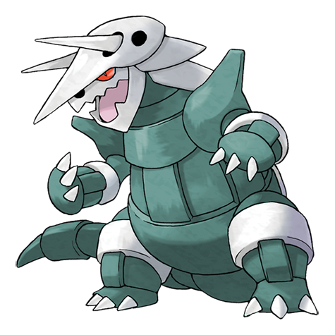

# #306 Aggron (Iron Armor Pokémon)

| Official Artwork | Shiny Artwork |
|------------------|---------------|
|  |  |

While seeking iron for food, it digs tunnels by breaking through bedrock with its steel horns.

---

## Media

### Default Sprites

| Front | Shiny | Back | Shiny |
|-------|-------|------|-------|
|  |  |  |  |

### Cries

Latest (Gen VI+):

<audio controls>
<source src='../../assets/cries/aggron/latest.ogg' type='audio/ogg'>
  Your browser does not support the audio element.
</audio>

Legacy:

<audio controls>
<source src='../../assets/cries/aggron/legacy.ogg' type='audio/ogg'>
  Your browser does not support the audio element.
</audio>

---

## Pokédex Data

| National № | Type(s) | Height | Weight | Abilities | Local № |
|------------|---------|--------|--------|-----------|---------|
| #306 | {: width="48"} {: width="48"} | 2.1 m / 6.9 ft | 360.0 kg / 793.7 lbs | 1. Sturdy 2. Rock Head | N/A |

---

## Base Stats
|   | HP | Attack | Defense | Sp. Atk | Sp. Def | Speed |
|---|----|--------|---------|---------|---------|-------|
| **Base** | 70 | 110 | 180 | 60 | 60 | 50 |
| **Min** | 250 | 202 | 328 | 112 | 112 | 94 |
| **Max** | 344 | 350 | 504 | 240 | 240 | 218 |

The ranges shown above are for a level 100 Pokémon. Maximum values are based on a beneficial nature, 252 EVs, 31 IVs; minimum values are based on a hindering nature, 0 EVs, 0 IVs.

---

## Forms & Evolutions

!!! warning "WARNING"

    Information on evolutions may not be 100% accurate; differences between evolution methods across generations are not accounted for.

### Forms

Aggron has no alternate forms.

### Evolution Line

1. [Aron](aron.md/)
    1. Level Up: [Lairon](lairon.md/)
        1. Level Up: [Aggron](aggron.md/)

---

## Training

| EV Yield | Catch Rate | Base Friendship | Base Exp. | Growth Rate | Held Items |
|----------|------------|-----------------|-----------|-------------|------------|
| 3 Def | 45 | 35 | 265 | Slow | Hard Stone (5%) |

---

## Breeding

| Egg Groups | Egg Cycles | Gender | Dimorphic | Color | Shape |
|------------|------------|--------|-----------|-------|-------|
| 1. Monster | 35 | 50.0% Male 50.0% Female | False | Gray | Upright |

---

## Moves

!!! warning "WARNING"

    Specific move information may be incorrect. However, the general movepool should be accurate; this includes changes made in Blaze Black and Volt White.

### Level Up Moves

| Lv. | Move | Type | Cat. | Power | Acc. | PP |
| --- | --- | --- | --- | --- | --- | --- |
| 1 | Bullet Punch | {: width="48"} | {: width="36"} | 40 | 100 | 30 |
| 1 | Harden | {: width="48"} | {: width="36"} | — | — | 30 |
| 1 | Head Smash | {: width="48"} | {: width="36"} | 150 | 80 | 5 |
| 1 | Headbutt | {: width="48"} | {: width="36"} | 70 | 100 | 15 |
| 1 | Mud Slap | {: width="48"} | {: width="36"} | 20 | 100 | 10 |
| 1 | Superpower | {: width="48"} | {: width="36"} | 120 | 100 | 5 |
| 1 | Tackle | {: width="48"} | {: width="36"} | 40 | 100 | 35 |
| 4 | Harden | {: width="48"} | {: width="36"} | — | — | 30 |
| 8 | Mud Slap | {: width="48"} | {: width="36"} | 20 | 100 | 10 |
| 11 | Headbutt | {: width="48"} | {: width="36"} | 70 | 100 | 15 |
| 15 | Metal Claw | {: width="48"} | {: width="36"} | 50 | 95 | 35 |
| 18 | Iron Defense | {: width="48"} | {: width="36"} | — | — | 15 |
| 22 | Roar | {: width="48"} | {: width="36"} | — | — | 20 |
| 25 | Take Down | {: width="48"} | {: width="36"} | 90 | 85 | 20 |
| 29 | Iron Head | {: width="48"} | {: width="36"} | 80 | 100 | 15 |
| 34 | Protect | {: width="48"} | {: width="36"} | — | — | 10 |
| 40 | Metal Sound | {: width="48"} | {: width="36"} | — | 85 | 40 |
| 48 | Iron Tail | {: width="48"} | {: width="36"} | 100 | 75 | 15 |
| 57 | Autotomize | {: width="48"} | {: width="36"} | — | — | 15 |
| 65 | Heavy Slam | {: width="48"} | {: width="36"} | — | 100 | 10 |
| 74 | Double Edge | {: width="48"} | {: width="36"} | 120 | 100 | 15 |
| 82 | Metal Burst | {: width="48"} | {: width="36"} | — | 100 | 10 |

### TM Moves

| TM | Move | Type | Cat. | Power | Acc. | PP |
| --- | --- | --- | --- | --- | --- | --- |
| HM01 | Cut | {: width="48"} | {: width="36"} | 60 | 100% | 25 |
| HM03 | Surf | {: width="48"} | {: width="36"} | 90 | 100 | 15 |
| HM04 | Strength | {: width="48"} | {: width="36"} | 100 | 100 | 15 |
| TM01 | Hone Claws | {: width="48"} | {: width="36"} | — | — | 15 |
| TM02 | Dragon Claw | {: width="48"} | {: width="36"} | 80 | 100 | 15 |
| TM05 | Roar | {: width="48"} | {: width="36"} | — | — | 20 |
| TM06 | Toxic | {: width="48"} | {: width="36"} | — | 90 | 10 |
| TM10 | Hidden Power | {: width="48"} | {: width="36"} | 60 | 100 | 15 |
| TM11 | Sunny Day | {: width="48"} | {: width="36"} | — | — | 5 |
| TM12 | Taunt | {: width="48"} | {: width="36"} | — | 100 | 20 |
| TM13 | Ice Beam | {: width="48"} | {: width="36"} | 90 | 100 | 10 |
| TM14 | Blizzard | {: width="48"} | {: width="36"} | 110 | 70 | 5 |
| TM15 | Hyper Beam | {: width="48"} | {: width="36"} | 150 | 90 | 5 |
| TM17 | Protect | {: width="48"} | {: width="36"} | — | — | 10 |
| TM18 | Rain Dance | {: width="48"} | {: width="36"} | — | — | 5 |
| TM21 | Frustration | {: width="48"} | {: width="36"} | — | 100 | 20 |
| TM22 | Solar Beam | {: width="48"} | {: width="36"} | 120 | 100 | 10 |
| TM23 | Smack Down | {: width="48"} | {: width="36"} | 50 | 100 | 15 |
| TM24 | Thunderbolt | {: width="48"} | {: width="36"} | 90 | 100 | 15 |
| TM25 | Thunder | {: width="48"} | {: width="36"} | 110 | 70 | 10 |
| TM26 | Earthquake | {: width="48"} | {: width="36"} | 100 | 100 | 10 |
| TM27 | Return | {: width="48"} | {: width="36"} | — | 100 | 20 |
| TM28 | Dig | {: width="48"} | {: width="36"} | 100 | 100 | 10 |
| TM31 | Brick Break | {: width="48"} | {: width="36"} | 75 | 100 | 15 |
| TM32 | Double Team | {: width="48"} | {: width="36"} | — | — | 15 |
| TM35 | Flamethrower | {: width="48"} | {: width="36"} | 90 | 100 | 15 |
| TM37 | Sandstorm | {: width="48"} | {: width="36"} | — | — | 10 |
| TM38 | Fire Blast | {: width="48"} | {: width="36"} | 110 | 85 | 5 |
| TM39 | Rock Tomb | {: width="48"} | {: width="36"} | 60 | 95 | 15 |
| TM40 | Aerial Ace | {: width="48"} | {: width="36"} | 60 | — | 20 |
| TM42 | Facade | {: width="48"} | {: width="36"} | 70 | 100 | 20 |
| TM44 | Rest | {: width="48"} | {: width="36"} | — | — | 5 |
| TM45 | Attract | {: width="48"} | {: width="36"} | — | 100 | 15 |
| TM48 | Round | {: width="48"} | {: width="36"} | 60 | 100 | 15 |
| TM52 | Focus Blast | {: width="48"} | {: width="36"} | 120 | 70 | 5 |
| TM56 | Fling | {: width="48"} | {: width="36"} | — | 100 | 10 |
| TM59 | Incinerate | {: width="48"} | {: width="36"} | 50 | 100 | 15 |
| TM65 | Shadow Claw | {: width="48"} | {: width="36"} | 80 | 100 | 15 |
| TM66 | Payback | {: width="48"} | {: width="36"} | 50 | 100 | 10 |
| TM68 | Giga Impact | {: width="48"} | {: width="36"} | 150 | 90 | 5 |
| TM69 | Rock Polish | {: width="48"} | {: width="36"} | — | — | 20 |
| TM71 | Stone Edge | {: width="48"} | {: width="36"} | 100 | 80 | 5 |
| TM73 | Thunder Wave | {: width="48"} | {: width="36"} | — | 90 | 20 |
| TM78 | Bulldoze | {: width="48"} | {: width="36"} | 80 | 100 | 20 |
| TM80 | Rock Slide | {: width="48"} | {: width="36"} | 75 | 90 | 10 |
| TM82 | Dragon Tail | {: width="48"} | {: width="36"} | 60 | 90 | 10 |
| TM87 | Swagger | {: width="48"} | {: width="36"} | — | 85 | 15 |
| TM90 | Substitute | {: width="48"} | {: width="36"} | — | — | 10 |
| TM91 | Flash Cannon | {: width="48"} | {: width="36"} | 80 | 100 | 10 |
| TM94 | Rock Smash | {: width="48"} | {: width="36"} | 60 | 100 | 15 |

### Egg Moves

Aggron cannot learn any moves by breeding.
### Tutor Moves

Aggron cannot learn any moves from tutors.
