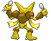
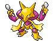
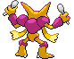
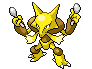
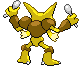
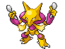
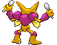

# Alakazam (Psi Pokémon)

| Official Artwork | Shiny Artwork |
| --- | --- |
|  |  |

The spoons clutched in its hands are said to have been created by its psychic powers.

---

## Media

### Default Sprites

| Front | Back | Front Shiny | Back Shiny |
| --- | --- | --- | --- |
|  |  |  |  |

### Female Sprites

| Front | Back | Front Shiny | Back Shiny |
| --- | --- | --- | --- |
|  |  |  |  |

### Cries

Latest (Gen VI+):

<audio controls>
<source src='../../assets/cries/alakazam/latest.ogg' type='audio/ogg'>
  Your browser does not support the audio element.
</audio>

Legacy:

<audio controls>
<source src='../../assets/cries/alakazam/legacy.ogg' type='audio/ogg'>
  Your browser does not support the audio element.
</audio>

---

## Pokédex Data

| National № | Type(s) | Height | Weight | Abilities | Local № |
|------------|---------|--------|--------|-----------|---------|
| #65 | {: width='48'} | 1.5 m | 48.0 kg | 1. Synchronize 2. Magic-Guard | N/A |

---

## Base Stats
|   | HP | Attack | Defense | Sp. Atk | Sp. Def | Speed |
|---|----|--------|---------|---------|---------|-------|
| **Base** | 55 | 50 | 45 | 135 | 95 | 120 |
| **Min** | 220 | 94 | 85 | 247 | 175 | 220 |
| **Max** | 314 | 218 | 207 | 405 | 317 | 372 |

The ranges shown above are for a level 100 Pokémon. Maximum values are based on a beneficial nature, 252 EVs, 31 IVs; minimum values are based on a hindering nature, 0 EVs, 0 IVs.

---

## Forms & Evolutions

!!! warning "WARNING"

    Information on evolutions may not be 100% accurate; differences between evolution methods across generations are not accounted for.

### Forms

Alakazam has no alternate forms.

### Evolution Line

1. [Abra](abra.md/)
    1. Level Up: [Kadabra](kadabra.md/)
        1. Trade: [Alakazam](alakazam.md/)

---

## Training

| EV Yield | Catch Rate | Base Friendship | Base Exp. | Growth Rate | Held Items |
|----------|------------|-----------------|-----------|-------------|------------|
| 3 Special Attack | 50 | 50 | 250 | Medium-Slow | twisted-spoon (5%) |

---

## Breeding

| Egg Groups | Egg Cycles | Gender | Dimorphic | Color | Shape |
|------------|------------|--------|-----------|-------|-------|
| 1. Humanshape | 20 | 75.0% Male 25.0% Female | True | Brown | Humanoid |

---

## Moves

!!! warning "WARNING"

    Specific move information may be incorrect. However, the general movepool should be accurate; this includes changes made in Blaze Black and Volt White.

### Level Up Moves

| Lv. | Move | Type | Cat. | Power | Acc. | PP |
| --- | --- | --- | --- | --- | --- | --- |
| 1 | Confusion | {: width='48'} | {: width='36'} | 50 | 100 | 25 |
| 1 | Kinesis | {: width='48'} | {: width='36'} | — | 80 | 15 |
| 1 | Teleport | {: width='48'} | {: width='36'} | — | — | 20 |
| 16 | Confusion | {: width='48'} | {: width='36'} | 50 | 100 | 25 |
| 18 | Disable | {: width='48'} | {: width='36'} | — | 100 | 20 |
| 20 | Shock Wave | {: width='48'} | {: width='36'} | 70 | — | 20 |
| 22 | Miracle Eye | {: width='48'} | {: width='36'} | — | — | 40 |
| 24 | Ally Switch | {: width='48'} | {: width='36'} | — | — | 15 |
| 28 | Psybeam | {: width='48'} | {: width='36'} | 65 | 100 | 20 |
| 30 | Reflect | {: width='48'} | {: width='36'} | — | — | 20 |
| 32 | Gravity | {: width='48'} | {: width='36'} | — | — | 5 |
| 34 | Telekinesis | {: width='48'} | {: width='36'} | — | — | 15 |
| 36 | Recover | {: width='48'} | {: width='36'} | — | — | 5 |
| 40 | Psycho Cut | {: width='48'} | {: width='36'} | 70 | 100 | 20 |
| 42 | Calm Mind | {: width='48'} | {: width='36'} | — | — | 20 |
| 46 | Psychic | {: width='48'} | {: width='36'} | 90 | 100 | 10 |
| 48 | Future Sight | {: width='48'} | {: width='36'} | 120 | 100 | 10 |
| 52 | Trick | {: width='48'} | {: width='36'} | — | 100 | 10 |
| 56 | Aura Sphere | {: width='48'} | {: width='36'} | 80 | — | 20 |

### TM Moves

| TM | Move | Type | Cat. | Power | Acc. | PP |
| --- | --- | --- | --- | --- | --- | --- |
| TM03 | Psyshock | {: width='48'} | {: width='36'} | 80 | 100 | 10 |
| TM04 | Calm Mind | {: width='48'} | {: width='36'} | — | — | 20 |
| TM06 | Toxic | {: width='48'} | {: width='36'} | — | 90 | 10 |
| TM10 | Hidden Power | {: width='48'} | {: width='36'} | 60 | 100 | 15 |
| TM11 | Sunny Day | {: width='48'} | {: width='36'} | — | — | 5 |
| TM12 | Taunt | {: width='48'} | {: width='36'} | — | 100 | 20 |
| TM15 | Hyper Beam | {: width='48'} | {: width='36'} | 150 | 90 | 5 |
| TM16 | Light Screen | {: width='48'} | {: width='36'} | — | — | 30 |
| TM17 | Protect | {: width='48'} | {: width='36'} | — | — | 10 |
| TM18 | Rain Dance | {: width='48'} | {: width='36'} | — | — | 5 |
| TM19 | Telekinesis | {: width='48'} | {: width='36'} | — | — | 15 |
| TM20 | Safeguard | {: width='48'} | {: width='36'} | — | — | 25 |
| TM21 | Frustration | {: width='48'} | {: width='36'} | — | 100 | 20 |
| TM27 | Return | {: width='48'} | {: width='36'} | — | 100 | 20 |
| TM29 | Psychic | {: width='48'} | {: width='36'} | 90 | 100 | 10 |
| TM30 | Shadow Ball | {: width='48'} | {: width='36'} | 90 | 100 | 15 |
| TM32 | Double Team | {: width='48'} | {: width='36'} | — | — | 15 |
| TM33 | Reflect | {: width='48'} | {: width='36'} | — | — | 20 |
| TM41 | Torment | {: width='48'} | {: width='36'} | — | 100 | 15 |
| TM42 | Facade | {: width='48'} | {: width='36'} | 70 | 100 | 20 |
| TM44 | Rest | {: width='48'} | {: width='36'} | — | — | 5 |
| TM45 | Attract | {: width='48'} | {: width='36'} | — | 100 | 15 |
| TM46 | Thief | {: width='48'} | {: width='36'} | 60 | 100 | 25 |
| TM48 | Round | {: width='48'} | {: width='36'} | 60 | 100 | 15 |
| TM51 | Ally Switch | {: width='48'} | {: width='36'} | — | — | 15 |
| TM52 | Focus Blast | {: width='48'} | {: width='36'} | 120 | 70 | 5 |
| TM53 | Energy Ball | {: width='48'} | {: width='36'} | 90 | 100 | 10 |
| TM56 | Fling | {: width='48'} | {: width='36'} | — | 100 | 10 |
| TM57 | Charge Beam | {: width='48'} | {: width='36'} | 50 | 90 | 10 |
| TM63 | Embargo | {: width='48'} | {: width='36'} | — | 100 | 15 |
| TM68 | Giga Impact | {: width='48'} | {: width='36'} | 150 | 90 | 5 |
| TM70 | Flash | {: width='48'} | {: width='36'} | — | 100 | 20 |
| TM73 | Thunder Wave | {: width='48'} | {: width='36'} | — | 90 | 20 |
| TM77 | Psych Up | {: width='48'} | {: width='36'} | — | — | 10 |
| TM85 | Dream Eater | {: width='48'} | {: width='36'} | 100 | 100 | 15 |
| TM86 | Grass Knot | {: width='48'} | {: width='36'} | — | 100 | 20 |
| TM87 | Swagger | {: width='48'} | {: width='36'} | — | 85 | 15 |
| TM90 | Substitute | {: width='48'} | {: width='36'} | — | — | 10 |
| TM92 | Trick Room | {: width='48'} | {: width='36'} | — | — | 5 |

### Egg Moves

Alakazam cannot learn any moves by breeding.
### Tutor Moves

Alakazam cannot learn any moves from tutors.
