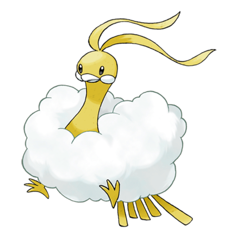

# #334 Altaria (Humming Pokémon)

| Official Artwork | Shiny Artwork |
| --- | --- |
|  |  |

If it bonds with a person, it will gently envelop the friend with its soft wings, then hum.

---

## Media

### Sprites

| Front | Back | Front Shiny | Back Shiny |
| --- | --- | --- | --- |
|  |  |  |  |

### Cries

Latest (Gen VI+):

<audio controls>
<source src='../../assets/cries/altaria/latest.ogg' type='audio/ogg'>
  Your browser does not support the audio element.
</audio>

Legacy:

<audio controls>
<source src='../../assets/cries/altaria/legacy.ogg' type='audio/ogg'>
  Your browser does not support the audio element.
</audio>

---

## Pokédex Data

| National № | Type(s) | Height | Weight | Abilities | Local № |
|------------|---------|--------|--------|-----------|---------|
| #334 | {: width='48'} {: width='48'} | 1.1 m | 20.6 kg | 1. Natural-Cure 2. Cloud-Nine | N/A |

---

## Base Stats
|   | HP | Attack | Defense | Sp. Atk | Sp. Def | Speed |
|---|----|--------|---------|---------|---------|-------|
| **Base** | 75 | 70 | 90 | 100 | 105 | 80 |
| **Min** | 260 | 130 | 166 | 184 | 193 | 148 |
| **Max** | 354 | 262 | 306 | 328 | 339 | 284 |

The ranges shown above are for a level 100 Pokémon. Maximum values are based on a beneficial nature, 252 EVs, 31 IVs; minimum values are based on a hindering nature, 0 EVs, 0 IVs.

---

## Forms & Evolutions

!!! warning "WARNING"

    Information on evolutions may not be 100% accurate; differences between evolution methods across generations are not accounted for.

### Forms

Altaria has no alternate forms.

### Evolution Line

1. [Swablu](swablu.md/)
    1. Level Up: [Altaria](altaria.md/)

### Evolution Changes

---

## Training

| EV Yield | Catch Rate | Base Friendship | Base Exp. | Growth Rate | Held Items |
|----------|------------|-----------------|-----------|-------------|------------|
| 2 Special Defense | 45 | 50 | 172 | Slow-Then-Very-Fast | N/A |

---

## Breeding

| Egg Groups | Egg Cycles | Gender | Dimorphic | Color | Shape |
|------------|------------|--------|-----------|-------|-------|
| 1. Flying 2. Dragon | 20 | 50.0% Male 50.0% Female | False | Blue | Wings |

---

## Moves

!!! warning "WARNING"

    Specific move information may be incorrect. However, the general movepool should be accurate; this includes changes made in Blaze Black and Volt White.

### Level Up Moves

| Lv. | Move | Type | Cat. | Power | Acc. | PP |
| --- | --- | --- | --- | --- | --- | --- |
| 1 | Astonish | {: width='48'} | {: width='36'} | 30 | 100 | 15 |
| 1 | Growl | {: width='48'} | {: width='36'} | — | 100 | 40 |
| 1 | Peck | {: width='48'} | {: width='36'} | 35 | 100 | 35 |
| 1 | Pluck | {: width='48'} | {: width='36'} | 60 | 100 | 20 |
| 1 | Roost | {: width='48'} | {: width='36'} | — | — | 5 |
| 1 | Sing | {: width='48'} | {: width='36'} | — | 55 | 15 |
| 5 | Astonish | {: width='48'} | {: width='36'} | 30 | 100 | 15 |
| 9 | Sing | {: width='48'} | {: width='36'} | — | 55 | 15 |
| 13 | Fury Attack | {: width='48'} | {: width='36'} | 15 | 85 | 20 |
| 18 | Safeguard | {: width='48'} | {: width='36'} | — | — | 25 |
| 23 | Mist | {: width='48'} | {: width='36'} | — | — | 30 |
| 28 | Take Down | {: width='48'} | {: width='36'} | 90 | 85 | 20 |
| 32 | Natural Gift | {: width='48'} | {: width='36'} | — | 100 | 15 |
| 35 | Dragon Breath | {: width='48'} | {: width='36'} | 60 | 100 | 20 |
| 39 | Dragon Dance | {: width='48'} | {: width='36'} | — | — | 20 |
| 42 | Hyper Voice | {: width='48'} | {: width='36'} | 90 | 100 | 10 |
| 46 | Cotton Guard | {: width='48'} | {: width='36'} | — | — | 10 |
| 50 | Outrage | {: width='48'} | {: width='36'} | 120 | 100 | 10 |
| 54 | Refresh | {: width='48'} | {: width='36'} | — | — | 20 |
| 62 | Dragon Pulse | {: width='48'} | {: width='36'} | 85 | 100 | 10 |
| 70 | Perish Song | {: width='48'} | {: width='36'} | — | — | 5 |
| 77 | Sky Attack | {: width='48'} | {: width='36'} | 140 | 90 | 5 |

### TM Moves

| TM | Move | Type | Cat. | Power | Acc. | PP |
| --- | --- | --- | --- | --- | --- | --- |
| HM02 | Fly | {: width='48'} | {: width='36'} | 100 | 100 | 15 |
| TM01 | Hone Claws | {: width='48'} | {: width='36'} | — | — | 15 |
| TM02 | Dragon Claw | {: width='48'} | {: width='36'} | 80 | 100 | 15 |
| TM05 | Roar | {: width='48'} | {: width='36'} | — | — | 20 |
| TM06 | Toxic | {: width='48'} | {: width='36'} | — | 90 | 10 |
| TM10 | Hidden Power | {: width='48'} | {: width='36'} | 60 | 100 | 15 |
| TM11 | Sunny Day | {: width='48'} | {: width='36'} | — | — | 5 |
| TM13 | Ice Beam | {: width='48'} | {: width='36'} | 90 | 100 | 10 |
| TM15 | Hyper Beam | {: width='48'} | {: width='36'} | 150 | 90 | 5 |
| TM17 | Protect | {: width='48'} | {: width='36'} | — | — | 10 |
| TM18 | Rain Dance | {: width='48'} | {: width='36'} | — | — | 5 |
| TM20 | Safeguard | {: width='48'} | {: width='36'} | — | — | 25 |
| TM21 | Frustration | {: width='48'} | {: width='36'} | — | 100 | 20 |
| TM22 | Solar Beam | {: width='48'} | {: width='36'} | 120 | 100 | 10 |
| TM26 | Earthquake | {: width='48'} | {: width='36'} | 100 | 100 | 10 |
| TM27 | Return | {: width='48'} | {: width='36'} | — | 100 | 20 |
| TM32 | Double Team | {: width='48'} | {: width='36'} | — | — | 15 |
| TM35 | Flamethrower | {: width='48'} | {: width='36'} | 90 | 100 | 15 |
| TM38 | Fire Blast | {: width='48'} | {: width='36'} | 110 | 85 | 5 |
| TM40 | Aerial Ace | {: width='48'} | {: width='36'} | 60 | — | 20 |
| TM42 | Facade | {: width='48'} | {: width='36'} | 70 | 100 | 20 |
| TM44 | Rest | {: width='48'} | {: width='36'} | — | — | 5 |
| TM45 | Attract | {: width='48'} | {: width='36'} | — | 100 | 15 |
| TM46 | Thief | {: width='48'} | {: width='36'} | 60 | 100 | 25 |
| TM48 | Round | {: width='48'} | {: width='36'} | 60 | 100 | 15 |
| TM49 | Echoed Voice | {: width='48'} | {: width='36'} | 40 | 100 | 15 |
| TM58 | Sky Drop | {: width='48'} | {: width='36'} | 80 | 100 | 10 |
| TM58 | Sky Drop | {: width='48'} | {: width='36'} | 80 | 100 | 10 |
| TM58 | Sky Drop | {: width='48'} | {: width='36'} | 80 | 100 | 10 |
| TM58 | Sky Drop | {: width='48'} | {: width='36'} | 80 | 100 | 10 |
| TM58 | Sky Drop | {: width='48'} | {: width='36'} | 80 | 100 | 10 |
| TM58 | Sky Drop | {: width='48'} | {: width='36'} | 80 | 100 | 10 |
| TM58 | Sky Drop | {: width='48'} | {: width='36'} | 80 | 100 | 10 |
| TM58 | Sky Drop | {: width='48'} | {: width='36'} | 80 | 100 | 10 |
| TM58 | Sky Drop | {: width='48'} | {: width='36'} | 80 | 100 | 10 |
| TM58 | Sky Drop | {: width='48'} | {: width='36'} | 80 | 100 | 10 |
| TM58 | Sky Drop | {: width='48'} | {: width='36'} | 80 | 100 | 10 |
| TM58 | Sky Drop | {: width='48'} | {: width='36'} | 80 | 100 | 10 |
| TM58 | Sky Drop | {: width='48'} | {: width='36'} | 80 | 100 | 10 |
| TM58 | Sky Drop | {: width='48'} | {: width='36'} | 80 | 100 | 10 |
| TM58 | Sky Drop | {: width='48'} | {: width='36'} | 80 | 100 | 10 |
| TM58 | Sky Drop | {: width='48'} | {: width='36'} | 80 | 100 | 10 |
| TM58 | Sky Drop | {: width='48'} | {: width='36'} | 80 | 100 | 10 |
| TM58 | Sky Drop | {: width='48'} | {: width='36'} | 80 | 100 | 10 |
| TM59 | Incinerate | {: width='48'} | {: width='36'} | 50 | 100 | 15 |
| TM62 | Acrobatics | {: width='48'} | {: width='36'} | 55 | 100 | 15 |
| TM62 | Acrobatics | {: width='48'} | {: width='36'} | 55 | 100 | 15 |
| TM62 | Acrobatics | {: width='48'} | {: width='36'} | 55 | 100 | 15 |
| TM62 | Acrobatics | {: width='48'} | {: width='36'} | 55 | 100 | 15 |
| TM62 | Acrobatics | {: width='48'} | {: width='36'} | 55 | 100 | 15 |
| TM62 | Acrobatics | {: width='48'} | {: width='36'} | 55 | 100 | 15 |
| TM62 | Acrobatics | {: width='48'} | {: width='36'} | 55 | 100 | 15 |
| TM62 | Acrobatics | {: width='48'} | {: width='36'} | 55 | 100 | 15 |
| TM62 | Acrobatics | {: width='48'} | {: width='36'} | 55 | 100 | 15 |
| TM62 | Acrobatics | {: width='48'} | {: width='36'} | 55 | 100 | 15 |
| TM62 | Acrobatics | {: width='48'} | {: width='36'} | 55 | 100 | 15 |
| TM62 | Acrobatics | {: width='48'} | {: width='36'} | 55 | 100 | 15 |
| TM62 | Acrobatics | {: width='48'} | {: width='36'} | 55 | 100 | 15 |
| TM62 | Acrobatics | {: width='48'} | {: width='36'} | 55 | 100 | 15 |
| TM62 | Acrobatics | {: width='48'} | {: width='36'} | 55 | 100 | 15 |
| TM62 | Acrobatics | {: width='48'} | {: width='36'} | 55 | 100 | 15 |
| TM62 | Acrobatics | {: width='48'} | {: width='36'} | 55 | 100 | 15 |
| TM62 | Acrobatics | {: width='48'} | {: width='36'} | 55 | 100 | 15 |
| TM68 | Giga Impact | {: width='48'} | {: width='36'} | 150 | 90 | 5 |
| TM77 | Psych Up | {: width='48'} | {: width='36'} | — | — | 10 |
| TM78 | Bulldoze | {: width='48'} | {: width='36'} | 80 | 100 | 20 |
| TM85 | Dream Eater | {: width='48'} | {: width='36'} | 100 | 100 | 15 |
| TM87 | Swagger | {: width='48'} | {: width='36'} | — | 85 | 15 |
| TM88 | Pluck | {: width='48'} | {: width='36'} | 60 | 100 | 20 |
| TM90 | Substitute | {: width='48'} | {: width='36'} | — | — | 10 |
| TM94 | Rock Smash | {: width='48'} | {: width='36'} | 40 | 100 | 15 |

### Egg Moves

Altaria cannot learn any moves by breeding.
### Tutor Moves

| Move | Type | Cat. | Power | Acc. | PP |
| --- | --- | --- | --- | --- | --- |
| Draco Meteor | {: width='48'} | {: width='36'} | 130 | 90 | 5 |

