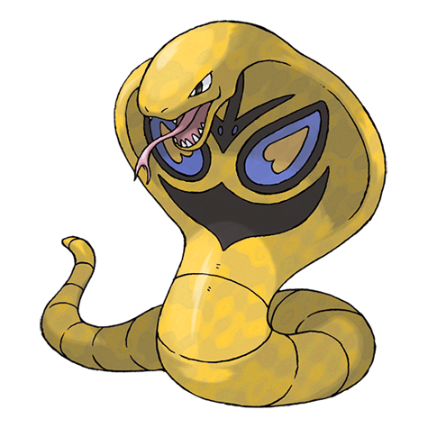
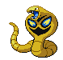
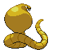

# #024 Arbok (Cobra Pokémon)

| Official Artwork | Shiny Artwork |
|------------------|---------------|
|  |  |

The pattern on its belly is for intimidation. It constricts foes while they are frozen in fear.

---

## Media

### Default Sprites

| Front | Shiny | Back | Shiny |
|-------|-------|------|-------|
|  |  |  |  |

### Cries

Latest (Gen VI+):

<audio controls>
<source src='../../assets/cries/arbok/latest.ogg' type='audio/ogg'>
  Your browser does not support the audio element.
</audio>

Legacy:

<audio controls>
<source src='../../assets/cries/arbok/legacy.ogg' type='audio/ogg'>
  Your browser does not support the audio element.
</audio>

---

## Pokédex Data

| National № | Type(s) | Height | Weight | Abilities | Local № |
|------------|---------|--------|--------|-----------|---------|
| #24 | {: width="48"} | 3.5 m / 11.5 ft | 65.0 kg / 143.3 lbs | 1. Intimidate 2. Shed Skin | N/A |

---

## Base Stats
|   | HP | Attack | Defense | Sp. Atk | Sp. Def | Speed |
|---|----|--------|---------|---------|---------|-------|
| **Base** | 60 | 96 | 69 | 80 | 79 | 87 |
| **Min** | 230 | 177 | 128 | 148 | 146 | 161 |
| **Max** | 324 | 320 | 260 | 284 | 282 | 300 |

The ranges shown above are for a level 100 Pokémon. Maximum values are based on a beneficial nature, 252 EVs, 31 IVs; minimum values are based on a hindering nature, 0 EVs, 0 IVs.

---

## Forms & Evolutions

!!! warning "WARNING"

    Information on evolutions may not be 100% accurate; differences between evolution methods across generations are not accounted for.

### Forms

Arbok has no alternate forms.

### Evolution Line

1. [Ekans](ekans.md/)
    1. Level Up: [Arbok](arbok.md/)

---

## Training

| EV Yield | Catch Rate | Base Friendship | Base Exp. | Growth Rate | Held Items |
|----------|------------|-----------------|-----------|-------------|------------|
| 2 Atk | 90 | 70 | 157 | Medium | Kebia Berry (50%) |

---

## Breeding

| Egg Groups | Egg Cycles | Gender | Dimorphic | Color | Shape |
|------------|------------|--------|-----------|-------|-------|
| 1. Ground 2. Dragon | 20 | 50.0% Male 50.0% Female | False | Purple | Squiggle |

---

## Moves

!!! warning "WARNING"

    Specific move information may be incorrect. However, the general movepool should be accurate; this includes changes made in Blaze Black and Volt White.

### Level Up Moves

| Lv. | Move | Type | Cat. | Power | Acc. | PP |
| --- | --- | --- | --- | --- | --- | --- |
| 1 | Bite | {: width="48"} | {: width="36"} | 60 | 100 | 25 |
| 1 | Fire Fang | {: width="48"} | {: width="36"} | 75 | 95 | 15 |
| 1 | Ice Fang | {: width="48"} | {: width="36"} | 75 | 95 | 15 |
| 1 | Leer | {: width="48"} | {: width="36"} | — | 100 | 30 |
| 1 | Poison Sting | {: width="48"} | {: width="36"} | 15 | 100 | 35 |
| 1 | Thunder Fang | {: width="48"} | {: width="36"} | 75 | 95 | 15 |
| 1 | Wrap | {: width="48"} | {: width="36"} | 15 | 90 | 20 |
| 4 | Poison Sting | {: width="48"} | {: width="36"} | 15 | 100 | 35 |
| 9 | Bite | {: width="48"} | {: width="36"} | 60 | 100 | 25 |
| 12 | Glare | {: width="48"} | {: width="36"} | — | 100 | 30 |
| 17 | Screech | {: width="48"} | {: width="36"} | — | 85 | 40 |
| 20 | Acid | {: width="48"} | {: width="36"} | 40 | 100 | 30 |
| 22 | Crunch | {: width="48"} | {: width="36"} | 80 | 100 | 15 |
| 23 | Poison Tail | {: width="48"} | {: width="36"} | 90 | 100 | 15 |
| 27 | Spit Up | {: width="48"} | {: width="36"} | — | 100 | 10 |
| 27 | Stockpile | {: width="48"} | {: width="36"} | — | — | 20 |
| 27 | Swallow | {: width="48"} | {: width="36"} | — | — | 10 |
| 32 | Acid Spray | {: width="48"} | {: width="36"} | 40 | 100 | 20 |
| 39 | Mud Bomb | {: width="48"} | {: width="36"} | 65 | 85 | 10 |
| 44 | Gastro Acid | {: width="48"} | {: width="36"} | — | 100 | 10 |
| 51 | Haze | {: width="48"} | {: width="36"} | — | — | 30 |
| 56 | Coil | {: width="48"} | {: width="36"} | — | — | 20 |
| 63 | Gunk Shot | {: width="48"} | {: width="36"} | 120 | 80 | 5 |

### TM Moves

| TM | Move | Type | Cat. | Power | Acc. | PP |
| --- | --- | --- | --- | --- | --- | --- |
| HM04 | Strength | {: width="48"} | {: width="36"} | 100 | 100 | 15 |
| TM06 | Toxic | {: width="48"} | {: width="36"} | — | 90 | 10 |
| TM09 | Venoshock | {: width="48"} | {: width="36"} | 65 | 100 | 10 |
| TM10 | Hidden Power | {: width="48"} | {: width="36"} | 60 | 100 | 15 |
| TM11 | Sunny Day | {: width="48"} | {: width="36"} | — | — | 5 |
| TM15 | Hyper Beam | {: width="48"} | {: width="36"} | 150 | 90 | 5 |
| TM17 | Protect | {: width="48"} | {: width="36"} | — | — | 10 |
| TM18 | Rain Dance | {: width="48"} | {: width="36"} | — | — | 5 |
| TM21 | Frustration | {: width="48"} | {: width="36"} | — | 100 | 20 |
| TM26 | Earthquake | {: width="48"} | {: width="36"} | 100 | 100 | 10 |
| TM27 | Return | {: width="48"} | {: width="36"} | — | 100 | 20 |
| TM28 | Dig | {: width="48"} | {: width="36"} | 100 | 100 | 10 |
| TM32 | Double Team | {: width="48"} | {: width="36"} | — | — | 15 |
| TM34 | Sludge Wave | {: width="48"} | {: width="36"} | 95 | 100 | 10 |
| TM36 | Sludge Bomb | {: width="48"} | {: width="36"} | 90 | 100 | 10 |
| TM39 | Rock Tomb | {: width="48"} | {: width="36"} | 60 | 95 | 15 |
| TM41 | Torment | {: width="48"} | {: width="36"} | — | 100 | 15 |
| TM42 | Facade | {: width="48"} | {: width="36"} | 70 | 100 | 20 |
| TM44 | Rest | {: width="48"} | {: width="36"} | — | — | 5 |
| TM45 | Attract | {: width="48"} | {: width="36"} | — | 100 | 15 |
| TM46 | Thief | {: width="48"} | {: width="36"} | 60 | 100 | 25 |
| TM48 | Round | {: width="48"} | {: width="36"} | 60 | 100 | 15 |
| TM66 | Payback | {: width="48"} | {: width="36"} | 50 | 100 | 10 |
| TM68 | Giga Impact | {: width="48"} | {: width="36"} | 150 | 90 | 5 |
| TM78 | Bulldoze | {: width="48"} | {: width="36"} | 80 | 100 | 20 |
| TM80 | Rock Slide | {: width="48"} | {: width="36"} | 75 | 90 | 10 |
| TM82 | Dragon Tail | {: width="48"} | {: width="36"} | 60 | 90 | 10 |
| TM84 | Poison Jab | {: width="48"} | {: width="36"} | 80 | 100 | 20 |
| TM87 | Swagger | {: width="48"} | {: width="36"} | — | 85 | 15 |
| TM90 | Substitute | {: width="48"} | {: width="36"} | — | — | 10 |

### Egg Moves

Arbok cannot learn any moves by breeding.
### Tutor Moves

Arbok cannot learn any moves from tutors.
