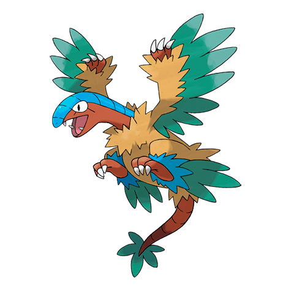
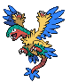
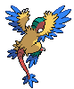
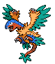
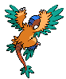

# #567 Archeops (First Bird Pokémon)

| Official Artwork | Shiny Artwork |
| --- | --- |
|  |  |

**Blaze Black:** They are intelligent and will cooperate to catch prey. From the ground, they use a running start to take flight.

**Volt White:** It runs better than it flies. It catches prey by running at speeds comparable to those of an automobile.

---

## Media

### Sprites

| Front | Back | Front Shiny | Back Shiny |
| --- | --- | --- | --- |
|  |  |  |  |

### Cries

Latest (Gen VI+):

<audio controls>
  <source src='../assets/cries/567/latest.ogg' type='audio/ogg'>
  Your browser does not support the audio element.
</audio>

Legacy:

<audio controls>
  <source src='../assets/cries/567/legacy.ogg' type='audio/ogg'>
  Your browser does not support the audio element.
</audio>

---

## Pokédex Data

| National № | Type(s) | Height | Weight | Abilities | Local № |
|------------|---------|--------|--------|-----------|---------|
| #567 | {: width='48'} {: width='48'} | 1.4 m | 32.0 kg | 1. Defeatist | #73 |

---

## Base Stats
---

## Base Stats
|   | HP | Attack | Defense | Sp. Atk | Sp. Def | Speed |
|---|----|--------|---------|---------|---------|-------|
| **Base** | 75 | 140 | 65 | 112 | 65 | 110 |
| **Min** | 260 | 256 | 121 | 206 | 121 | 202 |
| **Max** | 354 | 416 | 251 | 355 | 251 | 350 |

The ranges shown above are for a level 100 Pokémon. Maximum values are based on a beneficial nature, 252 EVs, 31 IVs; minimum values are based on a hindering nature, 0 EVs, 0 IVs.

---

## Forms & Evolutions

!!! warning "WARNING"

    Some forms may not be available in Blaze Black/Volt White. Also information on evolutions may not be 100% accurate; it is currently quite complex to track generational evolution data.

### Forms

Archeops has no alternate forms.

### Evolution Line

1. [Archen](archen.md/)
1. Level Up: [Archeops](archeops.md/)

---

## Training

| EV Yield | Catch Rate | Base Friendship | Base Exp. | Growth Rate | Held Items |
|----------|------------|-----------------|-----------|-------------|------------|
| 2 Attack | 45 | 50 | 177 | Medium | N/A |

---

## Breeding

| Egg Groups | Egg Cycles | Gender | Dimorphic | Color | Shape |
|------------|------------|--------|-----------|-------|-------|
| 1. Flying 2. Water3 | 30 | 87.5% Male 12.5% Female | False | Yellow | Wings |

---

## Moves

!!! warning "WARNING"

    Specific move information may be incorrect. However, the general movepool should be accurate (including changes to learnset).

### Level Up Moves

Lv. | Move | Type | Cat. | Power | Acc. | PP
--- | --- | --- | --- | --- | --- | ---
| 1 | Leer | {: width='48'} | {: width='36'} | — | 100 | 30 |
| 1 | Quick Attack | {: width='48'} | {: width='36'} | 40 | 100 | 30 |
| 1 | Rock Throw | {: width='48'} | {: width='36'} | 50 | 90 | 15 |
| 1 | Wing Attack | {: width='48'} | {: width='36'} | 75 | 100 | 35 |
| 5 | Rock Throw | {: width='48'} | {: width='36'} | 50 | 90 | 15 |
| 8 | Double Team | {: width='48'} | {: width='36'} | — | — | 15 |
| 11 | Scary Face | {: width='48'} | {: width='36'} | — | 100 | 10 |
| 15 | Pluck | {: width='48'} | {: width='36'} | 60 | 100 | 20 |
| 18 | Ancient Power | {: width='48'} | {: width='36'} | 60 | 100 | 5 |
| 21 | Agility | {: width='48'} | {: width='36'} | — | — | 30 |
| 25 | Quick Guard | {: width='48'} | {: width='36'} | — | — | 15 |
| 28 | Acrobatics | {: width='48'} | {: width='36'} | 55 | 100 | 15 |
| 31 | Dragon Breath | {: width='48'} | {: width='36'} | 60 | 100 | 20 |
| 35 | Crunch | {: width='48'} | {: width='36'} | 80 | 100 | 15 |
| 37 | Dragon Pulse | {: width='48'} | {: width='36'} | 85 | 100 | 10 |
| 40 | Endeavor | {: width='48'} | {: width='36'} | — | 100 | 5 |
| 45 | U Turn | {: width='48'} | {: width='36'} | 70 | 100 | 20 |
| 51 | Rock Slide | {: width='48'} | {: width='36'} | 80 | 95 | 10 |
| 56 | Dragon Claw | {: width='48'} | {: width='36'} | 80 | 100 | 15 |
| 61 | Thrash | {: width='48'} | {: width='36'} | 120 | 100 | 10 |
| 66 | Earth Power | {: width='48'} | {: width='36'} | 90 | 100 | 10 |
| 71 | Head Smash | {: width='48'} | {: width='36'} | 150 | 80 | 5 |

### TM Moves

TM | Move | Type | Cat. | Power | Acc. | PP
--- | --- | --- | --- | --- | --- | ---
| HM01 | Cut | {: width='48'} | {: width='36'} | 60 | 100 | 20 |
| HM02 | Fly | {: width='48'} | {: width='36'} | 100 | 100 | 15 |
| TM01 | Hone Claws | {: width='48'} | {: width='36'} | — | — | 15 |
| TM02 | Dragon Claw | {: width='48'} | {: width='36'} | 80 | 100 | 15 |
| TM05 | Roar | {: width='48'} | {: width='36'} | — | — | 20 |
| TM06 | Toxic | {: width='48'} | {: width='36'} | — | 90 | 10 |
| TM10 | Hidden Power | {: width='48'} | {: width='36'} | 60 | 100 | 15 |
| TM12 | Taunt | {: width='48'} | {: width='36'} | — | 100 | 20 |
| TM15 | Hyper Beam | {: width='48'} | {: width='36'} | 150 | 90 | 5 |
| TM17 | Protect | {: width='48'} | {: width='36'} | — | — | 10 |
| TM21 | Frustration | {: width='48'} | {: width='36'} | — | 100 | 20 |
| TM23 | Smack Down | {: width='48'} | {: width='36'} | 50 | 100 | 15 |
| TM26 | Earthquake | {: width='48'} | {: width='36'} | 100 | 100 | 10 |
| TM27 | Return | {: width='48'} | {: width='36'} | — | 100 | 20 |
| TM28 | Dig | {: width='48'} | {: width='36'} | 100 | 100 | 10 |
| TM32 | Double Team | {: width='48'} | {: width='36'} | — | — | 15 |
| TM37 | Sandstorm | {: width='48'} | {: width='36'} | — | — | 10 |
| TM39 | Rock Tomb | {: width='48'} | {: width='36'} | 60 | 95 | 15 |
| TM40 | Aerial Ace | {: width='48'} | {: width='36'} | 60 | — | 20 |
| TM41 | Torment | {: width='48'} | {: width='36'} | — | 100 | 15 |
| TM42 | Facade | {: width='48'} | {: width='36'} | 70 | 100 | 20 |
| TM44 | Rest | {: width='48'} | {: width='36'} | — | — | 5 |
| TM45 | Attract | {: width='48'} | {: width='36'} | — | 100 | 15 |
| TM48 | Round | {: width='48'} | {: width='36'} | 60 | 100 | 15 |
| TM52 | Focus Blast | {: width='48'} | {: width='36'} | 120 | 70 | 5 |
| TM62 | Acrobatics | {: width='48'} | {: width='36'} | 55 | 100 | 15 |
| TM65 | Shadow Claw | {: width='48'} | {: width='36'} | 80 | 100 | 15 |
| TM68 | Giga Impact | {: width='48'} | {: width='36'} | 150 | 90 | 5 |
| TM69 | Rock Polish | {: width='48'} | {: width='36'} | — | — | 20 |
| TM71 | Stone Edge | {: width='48'} | {: width='36'} | 100 | 80 | 5 |
| TM78 | Bulldoze | {: width='48'} | {: width='36'} | 80 | 100 | 20 |
| TM80 | Rock Slide | {: width='48'} | {: width='36'} | 80 | 95 | 10 |
| TM82 | Dragon Tail | {: width='48'} | {: width='36'} | 60 | 90 | 10 |
| TM87 | Swagger | {: width='48'} | {: width='36'} | — | 85 | 15 |
| TM88 | Pluck | {: width='48'} | {: width='36'} | 60 | 100 | 20 |
| TM89 | U Turn | {: width='48'} | {: width='36'} | 70 | 100 | 20 |
| TM90 | Substitute | {: width='48'} | {: width='36'} | — | — | 10 |
| TM94 | Rock Smash | {: width='48'} | {: width='36'} | 40 | 100 | 15 |

### Egg Moves

Archeops cannot learn any moves by breeding.
### Tutor Moves

Archeops cannot learn any moves from tutors.
