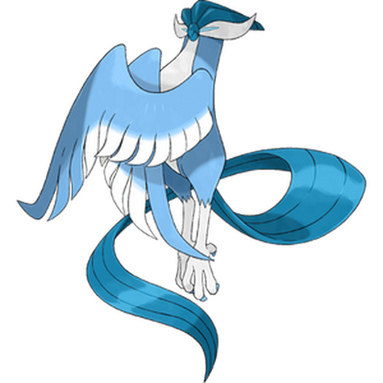
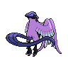
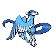
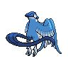

# #10169 Articuno Galar (Freeze Pokémon)

| Official Artwork | Shiny Artwork |
| --- | --- |
|  |  |

A legendary bird Pokémon. It can create blizzards by freezing moisture in the air.

---

## Media

### Sprites

| Front | Back | Front Shiny | Back Shiny |
| --- | --- | --- | --- |
|  |  |  |  |

### Cries

Latest (Gen VI+):

<audio controls>
  <source src='../assets/cries/articuno-galar/latest.ogg' type='audio/ogg'>
  Your browser does not support the audio element.
</audio>

---

## Pokédex Data

| National № | Type(s) | Height | Weight | Abilities | Local № |
|------------|---------|--------|--------|-----------|---------|
| #10169 | {: width='48'} {: width='48'} | 1.7 m | 50.9 kg | 1. Competitive | #N/A |

---

## Base Stats
---

## Base Stats
|   | HP | Attack | Defense | Sp. Atk | Sp. Def | Speed |
|---|----|--------|---------|---------|---------|-------|
| **Base** | 90 | 85 | 85 | 125 | 100 | 95 |
| **Min** | 290 | 157 | 157 | 229 | 184 | 175 |
| **Max** | 384 | 295 | 295 | 383 | 328 | 317 |

The ranges shown above are for a level 100 Pokémon. Maximum values are based on a beneficial nature, 252 EVs, 31 IVs; minimum values are based on a hindering nature, 0 EVs, 0 IVs.

---

## Forms & Evolutions

!!! warning "WARNING"

    Some forms may not be available in Blaze Black/Volt White. Also information on evolutions may not be 100% accurate; it is currently quite complex to track generational evolution data.

### Forms

1. [Articuno](articuno.md/)
2. [Articuno-Galar](articuno-galar.md/)

### Evolution Line

1. [Articuno](articuno.md/)

---

## Training

| EV Yield | Catch Rate | Base Friendship | Base Exp. | Growth Rate | Held Items |
|----------|------------|-----------------|-----------|-------------|------------|
| 3 Special Attack | 3 | 35 | 290 | Slow | N/A |

---

## Breeding

| Egg Groups | Egg Cycles | Gender | Dimorphic | Color | Shape |
|------------|------------|--------|-----------|-------|-------|
| 1. No-Eggs | 80 | Genderless | False | Blue | Wings |

---

## Moves

!!! warning "WARNING"

    Specific move information may be incorrect. However, the general movepool should be accurate (including changes to learnset).

### Level Up Moves

Lv. | Move | Type | Cat. | Power | Acc. | PP
--- | --- | --- | --- | --- | --- | ---
| 1 | Gust | {: width='48'} | {: width='36'} | 40 | 100 | 35 |
| 1 | Psycho Shift | {: width='48'} | {: width='36'} | — | 100 | 10 |
| 5 | Confusion | {: width='48'} | {: width='36'} | 50 | 100 | 25 |
| 10 | Reflect | {: width='48'} | {: width='36'} | — | — | 20 |
| 15 | Hypnosis | {: width='48'} | {: width='36'} | — | 60 | 20 |
| 20 | Agility | {: width='48'} | {: width='36'} | — | — | 30 |
| 25 | Ancient Power | {: width='48'} | {: width='36'} | 60 | 100 | 5 |
| 30 | Tailwind | {: width='48'} | {: width='36'} | — | — | 15 |
| 35 | Psycho Cut | {: width='48'} | {: width='36'} | 70 | 100 | 20 |
| 40 | Recover | {: width='48'} | {: width='36'} | — | — | 5 |
| 45 | Freezing Glare | {: width='48'} | {: width='36'} | 90 | 100 | 10 |
| 50 | Dream Eater | {: width='48'} | {: width='36'} | 100 | 100 | 15 |
| 55 | Hurricane | {: width='48'} | {: width='36'} | 110 | 70 | 10 |
| 60 | Mind Reader | {: width='48'} | {: width='36'} | — | — | 5 |
| 65 | Future Sight | {: width='48'} | {: width='36'} | 120 | 100 | 10 |
| 70 | Trick Room | {: width='48'} | {: width='36'} | — | — | 5 |

### TM Moves

TM | Move | Type | Cat. | Power | Acc. | PP
--- | --- | --- | --- | --- | --- | ---
| TM06 | Fly | {: width='48'} | {: width='36'} | 100 | 100 | 15 |
| TM08 | Hyper Beam | {: width='48'} | {: width='36'} | 150 | 90 | 5 |
| TM09 | Giga Impact | {: width='48'} | {: width='36'} | 150 | 90 | 5 |
| TM17 | Light Screen | {: width='48'} | {: width='36'} | — | — | 30 |
| TM18 | Reflect | {: width='48'} | {: width='36'} | — | — | 20 |
| TM21 | Rest | {: width='48'} | {: width='36'} | — | — | 5 |
| TM24 | Snore | {: width='48'} | {: width='36'} | 50 | 100 | 15 |
| TM25 | Protect | {: width='48'} | {: width='36'} | — | — | 10 |
| TM26 | Scary Face | {: width='48'} | {: width='36'} | — | 100 | 10 |
| TM30 | Steel Wing | {: width='48'} | {: width='36'} | 70 | 90 | 25 |
| TM39 | Facade | {: width='48'} | {: width='36'} | 70 | 100 | 20 |
| TM40 | Swift | {: width='48'} | {: width='36'} | 60 | — | 20 |
| TM44 | Imprison | {: width='48'} | {: width='36'} | — | — | 10 |
| TM56 | U Turn | {: width='48'} | {: width='36'} | 70 | 100 | 20 |
| TM60 | Power Swap | {: width='48'} | {: width='36'} | — | — | 10 |
| TM61 | Guard Swap | {: width='48'} | {: width='36'} | — | — | 10 |
| TM69 | Psycho Cut | {: width='48'} | {: width='36'} | 70 | 100 | 20 |
| TM70 | Trick Room | {: width='48'} | {: width='36'} | — | — | 5 |
| TM76 | Round | {: width='48'} | {: width='36'} | 60 | 100 | 15 |
| TM95 | Air Slash | {: width='48'} | {: width='36'} | 75 | 95 | 15 |
| TR11 | Psychic | {: width='48'} | {: width='36'} | 90 | 100 | 10 |
| TR12 | Agility | {: width='48'} | {: width='36'} | — | — | 30 |
| TR20 | Substitute | {: width='48'} | {: width='36'} | — | — | 10 |
| TR25 | Psyshock | {: width='48'} | {: width='36'} | 80 | 100 | 10 |
| TR26 | Endure | {: width='48'} | {: width='36'} | — | — | 10 |
| TR27 | Sleep Talk | {: width='48'} | {: width='36'} | — | — | 10 |
| TR33 | Shadow Ball | {: width='48'} | {: width='36'} | 90 | 100 | 15 |
| TR34 | Future Sight | {: width='48'} | {: width='36'} | 120 | 100 | 10 |
| TR40 | Skill Swap | {: width='48'} | {: width='36'} | — | — | 10 |
| TR42 | Hyper Voice | {: width='48'} | {: width='36'} | 90 | 100 | 10 |
| TR49 | Calm Mind | {: width='48'} | {: width='36'} | — | — | 20 |
| TR66 | Brave Bird | {: width='48'} | {: width='36'} | 120 | 100 | 15 |
| TR82 | Stored Power | {: width='48'} | {: width='36'} | 20 | 100 | 10 |
| TR83 | Ally Switch | {: width='48'} | {: width='36'} | — | — | 15 |
| TR89 | Hurricane | {: width='48'} | {: width='36'} | 110 | 70 | 10 |

### Egg Moves

Articuno Galar cannot learn any moves by breeding.
### Tutor Moves

Move | Type | Cat. | Power | Acc. | PP
--- | --- | --- | --- | --- | ---
| Expanding Force | {: width='48'} | {: width='36'} | 80 | 100 | 10 |
| Dual Wingbeat | {: width='48'} | {: width='36'} | 40 | 90 | 10 |

