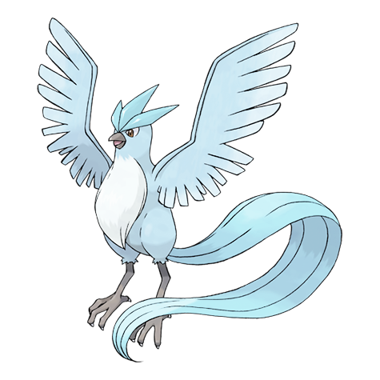
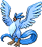

# #144 Articuno (Freeze Pokémon)

| Official Artwork | Shiny Artwork |
| --- | --- |
|  |  |

A legendary bird Pokémon. It can create blizzards by freezing moisture in the air.

---

## Media

### Default Sprites

| Front | Back | Front Shiny | Back Shiny |
| --- | --- | --- | --- |
|  |  |  |  |

### Cries

Latest (Gen VI+):

<audio controls>
<source src='../../assets/cries/articuno/latest.ogg' type='audio/ogg'>
  Your browser does not support the audio element.
</audio>

Legacy:

<audio controls>
<source src='../../assets/cries/articuno/legacy.ogg' type='audio/ogg'>
  Your browser does not support the audio element.
</audio>

---

## Pokédex Data

| National № | Type(s) | Height | Weight | Abilities | Local № |
|------------|---------|--------|--------|-----------|---------|
| #144 | {: width='48'} {: width='48'} | 1.7 m | 55.4 kg | 1. Pressure 2. Snow-Cloak | N/A |

---

## Base Stats
|   | HP | Attack | Defense | Sp. Atk | Sp. Def | Speed |
|---|----|--------|---------|---------|---------|-------|
| **Base** | 90 | 85 | 100 | 95 | 125 | 85 |
| **Min** | 290 | 157 | 184 | 175 | 229 | 157 |
| **Max** | 384 | 295 | 328 | 317 | 383 | 295 |

The ranges shown above are for a level 100 Pokémon. Maximum values are based on a beneficial nature, 252 EVs, 31 IVs; minimum values are based on a hindering nature, 0 EVs, 0 IVs.

---

## Forms & Evolutions

!!! warning "WARNING"

    Information on evolutions may not be 100% accurate; differences between evolution methods across generations are not accounted for.

### Forms

Articuno has no alternate forms.

### Evolution Line

1. [Articuno](articuno.md/)

---

## Training

| EV Yield | Catch Rate | Base Friendship | Base Exp. | Growth Rate | Held Items |
|----------|------------|-----------------|-----------|-------------|------------|
| 3 Special Defense | 3 | 35 | 290 | Slow | N/A |

---

## Breeding

| Egg Groups | Egg Cycles | Gender | Dimorphic | Color | Shape |
|------------|------------|--------|-----------|-------|-------|
| 1. No-Eggs | 80 | Genderless | False | Blue | Wings |

---

## Moves

!!! warning "WARNING"

    Specific move information may be incorrect. However, the general movepool should be accurate; this includes changes made in Blaze Black and Volt White.

### Level Up Moves

| Lv. | Move | Type | Cat. | Power | Acc. | PP |
| --- | --- | --- | --- | --- | --- | --- |
| 1 | Gust | {: width='48'} | {: width='36'} | 40 | 100 | 35 |
| 1 | Powder Snow | {: width='48'} | {: width='36'} | 40 | 100 | 25 |
| 8 | Mist | {: width='48'} | {: width='36'} | — | — | 30 |
| 15 | Ice Shard | {: width='48'} | {: width='36'} | 40 | 100 | 30 |
| 22 | Mind Reader | {: width='48'} | {: width='36'} | — | — | 5 |
| 29 | Ancient Power | {: width='48'} | {: width='36'} | 60 | 100 | 5 |
| 36 | Agility | {: width='48'} | {: width='36'} | — | — | 30 |
| 43 | Ice Beam | {: width='48'} | {: width='36'} | 90 | 100 | 10 |
| 50 | Reflect | {: width='48'} | {: width='36'} | — | — | 20 |
| 57 | Roost | {: width='48'} | {: width='36'} | — | — | 5 |
| 64 | Tailwind | {: width='48'} | {: width='36'} | — | — | 15 |
| 71 | Blizzard | {: width='48'} | {: width='36'} | 110 | 70 | 5 |
| 78 | Sheer Cold | {: width='48'} | {: width='36'} | — | 30 | 5 |
| 85 | Hail | {: width='48'} | {: width='36'} | — | — | 10 |

### TM Moves

| TM | Move | Type | Cat. | Power | Acc. | PP |
| --- | --- | --- | --- | --- | --- | --- |
| HM02 | Fly | {: width='48'} | {: width='36'} | 100 | 100% | 15 |
| TM05 | Roar | {: width='48'} | {: width='36'} | — | — | 20 |
| TM06 | Toxic | {: width='48'} | {: width='36'} | — | 90 | 10 |
| TM07 | Hail | {: width='48'} | {: width='36'} | — | — | 10 |
| TM10 | Hidden Power | {: width='48'} | {: width='36'} | 60 | 100 | 15 |
| TM11 | Sunny Day | {: width='48'} | {: width='36'} | — | — | 5 |
| TM13 | Ice Beam | {: width='48'} | {: width='36'} | 90 | 100 | 10 |
| TM14 | Blizzard | {: width='48'} | {: width='36'} | 110 | 70 | 5 |
| TM15 | Hyper Beam | {: width='48'} | {: width='36'} | 150 | 90 | 5 |
| TM17 | Protect | {: width='48'} | {: width='36'} | — | — | 10 |
| TM18 | Rain Dance | {: width='48'} | {: width='36'} | — | — | 5 |
| TM21 | Frustration | {: width='48'} | {: width='36'} | — | 100 | 20 |
| TM27 | Return | {: width='48'} | {: width='36'} | — | 100 | 20 |
| TM32 | Double Team | {: width='48'} | {: width='36'} | — | — | 15 |
| TM33 | Reflect | {: width='48'} | {: width='36'} | — | — | 20 |
| TM37 | Sandstorm | {: width='48'} | {: width='36'} | — | — | 10 |
| TM40 | Aerial Ace | {: width='48'} | {: width='36'} | 60 | — | 20 |
| TM42 | Facade | {: width='48'} | {: width='36'} | 70 | 100 | 20 |
| TM44 | Rest | {: width='48'} | {: width='36'} | — | — | 5 |
| TM48 | Round | {: width='48'} | {: width='36'} | 60 | 100 | 15 |
| TM58 | Sky Drop | {: width='48'} | {: width='36'} | 80 | 100 | 10 |
| TM68 | Giga Impact | {: width='48'} | {: width='36'} | 150 | 90 | 5 |
| TM79 | Frost Breath | {: width='48'} | {: width='36'} | 60 | 90 | 10 |
| TM87 | Swagger | {: width='48'} | {: width='36'} | — | 85 | 15 |
| TM88 | Pluck | {: width='48'} | {: width='36'} | 60 | 100 | 20 |
| TM89 | U Turn | {: width='48'} | {: width='36'} | 70 | 100 | 20 |
| TM90 | Substitute | {: width='48'} | {: width='36'} | — | — | 10 |
| TM94 | Rock Smash | {: width='48'} | {: width='36'} | 60 | 100 | 15 |

### Egg Moves

Articuno cannot learn any moves by breeding.
### Tutor Moves

Articuno cannot learn any moves from tutors.
