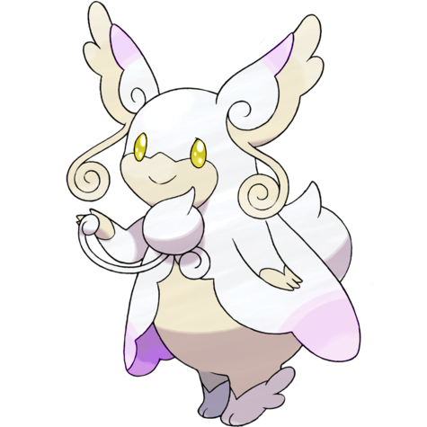
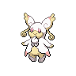
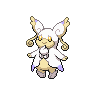

# #10069 Audino Mega (Hearing Pokémon)

| Official Artwork | Shiny Artwork |
| --- | --- |
|  |  |

**Blaze Black:** It touches others with the feelers on its ears, using the sound of their heartbeats to tell how they are feeling.

**Volt White:** Its auditory sense is astounding. It has a radarlike ability to understand its surroundings through slight sounds.

---

## Media

### Sprites

| Front | Front Shiny |
| --- | --- |
|  |  |

### Cries

Latest (Gen VI+):

<audio controls>
  <source src='../assets/cries/10069/latest.ogg' type='audio/ogg'>
  Your browser does not support the audio element.
</audio>

Legacy:

<audio controls>
  <source src='../assets/cries/10069/legacy.ogg' type='audio/ogg'>
  Your browser does not support the audio element.
</audio>

---

## Pokédex Data

| National № | Type(s) | Height | Weight | Abilities | Local № |
|------------|---------|--------|--------|-----------|---------|
| #10069 | {: width='48'} {: width='48'} | 1.5 m | 32.0 kg | 1. Healer | #37 |

---

## Base Stats
---

## Base Stats
|   | HP | Attack | Defense | Sp. Atk | Sp. Def | Speed |
|---|----|--------|---------|---------|---------|-------|
| **Base** | 103 | 60 | 126 | 80 | 126 | 50 |
| **Min** | 316 | 112 | 231 | 148 | 231 | 94 |
| **Max** | 410 | 240 | 386 | 284 | 386 | 218 |

The ranges shown above are for a level 100 Pokémon. Maximum values are based on a beneficial nature, 252 EVs, 31 IVs; minimum values are based on a hindering nature, 0 EVs, 0 IVs.

---

## Forms & Evolutions

!!! warning "WARNING"

    Some forms may not be available in Blaze Black/Volt White. Also information on evolutions may not be 100% accurate; it is currently quite complex to track generational evolution data.

### Forms

1. [Audino](audino.md/)
2. [Audino-Mega](audino-mega.md/)

### Evolution Line

1. [Audino](audino.md/)

---

## Training

| EV Yield | Catch Rate | Base Friendship | Base Exp. | Growth Rate | Held Items |
|----------|------------|-----------------|-----------|-------------|------------|
| 2 Hp | 255 | 50 | 425 | Fast |  |

---

## Breeding

| Egg Groups | Egg Cycles | Gender | Dimorphic | Color | Shape |
|------------|------------|--------|-----------|-------|-------|
| 1. Fairy | 20 | 50.0% Male 50.0% Female | False | Pink | Upright |

---

## Moves

!!! warning "WARNING"

    Specific move information may be incorrect. However, the general movepool should be accurate (including changes to learnset).

### Level Up Moves

Lv. | Move | Type | Cat. | Power | Acc. | PP
--- | --- | --- | --- | --- | --- | ---
| 1 | Growl | {: width='48'} | {: width='36'} | — | 100 | 40 |
| 1 | Helping Hand | {: width='48'} | {: width='36'} | — | — | 20 |
| 1 | Hyper Voice | {: width='48'} | {: width='36'} | 90 | 100 | 10 |
| 1 | Last Resort | {: width='48'} | {: width='36'} | 140 | 100 | 5 |
| 1 | Misty Terrain | {: width='48'} | {: width='36'} | — | — | 10 |
| 1 | Play Nice | {: width='48'} | {: width='36'} | — | — | 20 |
| 1 | Pound | {: width='48'} | {: width='36'} | 40 | 100 | 35 |
| 5 | Baby Doll Eyes | {: width='48'} | {: width='36'} | — | 100 | 30 |
| 9 | Refresh | {: width='48'} | {: width='36'} | — | — | 20 |
| 13 | Disarming Voice | {: width='48'} | {: width='36'} | 40 | — | 15 |
| 17 | Double Slap | {: width='48'} | {: width='36'} | 15 | 85 | 10 |
| 21 | Attract | {: width='48'} | {: width='36'} | — | 100 | 15 |
| 25 | Secret Power | {: width='48'} | {: width='36'} | 70 | 100 | 20 |
| 29 | Entrainment | {: width='48'} | {: width='36'} | — | 100 | 15 |
| 33 | Take Down | {: width='48'} | {: width='36'} | 90 | 85 | 20 |
| 37 | Heal Pulse | {: width='48'} | {: width='36'} | — | — | 10 |
| 41 | After You | {: width='48'} | {: width='36'} | — | — | 15 |
| 45 | Simple Beam | {: width='48'} | {: width='36'} | — | 100 | 15 |
| 49 | Double Edge | {: width='48'} | {: width='36'} | 120 | 100 | 15 |
| 53 | Hyper Voice | {: width='48'} | {: width='36'} | 90 | 100 | 10 |
| 57 | Last Resort | {: width='48'} | {: width='36'} | 140 | 100 | 5 |

### TM Moves

TM | Move | Type | Cat. | Power | Acc. | PP
--- | --- | --- | --- | --- | --- | ---
| TM01 | Work Up | {: width='48'} | {: width='36'} | — | — | 30 |
| TM03 | Psyshock | {: width='48'} | {: width='36'} | 80 | 100 | 10 |
| TM04 | Calm Mind | {: width='48'} | {: width='36'} | — | — | 20 |
| TM06 | Toxic | {: width='48'} | {: width='36'} | — | 90 | 10 |
| TM10 | Hidden Power | {: width='48'} | {: width='36'} | 60 | 100 | 15 |
| TM100 | Confide | {: width='48'} | {: width='36'} | — | — | 20 |
| TM11 | Sunny Day | {: width='48'} | {: width='36'} | — | — | 5 |
| TM13 | Ice Beam | {: width='48'} | {: width='36'} | 90 | 100 | 10 |
| TM14 | Blizzard | {: width='48'} | {: width='36'} | 110 | 70 | 5 |
| TM15 | Hyper Beam | {: width='48'} | {: width='36'} | 150 | 90 | 5 |
| TM16 | Light Screen | {: width='48'} | {: width='36'} | — | — | 30 |
| TM17 | Protect | {: width='48'} | {: width='36'} | — | — | 10 |
| TM18 | Rain Dance | {: width='48'} | {: width='36'} | — | — | 5 |
| TM20 | Safeguard | {: width='48'} | {: width='36'} | — | — | 25 |
| TM21 | Frustration | {: width='48'} | {: width='36'} | — | 100 | 20 |
| TM22 | Solar Beam | {: width='48'} | {: width='36'} | 120 | 100 | 10 |
| TM24 | Thunderbolt | {: width='48'} | {: width='36'} | 90 | 100 | 15 |
| TM25 | Thunder | {: width='48'} | {: width='36'} | 110 | 70 | 10 |
| TM27 | Return | {: width='48'} | {: width='36'} | — | 100 | 20 |
| TM29 | Psychic | {: width='48'} | {: width='36'} | 90 | 100 | 10 |
| TM30 | Shadow Ball | {: width='48'} | {: width='36'} | 90 | 100 | 15 |
| TM32 | Double Team | {: width='48'} | {: width='36'} | — | — | 15 |
| TM33 | Reflect | {: width='48'} | {: width='36'} | — | — | 20 |
| TM35 | Flamethrower | {: width='48'} | {: width='36'} | 90 | 100 | 15 |
| TM38 | Fire Blast | {: width='48'} | {: width='36'} | 110 | 85 | 5 |
| TM42 | Facade | {: width='48'} | {: width='36'} | 70 | 100 | 20 |
| TM44 | Rest | {: width='48'} | {: width='36'} | — | — | 5 |
| TM45 | Attract | {: width='48'} | {: width='36'} | — | 100 | 15 |
| TM48 | Round | {: width='48'} | {: width='36'} | 60 | 100 | 15 |
| TM49 | Echoed Voice | {: width='48'} | {: width='36'} | 40 | 100 | 15 |
| TM56 | Fling | {: width='48'} | {: width='36'} | — | 100 | 10 |
| TM57 | Charge Beam | {: width='48'} | {: width='36'} | 50 | 90 | 10 |
| TM73 | Thunder Wave | {: width='48'} | {: width='36'} | — | 90 | 20 |
| TM77 | Psych Up | {: width='48'} | {: width='36'} | — | — | 10 |
| TM85 | Dream Eater | {: width='48'} | {: width='36'} | 100 | 100 | 15 |
| TM86 | Grass Knot | {: width='48'} | {: width='36'} | — | 100 | 20 |
| TM87 | Swagger | {: width='48'} | {: width='36'} | — | 85 | 15 |
| TM88 | Sleep Talk | {: width='48'} | {: width='36'} | — | — | 10 |
| TM90 | Substitute | {: width='48'} | {: width='36'} | — | — | 10 |
| TM92 | Trick Room | {: width='48'} | {: width='36'} | — | — | 5 |
| TM93 | Wild Charge | {: width='48'} | {: width='36'} | 90 | 100 | 15 |
| TM94 | Surf | {: width='48'} | {: width='36'} | 90 | 100 | 15 |
| TM99 | Dazzling Gleam | {: width='48'} | {: width='36'} | 80 | 100 | 10 |

### Egg Moves

Move | Type | Cat. | Power | Acc. | PP
--- | --- | --- | --- | --- | ---
| Amnesia | {: width='48'} | {: width='36'} | — | — | 20 |
| Sweet Kiss | {: width='48'} | {: width='36'} | — | 75 | 10 |
| Sleep Talk | {: width='48'} | {: width='36'} | — | — | 10 |
| Heal Bell | {: width='48'} | {: width='36'} | — | — | 5 |
| Encore | {: width='48'} | {: width='36'} | — | 100 | 5 |
| Wish | {: width='48'} | {: width='36'} | — | — | 10 |
| Yawn | {: width='48'} | {: width='36'} | — | — | 10 |
| Healing Wish | {: width='48'} | {: width='36'} | — | — | 10 |
| Lucky Chant | {: width='48'} | {: width='36'} | — | — | 30 |
| Bestow | {: width='48'} | {: width='36'} | — | — | 15 |
| Draining Kiss | {: width='48'} | {: width='36'} | 50 | 100 | 10 |

### Tutor Moves

Move | Type | Cat. | Power | Acc. | PP
--- | --- | --- | --- | --- | ---
| Fire Punch | {: width='48'} | {: width='36'} | 80 | 100 | 15 |
| Ice Punch | {: width='48'} | {: width='36'} | 80 | 100 | 15 |
| Thunder Punch | {: width='48'} | {: width='36'} | 80 | 100 | 15 |
| Low Kick | {: width='48'} | {: width='36'} | — | 100 | 20 |
| Snore | {: width='48'} | {: width='36'} | 50 | 100 | 15 |
| Icy Wind | {: width='48'} | {: width='36'} | 55 | 95 | 15 |
| Heal Bell | {: width='48'} | {: width='36'} | — | — | 5 |
| Pain Split | {: width='48'} | {: width='36'} | — | — | 20 |
| Iron Tail | {: width='48'} | {: width='36'} | 100 | 75 | 15 |
| Uproar | {: width='48'} | {: width='36'} | 90 | 100 | 10 |
| Focus Punch | {: width='48'} | {: width='36'} | 150 | 100 | 20 |
| Helping Hand | {: width='48'} | {: width='36'} | — | — | 20 |
| Role Play | {: width='48'} | {: width='36'} | — | — | 10 |
| Magic Coat | {: width='48'} | {: width='36'} | — | — | 15 |
| Knock Off | {: width='48'} | {: width='36'} | 65 | 100 | 20 |
| Skill Swap | {: width='48'} | {: width='36'} | — | — | 10 |
| Snatch | {: width='48'} | {: width='36'} | — | — | 10 |
| Hyper Voice | {: width='48'} | {: width='36'} | 90 | 100 | 10 |
| Signal Beam | {: width='48'} | {: width='36'} | 75 | 100 | 15 |
| Covet | {: width='48'} | {: width='36'} | 60 | 100 | 25 |
| Gravity | {: width='48'} | {: width='36'} | — | — | 5 |
| Last Resort | {: width='48'} | {: width='36'} | 140 | 100 | 5 |
| Drain Punch | {: width='48'} | {: width='36'} | 75 | 100 | 10 |
| Zen Headbutt | {: width='48'} | {: width='36'} | 80 | 90 | 15 |
| Telekinesis | {: width='48'} | {: width='36'} | — | — | 15 |
| After You | {: width='48'} | {: width='36'} | — | — | 15 |
| Ally Switch | {: width='48'} | {: width='36'} | — | — | 15 |
| Laser Focus | {: width='48'} | {: width='36'} | — | — | 30 |
| Throat Chop | {: width='48'} | {: width='36'} | 80 | 100 | 15 |
| Stomping Tantrum | {: width='48'} | {: width='36'} | 75 | 100 | 10 |

