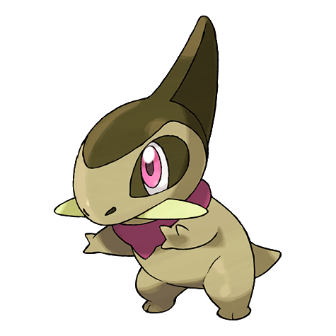

# Axew (Tusk Pokémon)

| Official Artwork | Shiny Artwork |
| --- | --- |
|  |  |

**Blaze Black:** They use their tusks to crush the berries they eat. Repeated regrowth makes their tusks strong and sharp.

**Volt White:** They mark their territory by leaving gashes in trees with their tusks. If a tusk breaks, a new one grows in quickly.

---

## Media

### Default Sprites

| Front | Back | Front Shiny | Back Shiny |
| --- | --- | --- | --- |
|  |  |  |  |

### Cries

Latest (Gen VI+):

<audio controls>
<source src='../../assets/cries/axew/latest.ogg' type='audio/ogg'>
  Your browser does not support the audio element.
</audio>

Legacy:

<audio controls>
<source src='../../assets/cries/axew/legacy.ogg' type='audio/ogg'>
  Your browser does not support the audio element.
</audio>

---

## Pokédex Data

| National № | Type(s) | Height | Weight | Abilities | Local № |
|------------|---------|--------|--------|-----------|---------|
| #610 | {: width='48'} | 0.6 m | 18.0 kg | 1. Rivalry 2. Mold-Breaker | #116 |

---

## Base Stats
|   | HP | Attack | Defense | Sp. Atk | Sp. Def | Speed |
|---|----|--------|---------|---------|---------|-------|
| **Base** | 46 | 87 | 60 | 30 | 40 | 57 |
| **Min** | 202 | 161 | 112 | 58 | 76 | 107 |
| **Max** | 296 | 300 | 240 | 174 | 196 | 234 |

The ranges shown above are for a level 100 Pokémon. Maximum values are based on a beneficial nature, 252 EVs, 31 IVs; minimum values are based on a hindering nature, 0 EVs, 0 IVs.

---

## Forms & Evolutions

!!! warning "WARNING"

    Information on evolutions may not be 100% accurate; differences between evolution methods across generations are not accounted for.

### Forms

Axew has no alternate forms.

### Evolution Line

1. [Axew](axew.md/)
    1. Level Up: [Fraxure](fraxure.md/)
        1. Level Up: [Haxorus](haxorus.md/)

---

## Training

| EV Yield | Catch Rate | Base Friendship | Base Exp. | Growth Rate | Held Items |
|----------|------------|-----------------|-----------|-------------|------------|
| 1 Attack | 75 | 35 | 64 | Slow | N/A |

---

## Breeding

| Egg Groups | Egg Cycles | Gender | Dimorphic | Color | Shape |
|------------|------------|--------|-----------|-------|-------|
| 1. Monster 2. Dragon | 40 | 50.0% Male 50.0% Female | False | Green | Upright |

---

## Moves

!!! warning "WARNING"

    Specific move information may be incorrect. However, the general movepool should be accurate; this includes changes made in Blaze Black and Volt White.

### Level Up Moves

| Lv. | Move | Type | Cat. | Power | Acc. | PP |
| --- | --- | --- | --- | --- | --- | --- |
| 1 | Scratch | {: width='48'} | {: width='36'} | 40 | 100 | 35 |
| 4 | Leer | {: width='48'} | {: width='36'} | — | 100 | 30 |
| 7 | Assurance | {: width='48'} | {: width='36'} | 60 | 100 | 10 |
| 10 | Dragon Rage | {: width='48'} | {: width='36'} | — | 100 | 10 |
| 13 | Dual Chop | {: width='48'} | {: width='36'} | 40 | 90 | 15 |
| 16 | Scary Face | {: width='48'} | {: width='36'} | — | 100 | 10 |
| 20 | Slash | {: width='48'} | {: width='36'} | 70 | 100 | 20 |
| 24 | False Swipe | {: width='48'} | {: width='36'} | 40 | 100 | 40 |
| 28 | Dragon Claw | {: width='48'} | {: width='36'} | 80 | 100 | 15 |
| 32 | Dragon Dance | {: width='48'} | {: width='36'} | — | — | 20 |
| 36 | Taunt | {: width='48'} | {: width='36'} | — | 100 | 20 |
| 41 | Dragon Pulse | {: width='48'} | {: width='36'} | 85 | 100 | 10 |
| 46 | Swords Dance | {: width='48'} | {: width='36'} | — | — | 20 |
| 51 | Guillotine | {: width='48'} | {: width='36'} | — | 30 | 5 |
| 56 | Outrage | {: width='48'} | {: width='36'} | 120 | 100 | 10 |
| 61 | Giga Impact | {: width='48'} | {: width='36'} | 150 | 90 | 5 |

### TM Moves

| TM | Move | Type | Cat. | Power | Acc. | PP |
| --- | --- | --- | --- | --- | --- | --- |
| HM01 | Cut | {: width='48'} | {: width='36'} | 60 | 100% | 25 |
| HM04 | Strength | {: width='48'} | {: width='36'} | 100 | 100 | 15 |
| TM01 | Hone Claws | {: width='48'} | {: width='36'} | — | — | 15 |
| TM02 | Dragon Claw | {: width='48'} | {: width='36'} | 80 | 100 | 15 |
| TM05 | Roar | {: width='48'} | {: width='36'} | — | — | 20 |
| TM06 | Toxic | {: width='48'} | {: width='36'} | — | 90 | 10 |
| TM10 | Hidden Power | {: width='48'} | {: width='36'} | 60 | 100 | 15 |
| TM11 | Sunny Day | {: width='48'} | {: width='36'} | — | — | 5 |
| TM12 | Taunt | {: width='48'} | {: width='36'} | — | 100 | 20 |
| TM17 | Protect | {: width='48'} | {: width='36'} | — | — | 10 |
| TM18 | Rain Dance | {: width='48'} | {: width='36'} | — | — | 5 |
| TM21 | Frustration | {: width='48'} | {: width='36'} | — | 100 | 20 |
| TM27 | Return | {: width='48'} | {: width='36'} | — | 100 | 20 |
| TM28 | Dig | {: width='48'} | {: width='36'} | 100 | 100 | 10 |
| TM32 | Double Team | {: width='48'} | {: width='36'} | — | — | 15 |
| TM39 | Rock Tomb | {: width='48'} | {: width='36'} | 60 | 95 | 15 |
| TM40 | Aerial Ace | {: width='48'} | {: width='36'} | 60 | — | 20 |
| TM42 | Facade | {: width='48'} | {: width='36'} | 70 | 100 | 20 |
| TM44 | Rest | {: width='48'} | {: width='36'} | — | — | 5 |
| TM45 | Attract | {: width='48'} | {: width='36'} | — | 100 | 15 |
| TM48 | Round | {: width='48'} | {: width='36'} | 60 | 100 | 15 |
| TM54 | False Swipe | {: width='48'} | {: width='36'} | 40 | 100 | 40 |
| TM56 | Fling | {: width='48'} | {: width='36'} | — | 100 | 10 |
| TM59 | Incinerate | {: width='48'} | {: width='36'} | 50 | 100 | 15 |
| TM66 | Payback | {: width='48'} | {: width='36'} | 50 | 100 | 10 |
| TM68 | Giga Impact | {: width='48'} | {: width='36'} | 150 | 90 | 5 |
| TM75 | Swords Dance | {: width='48'} | {: width='36'} | — | — | 20 |
| TM81 | X Scissor | {: width='48'} | {: width='36'} | 80 | 100 | 15 |
| TM84 | Poison Jab | {: width='48'} | {: width='36'} | 80 | 100 | 20 |
| TM87 | Swagger | {: width='48'} | {: width='36'} | — | 85 | 15 |
| TM90 | Substitute | {: width='48'} | {: width='36'} | — | — | 10 |
| TM94 | Rock Smash | {: width='48'} | {: width='36'} | 60 | 100 | 15 |

### Egg Moves

| Move | Type | Cat. | Power | Acc. | PP |
| --- | --- | --- | --- | --- | --- |
| Razor Wind | {: width='48'} | {: width='36'} | 80 | 100 | 10 |
| Counter | {: width='48'} | {: width='36'} | — | 100 | 20 |
| Harden | {: width='48'} | {: width='36'} | — | — | 30 |
| Focus Energy | {: width='48'} | {: width='36'} | — | — | 30 |
| Reversal | {: width='48'} | {: width='36'} | — | 100 | 15 |
| Endure | {: width='48'} | {: width='36'} | — | — | 10 |
| Iron Tail | {: width='48'} | {: width='36'} | 100 | 75 | 15 |
| Endeavor | {: width='48'} | {: width='36'} | — | 100 | 5 |
| Night Slash | {: width='48'} | {: width='36'} | 70 | 100 | 15 |
| Dragon Pulse | {: width='48'} | {: width='36'} | 85 | 100 | 10 |

### Tutor Moves

| Move | Type | Cat. | Power | Acc. | PP |
| --- | --- | --- | --- | --- | --- |
| Draco Meteor | {: width='48'} | {: width='36'} | 130 | 90 | 5 |

