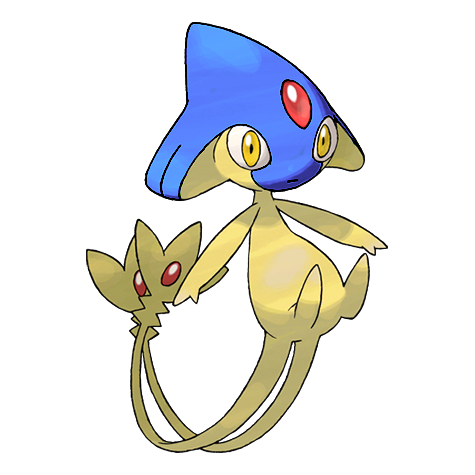
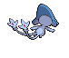
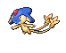
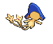

# Azelf (Willpower Pokémon)

| Official Artwork | Shiny Artwork |
| --- | --- |
|  |  |

When Azelf flew, people gained the determination to do things. It was the birth of willpower.

---

## Media

### Default Sprites

| Front | Back | Front Shiny | Back Shiny |
| --- | --- | --- | --- |
|  |  |  |  |

### Cries

Latest (Gen VI+):

<audio controls>
<source src='../../assets/cries/azelf/latest.ogg' type='audio/ogg'>
  Your browser does not support the audio element.
</audio>

Legacy:

<audio controls>
<source src='../../assets/cries/azelf/legacy.ogg' type='audio/ogg'>
  Your browser does not support the audio element.
</audio>

---

## Pokédex Data

| National № | Type(s) | Height | Weight | Abilities | Local № |
|------------|---------|--------|--------|-----------|---------|
| #482 | {: width='48'} | 0.3 m | 0.3 kg | 1. Levitate | N/A |

---

## Base Stats
|   | HP | Attack | Defense | Sp. Atk | Sp. Def | Speed |
|---|----|--------|---------|---------|---------|-------|
| **Base** | 75 | 125 | 70 | 125 | 70 | 115 |
| **Min** | 260 | 229 | 130 | 229 | 130 | 211 |
| **Max** | 354 | 383 | 262 | 383 | 262 | 361 |

The ranges shown above are for a level 100 Pokémon. Maximum values are based on a beneficial nature, 252 EVs, 31 IVs; minimum values are based on a hindering nature, 0 EVs, 0 IVs.

---

## Forms & Evolutions

!!! warning "WARNING"

    Information on evolutions may not be 100% accurate; differences between evolution methods across generations are not accounted for.

### Forms

Azelf has no alternate forms.

### Evolution Line

1. [Azelf](azelf.md/)

---

## Training

| EV Yield | Catch Rate | Base Friendship | Base Exp. | Growth Rate | Held Items |
|----------|------------|-----------------|-----------|-------------|------------|
| 2 Attack 1 Special Attack | 3 | 140 | 290 | Slow | N/A |

---

## Breeding

| Egg Groups | Egg Cycles | Gender | Dimorphic | Color | Shape |
|------------|------------|--------|-----------|-------|-------|
| 1. No-Eggs | 80 | Genderless | False | Blue | Upright |

---

## Moves

!!! warning "WARNING"

    Specific move information may be incorrect. However, the general movepool should be accurate; this includes changes made in Blaze Black and Volt White.

### Level Up Moves

| Lv. | Move | Type | Cat. | Power | Acc. | PP |
| --- | --- | --- | --- | --- | --- | --- |
| 1 | Confusion | {: width='48'} | {: width='36'} | 50 | 100 | 25 |
| 1 | Rest | {: width='48'} | {: width='36'} | — | — | 5 |
| 6 | Imprison | {: width='48'} | {: width='36'} | — | — | 10 |
| 16 | Detect | {: width='48'} | {: width='36'} | — | — | 5 |
| 21 | Swift | {: width='48'} | {: width='36'} | 60 | — | 20 |
| 31 | Uproar | {: width='48'} | {: width='36'} | 90 | 100 | 10 |
| 36 | Future Sight | {: width='48'} | {: width='36'} | 120 | 100 | 10 |
| 46 | Nasty Plot | {: width='48'} | {: width='36'} | — | — | 20 |
| 51 | Extrasensory | {: width='48'} | {: width='36'} | 80 | 100 | 20 |
| 61 | Last Resort | {: width='48'} | {: width='36'} | 140 | 100 | 5 |
| 66 | Natural Gift | {: width='48'} | {: width='36'} | — | 100 | 15 |
| 76 | Explosion | {: width='48'} | {: width='36'} | 250 | 100 | 5 |

### TM Moves

| TM | Move | Type | Cat. | Power | Acc. | PP |
| --- | --- | --- | --- | --- | --- | --- |
| TM03 | Psyshock | {: width='48'} | {: width='36'} | 80 | 100 | 10 |
| TM04 | Calm Mind | {: width='48'} | {: width='36'} | — | — | 20 |
| TM06 | Toxic | {: width='48'} | {: width='36'} | — | 90 | 10 |
| TM10 | Hidden Power | {: width='48'} | {: width='36'} | 60 | 100 | 15 |
| TM11 | Sunny Day | {: width='48'} | {: width='36'} | — | — | 5 |
| TM12 | Taunt | {: width='48'} | {: width='36'} | — | 100 | 20 |
| TM15 | Hyper Beam | {: width='48'} | {: width='36'} | 150 | 90 | 5 |
| TM16 | Light Screen | {: width='48'} | {: width='36'} | — | — | 30 |
| TM17 | Protect | {: width='48'} | {: width='36'} | — | — | 10 |
| TM18 | Rain Dance | {: width='48'} | {: width='36'} | — | — | 5 |
| TM19 | Telekinesis | {: width='48'} | {: width='36'} | — | — | 15 |
| TM20 | Safeguard | {: width='48'} | {: width='36'} | — | — | 25 |
| TM21 | Frustration | {: width='48'} | {: width='36'} | — | 100 | 20 |
| TM24 | Thunderbolt | {: width='48'} | {: width='36'} | 90 | 100 | 15 |
| TM25 | Thunder | {: width='48'} | {: width='36'} | 110 | 70 | 10 |
| TM27 | Return | {: width='48'} | {: width='36'} | — | 100 | 20 |
| TM29 | Psychic | {: width='48'} | {: width='36'} | 90 | 100 | 10 |
| TM30 | Shadow Ball | {: width='48'} | {: width='36'} | 90 | 100 | 15 |
| TM32 | Double Team | {: width='48'} | {: width='36'} | — | — | 15 |
| TM33 | Reflect | {: width='48'} | {: width='36'} | — | — | 20 |
| TM35 | Flamethrower | {: width='48'} | {: width='36'} | 90 | 100 | 15 |
| TM37 | Sandstorm | {: width='48'} | {: width='36'} | — | — | 10 |
| TM38 | Fire Blast | {: width='48'} | {: width='36'} | 110 | 85 | 5 |
| TM41 | Torment | {: width='48'} | {: width='36'} | — | 100 | 15 |
| TM42 | Facade | {: width='48'} | {: width='36'} | 70 | 100 | 20 |
| TM44 | Rest | {: width='48'} | {: width='36'} | — | — | 5 |
| TM48 | Round | {: width='48'} | {: width='36'} | 60 | 100 | 15 |
| TM53 | Energy Ball | {: width='48'} | {: width='36'} | 90 | 100 | 10 |
| TM56 | Fling | {: width='48'} | {: width='36'} | — | 100 | 10 |
| TM57 | Charge Beam | {: width='48'} | {: width='36'} | 50 | 90 | 10 |
| TM59 | Incinerate | {: width='48'} | {: width='36'} | 50 | 100 | 15 |
| TM62 | Acrobatics | {: width='48'} | {: width='36'} | 55 | 100 | 15 |
| TM64 | Explosion | {: width='48'} | {: width='36'} | 250 | 100 | 5 |
| TM66 | Payback | {: width='48'} | {: width='36'} | 50 | 100 | 10 |
| TM68 | Giga Impact | {: width='48'} | {: width='36'} | 150 | 90 | 5 |
| TM70 | Flash | {: width='48'} | {: width='36'} | — | 100 | 20 |
| TM73 | Thunder Wave | {: width='48'} | {: width='36'} | — | 90 | 20 |
| TM77 | Psych Up | {: width='48'} | {: width='36'} | — | — | 10 |
| TM85 | Dream Eater | {: width='48'} | {: width='36'} | 100 | 100 | 15 |
| TM86 | Grass Knot | {: width='48'} | {: width='36'} | — | 100 | 20 |
| TM87 | Swagger | {: width='48'} | {: width='36'} | — | 85 | 15 |
| TM89 | U Turn | {: width='48'} | {: width='36'} | 70 | 100 | 20 |
| TM90 | Substitute | {: width='48'} | {: width='36'} | — | — | 10 |
| TM92 | Trick Room | {: width='48'} | {: width='36'} | — | — | 5 |

### Egg Moves

Azelf cannot learn any moves by breeding.
### Tutor Moves

Azelf cannot learn any moves from tutors.
