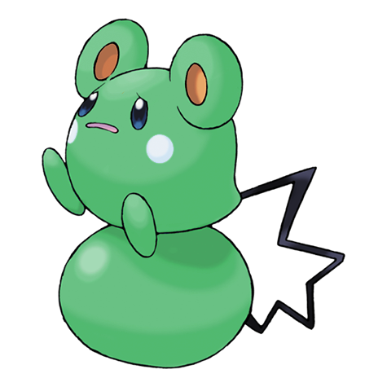

# #298 Azurill (Polka Dot Pokémon)

| Official Artwork | Shiny Artwork |
|------------------|---------------|
|  |  |

Its tail bounces like a rubber ball. It flings that tail around to fight opponents bigger than itself.

---

## Media

### Default Sprites

| Front | Shiny | Back | Shiny |
|-------|-------|------|-------|
|  |  |  |  |

### Cries

Latest (Gen VI+):

<audio controls>
<source src='../../assets/cries/azurill/latest.ogg' type='audio/ogg'>
  Your browser does not support the audio element.
</audio>

Legacy:

<audio controls>
<source src='../../assets/cries/azurill/legacy.ogg' type='audio/ogg'>
  Your browser does not support the audio element.
</audio>

---

## Pokédex Data

| National № | Type(s) | Height | Weight | Abilities | Local № |
|------------|---------|--------|--------|-----------|---------|
| #298 | {: width="48"} {: width="48"} | 0.2 m / 0.7 ft | 2.0 kg / 4.4 lbs | 1. Sap Sipper 2. Huge Power | #124 |

---

## Base Stats
|   | HP | Attack | Defense | Sp. Atk | Sp. Def | Speed |
|---|----|--------|---------|---------|---------|-------|
| **Base** | 50 | 20 | 40 | 20 | 40 | 20 |
| **Min** | 210 | 40 | 76 | 40 | 76 | 40 |
| **Max** | 304 | 152 | 196 | 152 | 196 | 152 |

The ranges shown above are for a level 100 Pokémon. Maximum values are based on a beneficial nature, 252 EVs, 31 IVs; minimum values are based on a hindering nature, 0 EVs, 0 IVs.

---

## Forms & Evolutions

!!! warning "WARNING"

    Information on evolutions may not be 100% accurate; differences between evolution methods across generations are not accounted for.

### Forms

Azurill has no alternate forms.

### Evolution Line

1. [Azurill](azurill.md/)
    1. Level Up: [Marill](marill.md/)
        1. Level Up: [Azumarill](azumarill.md/)

---

## Training

| EV Yield | Catch Rate | Base Friendship | Base Exp. | Growth Rate | Held Items |
|----------|------------|-----------------|-----------|-------------|------------|
| 1 HP | 150 | 50 | 38 | Fast | N/A |

---

## Breeding

| Egg Groups | Egg Cycles | Gender | Dimorphic | Color | Shape |
|------------|------------|--------|-----------|-------|-------|
| 1. No-Eggs | 10 | 25.0% Male 75.0% Female | False | Blue | Legs |

---

## Moves

!!! warning "WARNING"

    Specific move information may be incorrect. However, the general movepool should be accurate; this includes changes made in Blaze Black and Volt White.

### Level Up Moves

| Lv. | Move | Type | Cat. | Power | Acc. | PP |
| --- | --- | --- | --- | --- | --- | --- |
| 1 | Splash | {: width="48"} | {: width="36"} | — | — | 40 |
| 2 | Charm | {: width="48"} | {: width="36"} | — | 100 | 20 |
| 7 | Tail Whip | {: width="48"} | {: width="36"} | — | 100 | 30 |
| 10 | Bubble | {: width="48"} | {: width="36"} | 40 | 100 | 30 |
| 15 | Slam | {: width="48"} | {: width="36"} | 80 | 75 | 20 |
| 18 | Water Gun | {: width="48"} | {: width="36"} | 40 | 100 | 25 |
| 21 | Sing | {: width="48"} | {: width="36"} | — | 55 | 15 |

### TM Moves

| TM | Move | Type | Cat. | Power | Acc. | PP |
| --- | --- | --- | --- | --- | --- | --- |
| HM03 | Surf | {: width="48"} | {: width="36"} | 90 | 100 | 15 |
| HM05 | Waterfall | {: width="48"} | {: width="36"} | 85 | 100 | 15 |
| TM06 | Toxic | {: width="48"} | {: width="36"} | — | 90 | 10 |
| TM07 | Hail | {: width="48"} | {: width="36"} | — | — | 10 |
| TM10 | Hidden Power | {: width="48"} | {: width="36"} | 60 | 100 | 15 |
| TM13 | Ice Beam | {: width="48"} | {: width="36"} | 90 | 100 | 10 |
| TM14 | Blizzard | {: width="48"} | {: width="36"} | 110 | 70 | 5 |
| TM16 | Light Screen | {: width="48"} | {: width="36"} | — | — | 30 |
| TM17 | Protect | {: width="48"} | {: width="36"} | — | — | 10 |
| TM18 | Rain Dance | {: width="48"} | {: width="36"} | — | — | 5 |
| TM21 | Frustration | {: width="48"} | {: width="36"} | — | 100 | 20 |
| TM27 | Return | {: width="48"} | {: width="36"} | — | 100 | 20 |
| TM32 | Double Team | {: width="48"} | {: width="36"} | — | — | 15 |
| TM42 | Facade | {: width="48"} | {: width="36"} | 70 | 100 | 20 |
| TM44 | Rest | {: width="48"} | {: width="36"} | — | — | 5 |
| TM45 | Attract | {: width="48"} | {: width="36"} | — | 100 | 15 |
| TM48 | Round | {: width="48"} | {: width="36"} | 60 | 100 | 15 |
| TM55 | Scald | {: width="48"} | {: width="36"} | 80 | 100 | 15 |
| TM83 | Work Up | {: width="48"} | {: width="36"} | — | — | 30 |
| TM87 | Swagger | {: width="48"} | {: width="36"} | — | 85 | 15 |
| TM90 | Substitute | {: width="48"} | {: width="36"} | — | — | 10 |

### Egg Moves

| Move | Type | Cat. | Power | Acc. | PP |
| --- | --- | --- | --- | --- | --- |
| Slam | {: width="48"} | {: width="36"} | 80 | 75 | 20 |
| Body Slam | {: width="48"} | {: width="36"} | 85 | 100 | 15 |
| Sing | {: width="48"} | {: width="36"} | — | 55 | 15 |
| Encore | {: width="48"} | {: width="36"} | — | 100 | 5 |
| Refresh | {: width="48"} | {: width="36"} | — | — | 20 |
| Fake Tears | {: width="48"} | {: width="36"} | — | 100 | 20 |
| Tickle | {: width="48"} | {: width="36"} | — | 100 | 20 |
| Muddy Water | {: width="48"} | {: width="36"} | 90 | 85 | 10 |
| Water Sport | {: width="48"} | {: width="36"} | — | — | 15 |
| Soak | {: width="48"} | {: width="36"} | — | 100 | 20 |

### Tutor Moves

Azurill cannot learn any moves from tutors.
