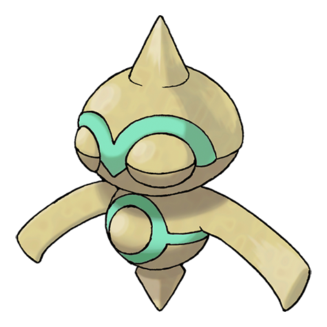

# #343 Baltoy (Clay Doll Pokémon)

| Official Artwork | Shiny Artwork |
| --- | --- |
|  |  |

It moves by spinning on its foot. It is a rare Pokémon that was discovered in ancient ruins.

---

## Media

### Default Sprites

| Front | Back | Front Shiny | Back Shiny |
| --- | --- | --- | --- |
|  |  |  |  |

### Cries

Latest (Gen VI+):

<audio controls>
<source src='../../assets/cries/baltoy/latest.ogg' type='audio/ogg'>
  Your browser does not support the audio element.
</audio>

Legacy:

<audio controls>
<source src='../../assets/cries/baltoy/legacy.ogg' type='audio/ogg'>
  Your browser does not support the audio element.
</audio>

---

## Pokédex Data

| National № | Type(s) | Height | Weight | Abilities | Local № |
|------------|---------|--------|--------|-----------|---------|
| #343 | {: width='48'} {: width='48'} | 0.5 m | 21.5 kg | 1. Levitate | N/A |

---

## Base Stats
|   | HP | Attack | Defense | Sp. Atk | Sp. Def | Speed |
|---|----|--------|---------|---------|---------|-------|
| **Base** | 40 | 40 | 55 | 40 | 70 | 55 |
| **Min** | 190 | 76 | 103 | 76 | 130 | 103 |
| **Max** | 284 | 196 | 229 | 196 | 262 | 229 |

The ranges shown above are for a level 100 Pokémon. Maximum values are based on a beneficial nature, 252 EVs, 31 IVs; minimum values are based on a hindering nature, 0 EVs, 0 IVs.

---

## Forms & Evolutions

!!! warning "WARNING"

    Information on evolutions may not be 100% accurate; differences between evolution methods across generations are not accounted for.

### Forms

Baltoy has no alternate forms.

### Evolution Line

1. [Baltoy](baltoy.md/)
    1. Level Up: [Claydol](claydol.md/)

---

## Training

| EV Yield | Catch Rate | Base Friendship | Base Exp. | Growth Rate | Held Items |
|----------|------------|-----------------|-----------|-------------|------------|
| 1 Special Defense | 255 | 50 | 60 | Medium |  |

---

## Breeding

| Egg Groups | Egg Cycles | Gender | Dimorphic | Color | Shape |
|------------|------------|--------|-----------|-------|-------|
| 1. Mineral | 20 | Genderless | False | Brown | Arms |

---

## Moves

!!! warning "WARNING"

    Specific move information may be incorrect. However, the general movepool should be accurate; this includes changes made in Blaze Black and Volt White.

### Level Up Moves

| Lv. | Move | Type | Cat. | Power | Acc. | PP |
| --- | --- | --- | --- | --- | --- | --- |
| 1 | Confusion | {: width='48'} | {: width='36'} | 50 | 100 | 25 |
| 4 | Harden | {: width='48'} | {: width='36'} | — | — | 30 |
| 7 | Rapid Spin | {: width='48'} | {: width='36'} | 50 | 100 | 40 |
| 11 | Mud Slap | {: width='48'} | {: width='36'} | 20 | 100 | 10 |
| 15 | Psybeam | {: width='48'} | {: width='36'} | 65 | 100 | 20 |
| 18 | Rock Tomb | {: width='48'} | {: width='36'} | 60 | 95 | 15 |
| 21 | Self Destruct | {: width='48'} | {: width='36'} | 200 | 100 | 5 |
| 26 | Ancient Power | {: width='48'} | {: width='36'} | 60 | 100 | 5 |
| 31 | Power Trick | {: width='48'} | {: width='36'} | — | — | 10 |
| 34 | Sandstorm | {: width='48'} | {: width='36'} | — | — | 10 |
| 37 | Cosmic Power | {: width='48'} | {: width='36'} | — | — | 20 |
| 43 | Extrasensory | {: width='48'} | {: width='36'} | 80 | 100 | 20 |
| 48 | Guard Split | {: width='48'} | {: width='36'} | — | — | 10 |
| 48 | Power Split | {: width='48'} | {: width='36'} | — | — | 10 |
| 51 | Earth Power | {: width='48'} | {: width='36'} | 90 | 100 | 10 |
| 54 | Heal Block | {: width='48'} | {: width='36'} | — | 100 | 15 |
| 60 | Explosion | {: width='48'} | {: width='36'} | 250 | 100 | 5 |

### TM Moves

| TM | Move | Type | Cat. | Power | Acc. | PP |
| --- | --- | --- | --- | --- | --- | --- |
| TM03 | Psyshock | {: width='48'} | {: width='36'} | 80 | 100 | 10 |
| TM04 | Calm Mind | {: width='48'} | {: width='36'} | — | — | 20 |
| TM06 | Toxic | {: width='48'} | {: width='36'} | — | 90 | 10 |
| TM10 | Hidden Power | {: width='48'} | {: width='36'} | 60 | 100 | 15 |
| TM11 | Sunny Day | {: width='48'} | {: width='36'} | — | — | 5 |
| TM13 | Ice Beam | {: width='48'} | {: width='36'} | 90 | 100 | 10 |
| TM16 | Light Screen | {: width='48'} | {: width='36'} | — | — | 30 |
| TM17 | Protect | {: width='48'} | {: width='36'} | — | — | 10 |
| TM18 | Rain Dance | {: width='48'} | {: width='36'} | — | — | 5 |
| TM19 | Telekinesis | {: width='48'} | {: width='36'} | — | — | 15 |
| TM20 | Safeguard | {: width='48'} | {: width='36'} | — | — | 25 |
| TM21 | Frustration | {: width='48'} | {: width='36'} | — | 100 | 20 |
| TM22 | Solar Beam | {: width='48'} | {: width='36'} | 120 | 100 | 10 |
| TM23 | Smack Down | {: width='48'} | {: width='36'} | 50 | 100 | 15 |
| TM26 | Earthquake | {: width='48'} | {: width='36'} | 100 | 100 | 10 |
| TM27 | Return | {: width='48'} | {: width='36'} | — | 100 | 20 |
| TM28 | Dig | {: width='48'} | {: width='36'} | 100 | 100 | 10 |
| TM29 | Psychic | {: width='48'} | {: width='36'} | 90 | 100 | 10 |
| TM30 | Shadow Ball | {: width='48'} | {: width='36'} | 90 | 100 | 15 |
| TM32 | Double Team | {: width='48'} | {: width='36'} | — | — | 15 |
| TM33 | Reflect | {: width='48'} | {: width='36'} | — | — | 20 |
| TM37 | Sandstorm | {: width='48'} | {: width='36'} | — | — | 10 |
| TM39 | Rock Tomb | {: width='48'} | {: width='36'} | 60 | 95 | 15 |
| TM42 | Facade | {: width='48'} | {: width='36'} | 70 | 100 | 20 |
| TM44 | Rest | {: width='48'} | {: width='36'} | — | — | 5 |
| TM48 | Round | {: width='48'} | {: width='36'} | 60 | 100 | 15 |
| TM51 | Ally Switch | {: width='48'} | {: width='36'} | — | — | 15 |
| TM57 | Charge Beam | {: width='48'} | {: width='36'} | 50 | 90 | 10 |
| TM64 | Explosion | {: width='48'} | {: width='36'} | 250 | 100 | 5 |
| TM69 | Rock Polish | {: width='48'} | {: width='36'} | — | — | 20 |
| TM70 | Flash | {: width='48'} | {: width='36'} | — | 100 | 20 |
| TM74 | Gyro Ball | {: width='48'} | {: width='36'} | — | 100 | 5 |
| TM77 | Psych Up | {: width='48'} | {: width='36'} | — | — | 10 |
| TM78 | Bulldoze | {: width='48'} | {: width='36'} | 80 | 100 | 20 |
| TM80 | Rock Slide | {: width='48'} | {: width='36'} | 75 | 90 | 10 |
| TM85 | Dream Eater | {: width='48'} | {: width='36'} | 100 | 100 | 15 |
| TM86 | Grass Knot | {: width='48'} | {: width='36'} | — | 100 | 20 |
| TM87 | Swagger | {: width='48'} | {: width='36'} | — | 85 | 15 |
| TM90 | Substitute | {: width='48'} | {: width='36'} | — | — | 10 |
| TM92 | Trick Room | {: width='48'} | {: width='36'} | — | — | 5 |

### Egg Moves

Baltoy cannot learn any moves by breeding.
### Tutor Moves

Baltoy cannot learn any moves from tutors.
