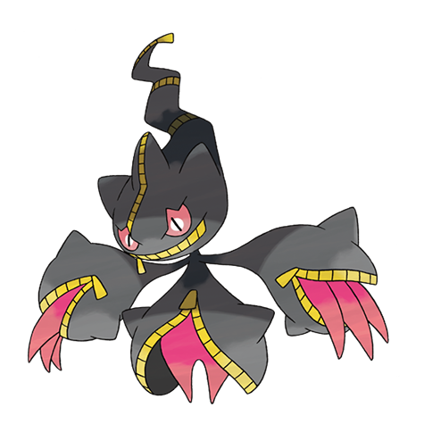
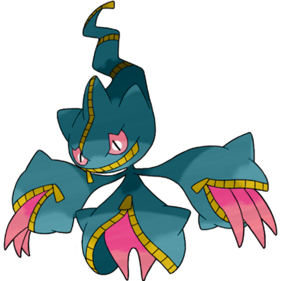
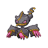
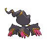
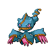
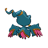

# #10056 Banette Mega (Marionette Pokémon)

| Official Artwork | Shiny Artwork |
| --- | --- |
|  |  |

A doll that became a Pokémon over its grudge from being junked. It seeks the child that disowned it.

---

## Media

### Sprites

| Front | Back | Front Shiny | Back Shiny |
| --- | --- | --- | --- |
|  |  |  |  |

### Cries

Latest (Gen VI+):

<audio controls>
  <source src='../assets/cries/10056/latest.ogg' type='audio/ogg'>
  Your browser does not support the audio element.
</audio>

Legacy:

<audio controls>
  <source src='../assets/cries/10056/legacy.ogg' type='audio/ogg'>
  Your browser does not support the audio element.
</audio>

---

## Pokédex Data

| National № | Type(s) | Height | Weight | Abilities | Local № |
|------------|---------|--------|--------|-----------|---------|
| #10056 | {: width='48'} | 1.2 m | 13.0 kg | 1. Prankster | #N/A |

---

## Base Stats
---

## Base Stats
|   | HP | Attack | Defense | Sp. Atk | Sp. Def | Speed |
|---|----|--------|---------|---------|---------|-------|
| **Base** | 64 | 165 | 75 | 93 | 83 | 75 |
| **Min** | 238 | 301 | 139 | 171 | 153 | 139 |
| **Max** | 332 | 471 | 273 | 313 | 291 | 273 |

The ranges shown above are for a level 100 Pokémon. Maximum values are based on a beneficial nature, 252 EVs, 31 IVs; minimum values are based on a hindering nature, 0 EVs, 0 IVs.

---

## Forms & Evolutions

!!! warning "WARNING"

    Some forms may not be available in Blaze Black/Volt White. Also information on evolutions may not be 100% accurate; it is currently quite complex to track generational evolution data.

### Forms

1. [Banette](banette.md/)
2. [Banette-Mega](banette-mega.md/)

### Evolution Line

1. [Shuppet](shuppet.md/)
1. Level Up: [Banette](banette.md/)

---

## Training

| EV Yield | Catch Rate | Base Friendship | Base Exp. | Growth Rate | Held Items |
|----------|------------|-----------------|-----------|-------------|------------|
| 2 Attack | 45 | 35 | 194 | Fast |  |

---

## Breeding

| Egg Groups | Egg Cycles | Gender | Dimorphic | Color | Shape |
|------------|------------|--------|-----------|-------|-------|
| 1. Indeterminate | 25 | 50.0% Male 50.0% Female | False | Black | Upright |

---

## Moves

!!! warning "WARNING"

    Specific move information may be incorrect. However, the general movepool should be accurate (including changes to learnset).

### Level Up Moves

Lv. | Move | Type | Cat. | Power | Acc. | PP
--- | --- | --- | --- | --- | --- | ---
| 1 | Knock Off | {: width='48'} | {: width='36'} | 65 | 100 | 20 |
| 1 | Night Shade | {: width='48'} | {: width='36'} | — | 100 | 15 |
| 1 | Phantom Force | {: width='48'} | {: width='36'} | 90 | 100 | 10 |
| 1 | Screech | {: width='48'} | {: width='36'} | — | 85 | 40 |
| 1 | Spite | {: width='48'} | {: width='36'} | — | 100 | 10 |
| 4 | Screech | {: width='48'} | {: width='36'} | — | 85 | 40 |
| 7 | Night Shade | {: width='48'} | {: width='36'} | — | 100 | 15 |
| 10 | Spite | {: width='48'} | {: width='36'} | — | 100 | 10 |
| 13 | Shadow Sneak | {: width='48'} | {: width='36'} | 40 | 100 | 30 |
| 16 | Will O Wisp | {: width='48'} | {: width='36'} | — | 85 | 15 |
| 19 | Feint Attack | {: width='48'} | {: width='36'} | 60 | — | 20 |
| 22 | Hex | {: width='48'} | {: width='36'} | 65 | 100 | 10 |
| 26 | Curse | {: width='48'} | {: width='36'} | — | — | 10 |
| 30 | Shadow Ball | {: width='48'} | {: width='36'} | 90 | 100 | 15 |
| 34 | Embargo | {: width='48'} | {: width='36'} | — | 100 | 15 |
| 40 | Sucker Punch | {: width='48'} | {: width='36'} | 70 | 100 | 5 |
| 46 | Snatch | {: width='48'} | {: width='36'} | — | — | 10 |
| 52 | Grudge | {: width='48'} | {: width='36'} | — | — | 5 |
| 58 | Trick | {: width='48'} | {: width='36'} | — | 100 | 10 |
| 64 | Phantom Force | {: width='48'} | {: width='36'} | 90 | 100 | 10 |

### TM Moves

TM | Move | Type | Cat. | Power | Acc. | PP
--- | --- | --- | --- | --- | --- | ---
| TM04 | Calm Mind | {: width='48'} | {: width='36'} | — | — | 20 |
| TM06 | Toxic | {: width='48'} | {: width='36'} | — | 90 | 10 |
| TM10 | Hidden Power | {: width='48'} | {: width='36'} | 60 | 100 | 15 |
| TM100 | Confide | {: width='48'} | {: width='36'} | — | — | 20 |
| TM11 | Sunny Day | {: width='48'} | {: width='36'} | — | — | 5 |
| TM12 | Taunt | {: width='48'} | {: width='36'} | — | 100 | 20 |
| TM15 | Hyper Beam | {: width='48'} | {: width='36'} | 150 | 90 | 5 |
| TM17 | Protect | {: width='48'} | {: width='36'} | — | — | 10 |
| TM18 | Rain Dance | {: width='48'} | {: width='36'} | — | — | 5 |
| TM21 | Frustration | {: width='48'} | {: width='36'} | — | 100 | 20 |
| TM24 | Thunderbolt | {: width='48'} | {: width='36'} | 90 | 100 | 15 |
| TM25 | Thunder | {: width='48'} | {: width='36'} | 110 | 70 | 10 |
| TM27 | Return | {: width='48'} | {: width='36'} | — | 100 | 20 |
| TM29 | Psychic | {: width='48'} | {: width='36'} | 90 | 100 | 10 |
| TM30 | Shadow Ball | {: width='48'} | {: width='36'} | 90 | 100 | 15 |
| TM32 | Double Team | {: width='48'} | {: width='36'} | — | — | 15 |
| TM41 | Torment | {: width='48'} | {: width='36'} | — | 100 | 15 |
| TM42 | Facade | {: width='48'} | {: width='36'} | 70 | 100 | 20 |
| TM44 | Rest | {: width='48'} | {: width='36'} | — | — | 5 |
| TM45 | Attract | {: width='48'} | {: width='36'} | — | 100 | 15 |
| TM46 | Thief | {: width='48'} | {: width='36'} | 60 | 100 | 25 |
| TM48 | Round | {: width='48'} | {: width='36'} | 60 | 100 | 15 |
| TM56 | Fling | {: width='48'} | {: width='36'} | — | 100 | 10 |
| TM57 | Charge Beam | {: width='48'} | {: width='36'} | 50 | 90 | 10 |
| TM61 | Will O Wisp | {: width='48'} | {: width='36'} | — | 85 | 15 |
| TM63 | Embargo | {: width='48'} | {: width='36'} | — | 100 | 15 |
| TM65 | Shadow Claw | {: width='48'} | {: width='36'} | 80 | 100 | 15 |
| TM66 | Payback | {: width='48'} | {: width='36'} | 50 | 100 | 10 |
| TM68 | Giga Impact | {: width='48'} | {: width='36'} | 150 | 90 | 5 |
| TM73 | Thunder Wave | {: width='48'} | {: width='36'} | — | 90 | 20 |
| TM77 | Psych Up | {: width='48'} | {: width='36'} | — | — | 10 |
| TM83 | Infestation | {: width='48'} | {: width='36'} | 20 | 100 | 20 |
| TM85 | Dream Eater | {: width='48'} | {: width='36'} | 100 | 100 | 15 |
| TM87 | Swagger | {: width='48'} | {: width='36'} | — | 85 | 15 |
| TM88 | Sleep Talk | {: width='48'} | {: width='36'} | — | — | 10 |
| TM90 | Substitute | {: width='48'} | {: width='36'} | — | — | 10 |
| TM92 | Trick Room | {: width='48'} | {: width='36'} | — | — | 5 |
| TM97 | Dark Pulse | {: width='48'} | {: width='36'} | 90 | 100 | 15 |
| TM99 | Dazzling Gleam | {: width='48'} | {: width='36'} | 80 | 100 | 10 |

### Egg Moves

Banette Mega cannot learn any moves by breeding.
### Tutor Moves

Move | Type | Cat. | Power | Acc. | PP
--- | --- | --- | --- | --- | ---
| Snore | {: width='48'} | {: width='36'} | 50 | 100 | 15 |
| Spite | {: width='48'} | {: width='36'} | — | 100 | 10 |
| Icy Wind | {: width='48'} | {: width='36'} | 55 | 95 | 15 |
| Pain Split | {: width='48'} | {: width='36'} | — | — | 20 |
| Trick | {: width='48'} | {: width='36'} | — | 100 | 10 |
| Role Play | {: width='48'} | {: width='36'} | — | — | 10 |
| Magic Coat | {: width='48'} | {: width='36'} | — | — | 15 |
| Knock Off | {: width='48'} | {: width='36'} | 65 | 100 | 20 |
| Skill Swap | {: width='48'} | {: width='36'} | — | — | 10 |
| Snatch | {: width='48'} | {: width='36'} | — | — | 10 |
| Shock Wave | {: width='48'} | {: width='36'} | 70 | — | 20 |
| Gunk Shot | {: width='48'} | {: width='36'} | 120 | 80 | 5 |
| Telekinesis | {: width='48'} | {: width='36'} | — | — | 15 |
| Magic Room | {: width='48'} | {: width='36'} | — | — | 10 |
| Foul Play | {: width='48'} | {: width='36'} | 95 | 100 | 15 |
| Ally Switch | {: width='48'} | {: width='36'} | — | — | 15 |
| Throat Chop | {: width='48'} | {: width='36'} | 80 | 100 | 15 |

