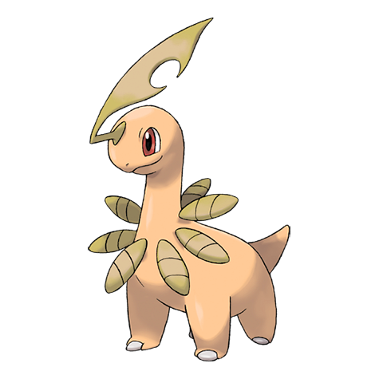
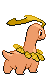

# #153 Bayleef (Leaf Pokémon)

| Official Artwork | Shiny Artwork |
| --- | --- |
|  |  |

The buds that ring its neck give off a spicy aroma that perks people up.

---

## Media

### Default Sprites

| Front | Back | Front Shiny | Back Shiny |
| --- | --- | --- | --- |
|  |  |  |  |

### Cries

Latest (Gen VI+):

<audio controls>
<source src='../../assets/cries/bayleef/latest.ogg' type='audio/ogg'>
  Your browser does not support the audio element.
</audio>

Legacy:

<audio controls>
<source src='../../assets/cries/bayleef/legacy.ogg' type='audio/ogg'>
  Your browser does not support the audio element.
</audio>

---

## Pokédex Data

| National № | Type(s) | Height | Weight | Abilities | Local № |
|------------|---------|--------|--------|-----------|---------|
| #153 | {: width='48'} | 1.2 m | 15.8 kg | 1. Overgrow 2. Natural-Cure | N/A |

---

## Base Stats
|   | HP | Attack | Defense | Sp. Atk | Sp. Def | Speed |
|---|----|--------|---------|---------|---------|-------|
| **Base** | 60 | 62 | 80 | 63 | 80 | 60 |
| **Min** | 230 | 116 | 148 | 117 | 148 | 112 |
| **Max** | 324 | 245 | 284 | 247 | 284 | 240 |

The ranges shown above are for a level 100 Pokémon. Maximum values are based on a beneficial nature, 252 EVs, 31 IVs; minimum values are based on a hindering nature, 0 EVs, 0 IVs.

---

## Forms & Evolutions

!!! warning "WARNING"

    Information on evolutions may not be 100% accurate; differences between evolution methods across generations are not accounted for.

### Forms

Bayleef has no alternate forms.

### Evolution Line

1. [Chikorita](chikorita.md/)
    1. Level Up: [Bayleef](bayleef.md/)
        1. Level Up: [Meganium](meganium.md/)

---

## Training

| EV Yield | Catch Rate | Base Friendship | Base Exp. | Growth Rate | Held Items |
|----------|------------|-----------------|-----------|-------------|------------|
| 1 Defense 1 Special Defense | 45 | 70 | 142 | Medium-Slow | N/A |

---

## Breeding

| Egg Groups | Egg Cycles | Gender | Dimorphic | Color | Shape |
|------------|------------|--------|-----------|-------|-------|
| 1. Monster 2. Plant | 20 | 87.5% Male 12.5% Female | False | Green | Quadruped |

---

## Moves

!!! warning "WARNING"

    Specific move information may be incorrect. However, the general movepool should be accurate; this includes changes made in Blaze Black and Volt White.

### Level Up Moves

| Lv. | Move | Type | Cat. | Power | Acc. | PP |
| --- | --- | --- | --- | --- | --- | --- |
| 1 | Growl | {: width='48'} | {: width='36'} | — | 100 | 40 |
| 1 | Poison Powder | {: width='48'} | {: width='36'} | — | 75 | 35 |
| 1 | Razor Leaf | {: width='48'} | {: width='36'} | 55 | 95 | 25 |
| 1 | Tackle | {: width='48'} | {: width='36'} | 40 | 100 | 35 |
| 6 | Razor Leaf | {: width='48'} | {: width='36'} | 55 | 95 | 25 |
| 9 | Poison Powder | {: width='48'} | {: width='36'} | — | 75 | 35 |
| 9 | Sleep Powder | {: width='48'} | {: width='36'} | — | 75 | 15 |
| 9 | Stun Spore | {: width='48'} | {: width='36'} | — | 75 | 30 |
| 12 | Synthesis | {: width='48'} | {: width='36'} | — | — | 5 |
| 15 | Nature Power | {: width='48'} | {: width='36'} | — | — | 20 |
| 18 | Reflect | {: width='48'} | {: width='36'} | — | — | 20 |
| 22 | Magical Leaf | {: width='48'} | {: width='36'} | 60 | — | 20 |
| 26 | Natural Gift | {: width='48'} | {: width='36'} | — | 100 | 15 |
| 32 | Sweet Scent | {: width='48'} | {: width='36'} | — | 100 | 20 |
| 36 | Light Screen | {: width='48'} | {: width='36'} | — | — | 30 |
| 40 | Body Slam | {: width='48'} | {: width='36'} | 85 | 100 | 15 |
| 46 | Safeguard | {: width='48'} | {: width='36'} | — | — | 25 |
| 50 | Aromatherapy | {: width='48'} | {: width='36'} | — | — | 5 |
| 54 | Solar Beam | {: width='48'} | {: width='36'} | 120 | 100 | 10 |
| 58 | Leaf Storm | {: width='48'} | {: width='36'} | 130 | 90 | 5 |

### TM Moves

| TM | Move | Type | Cat. | Power | Acc. | PP |
| --- | --- | --- | --- | --- | --- | --- |
| HM01 | Cut | {: width='48'} | {: width='36'} | 60 | 100% | 25 |
| HM04 | Strength | {: width='48'} | {: width='36'} | 100 | 100 | 15 |
| TM06 | Toxic | {: width='48'} | {: width='36'} | — | 90 | 10 |
| TM10 | Hidden Power | {: width='48'} | {: width='36'} | 60 | 100 | 15 |
| TM11 | Sunny Day | {: width='48'} | {: width='36'} | — | — | 5 |
| TM16 | Light Screen | {: width='48'} | {: width='36'} | — | — | 30 |
| TM17 | Protect | {: width='48'} | {: width='36'} | — | — | 10 |
| TM20 | Safeguard | {: width='48'} | {: width='36'} | — | — | 25 |
| TM21 | Frustration | {: width='48'} | {: width='36'} | — | 100 | 20 |
| TM22 | Solar Beam | {: width='48'} | {: width='36'} | 120 | 100 | 10 |
| TM27 | Return | {: width='48'} | {: width='36'} | — | 100 | 20 |
| TM32 | Double Team | {: width='48'} | {: width='36'} | — | — | 15 |
| TM33 | Reflect | {: width='48'} | {: width='36'} | — | — | 20 |
| TM42 | Facade | {: width='48'} | {: width='36'} | 70 | 100 | 20 |
| TM44 | Rest | {: width='48'} | {: width='36'} | — | — | 5 |
| TM45 | Attract | {: width='48'} | {: width='36'} | — | 100 | 15 |
| TM48 | Round | {: width='48'} | {: width='36'} | 60 | 100 | 15 |
| TM49 | Echoed Voice | {: width='48'} | {: width='36'} | 40 | 100 | 15 |
| TM53 | Energy Ball | {: width='48'} | {: width='36'} | 90 | 100 | 10 |
| TM70 | Flash | {: width='48'} | {: width='36'} | — | 100 | 20 |
| TM75 | Swords Dance | {: width='48'} | {: width='36'} | — | — | 20 |
| TM86 | Grass Knot | {: width='48'} | {: width='36'} | — | 100 | 20 |
| TM87 | Swagger | {: width='48'} | {: width='36'} | — | 85 | 15 |
| TM90 | Substitute | {: width='48'} | {: width='36'} | — | — | 10 |
| TM94 | Rock Smash | {: width='48'} | {: width='36'} | 60 | 100 | 15 |

### Egg Moves

Bayleef cannot learn any moves by breeding.
### Tutor Moves

| Move | Type | Cat. | Power | Acc. | PP |
| --- | --- | --- | --- | --- | --- |
| Grass Pledge | {: width='48'} | {: width='36'} | 80 | 100 | 10 |

