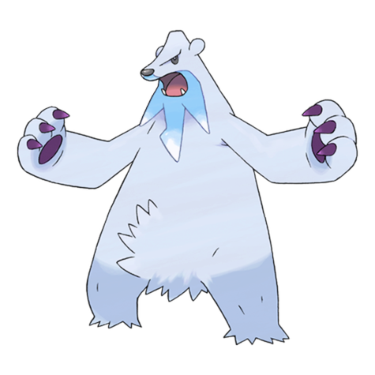

# #614 Beartic (Freezing Pokémon)

| Official Artwork | Shiny Artwork |
|------------------|---------------|
|  |  |

**Blaze Black:** It can make its breath freeze at will. Very able in the water, it swims around in northern seas and catches prey.

**Volt White:** It freezes its breath to create fangs and claws of ice to fight with. Cold northern areas are its habitat.

---

## Media

### Default Sprites

| Front | Shiny | Back | Shiny |
|-------|-------|------|-------|
|  |  |  |  |

### Cries

Latest (Gen VI+):

<audio controls>
<source src='../../assets/cries/beartic/latest.ogg' type='audio/ogg'>
  Your browser does not support the audio element.
</audio>

Legacy:

<audio controls>
<source src='../../assets/cries/beartic/legacy.ogg' type='audio/ogg'>
  Your browser does not support the audio element.
</audio>

---

## Pokédex Data

| National № | Type(s) | Height | Weight | Abilities | Local № |
|------------|---------|--------|--------|-----------|---------|
| #614 | {: width="48"} {: width="48"} | 2.6 m / 8.5 ft | 260.0 kg / 573.2 lbs | 1. Sheer Force 2. Swift Swim | N/A |

---

## Base Stats
|   | HP | Attack | Defense | Sp. Atk | Sp. Def | Speed |
|---|----|--------|---------|---------|---------|-------|
| **Base** | 110 | 130 | 85 | 70 | 85 | 60 |
| **Min** | 330 | 238 | 157 | 130 | 157 | 112 |
| **Max** | 424 | 394 | 295 | 262 | 295 | 240 |

The ranges shown above are for a level 100 Pokémon. Maximum values are based on a beneficial nature, 252 EVs, 31 IVs; minimum values are based on a hindering nature, 0 EVs, 0 IVs.

---

## Forms & Evolutions

!!! warning "WARNING"

    Information on evolutions may not be 100% accurate; differences between evolution methods across generations are not accounted for.

### Forms

Beartic has no alternate forms.

### Evolution Line

1. [Cubchoo](cubchoo.md/)
    1. Level Up: [Beartic](beartic.md/)

---

## Training

| EV Yield | Catch Rate | Base Friendship | Base Exp. | Growth Rate | Held Items |
|----------|------------|-----------------|-----------|-------------|------------|
| 2 Atk | 60 | 50 | 177 | Medium | Aspear Berry (50%) |

---

## Breeding

| Egg Groups | Egg Cycles | Gender | Dimorphic | Color | Shape |
|------------|------------|--------|-----------|-------|-------|
| 1. Ground | 20 | 50.0% Male 50.0% Female | False | White | Quadruped |

---

## Moves

!!! warning "WARNING"

    Specific move information may be incorrect. However, the general movepool should be accurate; this includes changes made in Blaze Black and Volt White.

### Level Up Moves

| Lv. | Move | Type | Cat. | Power | Acc. | PP |
| --- | --- | --- | --- | --- | --- | --- |
| 1 | Bide | {: width="48"} | {: width="36"} | — | — | 10 |
| 1 | Growl | {: width="48"} | {: width="36"} | — | 100 | 40 |
| 1 | Icy Wind | {: width="48"} | {: width="36"} | 55 | 95 | 15 |
| 1 | Powder Snow | {: width="48"} | {: width="36"} | 40 | 100 | 25 |
| 1 | Superpower | {: width="48"} | {: width="36"} | 120 | 100 | 5 |
| 1 | Yawn | {: width="48"} | {: width="36"} | — | — | 10 |
| 5 | Growl | {: width="48"} | {: width="36"} | — | 100 | 40 |
| 9 | Bide | {: width="48"} | {: width="36"} | — | — | 10 |
| 13 | Icy Wind | {: width="48"} | {: width="36"} | 55 | 95 | 15 |
| 17 | Fury Swipes | {: width="48"} | {: width="36"} | 18 | 80 | 15 |
| 21 | Scald | {: width="48"} | {: width="36"} | 80 | 100 | 15 |
| 25 | Endure | {: width="48"} | {: width="36"} | — | — | 10 |
| 29 | Swagger | {: width="48"} | {: width="36"} | — | 85 | 15 |
| 33 | Slash | {: width="48"} | {: width="36"} | 70 | 100 | 20 |
| 36 | Flail | {: width="48"} | {: width="36"} | — | 100 | 15 |
| 37 | Icicle Crash | {: width="48"} | {: width="36"} | 85 | 90 | 10 |
| 41 | Storm Throw | {: width="48"} | {: width="36"} | 60 | 100 | 10 |
| 45 | Blizzard | {: width="48"} | {: width="36"} | 110 | 70 | 5 |
| 53 | Close Combat | {: width="48"} | {: width="36"} | 120 | 100 | 5 |
| 59 | Thrash | {: width="48"} | {: width="36"} | 120 | 100 | 10 |
| 66 | Sheer Cold | {: width="48"} | {: width="36"} | — | 30 | 5 |

### TM Moves

| TM | Move | Type | Cat. | Power | Acc. | PP |
| --- | --- | --- | --- | --- | --- | --- |
| HM01 | Cut | {: width="48"} | {: width="36"} | 60 | 100% | 25 |
| HM03 | Surf | {: width="48"} | {: width="36"} | 90 | 100 | 15 |
| HM04 | Strength | {: width="48"} | {: width="36"} | 100 | 100 | 15 |
| HM05 | Waterfall | {: width="48"} | {: width="36"} | 85 | 100 | 15 |
| HM06 | Dive | {: width="48"} | {: width="36"} | 80 | 100 | 10 |
| TM01 | Hone Claws | {: width="48"} | {: width="36"} | — | — | 15 |
| TM05 | Roar | {: width="48"} | {: width="36"} | — | — | 20 |
| TM06 | Toxic | {: width="48"} | {: width="36"} | — | 90 | 10 |
| TM07 | Hail | {: width="48"} | {: width="36"} | — | — | 10 |
| TM08 | Bulk Up | {: width="48"} | {: width="36"} | — | — | 20 |
| TM10 | Hidden Power | {: width="48"} | {: width="36"} | 60 | 100 | 15 |
| TM12 | Taunt | {: width="48"} | {: width="36"} | — | 100 | 20 |
| TM13 | Ice Beam | {: width="48"} | {: width="36"} | 90 | 100 | 10 |
| TM14 | Blizzard | {: width="48"} | {: width="36"} | 110 | 70 | 5 |
| TM15 | Hyper Beam | {: width="48"} | {: width="36"} | 150 | 90 | 5 |
| TM17 | Protect | {: width="48"} | {: width="36"} | — | — | 10 |
| TM18 | Rain Dance | {: width="48"} | {: width="36"} | — | — | 5 |
| TM21 | Frustration | {: width="48"} | {: width="36"} | — | 100 | 20 |
| TM26 | Earthquake | {: width="48"} | {: width="36"} | 100 | 100 | 10 |
| TM27 | Return | {: width="48"} | {: width="36"} | — | 100 | 20 |
| TM28 | Dig | {: width="48"} | {: width="36"} | 100 | 100 | 10 |
| TM31 | Brick Break | {: width="48"} | {: width="36"} | 75 | 100 | 15 |
| TM32 | Double Team | {: width="48"} | {: width="36"} | — | — | 15 |
| TM39 | Rock Tomb | {: width="48"} | {: width="36"} | 60 | 95 | 15 |
| TM40 | Aerial Ace | {: width="48"} | {: width="36"} | 60 | — | 20 |
| TM42 | Facade | {: width="48"} | {: width="36"} | 70 | 100 | 20 |
| TM44 | Rest | {: width="48"} | {: width="36"} | — | — | 5 |
| TM45 | Attract | {: width="48"} | {: width="36"} | — | 100 | 15 |
| TM48 | Round | {: width="48"} | {: width="36"} | 60 | 100 | 15 |
| TM49 | Echoed Voice | {: width="48"} | {: width="36"} | 40 | 100 | 15 |
| TM52 | Focus Blast | {: width="48"} | {: width="36"} | 120 | 70 | 5 |
| TM56 | Fling | {: width="48"} | {: width="36"} | — | 100 | 10 |
| TM65 | Shadow Claw | {: width="48"} | {: width="36"} | 80 | 100 | 15 |
| TM68 | Giga Impact | {: width="48"} | {: width="36"} | 150 | 90 | 5 |
| TM71 | Stone Edge | {: width="48"} | {: width="36"} | 100 | 80 | 5 |
| TM75 | Swords Dance | {: width="48"} | {: width="36"} | — | — | 20 |
| TM78 | Bulldoze | {: width="48"} | {: width="36"} | 80 | 100 | 20 |
| TM79 | Frost Breath | {: width="48"} | {: width="36"} | 60 | 90 | 10 |
| TM80 | Rock Slide | {: width="48"} | {: width="36"} | 75 | 90 | 10 |
| TM86 | Grass Knot | {: width="48"} | {: width="36"} | — | 100 | 20 |
| TM87 | Swagger | {: width="48"} | {: width="36"} | — | 85 | 15 |
| TM90 | Substitute | {: width="48"} | {: width="36"} | — | — | 10 |
| TM94 | Rock Smash | {: width="48"} | {: width="36"} | 60 | 100 | 15 |

### Egg Moves

Beartic cannot learn any moves by breeding.
### Tutor Moves

Beartic cannot learn any moves from tutors.
