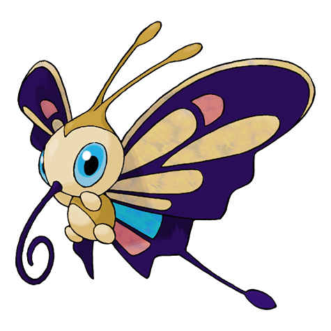
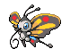
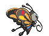
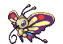
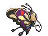
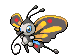
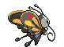
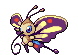
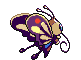

# Beautifly (Butterfly Pokémon)

| Official Artwork | Shiny Artwork |
| --- | --- |
|  |  |

Despite its looks, it is aggressive. It jabs with its long, thin mouth if disturbed while collecting pollen.

---

## Media

### Default Sprites

| Front | Back | Front Shiny | Back Shiny |
| --- | --- | --- | --- |
|  |  |  |  |

### Female Sprites

| Front | Back | Front Shiny | Back Shiny |
| --- | --- | --- | --- |
|  |  |  |  |

### Cries

Latest (Gen VI+):

<audio controls>
<source src='../../assets/cries/beautifly/latest.ogg' type='audio/ogg'>
  Your browser does not support the audio element.
</audio>

Legacy:

<audio controls>
<source src='../../assets/cries/beautifly/legacy.ogg' type='audio/ogg'>
  Your browser does not support the audio element.
</audio>

---

## Pokédex Data

| National № | Type(s) | Height | Weight | Abilities | Local № |
|------------|---------|--------|--------|-----------|---------|
| #267 | {: width='48'} {: width='48'} | 1.0 m | 28.4 kg | 1. Swarm 2. Shield-Dust | N/A |

---

## Base Stats
|   | HP | Attack | Defense | Sp. Atk | Sp. Def | Speed |
|---|----|--------|---------|---------|---------|-------|
| **Base** | 60 | 70 | 60 | 105 | 60 | 85 |
| **Min** | 230 | 130 | 112 | 193 | 112 | 157 |
| **Max** | 324 | 262 | 240 | 339 | 240 | 295 |

The ranges shown above are for a level 100 Pokémon. Maximum values are based on a beneficial nature, 252 EVs, 31 IVs; minimum values are based on a hindering nature, 0 EVs, 0 IVs.

---

## Forms & Evolutions

!!! warning "WARNING"

    Information on evolutions may not be 100% accurate; differences between evolution methods across generations are not accounted for.

### Forms

Beautifly has no alternate forms.

### Evolution Line

1. [Wurmple](wurmple.md/)
    1. Level Up: [Silcoon](silcoon.md/)
        1. Level Up: [Beautifly](beautifly.md/)

    2. Level Up: [Cascoon](cascoon.md/)
        1. Level Up: [Dustox](dustox.md/)

---

## Training

| EV Yield | Catch Rate | Base Friendship | Base Exp. | Growth Rate | Held Items |
|----------|------------|-----------------|-----------|-------------|------------|
| 3 Special Attack | 45 | 70 | 178 | Medium | shed-shell (5%) |

---

## Breeding

| Egg Groups | Egg Cycles | Gender | Dimorphic | Color | Shape |
|------------|------------|--------|-----------|-------|-------|
| 1. Bug | 15 | 50.0% Male 50.0% Female | True | Yellow | Bug-Wings |

---

## Moves

!!! warning "WARNING"

    Specific move information may be incorrect. However, the general movepool should be accurate; this includes changes made in Blaze Black and Volt White.

### Level Up Moves

| Lv. | Move | Type | Cat. | Power | Acc. | PP |
| --- | --- | --- | --- | --- | --- | --- |
| 1 | Absorb | {: width='48'} | {: width='36'} | 50 | 100 | 25 |
| 10 | Absorb | {: width='48'} | {: width='36'} | 50 | 100 | 25 |
| 10 | Air Cutter | {: width='48'} | {: width='36'} | 60 | 95 | 25 |
| 10 | Struggle Bug | {: width='48'} | {: width='36'} | 50 | 100 | 20 |
| 13 | Gust | {: width='48'} | {: width='36'} | 40 | 100 | 35 |
| 17 | Sleep Powder | {: width='48'} | {: width='36'} | — | 75 | 15 |
| 17 | Stun Spore | {: width='48'} | {: width='36'} | — | 75 | 30 |
| 20 | Morning Sun | {: width='48'} | {: width='36'} | — | — | 5 |
| 24 | Mega Drain | {: width='48'} | {: width='36'} | 50 | 100 | 15 |
| 27 | Whirlwind | {: width='48'} | {: width='36'} | — | — | 20 |
| 31 | Attract | {: width='48'} | {: width='36'} | — | 100 | 15 |
| 34 | Silver Wind | {: width='48'} | {: width='36'} | 60 | 100 | 5 |
| 38 | Giga Drain | {: width='48'} | {: width='36'} | 75 | 100 | 10 |
| 41 | Bug Buzz | {: width='48'} | {: width='36'} | 90 | 100 | 10 |
| 45 | Quiver Dance | {: width='48'} | {: width='36'} | — | — | 20 |
| 49 | Air Slash | {: width='48'} | {: width='36'} | 75 | 95 | 15 |

### TM Moves

| TM | Move | Type | Cat. | Power | Acc. | PP |
| --- | --- | --- | --- | --- | --- | --- |
| TM06 | Toxic | {: width='48'} | {: width='36'} | — | 90 | 10 |
| TM09 | Venoshock | {: width='48'} | {: width='36'} | 65 | 100 | 10 |
| TM10 | Hidden Power | {: width='48'} | {: width='36'} | 60 | 100 | 15 |
| TM11 | Sunny Day | {: width='48'} | {: width='36'} | — | — | 5 |
| TM15 | Hyper Beam | {: width='48'} | {: width='36'} | 150 | 90 | 5 |
| TM17 | Protect | {: width='48'} | {: width='36'} | — | — | 10 |
| TM20 | Safeguard | {: width='48'} | {: width='36'} | — | — | 25 |
| TM21 | Frustration | {: width='48'} | {: width='36'} | — | 100 | 20 |
| TM22 | Solar Beam | {: width='48'} | {: width='36'} | 120 | 100 | 10 |
| TM27 | Return | {: width='48'} | {: width='36'} | — | 100 | 20 |
| TM29 | Psychic | {: width='48'} | {: width='36'} | 90 | 100 | 10 |
| TM30 | Shadow Ball | {: width='48'} | {: width='36'} | 90 | 100 | 15 |
| TM32 | Double Team | {: width='48'} | {: width='36'} | — | — | 15 |
| TM40 | Aerial Ace | {: width='48'} | {: width='36'} | 60 | — | 20 |
| TM42 | Facade | {: width='48'} | {: width='36'} | 70 | 100 | 20 |
| TM44 | Rest | {: width='48'} | {: width='36'} | — | — | 5 |
| TM45 | Attract | {: width='48'} | {: width='36'} | — | 100 | 15 |
| TM46 | Thief | {: width='48'} | {: width='36'} | 60 | 100 | 25 |
| TM48 | Round | {: width='48'} | {: width='36'} | 60 | 100 | 15 |
| TM53 | Energy Ball | {: width='48'} | {: width='36'} | 90 | 100 | 10 |
| TM62 | Acrobatics | {: width='48'} | {: width='36'} | 55 | 100 | 15 |
| TM68 | Giga Impact | {: width='48'} | {: width='36'} | 150 | 90 | 5 |
| TM70 | Flash | {: width='48'} | {: width='36'} | — | 100 | 20 |
| TM76 | Struggle Bug | {: width='48'} | {: width='36'} | 50 | 100 | 20 |
| TM87 | Swagger | {: width='48'} | {: width='36'} | — | 85 | 15 |
| TM89 | U Turn | {: width='48'} | {: width='36'} | 70 | 100 | 20 |
| TM90 | Substitute | {: width='48'} | {: width='36'} | — | — | 10 |

### Egg Moves

Beautifly cannot learn any moves by breeding.
### Tutor Moves

Beautifly cannot learn any moves from tutors.
