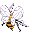

# #015 Beedrill (Poison Bee Pokémon)

| Official Artwork | Shiny Artwork |
| --- | --- |
|  |  |

Its best attack involves flying around at high speed, striking with poison needles, then flying off.

---

## Media

### Sprites

| Front | Back | Front Shiny | Back Shiny |
| --- | --- | --- | --- |
|  |  |  |  |

### Cries

Latest (Gen VI+):

<audio controls>
  <source src='../assets/cries/beedrill/latest.ogg' type='audio/ogg'>
  Your browser does not support the audio element.
</audio>

Legacy:

<audio controls>
  <source src='../assets/cries/beedrill/legacy.ogg' type='audio/ogg'>
  Your browser does not support the audio element.
</audio>

---

## Pokédex Data

| National № | Type(s) | Height | Weight | Abilities | Local № |
|------------|---------|--------|--------|-----------|---------|
| #15 | {: width='48'} {: width='48'} | 1.0 m | 29.5 kg | 1. Sniper 2. Poison-Touch | #N/A |

---

## Base Stats
---

## Base Stats
|   | HP | Attack | Defense | Sp. Atk | Sp. Def | Speed |
|---|----|--------|---------|---------|---------|-------|
| **Base** | 65 | 95 | 40 | 45 | 80 | 95 |
| **Min** | 240 | 175 | 76 | 85 | 148 | 175 |
| **Max** | 334 | 317 | 196 | 207 | 284 | 317 |

The ranges shown above are for a level 100 Pokémon. Maximum values are based on a beneficial nature, 252 EVs, 31 IVs; minimum values are based on a hindering nature, 0 EVs, 0 IVs.

---

## Forms & Evolutions

!!! warning "WARNING"

    Some forms may not be available in Blaze Black/Volt White. Also information on evolutions may not be 100% accurate; it is currently quite complex to track generational evolution data.

### Forms

1. [Beedrill](beedrill.md/)
2. [Beedrill-Mega](beedrill-mega.md/)

### Evolution Line

1. [Weedle](weedle.md/)
1. Level Up: [Kakuna](kakuna.md/)
1. Level Up: [Beedrill](beedrill.md/)

---

## Training

| EV Yield | Catch Rate | Base Friendship | Base Exp. | Growth Rate | Held Items |
|----------|------------|-----------------|-----------|-------------|------------|
| 2 Attack 1 Special Defense | 45 | 70 | 178 | Medium | Poison Barb (5%) |

---

## Breeding

| Egg Groups | Egg Cycles | Gender | Dimorphic | Color | Shape |
|------------|------------|--------|-----------|-------|-------|
| 1. Bug | 15 | 50.0% Male 50.0% Female | False | Yellow | Bug-Wings |

---

## Moves

!!! warning "WARNING"

    Specific move information may be incorrect. However, the general movepool should be accurate (including changes to learnset).

### Level Up Moves

Lv. | Move | Type | Cat. | Power | Acc. | PP
--- | --- | --- | --- | --- | --- | ---
| 1 | Bug Bite | {: width='48'} | {: width='36'} | 60 | 100 | 20 |
| 1 | Fury Attack | {: width='48'} | {: width='36'} | 15 | 85 | 20 |
| 10 | Cross Poison | {: width='48'} | {: width='36'} | 70 | 100 | 20 |
| 10 | Fury Attack | {: width='48'} | {: width='36'} | 15 | 85 | 20 |
| 10 | Rage | {: width='48'} | {: width='36'} | 20 | 100 | 20 |
| 13 | Focus Energy | {: width='48'} | {: width='36'} | — | — | 30 |
| 16 | Twineedle | {: width='48'} | {: width='36'} | 25 | 100 | 20 |
| 19 | X Scissor | {: width='48'} | {: width='36'} | 80 | 100 | 15 |
| 22 | Pursuit | {: width='48'} | {: width='36'} | 40 | 100 | 20 |
| 25 | Toxic Spikes | {: width='48'} | {: width='36'} | — | — | 20 |
| 28 | Pin Missile | {: width='48'} | {: width='36'} | 25 | 95 | 20 |
| 31 | Agility | {: width='48'} | {: width='36'} | — | — | 30 |
| 34 | Assurance | {: width='48'} | {: width='36'} | 60 | 100 | 10 |
| 37 | Poison Jab | {: width='48'} | {: width='36'} | 80 | 100 | 20 |
| 40 | Endeavor | {: width='48'} | {: width='36'} | — | 100 | 5 |
| 43 | Megahorn | {: width='48'} | {: width='36'} | 120 | 85 | 10 |
| 46 | Baton Pass | {: width='48'} | {: width='36'} | — | — | 40 |

### TM Moves

TM | Move | Type | Cat. | Power | Acc. | PP
--- | --- | --- | --- | --- | --- | ---
| HM01 | Cut | {: width='48'} | {: width='36'} | 60 | 100 | 20 |
| TM06 | Toxic | {: width='48'} | {: width='36'} | — | 90 | 10 |
| TM09 | Venoshock | {: width='48'} | {: width='36'} | 65 | 100 | 10 |
| TM10 | Hidden Power | {: width='48'} | {: width='36'} | 60 | 100 | 15 |
| TM11 | Sunny Day | {: width='48'} | {: width='36'} | — | — | 5 |
| TM15 | Hyper Beam | {: width='48'} | {: width='36'} | 150 | 90 | 5 |
| TM17 | Protect | {: width='48'} | {: width='36'} | — | — | 10 |
| TM21 | Frustration | {: width='48'} | {: width='36'} | — | 100 | 20 |
| TM22 | Solar Beam | {: width='48'} | {: width='36'} | 120 | 100 | 10 |
| TM27 | Return | {: width='48'} | {: width='36'} | — | 100 | 20 |
| TM31 | Brick Break | {: width='48'} | {: width='36'} | 75 | 100 | 15 |
| TM32 | Double Team | {: width='48'} | {: width='36'} | — | — | 15 |
| TM36 | Sludge Bomb | {: width='48'} | {: width='36'} | 90 | 100 | 10 |
| TM40 | Aerial Ace | {: width='48'} | {: width='36'} | 60 | — | 20 |
| TM42 | Facade | {: width='48'} | {: width='36'} | 70 | 100 | 20 |
| TM44 | Rest | {: width='48'} | {: width='36'} | — | — | 5 |
| TM45 | Attract | {: width='48'} | {: width='36'} | — | 100 | 15 |
| TM46 | Thief | {: width='48'} | {: width='36'} | 60 | 100 | 25 |
| TM48 | Round | {: width='48'} | {: width='36'} | 60 | 100 | 15 |
| TM54 | False Swipe | {: width='48'} | {: width='36'} | 40 | 100 | 40 |
| TM62 | Acrobatics | {: width='48'} | {: width='36'} | 55 | 100 | 15 |
| TM66 | Payback | {: width='48'} | {: width='36'} | 50 | 100 | 10 |
| TM68 | Giga Impact | {: width='48'} | {: width='36'} | 150 | 90 | 5 |
| TM70 | Flash | {: width='48'} | {: width='36'} | — | 100 | 20 |
| TM75 | Swords Dance | {: width='48'} | {: width='36'} | — | — | 20 |
| TM76 | Struggle Bug | {: width='48'} | {: width='36'} | 50 | 100 | 20 |
| TM84 | Poison Jab | {: width='48'} | {: width='36'} | 80 | 100 | 20 |
| TM87 | Swagger | {: width='48'} | {: width='36'} | — | 85 | 15 |
| TM89 | U Turn | {: width='48'} | {: width='36'} | 70 | 100 | 20 |
| TM90 | Substitute | {: width='48'} | {: width='36'} | — | — | 10 |
| TM94 | Rock Smash | {: width='48'} | {: width='36'} | 40 | 100 | 15 |

### Egg Moves

Beedrill cannot learn any moves by breeding.
### Tutor Moves

Beedrill cannot learn any moves from tutors.
