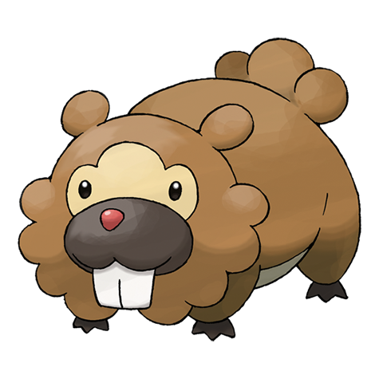

# #399 Bidoof (Plump Mouse Pokémon)

| Official Artwork | Shiny Artwork |
| --- | --- |
|  |  |

A comparison revealed that Bidoof’s front teeth grow at the same rate as Rattata’s.

---

## Media

### Sprites

| Front | Back | Front Shiny | Back Shiny |
| --- | --- | --- | --- |
|  |  |  |  |

### Female Sprites

| Front | Back | Front Shiny | Back Shiny |
| --- | --- | --- | --- |
|  |  |  |  |

### Cries

Latest (Gen VI+):

<audio controls>
<source src='../../assets/cries/bidoof/latest.ogg' type='audio/ogg'>
  Your browser does not support the audio element.
</audio>

Legacy:

<audio controls>
<source src='../../assets/cries/bidoof/legacy.ogg' type='audio/ogg'>
  Your browser does not support the audio element.
</audio>

---

## Pokédex Data

| National № | Type(s) | Height | Weight | Abilities | Local № |
|------------|---------|--------|--------|-----------|---------|
| #399 | {: width='48'} | 0.5 m | 20.0 kg | 1. Simple 2. Moody | N/A |

---

## Base Stats
|   | HP | Attack | Defense | Sp. Atk | Sp. Def | Speed |
|---|----|--------|---------|---------|---------|-------|
| **Base** | 59 | 45 | 40 | 35 | 40 | 31 |
| **Min** | 228 | 85 | 76 | 67 | 76 | 60 |
| **Max** | 322 | 207 | 196 | 185 | 196 | 177 |

The ranges shown above are for a level 100 Pokémon. Maximum values are based on a beneficial nature, 252 EVs, 31 IVs; minimum values are based on a hindering nature, 0 EVs, 0 IVs.

---

## Forms & Evolutions

!!! warning "WARNING"

    Information on evolutions may not be 100% accurate; differences between evolution methods across generations are not accounted for.

### Forms

Bidoof has no alternate forms.

### Evolution Line

1. [Bidoof](bidoof.md/)
    1. Level Up: [Bibarel](bibarel.md/)

---

## Training

| EV Yield | Catch Rate | Base Friendship | Base Exp. | Growth Rate | Held Items |
|----------|------------|-----------------|-----------|-------------|------------|
| 1 Hp | 255 | 70 | 50 | Medium | N/A |

---

## Breeding

| Egg Groups | Egg Cycles | Gender | Dimorphic | Color | Shape |
|------------|------------|--------|-----------|-------|-------|
| 1. Water1 2. Ground | 15 | 50.0% Male 50.0% Female | True | Brown | Quadruped |

---

## Moves

!!! warning "WARNING"

    Specific move information may be incorrect. However, the general movepool should be accurate; this includes changes made in Blaze Black and Volt White.

### Level Up Moves

| Lv. | Move | Type | Cat. | Power | Acc. | PP |
| --- | --- | --- | --- | --- | --- | --- |
| 1 | Tackle | {: width='48'} | {: width='36'} | 40 | 100 | 35 |
| 5 | Growl | {: width='48'} | {: width='36'} | — | 100 | 40 |
| 9 | Defense Curl | {: width='48'} | {: width='36'} | — | — | 40 |
| 13 | Rollout | {: width='48'} | {: width='36'} | 30 | 90 | 20 |
| 17 | Headbutt | {: width='48'} | {: width='36'} | 70 | 100 | 15 |
| 21 | Hyper Fang | {: width='48'} | {: width='36'} | 80 | 90 | 15 |
| 25 | Yawn | {: width='48'} | {: width='36'} | — | — | 10 |
| 29 | Amnesia | {: width='48'} | {: width='36'} | — | — | 20 |
| 33 | Take Down | {: width='48'} | {: width='36'} | 90 | 85 | 20 |
| 37 | Super Fang | {: width='48'} | {: width='36'} | — | 90 | 10 |
| 41 | Superpower | {: width='48'} | {: width='36'} | 120 | 100 | 5 |
| 45 | Curse | {: width='48'} | {: width='36'} | — | — | 10 |
| 49 | Double Edge | {: width='48'} | {: width='36'} | 120 | 100 | 15 |

### TM Moves

| TM | Move | Type | Cat. | Power | Acc. | PP |
| --- | --- | --- | --- | --- | --- | --- |
| HM01 | Cut | {: width='48'} | {: width='36'} | 60 | 100 | 20 |
| TM06 | Toxic | {: width='48'} | {: width='36'} | — | 90 | 10 |
| TM10 | Hidden Power | {: width='48'} | {: width='36'} | 60 | 100 | 15 |
| TM11 | Sunny Day | {: width='48'} | {: width='36'} | — | — | 5 |
| TM12 | Taunt | {: width='48'} | {: width='36'} | — | 100 | 20 |
| TM13 | Ice Beam | {: width='48'} | {: width='36'} | 90 | 100 | 10 |
| TM14 | Blizzard | {: width='48'} | {: width='36'} | 110 | 70 | 5 |
| TM17 | Protect | {: width='48'} | {: width='36'} | — | — | 10 |
| TM18 | Rain Dance | {: width='48'} | {: width='36'} | — | — | 5 |
| TM21 | Frustration | {: width='48'} | {: width='36'} | — | 100 | 20 |
| TM24 | Thunderbolt | {: width='48'} | {: width='36'} | 90 | 100 | 15 |
| TM25 | Thunder | {: width='48'} | {: width='36'} | 110 | 70 | 10 |
| TM27 | Return | {: width='48'} | {: width='36'} | — | 100 | 20 |
| TM28 | Dig | {: width='48'} | {: width='36'} | 100 | 100 | 10 |
| TM30 | Shadow Ball | {: width='48'} | {: width='36'} | 90 | 100 | 15 |
| TM32 | Double Team | {: width='48'} | {: width='36'} | — | — | 15 |
| TM42 | Facade | {: width='48'} | {: width='36'} | 70 | 100 | 20 |
| TM44 | Rest | {: width='48'} | {: width='36'} | — | — | 5 |
| TM45 | Attract | {: width='48'} | {: width='36'} | — | 100 | 15 |
| TM46 | Thief | {: width='48'} | {: width='36'} | 60 | 100 | 25 |
| TM48 | Round | {: width='48'} | {: width='36'} | 60 | 100 | 15 |
| TM49 | Echoed Voice | {: width='48'} | {: width='36'} | 40 | 100 | 15 |
| TM57 | Charge Beam | {: width='48'} | {: width='36'} | 50 | 90 | 10 |
| TM67 | Retaliate | {: width='48'} | {: width='36'} | 70 | 100 | 5 |
| TM73 | Thunder Wave | {: width='48'} | {: width='36'} | — | 90 | 20 |
| TM83 | Work Up | {: width='48'} | {: width='36'} | — | — | 30 |
| TM86 | Grass Knot | {: width='48'} | {: width='36'} | — | 100 | 20 |
| TM87 | Swagger | {: width='48'} | {: width='36'} | — | 85 | 15 |
| TM88 | Pluck | {: width='48'} | {: width='36'} | 60 | 100 | 20 |
| TM90 | Substitute | {: width='48'} | {: width='36'} | — | — | 10 |
| TM94 | Rock Smash | {: width='48'} | {: width='36'} | 40 | 100 | 15 |

### Egg Moves

| Move | Type | Cat. | Power | Acc. | PP |
| --- | --- | --- | --- | --- | --- |
| Quick Attack | {: width='48'} | {: width='36'} | 40 | 100 | 30 |
| Defense Curl | {: width='48'} | {: width='36'} | — | — | 40 |
| Skull Bash | {: width='48'} | {: width='36'} | 130 | 100 | 10 |
| Fury Swipes | {: width='48'} | {: width='36'} | 18 | 80 | 15 |
| Endure | {: width='48'} | {: width='36'} | — | — | 10 |
| Rollout | {: width='48'} | {: width='36'} | 30 | 90 | 20 |
| Sleep Talk | {: width='48'} | {: width='36'} | — | — | 10 |
| Odor Sleuth | {: width='48'} | {: width='36'} | — | — | 40 |
| Water Sport | {: width='48'} | {: width='36'} | — | — | 15 |
| Aqua Tail | {: width='48'} | {: width='36'} | 90 | 90 | 10 |
| Rock Climb | {: width='48'} | {: width='36'} | 90 | 85 | 20 |

### Tutor Moves

Bidoof cannot learn any moves from tutors.
