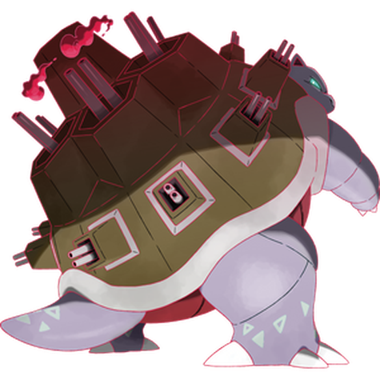
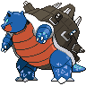
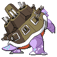
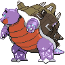

# #10197 Blastoise Gmax (Shellfish Pokémon)

| Official Artwork | Shiny Artwork |
| --- | --- |
|  |  |

The jets of water it spouts from the rocket cannons on its shell can punch through thick steel.

---

## Media

### Sprites

| Front | Back | Front Shiny | Back Shiny |
| --- | --- | --- | --- |
|  |  |  |  |

### Cries

Latest (Gen VI+):

<audio controls>
  <source src='../assets/cries/10197/latest.ogg' type='audio/ogg'>
  Your browser does not support the audio element.
</audio>

Legacy:

<audio controls>
  <source src='../assets/cries/10197/legacy.ogg' type='audio/ogg'>
  Your browser does not support the audio element.
</audio>

---

## Pokédex Data

| National № | Type(s) | Height | Weight | Abilities | Local № |
|------------|---------|--------|--------|-----------|---------|
| #10197 | {: width='48'} | 25.0 m | 1000.0 kg | 1. Torrent 2. Rain-Dish | #N/A |

---

## Base Stats
---

## Base Stats
|   | HP | Attack | Defense | Sp. Atk | Sp. Def | Speed |
|---|----|--------|---------|---------|---------|-------|
| **Base** | 79 | 83 | 100 | 85 | 105 | 78 |
| **Min** | 268 | 153 | 184 | 157 | 193 | 144 |
| **Max** | 362 | 291 | 328 | 295 | 339 | 280 |

The ranges shown above are for a level 100 Pokémon. Maximum values are based on a beneficial nature, 252 EVs, 31 IVs; minimum values are based on a hindering nature, 0 EVs, 0 IVs.

---

## Forms & Evolutions

!!! warning "WARNING"

    Some forms may not be available in Blaze Black/Volt White. Also information on evolutions may not be 100% accurate; it is currently quite complex to track generational evolution data.

### Forms

1. [Blastoise](blastoise.md/)
2. [Blastoise-Mega](blastoise-mega.md/)
3. [Blastoise-Gmax](blastoise-gmax.md/)

### Evolution Line

1. [Squirtle](squirtle.md/)
1. Level Up: [Wartortle](wartortle.md/)
1. Level Up: [Blastoise](blastoise.md/)

---

## Training

| EV Yield | Catch Rate | Base Friendship | Base Exp. | Growth Rate | Held Items |
|----------|------------|-----------------|-----------|-------------|------------|
| 3 Special Defense | 45 | 50 | 239 | Medium-Slow | N/A |

---

## Breeding

| Egg Groups | Egg Cycles | Gender | Dimorphic | Color | Shape |
|------------|------------|--------|-----------|-------|-------|
| 1. Monster 2. Water1 | 20 | 87.5% Male 12.5% Female | False | Blue | Upright |

---

## Moves

!!! warning "WARNING"

    Specific move information may be incorrect. However, the general movepool should be accurate (including changes to learnset).

### Level Up Moves

Blastoise Gmax cannot learn any moves by leveling up.
### TM Moves

Blastoise Gmax cannot learn any TM moves.
### Egg Moves

Blastoise Gmax cannot learn any moves by breeding.
### Tutor Moves

Blastoise Gmax cannot learn any moves from tutors.
