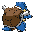
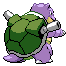

# #009 Blastoise (Shellfish Pokémon)

| Official Artwork | Shiny Artwork |
|------------------|---------------|
|  |  |

The jets of water it spouts from the rocket cannons on its shell can punch through thick steel.

---

## Media

### Default Sprites

| Front | Shiny | Back | Shiny |
|-------|-------|------|-------|
|  |  |  |  |

### Cries

Latest (Gen VI+):

<audio controls>
<source src='../../assets/cries/blastoise/latest.ogg' type='audio/ogg'>
  Your browser does not support the audio element.
</audio>

Legacy:

<audio controls>
<source src='../../assets/cries/blastoise/legacy.ogg' type='audio/ogg'>
  Your browser does not support the audio element.
</audio>

---

## Pokédex Data

| National № | Type(s) | Height | Weight | Abilities | Local № |
|------------|---------|--------|--------|-----------|---------|
| #9 | {: width="48"} | 1.6 m / 5.2 ft | 85.5 kg / 188.5 lbs | 1. Torrent 2. Sturdy | N/A |

---

## Base Stats
|   | HP | Attack | Defense | Sp. Atk | Sp. Def | Speed |
|---|----|--------|---------|---------|---------|-------|
| **Base** | 79 | 83 | 100 | 85 | 105 | 78 |
| **Min** | 268 | 153 | 184 | 157 | 193 | 144 |
| **Max** | 362 | 291 | 328 | 295 | 339 | 280 |

The ranges shown above are for a level 100 Pokémon. Maximum values are based on a beneficial nature, 252 EVs, 31 IVs; minimum values are based on a hindering nature, 0 EVs, 0 IVs.

---

## Forms & Evolutions

!!! warning "WARNING"

    Information on evolutions may not be 100% accurate; differences between evolution methods across generations are not accounted for.

### Forms

Blastoise has no alternate forms.

### Evolution Line

1. [Squirtle](squirtle.md/)
    1. Level Up: [Wartortle](wartortle.md/)
        1. Level Up: [Blastoise](blastoise.md/)

---

## Training

| EV Yield | Catch Rate | Base Friendship | Base Exp. | Growth Rate | Held Items |
|----------|------------|-----------------|-----------|-------------|------------|
| 3 Sp. Def | 45 | 50 | 265 | Medium Slow | Mystic Water (50%) |

---

## Breeding

| Egg Groups | Egg Cycles | Gender | Dimorphic | Color | Shape |
|------------|------------|--------|-----------|-------|-------|
| 1. Monster 2. Water1 | 20 | 87.5% Male 12.5% Female | False | Blue | Upright |

---

## Moves

!!! warning "WARNING"

    Specific move information may be incorrect. However, the general movepool should be accurate; this includes changes made in Blaze Black and Volt White.

### Level Up Moves

| Lv. | Move | Type | Cat. | Power | Acc. | PP |
| --- | --- | --- | --- | --- | --- | --- |
| 1 | Bubble | {: width="48"} | {: width="36"} | 40 | 100 | 30 |
| 1 | Flash Cannon | {: width="48"} | {: width="36"} | 80 | 100 | 10 |
| 1 | Tackle | {: width="48"} | {: width="36"} | 40 | 100 | 35 |
| 1 | Tail Whip | {: width="48"} | {: width="36"} | — | 100 | 30 |
| 1 | Withdraw | {: width="48"} | {: width="36"} | — | — | 40 |
| 1 | Zap Cannon | {: width="48"} | {: width="36"} | 120 | 50 | 5 |
| 4 | Tail Whip | {: width="48"} | {: width="36"} | — | 100 | 30 |
| 7 | Bubble | {: width="48"} | {: width="36"} | 40 | 100 | 30 |
| 10 | Withdraw | {: width="48"} | {: width="36"} | — | — | 40 |
| 13 | Water Gun | {: width="48"} | {: width="36"} | 40 | 100 | 25 |
| 16 | Aqua Jet | {: width="48"} | {: width="36"} | 40 | 100 | 20 |
| 16 | Bite | {: width="48"} | {: width="36"} | 60 | 100 | 25 |
| 20 | Rapid Spin | {: width="48"} | {: width="36"} | 50 | 100 | 40 |
| 24 | Protect | {: width="48"} | {: width="36"} | — | — | 10 |
| 28 | Water Pulse | {: width="48"} | {: width="36"} | 60 | 100 | 20 |
| 32 | Aqua Tail | {: width="48"} | {: width="36"} | 90 | 90 | 10 |
| 39 | Skull Bash | {: width="48"} | {: width="36"} | 130 | 100 | 10 |
| 39 | Zen Headbutt | {: width="48"} | {: width="36"} | 80 | 90 | 15 |
| 46 | Iron Defense | {: width="48"} | {: width="36"} | — | — | 15 |
| 53 | Rain Dance | {: width="48"} | {: width="36"} | — | — | 5 |
| 60 | Hydro Pump | {: width="48"} | {: width="36"} | 110 | 80 | 5 |
| 67 | Water Spout | {: width="48"} | {: width="36"} | 150 | 100 | 5 |
| 74 | Shell Smash | {: width="48"} | {: width="36"} | — | — | 15 |

### TM Moves

| TM | Move | Type | Cat. | Power | Acc. | PP |
| --- | --- | --- | --- | --- | --- | --- |
| HM03 | Surf | {: width="48"} | {: width="36"} | 90 | 100 | 15 |
| HM04 | Strength | {: width="48"} | {: width="36"} | 100 | 100 | 15 |
| HM05 | Waterfall | {: width="48"} | {: width="36"} | 85 | 100 | 15 |
| HM06 | Dive | {: width="48"} | {: width="36"} | 80 | 100 | 10 |
| TM05 | Roar | {: width="48"} | {: width="36"} | — | — | 20 |
| TM06 | Toxic | {: width="48"} | {: width="36"} | — | 90 | 10 |
| TM07 | Hail | {: width="48"} | {: width="36"} | — | — | 10 |
| TM10 | Hidden Power | {: width="48"} | {: width="36"} | 60 | 100 | 15 |
| TM13 | Ice Beam | {: width="48"} | {: width="36"} | 90 | 100 | 10 |
| TM14 | Blizzard | {: width="48"} | {: width="36"} | 110 | 70 | 5 |
| TM15 | Hyper Beam | {: width="48"} | {: width="36"} | 150 | 90 | 5 |
| TM17 | Protect | {: width="48"} | {: width="36"} | — | — | 10 |
| TM18 | Rain Dance | {: width="48"} | {: width="36"} | — | — | 5 |
| TM21 | Frustration | {: width="48"} | {: width="36"} | — | 100 | 20 |
| TM23 | Smack Down | {: width="48"} | {: width="36"} | 50 | 100 | 15 |
| TM26 | Earthquake | {: width="48"} | {: width="36"} | 100 | 100 | 10 |
| TM27 | Return | {: width="48"} | {: width="36"} | — | 100 | 20 |
| TM28 | Dig | {: width="48"} | {: width="36"} | 100 | 100 | 10 |
| TM31 | Brick Break | {: width="48"} | {: width="36"} | 75 | 100 | 15 |
| TM32 | Double Team | {: width="48"} | {: width="36"} | — | — | 15 |
| TM39 | Rock Tomb | {: width="48"} | {: width="36"} | 60 | 95 | 15 |
| TM42 | Facade | {: width="48"} | {: width="36"} | 70 | 100 | 20 |
| TM44 | Rest | {: width="48"} | {: width="36"} | — | — | 5 |
| TM45 | Attract | {: width="48"} | {: width="36"} | — | 100 | 15 |
| TM48 | Round | {: width="48"} | {: width="36"} | 60 | 100 | 15 |
| TM52 | Focus Blast | {: width="48"} | {: width="36"} | 120 | 70 | 5 |
| TM55 | Scald | {: width="48"} | {: width="36"} | 80 | 100 | 15 |
| TM56 | Fling | {: width="48"} | {: width="36"} | — | 100 | 10 |
| TM68 | Giga Impact | {: width="48"} | {: width="36"} | 150 | 90 | 5 |
| TM74 | Gyro Ball | {: width="48"} | {: width="36"} | — | 100 | 5 |
| TM78 | Bulldoze | {: width="48"} | {: width="36"} | 80 | 100 | 20 |
| TM80 | Rock Slide | {: width="48"} | {: width="36"} | 75 | 90 | 10 |
| TM82 | Dragon Tail | {: width="48"} | {: width="36"} | 60 | 90 | 10 |
| TM87 | Swagger | {: width="48"} | {: width="36"} | — | 85 | 15 |
| TM90 | Substitute | {: width="48"} | {: width="36"} | — | — | 10 |
| TM91 | Flash Cannon | {: width="48"} | {: width="36"} | 80 | 100 | 10 |
| TM94 | Rock Smash | {: width="48"} | {: width="36"} | 60 | 100 | 15 |

### Egg Moves

Blastoise cannot learn any moves by breeding.
### Tutor Moves

| Move | Type | Cat. | Power | Acc. | PP |
| --- | --- | --- | --- | --- | --- |
| Hydro Cannon | {: width="48"} | {: width="36"} | 150 | 90 | 5 |
| Water Pledge | {: width="48"} | {: width="36"} | 80 | 100 | 10 |

