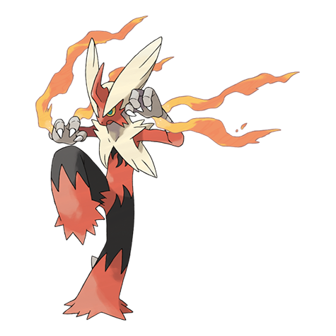
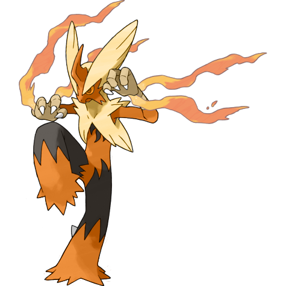
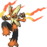

# #10050 Blaziken Mega (Blaze Pokémon)

| Official Artwork | Shiny Artwork |
| --- | --- |
|  |  |

Flames spout from its wrists, enveloping its knuckles. Its punches scorch its foes.

---

## Media

### Sprites

| Front | Front Shiny |
| --- | --- |
|  |  |

### Cries

Latest (Gen VI+):

<audio controls>
  <source src='../assets/cries/blaziken-mega/latest.ogg' type='audio/ogg'>
  Your browser does not support the audio element.
</audio>

---

## Pokédex Data

| National № | Type(s) | Height | Weight | Abilities | Local № |
|------------|---------|--------|--------|-----------|---------|
| #10050 | {: width='48'} {: width='48'} | 1.9 m | 52.0 kg | 1. Speed-Boost | #N/A |

---

## Base Stats
---

## Base Stats
|   | HP | Attack | Defense | Sp. Atk | Sp. Def | Speed |
|---|----|--------|---------|---------|---------|-------|
| **Base** | 80 | 160 | 80 | 130 | 80 | 100 |
| **Min** | 270 | 292 | 148 | 238 | 148 | 184 |
| **Max** | 364 | 460 | 284 | 394 | 284 | 328 |

The ranges shown above are for a level 100 Pokémon. Maximum values are based on a beneficial nature, 252 EVs, 31 IVs; minimum values are based on a hindering nature, 0 EVs, 0 IVs.

---

## Forms & Evolutions

!!! warning "WARNING"

    Some forms may not be available in Blaze Black/Volt White. Also information on evolutions may not be 100% accurate; it is currently quite complex to track generational evolution data.

### Forms

1. [Blaziken](blaziken.md/)
2. [Blaziken-Mega](blaziken-mega.md/)

### Evolution Line

1. [Torchic](torchic.md/)
1. Level Up: [Combusken](combusken.md/)
1. Level Up: [Blaziken](blaziken.md/)

---

## Training

| EV Yield | Catch Rate | Base Friendship | Base Exp. | Growth Rate | Held Items |
|----------|------------|-----------------|-----------|-------------|------------|
| 3 Attack | 45 | 50 | 284 | Medium-Slow | N/A |

---

## Breeding

| Egg Groups | Egg Cycles | Gender | Dimorphic | Color | Shape |
|------------|------------|--------|-----------|-------|-------|
| 1. Ground | 20 | 87.5% Male 12.5% Female | True | Red | Upright |

---

## Moves

!!! warning "WARNING"

    Specific move information may be incorrect. However, the general movepool should be accurate (including changes to learnset).

### Level Up Moves

Lv. | Move | Type | Cat. | Power | Acc. | PP
--- | --- | --- | --- | --- | --- | ---
| 0 | Blaze Kick | {: width='48'} | {: width='36'} | 85 | 90 | 10 |
| 1 | Blaze Kick | {: width='48'} | {: width='36'} | 85 | 90 | 10 |
| 1 | Double Kick | {: width='48'} | {: width='36'} | 30 | 100 | 30 |
| 1 | Ember | {: width='48'} | {: width='36'} | 40 | 100 | 25 |
| 1 | Fire Punch | {: width='48'} | {: width='36'} | 80 | 100 | 15 |
| 1 | Flare Blitz | {: width='48'} | {: width='36'} | 120 | 100 | 15 |
| 1 | Growl | {: width='48'} | {: width='36'} | — | 100 | 40 |
| 1 | High Jump Kick | {: width='48'} | {: width='36'} | 130 | 90 | 10 |
| 1 | Sand Attack | {: width='48'} | {: width='36'} | — | 100 | 15 |
| 1 | Scratch | {: width='48'} | {: width='36'} | 40 | 100 | 35 |
| 5 | Ember | {: width='48'} | {: width='36'} | 40 | 100 | 25 |
| 10 | Sand Attack | {: width='48'} | {: width='36'} | — | 100 | 15 |
| 14 | Peck | {: width='48'} | {: width='36'} | 35 | 100 | 35 |
| 20 | Flame Charge | {: width='48'} | {: width='36'} | 50 | 100 | 20 |
| 25 | Quick Attack | {: width='48'} | {: width='36'} | 40 | 100 | 30 |
| 31 | Bulk Up | {: width='48'} | {: width='36'} | — | — | 20 |
| 37 | Focus Energy | {: width='48'} | {: width='36'} | — | — | 30 |
| 44 | Slash | {: width='48'} | {: width='36'} | 70 | 100 | 20 |
| 50 | Brave Bird | {: width='48'} | {: width='36'} | 120 | 100 | 15 |
| 57 | Sky Uppercut | {: width='48'} | {: width='36'} | 85 | 90 | 15 |
| 63 | Flare Blitz | {: width='48'} | {: width='36'} | 120 | 100 | 15 |

### TM Moves

TM | Move | Type | Cat. | Power | Acc. | PP
--- | --- | --- | --- | --- | --- | ---
| TM01 | Work Up | {: width='48'} | {: width='36'} | — | — | 30 |
| TM05 | Roar | {: width='48'} | {: width='36'} | — | — | 20 |
| TM06 | Toxic | {: width='48'} | {: width='36'} | — | 90 | 10 |
| TM08 | Bulk Up | {: width='48'} | {: width='36'} | — | — | 20 |
| TM10 | Hidden Power | {: width='48'} | {: width='36'} | 60 | 100 | 15 |
| TM100 | Confide | {: width='48'} | {: width='36'} | — | — | 20 |
| TM11 | Sunny Day | {: width='48'} | {: width='36'} | — | — | 5 |
| TM15 | Hyper Beam | {: width='48'} | {: width='36'} | 150 | 90 | 5 |
| TM17 | Protect | {: width='48'} | {: width='36'} | — | — | 10 |
| TM21 | Frustration | {: width='48'} | {: width='36'} | — | 100 | 20 |
| TM22 | Solar Beam | {: width='48'} | {: width='36'} | 120 | 100 | 10 |
| TM26 | Earthquake | {: width='48'} | {: width='36'} | 100 | 100 | 10 |
| TM27 | Return | {: width='48'} | {: width='36'} | — | 100 | 20 |
| TM31 | Brick Break | {: width='48'} | {: width='36'} | 75 | 100 | 15 |
| TM32 | Double Team | {: width='48'} | {: width='36'} | — | — | 15 |
| TM35 | Flamethrower | {: width='48'} | {: width='36'} | 90 | 100 | 15 |
| TM38 | Fire Blast | {: width='48'} | {: width='36'} | 110 | 85 | 5 |
| TM39 | Rock Tomb | {: width='48'} | {: width='36'} | 60 | 95 | 15 |
| TM40 | Aerial Ace | {: width='48'} | {: width='36'} | 60 | — | 20 |
| TM42 | Facade | {: width='48'} | {: width='36'} | 70 | 100 | 20 |
| TM43 | Flame Charge | {: width='48'} | {: width='36'} | 50 | 100 | 20 |
| TM44 | Rest | {: width='48'} | {: width='36'} | — | — | 5 |
| TM45 | Attract | {: width='48'} | {: width='36'} | — | 100 | 15 |
| TM47 | Low Sweep | {: width='48'} | {: width='36'} | 65 | 100 | 20 |
| TM48 | Round | {: width='48'} | {: width='36'} | 60 | 100 | 15 |
| TM49 | Echoed Voice | {: width='48'} | {: width='36'} | 40 | 100 | 15 |
| TM50 | Overheat | {: width='48'} | {: width='36'} | 130 | 90 | 5 |
| TM52 | Focus Blast | {: width='48'} | {: width='36'} | 120 | 70 | 5 |
| TM56 | Fling | {: width='48'} | {: width='36'} | — | 100 | 10 |
| TM61 | Will O Wisp | {: width='48'} | {: width='36'} | — | 85 | 15 |
| TM62 | Acrobatics | {: width='48'} | {: width='36'} | 55 | 100 | 15 |
| TM65 | Shadow Claw | {: width='48'} | {: width='36'} | 80 | 100 | 15 |
| TM68 | Giga Impact | {: width='48'} | {: width='36'} | 150 | 90 | 5 |
| TM71 | Stone Edge | {: width='48'} | {: width='36'} | 100 | 80 | 5 |
| TM75 | Swords Dance | {: width='48'} | {: width='36'} | — | — | 20 |
| TM78 | Bulldoze | {: width='48'} | {: width='36'} | 80 | 100 | 20 |
| TM80 | Rock Slide | {: width='48'} | {: width='36'} | 80 | 95 | 10 |
| TM84 | Poison Jab | {: width='48'} | {: width='36'} | 80 | 100 | 20 |
| TM87 | Swagger | {: width='48'} | {: width='36'} | — | 85 | 15 |
| TM88 | Sleep Talk | {: width='48'} | {: width='36'} | — | — | 10 |
| TM90 | Substitute | {: width='48'} | {: width='36'} | — | — | 10 |

### Egg Moves

Blaziken Mega cannot learn any moves by breeding.
### Tutor Moves

Move | Type | Cat. | Power | Acc. | PP
--- | --- | --- | --- | --- | ---
| Fire Punch | {: width='48'} | {: width='36'} | 80 | 100 | 15 |
| Thunder Punch | {: width='48'} | {: width='36'} | 80 | 100 | 15 |
| Low Kick | {: width='48'} | {: width='36'} | — | 100 | 20 |
| Snore | {: width='48'} | {: width='36'} | 50 | 100 | 15 |
| Heat Wave | {: width='48'} | {: width='36'} | 95 | 90 | 10 |
| Focus Punch | {: width='48'} | {: width='36'} | 150 | 100 | 20 |
| Helping Hand | {: width='48'} | {: width='36'} | — | — | 20 |
| Role Play | {: width='48'} | {: width='36'} | — | — | 10 |
| Superpower | {: width='48'} | {: width='36'} | 120 | 100 | 5 |
| Knock Off | {: width='48'} | {: width='36'} | 65 | 100 | 20 |
| Blast Burn | {: width='48'} | {: width='36'} | 150 | 90 | 5 |
| Bounce | {: width='48'} | {: width='36'} | 85 | 85 | 5 |
| Last Resort | {: width='48'} | {: width='36'} | 140 | 100 | 5 |
| Defog | {: width='48'} | {: width='36'} | — | — | 15 |
| Fire Pledge | {: width='48'} | {: width='36'} | 100 | 100 | 10 |
| Dual Chop | {: width='48'} | {: width='36'} | 40 | 90 | 15 |
| Laser Focus | {: width='48'} | {: width='36'} | — | — | 30 |

