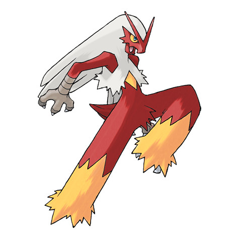
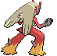
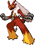
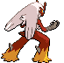
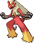
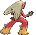
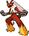
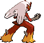

# #257 Blaziken (Blaze Pokémon)

| Official Artwork | Shiny Artwork |
| --- | --- |
|  |  |

Flames spout from its wrists, enveloping its knuckles. Its punches scorch its foes.

---

## Media

### Sprites

| Front | Back | Front Shiny | Back Shiny |
| --- | --- | --- | --- |
|  |  |  |  |

### Female Sprites

| Front | Back | Front Shiny | Back Shiny |
| --- | --- | --- | --- |
|  |  |  |  |

### Cries

Latest (Gen VI+):

<audio controls>
<source src='../../assets/cries/blaziken/latest.ogg' type='audio/ogg'>
  Your browser does not support the audio element.
</audio>

Legacy:

<audio controls>
<source src='../../assets/cries/blaziken/legacy.ogg' type='audio/ogg'>
  Your browser does not support the audio element.
</audio>

---

## Pokédex Data

| National № | Type(s) | Height | Weight | Abilities | Local № |
|------------|---------|--------|--------|-----------|---------|
| #257 | {: width='48'} {: width='48'} | 1.9 m | 52.0 kg | 1. Blaze 2. Speed-Boost | N/A |

---

## Base Stats
|   | HP | Attack | Defense | Sp. Atk | Sp. Def | Speed |
|---|----|--------|---------|---------|---------|-------|
| **Base** | 80 | 120 | 70 | 110 | 70 | 80 |
| **Min** | 270 | 220 | 130 | 202 | 130 | 148 |
| **Max** | 364 | 372 | 262 | 350 | 262 | 284 |

The ranges shown above are for a level 100 Pokémon. Maximum values are based on a beneficial nature, 252 EVs, 31 IVs; minimum values are based on a hindering nature, 0 EVs, 0 IVs.

---

## Forms & Evolutions

!!! warning "WARNING"

    Information on evolutions may not be 100% accurate; differences between evolution methods across generations are not accounted for.

### Forms

Blaziken has no alternate forms.

### Evolution Line

1. [Torchic](torchic.md/)
    1. Level Up: [Combusken](combusken.md/)
        1. Level Up: [Blaziken](blaziken.md/)

### Evolution Changes

---

## Training

| EV Yield | Catch Rate | Base Friendship | Base Exp. | Growth Rate | Held Items |
|----------|------------|-----------------|-----------|-------------|------------|
| 3 Attack | 45 | 50 | 265 | Medium-Slow | N/A |

---

## Breeding

| Egg Groups | Egg Cycles | Gender | Dimorphic | Color | Shape |
|------------|------------|--------|-----------|-------|-------|
| 1. Ground | 20 | 87.5% Male 12.5% Female | True | Red | Upright |

---

## Moves

!!! warning "WARNING"

    Specific move information may be incorrect. However, the general movepool should be accurate; this includes changes made in Blaze Black and Volt White.

### Level Up Moves

| Lv. | Move | Type | Cat. | Power | Acc. | PP |
| --- | --- | --- | --- | --- | --- | --- |
| 1 | Ember | {: width='48'} | {: width='36'} | 40 | 100 | 25 |
| 1 | Fire Punch | {: width='48'} | {: width='36'} | 80 | 100 | 15 |
| 1 | Focus Energy | {: width='48'} | {: width='36'} | — | — | 30 |
| 1 | Growl | {: width='48'} | {: width='36'} | — | 100 | 40 |
| 1 | High Jump Kick | {: width='48'} | {: width='36'} | 130 | 90 | 10 |
| 1 | Night Slash | {: width='48'} | {: width='36'} | 70 | 100 | 15 |
| 1 | Scratch | {: width='48'} | {: width='36'} | 40 | 100 | 35 |
| 1 | Thunder Punch | {: width='48'} | {: width='36'} | 80 | 100 | 15 |
| 7 | Focus Energy | {: width='48'} | {: width='36'} | — | — | 30 |
| 13 | Ember | {: width='48'} | {: width='36'} | 40 | 100 | 25 |
| 16 | Double Kick | {: width='48'} | {: width='36'} | 30 | 100 | 30 |
| 17 | Peck | {: width='48'} | {: width='36'} | 35 | 100 | 35 |
| 21 | Sand Attack | {: width='48'} | {: width='36'} | — | 100 | 15 |
| 25 | Low Kick | {: width='48'} | {: width='36'} | — | 100 | 20 |
| 28 | Bulk Up | {: width='48'} | {: width='36'} | — | — | 20 |
| 32 | Quick Attack | {: width='48'} | {: width='36'} | 40 | 100 | 30 |
| 36 | Blaze Kick | {: width='48'} | {: width='36'} | 85 | 90 | 10 |
| 42 | Slash | {: width='48'} | {: width='36'} | 70 | 100 | 20 |
| 49 | Brave Bird | {: width='48'} | {: width='36'} | 120 | 100 | 15 |
| 59 | Sky Uppercut | {: width='48'} | {: width='36'} | 85 | 90 | 15 |
| 66 | Flare Blitz | {: width='48'} | {: width='36'} | 120 | 100 | 15 |

### TM Moves

| TM | Move | Type | Cat. | Power | Acc. | PP |
| --- | --- | --- | --- | --- | --- | --- |
| HM01 | Cut | {: width='48'} | {: width='36'} | 60 | 100 | 20 |
| HM04 | Strength | {: width='48'} | {: width='36'} | 85 | 100 | 15 |
| TM01 | Hone Claws | {: width='48'} | {: width='36'} | — | — | 15 |
| TM05 | Roar | {: width='48'} | {: width='36'} | — | — | 20 |
| TM06 | Toxic | {: width='48'} | {: width='36'} | — | 90 | 10 |
| TM08 | Bulk Up | {: width='48'} | {: width='36'} | — | — | 20 |
| TM10 | Hidden Power | {: width='48'} | {: width='36'} | 60 | 100 | 15 |
| TM11 | Sunny Day | {: width='48'} | {: width='36'} | — | — | 5 |
| TM15 | Hyper Beam | {: width='48'} | {: width='36'} | 150 | 90 | 5 |
| TM17 | Protect | {: width='48'} | {: width='36'} | — | — | 10 |
| TM21 | Frustration | {: width='48'} | {: width='36'} | — | 100 | 20 |
| TM22 | Solar Beam | {: width='48'} | {: width='36'} | 120 | 100 | 10 |
| TM26 | Earthquake | {: width='48'} | {: width='36'} | 100 | 100 | 10 |
| TM27 | Return | {: width='48'} | {: width='36'} | — | 100 | 20 |
| TM28 | Dig | {: width='48'} | {: width='36'} | 100 | 100 | 10 |
| TM31 | Brick Break | {: width='48'} | {: width='36'} | 75 | 100 | 15 |
| TM32 | Double Team | {: width='48'} | {: width='36'} | — | — | 15 |
| TM35 | Flamethrower | {: width='48'} | {: width='36'} | 90 | 100 | 15 |
| TM38 | Fire Blast | {: width='48'} | {: width='36'} | 110 | 85 | 5 |
| TM39 | Rock Tomb | {: width='48'} | {: width='36'} | 60 | 95 | 15 |
| TM40 | Aerial Ace | {: width='48'} | {: width='36'} | 60 | — | 20 |
| TM42 | Facade | {: width='48'} | {: width='36'} | 70 | 100 | 20 |
| TM43 | Flame Charge | {: width='48'} | {: width='36'} | 50 | 100 | 20 |
| TM44 | Rest | {: width='48'} | {: width='36'} | — | — | 5 |
| TM45 | Attract | {: width='48'} | {: width='36'} | — | 100 | 15 |
| TM47 | Low Sweep | {: width='48'} | {: width='36'} | 65 | 100 | 20 |
| TM48 | Round | {: width='48'} | {: width='36'} | 60 | 100 | 15 |
| TM49 | Echoed Voice | {: width='48'} | {: width='36'} | 40 | 100 | 15 |
| TM50 | Overheat | {: width='48'} | {: width='36'} | 130 | 90 | 5 |
| TM52 | Focus Blast | {: width='48'} | {: width='36'} | 120 | 70 | 5 |
| TM56 | Fling | {: width='48'} | {: width='36'} | — | 100 | 10 |
| TM59 | Incinerate | {: width='48'} | {: width='36'} | 50 | 100 | 15 |
| TM61 | Will O Wisp | {: width='48'} | {: width='36'} | — | 85 | 15 |
| TM62 | Acrobatics | {: width='48'} | {: width='36'} | 55 | 100 | 15 |
| TM65 | Shadow Claw | {: width='48'} | {: width='36'} | 80 | 100 | 15 |
| TM68 | Giga Impact | {: width='48'} | {: width='36'} | 150 | 90 | 5 |
| TM71 | Stone Edge | {: width='48'} | {: width='36'} | 100 | 80 | 5 |
| TM75 | Swords Dance | {: width='48'} | {: width='36'} | — | — | 20 |
| TM78 | Bulldoze | {: width='48'} | {: width='36'} | 80 | 100 | 20 |
| TM80 | Rock Slide | {: width='48'} | {: width='36'} | 80 | 95 | 10 |
| TM83 | Work Up | {: width='48'} | {: width='36'} | — | — | 30 |
| TM84 | Poison Jab | {: width='48'} | {: width='36'} | 80 | 100 | 20 |
| TM87 | Swagger | {: width='48'} | {: width='36'} | — | 85 | 15 |
| TM90 | Substitute | {: width='48'} | {: width='36'} | — | — | 10 |
| TM94 | Rock Smash | {: width='48'} | {: width='36'} | 40 | 100 | 15 |

### Egg Moves

Blaziken cannot learn any moves by breeding.
### Tutor Moves

| Move | Type | Cat. | Power | Acc. | PP |
| --- | --- | --- | --- | --- | --- |
| Blast Burn | {: width='48'} | {: width='36'} | 150 | 90 | 5 |
| Fire Pledge | {: width='48'} | {: width='36'} | 100 | 100 | 10 |

