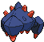
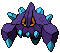
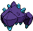

# #525 Boldore (Ore Pokémon)

| Official Artwork | Shiny Artwork |
| --- | --- |
|  |  |

**Blaze Black:** When it overflows with power, the orange crystal on its body glows. It looks for underground water in caves.

**Volt White:** Because its energy was too great to be contained, the energy leaked and formed orange crystals.

---

## Media

### Sprites

| Front | Back | Front Shiny | Back Shiny |
| --- | --- | --- | --- |
|  |  |  |  |

### Cries

Latest (Gen VI+):

<audio controls>
<source src='../../assets/cries/boldore/latest.ogg' type='audio/ogg'>
  Your browser does not support the audio element.
</audio>

Legacy:

<audio controls>
<source src='../../assets/cries/boldore/legacy.ogg' type='audio/ogg'>
  Your browser does not support the audio element.
</audio>

---

## Pokédex Data

| National № | Type(s) | Height | Weight | Abilities | Local № |
|------------|---------|--------|--------|-----------|---------|
| #525 | {: width='48'} | 0.9 m | 102.0 kg | 1. Sturdy 2. Sand-Force | #31 |

---

## Base Stats
|   | HP | Attack | Defense | Sp. Atk | Sp. Def | Speed |
|---|----|--------|---------|---------|---------|-------|
| **Base** | 70 | 105 | 105 | 50 | 40 | 20 |
| **Min** | 250 | 193 | 193 | 94 | 76 | 40 |
| **Max** | 344 | 339 | 339 | 218 | 196 | 152 |

The ranges shown above are for a level 100 Pokémon. Maximum values are based on a beneficial nature, 252 EVs, 31 IVs; minimum values are based on a hindering nature, 0 EVs, 0 IVs.

---

## Forms & Evolutions

!!! warning "WARNING"

    Information on evolutions may not be 100% accurate; differences between evolution methods across generations are not accounted for.

### Forms

Boldore has no alternate forms.

### Evolution Line

1. [Roggenrola](roggenrola.md/)
    1. Level Up: [Boldore](boldore.md/)
        1. Trade: [Gigalith](gigalith.md/)

### Evolution Changes

1. Level 36.

---

## Training

| EV Yield | Catch Rate | Base Friendship | Base Exp. | Growth Rate | Held Items |
|----------|------------|-----------------|-----------|-------------|------------|
| 1 Attack 1 Defense | 120 | 50 | 137 | Medium-Slow | Everstone (50%) Hard Stone (5%) |

---

## Breeding

| Egg Groups | Egg Cycles | Gender | Dimorphic | Color | Shape |
|------------|------------|--------|-----------|-------|-------|
| 1. Mineral | 15 | 50.0% Male 50.0% Female | False | Blue | Tentacles |

---

## Moves

!!! warning "WARNING"

    Specific move information may be incorrect. However, the general movepool should be accurate; this includes changes made in Blaze Black and Volt White.

### Level Up Moves

| Lv. | Move | Type | Cat. | Power | Acc. | PP |
| --- | --- | --- | --- | --- | --- | --- |
| 1 | Harden | {: width='48'} | {: width='36'} | — | — | 30 |
| 1 | Headbutt | {: width='48'} | {: width='36'} | 70 | 100 | 15 |
| 1 | Sand Attack | {: width='48'} | {: width='36'} | — | 100 | 15 |
| 1 | Tackle | {: width='48'} | {: width='36'} | 40 | 100 | 35 |
| 4 | Harden | {: width='48'} | {: width='36'} | — | — | 30 |
| 7 | Sand Attack | {: width='48'} | {: width='36'} | — | 100 | 15 |
| 10 | Headbutt | {: width='48'} | {: width='36'} | 70 | 100 | 15 |
| 12 | Magnitude | {: width='48'} | {: width='36'} | — | 100 | 30 |
| 14 | Rock Blast | {: width='48'} | {: width='36'} | 25 | 90 | 10 |
| 17 | Mud Slap | {: width='48'} | {: width='36'} | 20 | 100 | 10 |
| 20 | Iron Defense | {: width='48'} | {: width='36'} | — | — | 15 |
| 23 | Smack Down | {: width='48'} | {: width='36'} | 50 | 100 | 15 |
| 25 | Power Gem | {: width='48'} | {: width='36'} | 90 | 100 | 20 |
| 30 | Rock Slide | {: width='48'} | {: width='36'} | 80 | 95 | 10 |
| 36 | Stealth Rock | {: width='48'} | {: width='36'} | — | — | 20 |
| 42 | Sandstorm | {: width='48'} | {: width='36'} | — | — | 10 |
| 48 | Stone Edge | {: width='48'} | {: width='36'} | 100 | 80 | 5 |
| 55 | Explosion | {: width='48'} | {: width='36'} | 250 | 100 | 5 |

### TM Moves

| TM | Move | Type | Cat. | Power | Acc. | PP |
| --- | --- | --- | --- | --- | --- | --- |
| HM04 | Strength | {: width='48'} | {: width='36'} | 85 | 100 | 15 |
| TM06 | Toxic | {: width='48'} | {: width='36'} | — | 90 | 10 |
| TM10 | Hidden Power | {: width='48'} | {: width='36'} | 60 | 100 | 15 |
| TM17 | Protect | {: width='48'} | {: width='36'} | — | — | 10 |
| TM21 | Frustration | {: width='48'} | {: width='36'} | — | 100 | 20 |
| TM23 | Smack Down | {: width='48'} | {: width='36'} | 50 | 100 | 15 |
| TM26 | Earthquake | {: width='48'} | {: width='36'} | 100 | 100 | 10 |
| TM27 | Return | {: width='48'} | {: width='36'} | — | 100 | 20 |
| TM32 | Double Team | {: width='48'} | {: width='36'} | — | — | 15 |
| TM37 | Sandstorm | {: width='48'} | {: width='36'} | — | — | 10 |
| TM39 | Rock Tomb | {: width='48'} | {: width='36'} | 60 | 95 | 15 |
| TM42 | Facade | {: width='48'} | {: width='36'} | 70 | 100 | 20 |
| TM44 | Rest | {: width='48'} | {: width='36'} | — | — | 5 |
| TM45 | Attract | {: width='48'} | {: width='36'} | — | 100 | 15 |
| TM48 | Round | {: width='48'} | {: width='36'} | 60 | 100 | 15 |
| TM64 | Explosion | {: width='48'} | {: width='36'} | 250 | 100 | 5 |
| TM69 | Rock Polish | {: width='48'} | {: width='36'} | — | — | 20 |
| TM71 | Stone Edge | {: width='48'} | {: width='36'} | 100 | 80 | 5 |
| TM78 | Bulldoze | {: width='48'} | {: width='36'} | 80 | 100 | 20 |
| TM80 | Rock Slide | {: width='48'} | {: width='36'} | 80 | 95 | 10 |
| TM87 | Swagger | {: width='48'} | {: width='36'} | — | 85 | 15 |
| TM90 | Substitute | {: width='48'} | {: width='36'} | — | — | 10 |
| TM91 | Flash Cannon | {: width='48'} | {: width='36'} | 80 | 100 | 10 |
| TM94 | Rock Smash | {: width='48'} | {: width='36'} | 40 | 100 | 15 |

### Egg Moves

Boldore cannot learn any moves by breeding.
### Tutor Moves

Boldore cannot learn any moves from tutors.
