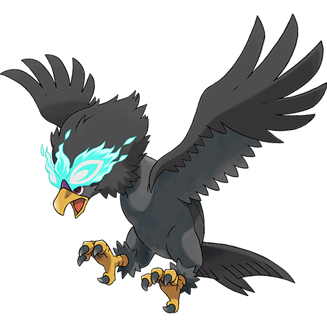

# #10240 Braviary Hisui (Valiant Pokémon)

| Official Artwork | Shiny Artwork |
| --- | --- |
|  |  |

**Blaze Black:** They fight for their friends without any thought about danger to themselves. One can carry a car while flying.

**Volt White:** The more scars they have, the more respect these brave soldiers of the sky  get from their peers.

---

## Media

### Sprites

### Cries

Latest (Gen VI+):

<audio controls>
  <source src='../assets/cries/braviary-hisui/latest.ogg' type='audio/ogg'>
  Your browser does not support the audio element.
</audio>

---

## Pokédex Data

| National № | Type(s) | Height | Weight | Abilities | Local № |
|------------|---------|--------|--------|-----------|---------|
| #10240 | {: width='48'} {: width='48'} | 1.7 m | 43.4 kg | 1. Keen-Eye 2. Sheer-Force 3. Tinted-Lens | #134 |

---

## Base Stats
---

## Base Stats
|   | HP | Attack | Defense | Sp. Atk | Sp. Def | Speed |
|---|----|--------|---------|---------|---------|-------|
| **Base** | 110 | 83 | 70 | 112 | 70 | 65 |
| **Min** | 330 | 153 | 130 | 206 | 130 | 121 |
| **Max** | 424 | 291 | 262 | 355 | 262 | 251 |

The ranges shown above are for a level 100 Pokémon. Maximum values are based on a beneficial nature, 252 EVs, 31 IVs; minimum values are based on a hindering nature, 0 EVs, 0 IVs.

---

## Forms & Evolutions

!!! warning "WARNING"

    Some forms may not be available in Blaze Black/Volt White. Also information on evolutions may not be 100% accurate; it is currently quite complex to track generational evolution data.

### Forms

1. [Braviary](braviary.md/)
2. [Braviary-Hisui](braviary-hisui.md/)

### Evolution Line

1. [Rufflet](rufflet.md/)
1. Level Up: [Braviary](braviary.md/)

---

## Training

| EV Yield | Catch Rate | Base Friendship | Base Exp. | Growth Rate | Held Items |
|----------|------------|-----------------|-----------|-------------|------------|
| 2 Attack | 60 | 50 | 179 | Slow | N/A |

---

## Breeding

| Egg Groups | Egg Cycles | Gender | Dimorphic | Color | Shape |
|------------|------------|--------|-----------|-------|-------|
| 1. Flying | 20 | 100.0% Male 0.0% Female | False | Red | Wings |

---

## Moves

!!! warning "WARNING"

    Specific move information may be incorrect. However, the general movepool should be accurate (including changes to learnset).

### Level Up Moves

Lv. | Move | Type | Cat. | Power | Acc. | PP
--- | --- | --- | --- | --- | --- | ---
| 1 | Quick Attack | {: width='48'} | {: width='36'} | 40 | 100 | 30 |
| 6 | Aerial Ace | {: width='48'} | {: width='36'} | 60 | — | 20 |
| 11 | Twister | {: width='48'} | {: width='36'} | 50 | 100 | 20 |
| 18 | Slash | {: width='48'} | {: width='36'} | 70 | 100 | 20 |
| 20 | Air Slash | {: width='48'} | {: width='36'} | 75 | 95 | 15 |
| 25 | Esper Wing | {: width='48'} | {: width='36'} | 80 | 100 | 10 |
| 25 | Roost | {: width='48'} | {: width='36'} | — | — | 5 |
| 34 | Double Edge | {: width='48'} | {: width='36'} | 120 | 100 | 15 |
| 43 | Brave Bird | {: width='48'} | {: width='36'} | 120 | 100 | 15 |
| 52 | Hurricane | {: width='48'} | {: width='36'} | 110 | 70 | 10 |

### TM Moves

Braviary Hisui cannot learn any TM moves.
### Egg Moves

Braviary Hisui cannot learn any moves by breeding.
### Tutor Moves

Move | Type | Cat. | Power | Acc. | PP
--- | --- | --- | --- | --- | ---
| Hyper Beam | {: width='48'} | {: width='36'} | 150 | 90 | 5 |
| Psychic | {: width='48'} | {: width='36'} | 90 | 100 | 10 |
| Swift | {: width='48'} | {: width='36'} | 60 | — | 20 |
| Rest | {: width='48'} | {: width='36'} | — | — | 5 |
| Rock Slide | {: width='48'} | {: width='36'} | 80 | 95 | 10 |
| Rock Smash | {: width='48'} | {: width='36'} | 40 | 100 | 15 |
| Aerial Ace | {: width='48'} | {: width='36'} | 60 | — | 20 |
| Bulk Up | {: width='48'} | {: width='36'} | — | — | 20 |
| Giga Impact | {: width='48'} | {: width='36'} | 150 | 90 | 5 |
| Shadow Claw | {: width='48'} | {: width='36'} | 80 | 100 | 15 |
| Zen Headbutt | {: width='48'} | {: width='36'} | 80 | 90 | 15 |
| Ominous Wind | {: width='48'} | {: width='36'} | 60 | 100 | 5 |
| Mystical Fire | {: width='48'} | {: width='36'} | 75 | 100 | 10 |
| Dazzling Gleam | {: width='48'} | {: width='36'} | 80 | 100 | 10 |
| Power Shift | {: width='48'} | {: width='36'} | — | — | 10 |

