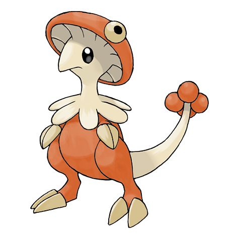
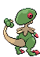
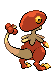

# Breloom (Mushroom Pokémon)

| Official Artwork | Shiny Artwork |
| --- | --- |
|  |  |

Its short arms stretch when it throws punches. Its technique is equal to that of pro boxers.

---

## Media

### Default Sprites

| Front | Back | Front Shiny | Back Shiny |
| --- | --- | --- | --- |
|  |  |  |  |

### Cries

Latest (Gen VI+):

<audio controls>
<source src='../../assets/cries/breloom/latest.ogg' type='audio/ogg'>
  Your browser does not support the audio element.
</audio>

Legacy:

<audio controls>
<source src='../../assets/cries/breloom/legacy.ogg' type='audio/ogg'>
  Your browser does not support the audio element.
</audio>

---

## Pokédex Data

| National № | Type(s) | Height | Weight | Abilities | Local № |
|------------|---------|--------|--------|-----------|---------|
| #286 | {: width='48'} {: width='48'} | 1.2 m | 39.2 kg | 1. Technician 2. Poison-Heal | N/A |

---

## Base Stats
|   | HP | Attack | Defense | Sp. Atk | Sp. Def | Speed |
|---|----|--------|---------|---------|---------|-------|
| **Base** | 60 | 130 | 80 | 60 | 60 | 70 |
| **Min** | 230 | 238 | 148 | 112 | 112 | 130 |
| **Max** | 324 | 394 | 284 | 240 | 240 | 262 |

The ranges shown above are for a level 100 Pokémon. Maximum values are based on a beneficial nature, 252 EVs, 31 IVs; minimum values are based on a hindering nature, 0 EVs, 0 IVs.

---

## Forms & Evolutions

!!! warning "WARNING"

    Information on evolutions may not be 100% accurate; differences between evolution methods across generations are not accounted for.

### Forms

Breloom has no alternate forms.

### Evolution Line

1. [Shroomish](shroomish.md/)
    1. Level Up: [Breloom](breloom.md/)

---

## Training

| EV Yield | Catch Rate | Base Friendship | Base Exp. | Growth Rate | Held Items |
|----------|------------|-----------------|-----------|-------------|------------|
| 2 Attack | 90 | 70 | 161 | Fast-Then-Very-Slow | kebia-berry (5%) |

---

## Breeding

| Egg Groups | Egg Cycles | Gender | Dimorphic | Color | Shape |
|------------|------------|--------|-----------|-------|-------|
| 1. Fairy 2. Plant | 15 | 50.0% Male 50.0% Female | False | Green | Upright |

---

## Moves

!!! warning "WARNING"

    Specific move information may be incorrect. However, the general movepool should be accurate; this includes changes made in Blaze Black and Volt White.

### Level Up Moves

| Lv. | Move | Type | Cat. | Power | Acc. | PP |
| --- | --- | --- | --- | --- | --- | --- |
| 1 | Absorb | {: width='48'} | {: width='36'} | 50 | 100 | 25 |
| 1 | Leech Seed | {: width='48'} | {: width='36'} | — | 90 | 10 |
| 1 | Stun Spore | {: width='48'} | {: width='36'} | — | 75 | 30 |
| 1 | Tackle | {: width='48'} | {: width='36'} | 40 | 100 | 35 |
| 1 | Thunder Punch | {: width='48'} | {: width='36'} | 80 | 100 | 15 |
| 5 | Tackle | {: width='48'} | {: width='36'} | 40 | 100 | 35 |
| 9 | Stun Spore | {: width='48'} | {: width='36'} | — | 75 | 30 |
| 13 | Leech Seed | {: width='48'} | {: width='36'} | — | 90 | 10 |
| 17 | Mega Drain | {: width='48'} | {: width='36'} | 50 | 100 | 15 |
| 21 | Headbutt | {: width='48'} | {: width='36'} | 70 | 100 | 15 |
| 23 | Mach Punch | {: width='48'} | {: width='36'} | 40 | 100 | 30 |
| 25 | Counter | {: width='48'} | {: width='36'} | — | 100 | 20 |
| 29 | Force Palm | {: width='48'} | {: width='36'} | 60 | 100 | 10 |
| 33 | Sky Uppercut | {: width='48'} | {: width='36'} | 85 | 90 | 15 |
| 37 | Mind Reader | {: width='48'} | {: width='36'} | — | — | 5 |
| 41 | Seed Bomb | {: width='48'} | {: width='36'} | 80 | 100 | 15 |
| 45 | Dynamic Punch | {: width='48'} | {: width='36'} | 100 | 50 | 5 |
| 49 | Drain Punch | {: width='48'} | {: width='36'} | 75 | 100 | 10 |
| 53 | Spore | {: width='48'} | {: width='36'} | — | 100 | 15 |
| 57 | Focus Punch | {: width='48'} | {: width='36'} | 150 | 100 | 20 |

### TM Moves

| TM | Move | Type | Cat. | Power | Acc. | PP |
| --- | --- | --- | --- | --- | --- | --- |
| HM01 | Cut | {: width='48'} | {: width='36'} | 60 | 100% | 25 |
| HM04 | Strength | {: width='48'} | {: width='36'} | 100 | 100 | 15 |
| TM06 | Toxic | {: width='48'} | {: width='36'} | — | 90 | 10 |
| TM08 | Bulk Up | {: width='48'} | {: width='36'} | — | — | 20 |
| TM09 | Venoshock | {: width='48'} | {: width='36'} | 65 | 100 | 10 |
| TM10 | Hidden Power | {: width='48'} | {: width='36'} | 60 | 100 | 15 |
| TM11 | Sunny Day | {: width='48'} | {: width='36'} | — | — | 5 |
| TM15 | Hyper Beam | {: width='48'} | {: width='36'} | 150 | 90 | 5 |
| TM17 | Protect | {: width='48'} | {: width='36'} | — | — | 10 |
| TM20 | Safeguard | {: width='48'} | {: width='36'} | — | — | 25 |
| TM21 | Frustration | {: width='48'} | {: width='36'} | — | 100 | 20 |
| TM22 | Solar Beam | {: width='48'} | {: width='36'} | 120 | 100 | 10 |
| TM27 | Return | {: width='48'} | {: width='36'} | — | 100 | 20 |
| TM31 | Brick Break | {: width='48'} | {: width='36'} | 75 | 100 | 15 |
| TM32 | Double Team | {: width='48'} | {: width='36'} | — | — | 15 |
| TM36 | Sludge Bomb | {: width='48'} | {: width='36'} | 90 | 100 | 10 |
| TM39 | Rock Tomb | {: width='48'} | {: width='36'} | 60 | 95 | 15 |
| TM42 | Facade | {: width='48'} | {: width='36'} | 70 | 100 | 20 |
| TM44 | Rest | {: width='48'} | {: width='36'} | — | — | 5 |
| TM45 | Attract | {: width='48'} | {: width='36'} | — | 100 | 15 |
| TM47 | Low Sweep | {: width='48'} | {: width='36'} | 65 | 100 | 20 |
| TM48 | Round | {: width='48'} | {: width='36'} | 60 | 100 | 15 |
| TM52 | Focus Blast | {: width='48'} | {: width='36'} | 120 | 70 | 5 |
| TM53 | Energy Ball | {: width='48'} | {: width='36'} | 90 | 100 | 10 |
| TM54 | False Swipe | {: width='48'} | {: width='36'} | 40 | 100 | 40 |
| TM56 | Fling | {: width='48'} | {: width='36'} | — | 100 | 10 |
| TM67 | Retaliate | {: width='48'} | {: width='36'} | 70 | 100 | 5 |
| TM68 | Giga Impact | {: width='48'} | {: width='36'} | 150 | 90 | 5 |
| TM70 | Flash | {: width='48'} | {: width='36'} | — | 100 | 20 |
| TM71 | Stone Edge | {: width='48'} | {: width='36'} | 100 | 80 | 5 |
| TM75 | Swords Dance | {: width='48'} | {: width='36'} | — | — | 20 |
| TM80 | Rock Slide | {: width='48'} | {: width='36'} | 75 | 90 | 10 |
| TM83 | Work Up | {: width='48'} | {: width='36'} | — | — | 30 |
| TM86 | Grass Knot | {: width='48'} | {: width='36'} | — | 100 | 20 |
| TM87 | Swagger | {: width='48'} | {: width='36'} | — | 85 | 15 |
| TM90 | Substitute | {: width='48'} | {: width='36'} | — | — | 10 |
| TM94 | Rock Smash | {: width='48'} | {: width='36'} | 60 | 100 | 15 |

### Egg Moves

Breloom cannot learn any moves by breeding.
### Tutor Moves

Breloom cannot learn any moves from tutors.
