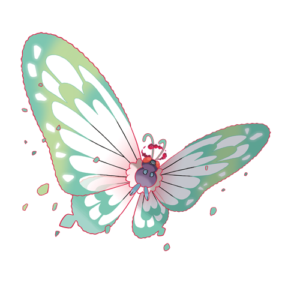
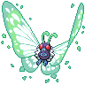
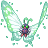
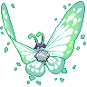

# #10198 Butterfree Gmax (Butterfly Pokémon)

| Official Artwork | Shiny Artwork |
| --- | --- |
|  |  |

It loves the honey of flowers and can locate flower patches that have even tiny amounts of pollen.

---

## Media

### Sprites

| Front | Back | Front Shiny | Back Shiny |
| --- | --- | --- | --- |
|  |  |  |  |

### Cries

Latest (Gen VI+):

<audio controls>
  <source src='../assets/cries/butterfree-gmax/latest.ogg' type='audio/ogg'>
  Your browser does not support the audio element.
</audio>

---

## Pokédex Data

| National № | Type(s) | Height | Weight | Abilities | Local № |
|------------|---------|--------|--------|-----------|---------|
| #10198 | {: width='48'} {: width='48'} | 17.0 m | 1000.0 kg | 1. Compound-Eyes 2. Tinted-Lens | #N/A |

---

## Base Stats
---

## Base Stats
|   | HP | Attack | Defense | Sp. Atk | Sp. Def | Speed |
|---|----|--------|---------|---------|---------|-------|
| **Base** | 60 | 45 | 50 | 90 | 80 | 70 |
| **Min** | 230 | 85 | 94 | 166 | 148 | 130 |
| **Max** | 324 | 207 | 218 | 306 | 284 | 262 |

The ranges shown above are for a level 100 Pokémon. Maximum values are based on a beneficial nature, 252 EVs, 31 IVs; minimum values are based on a hindering nature, 0 EVs, 0 IVs.

---

## Forms & Evolutions

!!! warning "WARNING"

    Some forms may not be available in Blaze Black/Volt White. Also information on evolutions may not be 100% accurate; it is currently quite complex to track generational evolution data.

### Forms

1. [Butterfree](butterfree.md/)
2. [Butterfree-Gmax](butterfree-gmax.md/)

### Evolution Line

1. [Caterpie](caterpie.md/)
1. Level Up: [Metapod](metapod.md/)
1. Level Up: [Butterfree](butterfree.md/)

---

## Training

| EV Yield | Catch Rate | Base Friendship | Base Exp. | Growth Rate | Held Items |
|----------|------------|-----------------|-----------|-------------|------------|
| 2 Special Attack 1 Special Defense | 45 | 50 | 178 | Medium | N/A |

---

## Breeding

| Egg Groups | Egg Cycles | Gender | Dimorphic | Color | Shape |
|------------|------------|--------|-----------|-------|-------|
| 1. Bug | 15 | 50.0% Male 50.0% Female | True | White | Bug-Wings |

---

## Moves

!!! warning "WARNING"

    Specific move information may be incorrect. However, the general movepool should be accurate (including changes to learnset).

### Level Up Moves

Butterfree Gmax cannot learn any moves by leveling up.
### TM Moves

Butterfree Gmax cannot learn any TM moves.
### Egg Moves

Butterfree Gmax cannot learn any moves by breeding.
### Tutor Moves

Butterfree Gmax cannot learn any moves from tutors.
