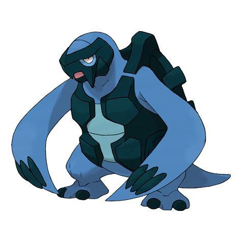
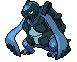
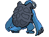
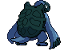

# #565 Carracosta (Prototurtle Pokémon)

| Official Artwork | Shiny Artwork |
|------------------|---------------|
|  |  |

**Blaze Black:** They can live both in the ocean and on land. A slap from one of them is enough to open a hole in the bottom of a tanker.

**Volt White:** Incredible jaw strength enables them to chew up steel beams and rocks along with their prey.

---

## Media

### Default Sprites

| Front | Shiny | Back | Shiny |
|-------|-------|------|-------|
|  |  |  |  |

### Cries

Latest (Gen VI+):

<audio controls>
<source src='../../assets/cries/carracosta/latest.ogg' type='audio/ogg'>
  Your browser does not support the audio element.
</audio>

Legacy:

<audio controls>
<source src='../../assets/cries/carracosta/legacy.ogg' type='audio/ogg'>
  Your browser does not support the audio element.
</audio>

---

## Pokédex Data

| National № | Type(s) | Height | Weight | Abilities | Local № |
|------------|---------|--------|--------|-----------|---------|
| #565 | {: width="48"} {: width="48"} | 1.2 m / 3.9 ft | 81.0 kg / 178.6 lbs | 1. Solid Rock 2. Sturdy | N/A |

---

## Base Stats
|   | HP | Attack | Defense | Sp. Atk | Sp. Def | Speed |
|---|----|--------|---------|---------|---------|-------|
| **Base** | 74 | 108 | 133 | 83 | 65 | 32 |
| **Min** | 258 | 198 | 243 | 153 | 121 | 62 |
| **Max** | 352 | 346 | 401 | 291 | 251 | 179 |

The ranges shown above are for a level 100 Pokémon. Maximum values are based on a beneficial nature, 252 EVs, 31 IVs; minimum values are based on a hindering nature, 0 EVs, 0 IVs.

---

## Forms & Evolutions

!!! warning "WARNING"

    Information on evolutions may not be 100% accurate; differences between evolution methods across generations are not accounted for.

### Forms

Carracosta has no alternate forms.

### Evolution Line

1. [Tirtouga](tirtouga.md/)
    1. Level Up: [Carracosta](carracosta.md/)

---

## Training

| EV Yield | Catch Rate | Base Friendship | Base Exp. | Growth Rate | Held Items |
|----------|------------|-----------------|-----------|-------------|------------|
| 2 Def | 45 | 50 | 173 | Medium | N/A |

---

## Breeding

| Egg Groups | Egg Cycles | Gender | Dimorphic | Color | Shape |
|------------|------------|--------|-----------|-------|-------|
| 1. Water1 2. Water3 | 30 | 87.5% Male 12.5% Female | False | Blue | Upright |

---

## Moves

!!! warning "WARNING"

    Specific move information may be incorrect. However, the general movepool should be accurate; this includes changes made in Blaze Black and Volt White.

### Level Up Moves

| Lv. | Move | Type | Cat. | Power | Acc. | PP |
| --- | --- | --- | --- | --- | --- | --- |
| 1 | Bide | {: width="48"} | {: width="36"} | — | — | 10 |
| 1 | Rollout | {: width="48"} | {: width="36"} | 30 | 90 | 20 |
| 1 | Water Gun | {: width="48"} | {: width="36"} | 40 | 100 | 25 |
| 1 | Withdraw | {: width="48"} | {: width="36"} | — | — | 40 |
| 5 | Rollout | {: width="48"} | {: width="36"} | 30 | 90 | 20 |
| 8 | Bite | {: width="48"} | {: width="36"} | 60 | 100 | 25 |
| 11 | Protect | {: width="48"} | {: width="36"} | — | — | 10 |
| 15 | Aqua Jet | {: width="48"} | {: width="36"} | 40 | 100 | 20 |
| 18 | Ancient Power | {: width="48"} | {: width="36"} | 60 | 100 | 5 |
| 21 | Crunch | {: width="48"} | {: width="36"} | 80 | 100 | 15 |
| 25 | Wide Guard | {: width="48"} | {: width="36"} | — | — | 10 |
| 28 | Scald | {: width="48"} | {: width="36"} | 80 | 100 | 15 |
| 31 | Smack Down | {: width="48"} | {: width="36"} | 50 | 100 | 15 |
| 35 | Curse | {: width="48"} | {: width="36"} | — | — | 10 |
| 40 | Shell Smash | {: width="48"} | {: width="36"} | — | — | 15 |
| 45 | Aqua Tail | {: width="48"} | {: width="36"} | 90 | 90 | 10 |
| 51 | Rock Slide | {: width="48"} | {: width="36"} | 75 | 90 | 10 |
| 56 | Rain Dance | {: width="48"} | {: width="36"} | — | — | 5 |
| 61 | Hydro Pump | {: width="48"} | {: width="36"} | 110 | 80 | 5 |

### TM Moves

| TM | Move | Type | Cat. | Power | Acc. | PP |
| --- | --- | --- | --- | --- | --- | --- |
| HM03 | Surf | {: width="48"} | {: width="36"} | 90 | 100 | 15 |
| HM04 | Strength | {: width="48"} | {: width="36"} | 100 | 100 | 15 |
| HM05 | Waterfall | {: width="48"} | {: width="36"} | 85 | 100 | 15 |
| HM06 | Dive | {: width="48"} | {: width="36"} | 80 | 100 | 10 |
| TM06 | Toxic | {: width="48"} | {: width="36"} | — | 90 | 10 |
| TM10 | Hidden Power | {: width="48"} | {: width="36"} | 60 | 100 | 15 |
| TM13 | Ice Beam | {: width="48"} | {: width="36"} | 90 | 100 | 10 |
| TM14 | Blizzard | {: width="48"} | {: width="36"} | 110 | 70 | 5 |
| TM15 | Hyper Beam | {: width="48"} | {: width="36"} | 150 | 90 | 5 |
| TM17 | Protect | {: width="48"} | {: width="36"} | — | — | 10 |
| TM18 | Rain Dance | {: width="48"} | {: width="36"} | — | — | 5 |
| TM21 | Frustration | {: width="48"} | {: width="36"} | — | 100 | 20 |
| TM23 | Smack Down | {: width="48"} | {: width="36"} | 50 | 100 | 15 |
| TM26 | Earthquake | {: width="48"} | {: width="36"} | 100 | 100 | 10 |
| TM27 | Return | {: width="48"} | {: width="36"} | — | 100 | 20 |
| TM28 | Dig | {: width="48"} | {: width="36"} | 100 | 100 | 10 |
| TM32 | Double Team | {: width="48"} | {: width="36"} | — | — | 15 |
| TM37 | Sandstorm | {: width="48"} | {: width="36"} | — | — | 10 |
| TM39 | Rock Tomb | {: width="48"} | {: width="36"} | 60 | 95 | 15 |
| TM42 | Facade | {: width="48"} | {: width="36"} | 70 | 100 | 20 |
| TM44 | Rest | {: width="48"} | {: width="36"} | — | — | 5 |
| TM45 | Attract | {: width="48"} | {: width="36"} | — | 100 | 15 |
| TM48 | Round | {: width="48"} | {: width="36"} | 60 | 100 | 15 |
| TM52 | Focus Blast | {: width="48"} | {: width="36"} | 120 | 70 | 5 |
| TM55 | Scald | {: width="48"} | {: width="36"} | 80 | 100 | 15 |
| TM68 | Giga Impact | {: width="48"} | {: width="36"} | 150 | 90 | 5 |
| TM69 | Rock Polish | {: width="48"} | {: width="36"} | — | — | 20 |
| TM71 | Stone Edge | {: width="48"} | {: width="36"} | 100 | 80 | 5 |
| TM78 | Bulldoze | {: width="48"} | {: width="36"} | 80 | 100 | 20 |
| TM80 | Rock Slide | {: width="48"} | {: width="36"} | 75 | 90 | 10 |
| TM87 | Swagger | {: width="48"} | {: width="36"} | — | 85 | 15 |
| TM90 | Substitute | {: width="48"} | {: width="36"} | — | — | 10 |
| TM94 | Rock Smash | {: width="48"} | {: width="36"} | 60 | 100 | 15 |

### Egg Moves

Carracosta cannot learn any moves by breeding.
### Tutor Moves

Carracosta cannot learn any moves from tutors.
