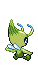
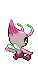

# #251 Celebi (Time Travel Pokémon)

| Official Artwork | Shiny Artwork |
|------------------|---------------|
|  |  |

It has the power to travel across time, but it is said to appear only in peaceful times.

---

## Media

### Default Sprites

| Front | Shiny | Back | Shiny |
|-------|-------|------|-------|
|  |  |  |  |

### Cries

Latest (Gen VI+):

<audio controls>
<source src='../../assets/cries/celebi/latest.ogg' type='audio/ogg'>
  Your browser does not support the audio element.
</audio>

Legacy:

<audio controls>
<source src='../../assets/cries/celebi/legacy.ogg' type='audio/ogg'>
  Your browser does not support the audio element.
</audio>

---

## Pokédex Data

| National № | Type(s) | Height | Weight | Abilities | Local № |
|------------|---------|--------|--------|-----------|---------|
| #251 | {: width="48"} {: width="48"} | 0.6 m / 2.0 ft | 5.0 kg / 11.0 lbs | 1. Natural Cure 2. Magic Guard | N/A |

---

## Base Stats
|   | HP | Attack | Defense | Sp. Atk | Sp. Def | Speed |
|---|----|--------|---------|---------|---------|-------|
| **Base** | 100 | 100 | 100 | 100 | 100 | 100 |
| **Min** | 310 | 184 | 184 | 184 | 184 | 184 |
| **Max** | 404 | 328 | 328 | 328 | 328 | 328 |

The ranges shown above are for a level 100 Pokémon. Maximum values are based on a beneficial nature, 252 EVs, 31 IVs; minimum values are based on a hindering nature, 0 EVs, 0 IVs.

---

## Forms & Evolutions

!!! warning "WARNING"

    Information on evolutions may not be 100% accurate; differences between evolution methods across generations are not accounted for.

### Forms

Celebi has no alternate forms.

### Evolution Line

1. [Celebi](celebi.md/)

---

## Training

| EV Yield | Catch Rate | Base Friendship | Base Exp. | Growth Rate | Held Items |
|----------|------------|-----------------|-----------|-------------|------------|
| 3 HP | 45 | 100 | 300 | Medium Slow | Jaboca Berry (100%) |

---

## Breeding

| Egg Groups | Egg Cycles | Gender | Dimorphic | Color | Shape |
|------------|------------|--------|-----------|-------|-------|
| 1. No-Eggs | 120 | Genderless | False | Green | Humanoid |

---

## Moves

!!! warning "WARNING"

    Specific move information may be incorrect. However, the general movepool should be accurate; this includes changes made in Blaze Black and Volt White.

### Level Up Moves

| Lv. | Move | Type | Cat. | Power | Acc. | PP |
| --- | --- | --- | --- | --- | --- | --- |
| 1 | Confusion | {: width="48"} | {: width="36"} | 50 | 100 | 25 |
| 1 | Heal Bell | {: width="48"} | {: width="36"} | — | — | 5 |
| 1 | Leech Seed | {: width="48"} | {: width="36"} | — | 90 | 10 |
| 1 | Nasty Plot | {: width="48"} | {: width="36"} | — | — | 20 |
| 1 | Recover | {: width="48"} | {: width="36"} | — | — | 5 |
| 10 | Safeguard | {: width="48"} | {: width="36"} | — | — | 25 |
| 19 | Magical Leaf | {: width="48"} | {: width="36"} | 60 | — | 20 |
| 28 | Ancient Power | {: width="48"} | {: width="36"} | 60 | 100 | 5 |
| 37 | Baton Pass | {: width="48"} | {: width="36"} | — | — | 40 |
| 46 | Natural Gift | {: width="48"} | {: width="36"} | — | 100 | 15 |
| 55 | Heal Block | {: width="48"} | {: width="36"} | — | 100 | 15 |
| 64 | Future Sight | {: width="48"} | {: width="36"} | 120 | 100 | 10 |
| 73 | Healing Wish | {: width="48"} | {: width="36"} | — | — | 10 |
| 82 | Leaf Storm | {: width="48"} | {: width="36"} | 130 | 90 | 5 |
| 91 | Perish Song | {: width="48"} | {: width="36"} | — | — | 5 |

### TM Moves

| TM | Move | Type | Cat. | Power | Acc. | PP |
| --- | --- | --- | --- | --- | --- | --- |
| HM01 | Cut | {: width="48"} | {: width="36"} | 60 | 100% | 25 |
| TM04 | Calm Mind | {: width="48"} | {: width="36"} | — | — | 20 |
| TM06 | Toxic | {: width="48"} | {: width="36"} | — | 90 | 10 |
| TM10 | Hidden Power | {: width="48"} | {: width="36"} | 60 | 100 | 15 |
| TM11 | Sunny Day | {: width="48"} | {: width="36"} | — | — | 5 |
| TM15 | Hyper Beam | {: width="48"} | {: width="36"} | 150 | 90 | 5 |
| TM16 | Light Screen | {: width="48"} | {: width="36"} | — | — | 30 |
| TM17 | Protect | {: width="48"} | {: width="36"} | — | — | 10 |
| TM18 | Rain Dance | {: width="48"} | {: width="36"} | — | — | 5 |
| TM20 | Safeguard | {: width="48"} | {: width="36"} | — | — | 25 |
| TM21 | Frustration | {: width="48"} | {: width="36"} | — | 100 | 20 |
| TM22 | Solar Beam | {: width="48"} | {: width="36"} | 120 | 100 | 10 |
| TM27 | Return | {: width="48"} | {: width="36"} | — | 100 | 20 |
| TM29 | Psychic | {: width="48"} | {: width="36"} | 90 | 100 | 10 |
| TM30 | Shadow Ball | {: width="48"} | {: width="36"} | 90 | 100 | 15 |
| TM32 | Double Team | {: width="48"} | {: width="36"} | — | — | 15 |
| TM33 | Reflect | {: width="48"} | {: width="36"} | — | — | 20 |
| TM37 | Sandstorm | {: width="48"} | {: width="36"} | — | — | 10 |
| TM40 | Aerial Ace | {: width="48"} | {: width="36"} | 60 | — | 20 |
| TM42 | Facade | {: width="48"} | {: width="36"} | 70 | 100 | 20 |
| TM44 | Rest | {: width="48"} | {: width="36"} | — | — | 5 |
| TM48 | Round | {: width="48"} | {: width="36"} | 60 | 100 | 15 |
| TM49 | Echoed Voice | {: width="48"} | {: width="36"} | 40 | 100 | 15 |
| TM53 | Energy Ball | {: width="48"} | {: width="36"} | 90 | 100 | 10 |
| TM56 | Fling | {: width="48"} | {: width="36"} | — | 100 | 10 |
| TM57 | Charge Beam | {: width="48"} | {: width="36"} | 50 | 90 | 10 |
| TM68 | Giga Impact | {: width="48"} | {: width="36"} | 150 | 90 | 5 |
| TM70 | Flash | {: width="48"} | {: width="36"} | — | 100 | 20 |
| TM73 | Thunder Wave | {: width="48"} | {: width="36"} | — | 90 | 20 |
| TM75 | Swords Dance | {: width="48"} | {: width="36"} | — | — | 20 |
| TM77 | Psych Up | {: width="48"} | {: width="36"} | — | — | 10 |
| TM85 | Dream Eater | {: width="48"} | {: width="36"} | 100 | 100 | 15 |
| TM86 | Grass Knot | {: width="48"} | {: width="36"} | — | 100 | 20 |
| TM87 | Swagger | {: width="48"} | {: width="36"} | — | 85 | 15 |
| TM89 | U Turn | {: width="48"} | {: width="36"} | 70 | 100 | 20 |
| TM90 | Substitute | {: width="48"} | {: width="36"} | — | — | 10 |
| TM92 | Trick Room | {: width="48"} | {: width="36"} | — | — | 5 |

### Egg Moves

Celebi cannot learn any moves by breeding.
### Tutor Moves

Celebi cannot learn any moves from tutors.
