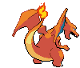

# Charizard (Flame Pokémon)

| Official Artwork | Shiny Artwork |
| --- | --- |
|  |  |

It is said that Charizard’s fire burns hotter if it has experienced harsh battles.

---

## Media

### Default Sprites

| Front | Back | Front Shiny | Back Shiny |
| --- | --- | --- | --- |
|  |  |  |  |

### Charizard Mega X Sprites

| Front | Front Shiny |
| --- | --- |
|  |  |

### Charizard Mega Y Sprites

| Front | Front Shiny |
| --- | --- |
|  |  |

### Charizard Gmax Sprites

| Front | Back | Front Shiny | Back Shiny |
| --- | --- | --- | --- |
|  |  |  |  |

### Cries

Latest (Gen VI+):

<audio controls>
<source src='../../assets/cries/charizard/latest.ogg' type='audio/ogg'>
  Your browser does not support the audio element.
</audio>

Legacy:

<audio controls>
<source src='../../assets/cries/charizard/legacy.ogg' type='audio/ogg'>
  Your browser does not support the audio element.
</audio>

---

## Pokédex Data

| National № | Type(s) | Height | Weight | Abilities | Local № |
|------------|---------|--------|--------|-----------|---------|
| #6 | {: width='48'} {: width='48'} | 1.7 m | 90.5 kg | 1. Blaze 2. Solar-Power | N/A |

---

## Base Stats
|   | HP | Attack | Defense | Sp. Atk | Sp. Def | Speed |
|---|----|--------|---------|---------|---------|-------|
| **Base** | 78 | 84 | 78 | 110 | 85 | 100 |
| **Min** | 266 | 155 | 144 | 202 | 157 | 184 |
| **Max** | 360 | 293 | 280 | 350 | 295 | 328 |

The ranges shown above are for a level 100 Pokémon. Maximum values are based on a beneficial nature, 252 EVs, 31 IVs; minimum values are based on a hindering nature, 0 EVs, 0 IVs.

---

## Forms & Evolutions

!!! warning "WARNING"

    Information on evolutions may not be 100% accurate; differences between evolution methods across generations are not accounted for.

### Forms

Charizard has no alternate forms.

### Evolution Line

1. [Charmander](charmander.md/)
    1. Level Up: [Charmeleon](charmeleon.md/)
        1. Level Up: [Charizard](charizard.md/)

---

## Training

| EV Yield | Catch Rate | Base Friendship | Base Exp. | Growth Rate | Held Items |
|----------|------------|-----------------|-----------|-------------|------------|
| 3 Special Attack | 45 | 50 | 267 | Medium-Slow | N/A |

---

## Breeding

| Egg Groups | Egg Cycles | Gender | Dimorphic | Color | Shape |
|------------|------------|--------|-----------|-------|-------|
| 1. Monster 2. Dragon | 20 | 87.5% Male 12.5% Female | False | Red | Upright |

---

## Moves

!!! warning "WARNING"

    Specific move information may be incorrect. However, the general movepool should be accurate; this includes changes made in Blaze Black and Volt White.

### Level Up Moves

| Lv. | Move | Type | Cat. | Power | Acc. | PP |
| --- | --- | --- | --- | --- | --- | --- |
| 1 | Air Slash | {: width='48'} | {: width='36'} | 75 | 95 | 15 |
| 1 | Crunch | {: width='48'} | {: width='36'} | 80 | 100 | 15 |
| 1 | Dragon Claw | {: width='48'} | {: width='36'} | 80 | 100 | 15 |
| 1 | Ember | {: width='48'} | {: width='36'} | 40 | 100 | 25 |
| 1 | Growl | {: width='48'} | {: width='36'} | — | 100 | 40 |
| 1 | Scratch | {: width='48'} | {: width='36'} | 40 | 100 | 35 |
| 1 | Shadow Claw | {: width='48'} | {: width='36'} | 80 | 100 | 15 |
| 1 | Smokescreen | {: width='48'} | {: width='36'} | — | 100 | 20 |
| 7 | Ember | {: width='48'} | {: width='36'} | 40 | 100 | 25 |
| 10 | Smokescreen | {: width='48'} | {: width='36'} | — | 100 | 20 |
| 17 | Dragon Rage | {: width='48'} | {: width='36'} | — | 100 | 10 |
| 21 | Scary Face | {: width='48'} | {: width='36'} | — | 100 | 10 |
| 28 | Fire Fang | {: width='48'} | {: width='36'} | 75 | 95 | 15 |
| 32 | Flame Burst | {: width='48'} | {: width='36'} | 70 | 100 | 15 |
| 36 | Wing Attack | {: width='48'} | {: width='36'} | 75 | 100 | 35 |
| 41 | Dragon Pulse | {: width='48'} | {: width='36'} | 85 | 100 | 10 |
| 47 | Flamethrower | {: width='48'} | {: width='36'} | 90 | 100 | 15 |
| 56 | Dragon Dance | {: width='48'} | {: width='36'} | — | — | 20 |
| 61 | Inferno | {: width='48'} | {: width='36'} | 100 | 50 | 5 |
| 66 | Outrage | {: width='48'} | {: width='36'} | 120 | 100 | 10 |
| 71 | Heat Wave | {: width='48'} | {: width='36'} | 95 | 90 | 10 |
| 77 | Flare Blitz | {: width='48'} | {: width='36'} | 120 | 100 | 15 |
| 83 | Belly Drum | {: width='48'} | {: width='36'} | — | — | 10 |

### TM Moves

| TM | Move | Type | Cat. | Power | Acc. | PP |
| --- | --- | --- | --- | --- | --- | --- |
| HM01 | Cut | {: width='48'} | {: width='36'} | 60 | 100% | 25 |
| HM02 | Fly | {: width='48'} | {: width='36'} | 100 | 100% | 15 |
| HM04 | Strength | {: width='48'} | {: width='36'} | 100 | 100 | 15 |
| TM01 | Hone Claws | {: width='48'} | {: width='36'} | — | — | 15 |
| TM02 | Dragon Claw | {: width='48'} | {: width='36'} | 80 | 100 | 15 |
| TM05 | Roar | {: width='48'} | {: width='36'} | — | — | 20 |
| TM06 | Toxic | {: width='48'} | {: width='36'} | — | 90 | 10 |
| TM10 | Hidden Power | {: width='48'} | {: width='36'} | 60 | 100 | 15 |
| TM11 | Sunny Day | {: width='48'} | {: width='36'} | — | — | 5 |
| TM15 | Hyper Beam | {: width='48'} | {: width='36'} | 150 | 90 | 5 |
| TM17 | Protect | {: width='48'} | {: width='36'} | — | — | 10 |
| TM21 | Frustration | {: width='48'} | {: width='36'} | — | 100 | 20 |
| TM22 | Solar Beam | {: width='48'} | {: width='36'} | 120 | 100 | 10 |
| TM26 | Earthquake | {: width='48'} | {: width='36'} | 100 | 100 | 10 |
| TM27 | Return | {: width='48'} | {: width='36'} | — | 100 | 20 |
| TM28 | Dig | {: width='48'} | {: width='36'} | 100 | 100 | 10 |
| TM31 | Brick Break | {: width='48'} | {: width='36'} | 75 | 100 | 15 |
| TM32 | Double Team | {: width='48'} | {: width='36'} | — | — | 15 |
| TM35 | Flamethrower | {: width='48'} | {: width='36'} | 90 | 100 | 15 |
| TM38 | Fire Blast | {: width='48'} | {: width='36'} | 110 | 85 | 5 |
| TM39 | Rock Tomb | {: width='48'} | {: width='36'} | 60 | 95 | 15 |
| TM40 | Aerial Ace | {: width='48'} | {: width='36'} | 60 | — | 20 |
| TM42 | Facade | {: width='48'} | {: width='36'} | 70 | 100 | 20 |
| TM43 | Flame Charge | {: width='48'} | {: width='36'} | 50 | 100 | 20 |
| TM44 | Rest | {: width='48'} | {: width='36'} | — | — | 5 |
| TM45 | Attract | {: width='48'} | {: width='36'} | — | 100 | 15 |
| TM48 | Round | {: width='48'} | {: width='36'} | 60 | 100 | 15 |
| TM49 | Echoed Voice | {: width='48'} | {: width='36'} | 40 | 100 | 15 |
| TM50 | Overheat | {: width='48'} | {: width='36'} | 130 | 90 | 5 |
| TM52 | Focus Blast | {: width='48'} | {: width='36'} | 120 | 70 | 5 |
| TM56 | Fling | {: width='48'} | {: width='36'} | — | 100 | 10 |
| TM58 | Sky Drop | {: width='48'} | {: width='36'} | 80 | 100 | 10 |
| TM59 | Incinerate | {: width='48'} | {: width='36'} | 50 | 100 | 15 |
| TM61 | Will O Wisp | {: width='48'} | {: width='36'} | — | 85 | 15 |
| TM65 | Shadow Claw | {: width='48'} | {: width='36'} | 80 | 100 | 15 |
| TM68 | Giga Impact | {: width='48'} | {: width='36'} | 150 | 90 | 5 |
| TM75 | Swords Dance | {: width='48'} | {: width='36'} | — | — | 20 |
| TM78 | Bulldoze | {: width='48'} | {: width='36'} | 80 | 100 | 20 |
| TM80 | Rock Slide | {: width='48'} | {: width='36'} | 75 | 90 | 10 |
| TM82 | Dragon Tail | {: width='48'} | {: width='36'} | 60 | 90 | 10 |
| TM87 | Swagger | {: width='48'} | {: width='36'} | — | 85 | 15 |
| TM90 | Substitute | {: width='48'} | {: width='36'} | — | — | 10 |
| TM94 | Rock Smash | {: width='48'} | {: width='36'} | 60 | 100 | 15 |

### Egg Moves

Charizard cannot learn any moves by breeding.
### Tutor Moves

| Move | Type | Cat. | Power | Acc. | PP |
| --- | --- | --- | --- | --- | --- |
| Blast Burn | {: width='48'} | {: width='36'} | 150 | 90 | 5 |
| Fire Pledge | {: width='48'} | {: width='36'} | 80 | 100 | 10 |

