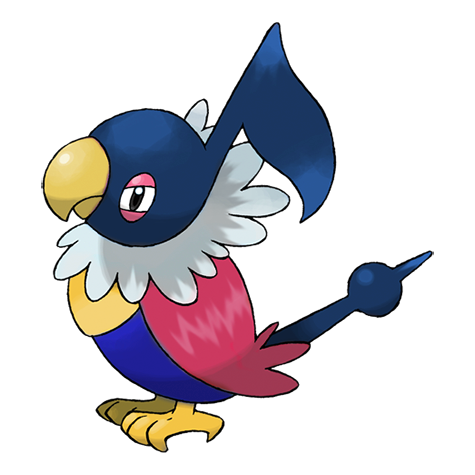
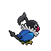
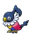

# #441 Chatot (Music Note Pokémon)

| Official Artwork | Shiny Artwork |
| --- | --- |
|  |  |

Its tongue is just like a human’s. As a result, it can cleverly mimic human speech.

---

## Media

### Sprites

| Front | Back | Front Shiny | Back Shiny |
| --- | --- | --- | --- |
|  |  |  |  |

### Cries

Latest (Gen VI+):

<audio controls>
<source src='../../assets/cries/chatot/latest.ogg' type='audio/ogg'>
  Your browser does not support the audio element.
</audio>

Legacy:

<audio controls>
<source src='../../assets/cries/chatot/legacy.ogg' type='audio/ogg'>
  Your browser does not support the audio element.
</audio>

---

## Pokédex Data

| National № | Type(s) | Height | Weight | Abilities | Local № |
|------------|---------|--------|--------|-----------|---------|
| #441 | {: width='48'} {: width='48'} | 0.5 m | 1.9 kg | 1. Moody 2. Tangled-Feet | N/A |

---

## Base Stats
|   | HP | Attack | Defense | Sp. Atk | Sp. Def | Speed |
|---|----|--------|---------|---------|---------|-------|
| **Base** | 76 | 65 | 56 | 112 | 55 | 111 |
| **Min** | 262 | 121 | 105 | 206 | 103 | 204 |
| **Max** | 356 | 251 | 232 | 355 | 229 | 353 |

The ranges shown above are for a level 100 Pokémon. Maximum values are based on a beneficial nature, 252 EVs, 31 IVs; minimum values are based on a hindering nature, 0 EVs, 0 IVs.

---

## Forms & Evolutions

!!! warning "WARNING"

    Information on evolutions may not be 100% accurate; differences between evolution methods across generations are not accounted for.

### Forms

Chatot has no alternate forms.

### Evolution Line

1. [Chatot](chatot.md/)

### Evolution Changes

---

## Training

| EV Yield | Catch Rate | Base Friendship | Base Exp. | Growth Rate | Held Items |
|----------|------------|-----------------|-----------|-------------|------------|
| 1 Attack | 30 | 35 | 144 | Medium-Slow | Metronome (5%) |

---

## Breeding

| Egg Groups | Egg Cycles | Gender | Dimorphic | Color | Shape |
|------------|------------|--------|-----------|-------|-------|
| 1. Flying | 20 | 50.0% Male 50.0% Female | False | Black | Wings |

---

## Moves

!!! warning "WARNING"

    Specific move information may be incorrect. However, the general movepool should be accurate; this includes changes made in Blaze Black and Volt White.

### Level Up Moves

| Lv. | Move | Type | Cat. | Power | Acc. | PP |
| --- | --- | --- | --- | --- | --- | --- |
| 1 | Nasty Plot | {: width='48'} | {: width='36'} | — | — | 20 |
| 1 | Peck | {: width='48'} | {: width='36'} | 35 | 100 | 35 |
| 5 | Growl | {: width='48'} | {: width='36'} | — | 100 | 40 |
| 9 | Mirror Move | {: width='48'} | {: width='36'} | — | — | 20 |
| 13 | Sing | {: width='48'} | {: width='36'} | — | 55 | 15 |
| 17 | Fury Attack | {: width='48'} | {: width='36'} | 15 | 85 | 20 |
| 21 | Chatter | {: width='48'} | {: width='36'} | 65 | 100 | 20 |
| 25 | Taunt | {: width='48'} | {: width='36'} | — | 100 | 20 |
| 29 | Round | {: width='48'} | {: width='36'} | 60 | 100 | 15 |
| 33 | Mimic | {: width='48'} | {: width='36'} | — | — | 10 |
| 37 | Echoed Voice | {: width='48'} | {: width='36'} | 40 | 100 | 15 |
| 41 | Roost | {: width='48'} | {: width='36'} | — | — | 5 |
| 45 | Uproar | {: width='48'} | {: width='36'} | 90 | 100 | 10 |
| 49 | Synchronoise | {: width='48'} | {: width='36'} | 120 | 100 | 10 |
| 53 | Feather Dance | {: width='48'} | {: width='36'} | — | 100 | 15 |
| 57 | Hyper Voice | {: width='48'} | {: width='36'} | 90 | 100 | 10 |
| 61 | Hurricane | {: width='48'} | {: width='36'} | 110 | 70 | 10 |
| 65 | Heat Wave | {: width='48'} | {: width='36'} | 95 | 90 | 10 |

### TM Moves

| TM | Move | Type | Cat. | Power | Acc. | PP |
| --- | --- | --- | --- | --- | --- | --- |
| HM02 | Fly | {: width='48'} | {: width='36'} | 100 | 100 | 15 |
| TM06 | Toxic | {: width='48'} | {: width='36'} | — | 90 | 10 |
| TM10 | Hidden Power | {: width='48'} | {: width='36'} | 60 | 100 | 15 |
| TM11 | Sunny Day | {: width='48'} | {: width='36'} | — | — | 5 |
| TM12 | Taunt | {: width='48'} | {: width='36'} | — | 100 | 20 |
| TM17 | Protect | {: width='48'} | {: width='36'} | — | — | 10 |
| TM18 | Rain Dance | {: width='48'} | {: width='36'} | — | — | 5 |
| TM21 | Frustration | {: width='48'} | {: width='36'} | — | 100 | 20 |
| TM27 | Return | {: width='48'} | {: width='36'} | — | 100 | 20 |
| TM32 | Double Team | {: width='48'} | {: width='36'} | — | — | 15 |
| TM40 | Aerial Ace | {: width='48'} | {: width='36'} | 60 | — | 20 |
| TM41 | Torment | {: width='48'} | {: width='36'} | — | 100 | 15 |
| TM42 | Facade | {: width='48'} | {: width='36'} | 70 | 100 | 20 |
| TM44 | Rest | {: width='48'} | {: width='36'} | — | — | 5 |
| TM45 | Attract | {: width='48'} | {: width='36'} | — | 100 | 15 |
| TM46 | Thief | {: width='48'} | {: width='36'} | 60 | 100 | 25 |
| TM48 | Round | {: width='48'} | {: width='36'} | 60 | 100 | 15 |
| TM49 | Echoed Voice | {: width='48'} | {: width='36'} | 40 | 100 | 15 |
| TM83 | Work Up | {: width='48'} | {: width='36'} | — | — | 30 |
| TM87 | Swagger | {: width='48'} | {: width='36'} | — | 85 | 15 |
| TM88 | Pluck | {: width='48'} | {: width='36'} | 60 | 100 | 20 |
| TM89 | U Turn | {: width='48'} | {: width='36'} | 70 | 100 | 20 |
| TM90 | Substitute | {: width='48'} | {: width='36'} | — | — | 10 |

### Egg Moves

| Move | Type | Cat. | Power | Acc. | PP |
| --- | --- | --- | --- | --- | --- |
| Supersonic | {: width='48'} | {: width='36'} | — | 55 | 20 |
| Agility | {: width='48'} | {: width='36'} | — | — | 30 |
| Night Shade | {: width='48'} | {: width='36'} | — | 100 | 15 |
| Steel Wing | {: width='48'} | {: width='36'} | 70 | 90 | 25 |
| Sleep Talk | {: width='48'} | {: width='36'} | — | — | 10 |
| Encore | {: width='48'} | {: width='36'} | — | 100 | 5 |
| Air Cutter | {: width='48'} | {: width='36'} | 60 | 95 | 25 |
| Nasty Plot | {: width='48'} | {: width='36'} | — | — | 20 |
| Defog | {: width='48'} | {: width='36'} | — | — | 15 |

### Tutor Moves

Chatot cannot learn any moves from tutors.
