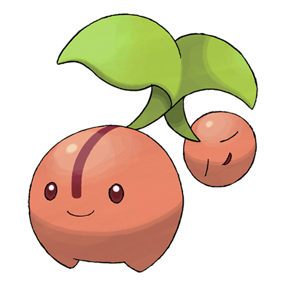
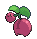
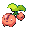
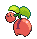

# #420 Cherubi (Cherry Pokémon)

| Official Artwork | Shiny Artwork |
| --- | --- |
|  |  |

The small ball is not only filled with nutrients, it is also tasty. Starly try to peck it off.

---

## Media

### Sprites

| Front | Back | Front Shiny | Back Shiny |
| --- | --- | --- | --- |
|  |  |  |  |

### Cries

Latest (Gen VI+):

<audio controls>
<source src='../../assets/cries/cherubi/latest.ogg' type='audio/ogg'>
  Your browser does not support the audio element.
</audio>

Legacy:

<audio controls>
<source src='../../assets/cries/cherubi/legacy.ogg' type='audio/ogg'>
  Your browser does not support the audio element.
</audio>

---

## Pokédex Data

| National № | Type(s) | Height | Weight | Abilities | Local № |
|------------|---------|--------|--------|-----------|---------|
| #420 | {: width='48'} | 0.4 m | 3.3 kg | 1. Chlorophyll 2. Healer | N/A |

---

## Base Stats
|   | HP | Attack | Defense | Sp. Atk | Sp. Def | Speed |
|---|----|--------|---------|---------|---------|-------|
| **Base** | 45 | 35 | 45 | 62 | 53 | 35 |
| **Min** | 200 | 67 | 85 | 116 | 99 | 67 |
| **Max** | 294 | 185 | 207 | 245 | 225 | 185 |

The ranges shown above are for a level 100 Pokémon. Maximum values are based on a beneficial nature, 252 EVs, 31 IVs; minimum values are based on a hindering nature, 0 EVs, 0 IVs.

---

## Forms & Evolutions

!!! warning "WARNING"

    Information on evolutions may not be 100% accurate; differences between evolution methods across generations are not accounted for.

### Forms

Cherubi has no alternate forms.

### Evolution Line

1. [Cherubi](cherubi.md/)
    1. Level Up: [Cherrim](cherrim.md/)

### Evolution Changes

---

## Training

| EV Yield | Catch Rate | Base Friendship | Base Exp. | Growth Rate | Held Items |
|----------|------------|-----------------|-----------|-------------|------------|
| 1 Special Attack | 190 | 50 | 55 | Medium | Miracle Seed (5%) |

---

## Breeding

| Egg Groups | Egg Cycles | Gender | Dimorphic | Color | Shape |
|------------|------------|--------|-----------|-------|-------|
| 1. Fairy 2. Plant | 20 | 50.0% Male 50.0% Female | False | Pink | Heads |

---

## Moves

!!! warning "WARNING"

    Specific move information may be incorrect. However, the general movepool should be accurate; this includes changes made in Blaze Black and Volt White.

### Level Up Moves

| Lv. | Move | Type | Cat. | Power | Acc. | PP |
| --- | --- | --- | --- | --- | --- | --- |
| 1 | Morning Sun | {: width='48'} | {: width='36'} | — | — | 5 |
| 1 | Tackle | {: width='48'} | {: width='36'} | 40 | 100 | 35 |
| 7 | Growth | {: width='48'} | {: width='36'} | — | — | 20 |
| 10 | Leech Seed | {: width='48'} | {: width='36'} | — | 90 | 10 |
| 13 | Helping Hand | {: width='48'} | {: width='36'} | — | — | 20 |
| 19 | Magical Leaf | {: width='48'} | {: width='36'} | 60 | — | 20 |
| 22 | Sunny Day | {: width='48'} | {: width='36'} | — | — | 5 |
| 28 | Worry Seed | {: width='48'} | {: width='36'} | — | 100 | 10 |
| 31 | Take Down | {: width='48'} | {: width='36'} | 90 | 85 | 20 |
| 37 | Solar Beam | {: width='48'} | {: width='36'} | 120 | 100 | 10 |
| 40 | Lucky Chant | {: width='48'} | {: width='36'} | — | — | 30 |

### TM Moves

| TM | Move | Type | Cat. | Power | Acc. | PP |
| --- | --- | --- | --- | --- | --- | --- |
| TM06 | Toxic | {: width='48'} | {: width='36'} | — | 90 | 10 |
| TM10 | Hidden Power | {: width='48'} | {: width='36'} | 60 | 100 | 15 |
| TM11 | Sunny Day | {: width='48'} | {: width='36'} | — | — | 5 |
| TM17 | Protect | {: width='48'} | {: width='36'} | — | — | 10 |
| TM20 | Safeguard | {: width='48'} | {: width='36'} | — | — | 25 |
| TM21 | Frustration | {: width='48'} | {: width='36'} | — | 100 | 20 |
| TM22 | Solar Beam | {: width='48'} | {: width='36'} | 120 | 100 | 10 |
| TM27 | Return | {: width='48'} | {: width='36'} | — | 100 | 20 |
| TM32 | Double Team | {: width='48'} | {: width='36'} | — | — | 15 |
| TM42 | Facade | {: width='48'} | {: width='36'} | 70 | 100 | 20 |
| TM44 | Rest | {: width='48'} | {: width='36'} | — | — | 5 |
| TM45 | Attract | {: width='48'} | {: width='36'} | — | 100 | 15 |
| TM48 | Round | {: width='48'} | {: width='36'} | 60 | 100 | 15 |
| TM53 | Energy Ball | {: width='48'} | {: width='36'} | 90 | 100 | 10 |
| TM70 | Flash | {: width='48'} | {: width='36'} | — | 100 | 20 |
| TM75 | Swords Dance | {: width='48'} | {: width='36'} | — | — | 20 |
| TM86 | Grass Knot | {: width='48'} | {: width='36'} | — | 100 | 20 |
| TM87 | Swagger | {: width='48'} | {: width='36'} | — | 85 | 15 |
| TM90 | Substitute | {: width='48'} | {: width='36'} | — | — | 10 |

### Egg Moves

| Move | Type | Cat. | Power | Acc. | PP |
| --- | --- | --- | --- | --- | --- |
| Razor Leaf | {: width='48'} | {: width='36'} | 55 | 95 | 25 |
| Defense Curl | {: width='48'} | {: width='36'} | — | — | 40 |
| Rollout | {: width='48'} | {: width='36'} | 30 | 90 | 20 |
| Sweet Scent | {: width='48'} | {: width='36'} | — | 100 | 20 |
| Nature Power | {: width='48'} | {: width='36'} | — | — | 20 |
| Weather Ball | {: width='48'} | {: width='36'} | 50 | 100 | 10 |
| Aromatherapy | {: width='48'} | {: width='36'} | — | — | 5 |
| Grass Whistle | {: width='48'} | {: width='36'} | — | 55 | 15 |
| Tickle | {: width='48'} | {: width='36'} | — | 100 | 20 |
| Healing Wish | {: width='48'} | {: width='36'} | — | — | 10 |
| Natural Gift | {: width='48'} | {: width='36'} | — | 100 | 15 |
| Seed Bomb | {: width='48'} | {: width='36'} | 80 | 100 | 15 |
| Heal Pulse | {: width='48'} | {: width='36'} | — | — | 10 |

### Tutor Moves

Cherubi cannot learn any moves from tutors.
