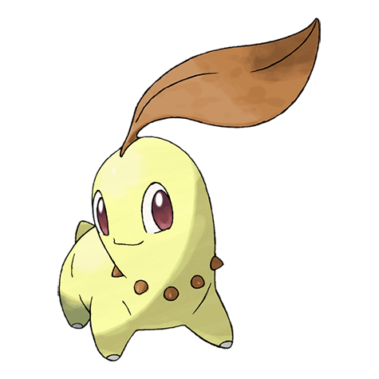

# #152 Chikorita (Leaf Pokémon)

| Official Artwork | Shiny Artwork |
| --- | --- |
|  |  |

It uses the leaf on its head to determine the temperature and humidity. It loves to sunbathe.

---

## Media

### Sprites

| Front | Back | Front Shiny | Back Shiny |
| --- | --- | --- | --- |
|  |  |  |  |

### Cries

Latest (Gen VI+):

<audio controls>
  <source src='../assets/cries/152/latest.ogg' type='audio/ogg'>
  Your browser does not support the audio element.
</audio>

Legacy:

<audio controls>
  <source src='../assets/cries/152/legacy.ogg' type='audio/ogg'>
  Your browser does not support the audio element.
</audio>

---

## Pokédex Data

| National № | Type(s) | Height | Weight | Abilities | Local № |
|------------|---------|--------|--------|-----------|---------|
| #152 | {: width='48'} | 0.9 m | 6.4 kg | 1. Overgrow 2. Natural-Cure | #N/A |

---

## Base Stats
---

## Base Stats
|   | HP | Attack | Defense | Sp. Atk | Sp. Def | Speed |
|---|----|--------|---------|---------|---------|-------|
| **Base** | 45 | 49 | 65 | 49 | 65 | 45 |
| **Min** | 200 | 92 | 121 | 92 | 121 | 85 |
| **Max** | 294 | 216 | 251 | 216 | 251 | 207 |

The ranges shown above are for a level 100 Pokémon. Maximum values are based on a beneficial nature, 252 EVs, 31 IVs; minimum values are based on a hindering nature, 0 EVs, 0 IVs.

---

## Forms & Evolutions

!!! warning "WARNING"

    Some forms may not be available in Blaze Black/Volt White. Also information on evolutions may not be 100% accurate; it is currently quite complex to track generational evolution data.

### Forms

Chikorita has no alternate forms.

### Evolution Line

1. [Chikorita](chikorita.md/)
1. Level Up: [Bayleef](bayleef.md/)
1. Level Up: [Meganium](meganium.md/)

---

## Training

| EV Yield | Catch Rate | Base Friendship | Base Exp. | Growth Rate | Held Items |
|----------|------------|-----------------|-----------|-------------|------------|
| 1 Special Defense | 45 | 70 | 64 | Medium-Slow |  |

---

## Breeding

| Egg Groups | Egg Cycles | Gender | Dimorphic | Color | Shape |
|------------|------------|--------|-----------|-------|-------|
| 1. Monster 2. Plant | 20 | 87.5% Male 12.5% Female | False | Green | Quadruped |

---

## Moves

!!! warning "WARNING"

    Specific move information may be incorrect. However, the general movepool should be accurate (including changes to learnset).

### Level Up Moves

Lv. | Move | Type | Cat. | Power | Acc. | PP
--- | --- | --- | --- | --- | --- | ---
| 1 | Growl | {: width='48'} | {: width='36'} | — | 100 | 40 |
| 1 | Tackle | {: width='48'} | {: width='36'} | 40 | 100 | 35 |
| 6 | Razor Leaf | {: width='48'} | {: width='36'} | 55 | 95 | 25 |
| 9 | Poison Powder | {: width='48'} | {: width='36'} | — | 75 | 35 |
| 9 | Sleep Powder | {: width='48'} | {: width='36'} | — | 75 | 15 |
| 9 | Stun Spore | {: width='48'} | {: width='36'} | — | 75 | 30 |
| 12 | Synthesis | {: width='48'} | {: width='36'} | — | — | 5 |
| 15 | Nature Power | {: width='48'} | {: width='36'} | — | — | 20 |
| 17 | Reflect | {: width='48'} | {: width='36'} | — | — | 20 |
| 20 | Magical Leaf | {: width='48'} | {: width='36'} | 60 | — | 20 |
| 23 | Natural Gift | {: width='48'} | {: width='36'} | — | 100 | 15 |
| 28 | Sweet Scent | {: width='48'} | {: width='36'} | — | 100 | 20 |
| 31 | Light Screen | {: width='48'} | {: width='36'} | — | — | 30 |
| 34 | Body Slam | {: width='48'} | {: width='36'} | 85 | 100 | 15 |
| 39 | Safeguard | {: width='48'} | {: width='36'} | — | — | 25 |
| 42 | Aromatherapy | {: width='48'} | {: width='36'} | — | — | 5 |
| 45 | Solar Beam | {: width='48'} | {: width='36'} | 120 | 100 | 10 |
| 48 | Leaf Storm | {: width='48'} | {: width='36'} | 130 | 90 | 5 |

### TM Moves

TM | Move | Type | Cat. | Power | Acc. | PP
--- | --- | --- | --- | --- | --- | ---
| HM01 | Cut | {: width='48'} | {: width='36'} | 60 | 100 | 20 |
| TM06 | Toxic | {: width='48'} | {: width='36'} | — | 90 | 10 |
| TM10 | Hidden Power | {: width='48'} | {: width='36'} | 60 | 100 | 15 |
| TM11 | Sunny Day | {: width='48'} | {: width='36'} | — | — | 5 |
| TM16 | Light Screen | {: width='48'} | {: width='36'} | — | — | 30 |
| TM17 | Protect | {: width='48'} | {: width='36'} | — | — | 10 |
| TM20 | Safeguard | {: width='48'} | {: width='36'} | — | — | 25 |
| TM21 | Frustration | {: width='48'} | {: width='36'} | — | 100 | 20 |
| TM22 | Solar Beam | {: width='48'} | {: width='36'} | 120 | 100 | 10 |
| TM27 | Return | {: width='48'} | {: width='36'} | — | 100 | 20 |
| TM32 | Double Team | {: width='48'} | {: width='36'} | — | — | 15 |
| TM33 | Reflect | {: width='48'} | {: width='36'} | — | — | 20 |
| TM42 | Facade | {: width='48'} | {: width='36'} | 70 | 100 | 20 |
| TM44 | Rest | {: width='48'} | {: width='36'} | — | — | 5 |
| TM45 | Attract | {: width='48'} | {: width='36'} | — | 100 | 15 |
| TM48 | Round | {: width='48'} | {: width='36'} | 60 | 100 | 15 |
| TM49 | Echoed Voice | {: width='48'} | {: width='36'} | 40 | 100 | 15 |
| TM53 | Energy Ball | {: width='48'} | {: width='36'} | 90 | 100 | 10 |
| TM70 | Flash | {: width='48'} | {: width='36'} | — | 100 | 20 |
| TM75 | Swords Dance | {: width='48'} | {: width='36'} | — | — | 20 |
| TM86 | Grass Knot | {: width='48'} | {: width='36'} | — | 100 | 20 |
| TM87 | Swagger | {: width='48'} | {: width='36'} | — | 85 | 15 |
| TM90 | Substitute | {: width='48'} | {: width='36'} | — | — | 10 |

### Egg Moves

Move | Type | Cat. | Power | Acc. | PP
--- | --- | --- | --- | --- | ---
| Vine Whip | {: width='48'} | {: width='36'} | 45 | 100 | 25 |
| Body Slam | {: width='48'} | {: width='36'} | 85 | 100 | 15 |
| Counter | {: width='48'} | {: width='36'} | — | 100 | 20 |
| Leech Seed | {: width='48'} | {: width='36'} | — | 90 | 10 |
| Flail | {: width='48'} | {: width='36'} | — | 100 | 15 |
| Ancient Power | {: width='48'} | {: width='36'} | 60 | 100 | 5 |
| Ingrain | {: width='48'} | {: width='36'} | — | — | 20 |
| Refresh | {: width='48'} | {: width='36'} | — | — | 20 |
| Aromatherapy | {: width='48'} | {: width='36'} | — | — | 5 |
| Grass Whistle | {: width='48'} | {: width='36'} | — | 55 | 15 |
| Wring Out | {: width='48'} | {: width='36'} | — | 100 | 5 |
| Heal Pulse | {: width='48'} | {: width='36'} | — | — | 10 |

### Tutor Moves

Move | Type | Cat. | Power | Acc. | PP
--- | --- | --- | --- | --- | ---
| Grass Pledge | {: width='48'} | {: width='36'} | 100 | 100 | 10 |

