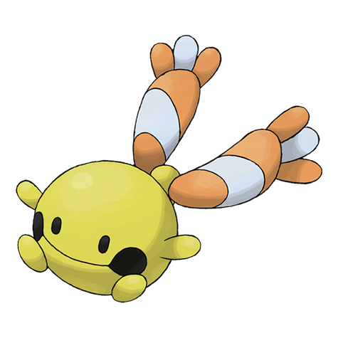
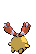
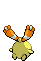

# #433 Chingling (Bell Pokémon)

| Official Artwork | Shiny Artwork |
|------------------|---------------|
|  |  |

There is an orb inside its mouth. When it hops, the orb bounces all over and makes a ringing sound.

---

## Media

### Default Sprites

| Front | Shiny | Back | Shiny |
|-------|-------|------|-------|
|  |  |  |  |

### Cries

Latest (Gen VI+):

<audio controls>
<source src='../../assets/cries/chingling/latest.ogg' type='audio/ogg'>
  Your browser does not support the audio element.
</audio>

Legacy:

<audio controls>
<source src='../../assets/cries/chingling/legacy.ogg' type='audio/ogg'>
  Your browser does not support the audio element.
</audio>

---

## Pokédex Data

| National № | Type(s) | Height | Weight | Abilities | Local № |
|------------|---------|--------|--------|-----------|---------|
| #433 | {: width="48"} | 0.2 m / 0.7 ft | 0.6 kg / 1.3 lbs | 1. Levitate | #82 |

---

## Base Stats
|   | HP | Attack | Defense | Sp. Atk | Sp. Def | Speed |
|---|----|--------|---------|---------|---------|-------|
| **Base** | 45 | 30 | 50 | 65 | 50 | 45 |
| **Min** | 200 | 58 | 94 | 121 | 94 | 85 |
| **Max** | 294 | 174 | 218 | 251 | 218 | 207 |

The ranges shown above are for a level 100 Pokémon. Maximum values are based on a beneficial nature, 252 EVs, 31 IVs; minimum values are based on a hindering nature, 0 EVs, 0 IVs.

---

## Forms & Evolutions

!!! warning "WARNING"

    Information on evolutions may not be 100% accurate; differences between evolution methods across generations are not accounted for.

### Forms

Chingling has no alternate forms.

### Evolution Line

1. [Chingling](chingling.md/)
    1. Level Up: [Chimecho](chimecho.md/)

---

## Training

| EV Yield | Catch Rate | Base Friendship | Base Exp. | Growth Rate | Held Items |
|----------|------------|-----------------|-----------|-------------|------------|
| 1 Sp. Atk | 120 | 200 | 57 | Fast | Colbur Berry (5%) |

---

## Breeding

| Egg Groups | Egg Cycles | Gender | Dimorphic | Color | Shape |
|------------|------------|--------|-----------|-------|-------|
| 1. No-Eggs | 25 | 50.0% Male 50.0% Female | False | Yellow | Humanoid |

---

## Moves

!!! warning "WARNING"

    Specific move information may be incorrect. However, the general movepool should be accurate; this includes changes made in Blaze Black and Volt White.

### Level Up Moves

| Lv. | Move | Type | Cat. | Power | Acc. | PP |
| --- | --- | --- | --- | --- | --- | --- |
| 1 | Hypnosis | {: width="48"} | {: width="36"} | — | 60 | 20 |
| 1 | Recover | {: width="48"} | {: width="36"} | — | — | 5 |
| 1 | Wrap | {: width="48"} | {: width="36"} | 15 | 90 | 20 |
| 6 | Growl | {: width="48"} | {: width="36"} | — | 100 | 40 |
| 9 | Astonish | {: width="48"} | {: width="36"} | 30 | 100 | 15 |
| 14 | Confusion | {: width="48"} | {: width="36"} | 50 | 100 | 25 |
| 17 | Uproar | {: width="48"} | {: width="36"} | 90 | 100 | 10 |
| 22 | Last Resort | {: width="48"} | {: width="36"} | 140 | 100 | 5 |
| 25 | Entrainment | {: width="48"} | {: width="36"} | — | 100 | 15 |
| 30 | Hyper Voice | {: width="48"} | {: width="36"} | 90 | 100 | 10 |

### TM Moves

| TM | Move | Type | Cat. | Power | Acc. | PP |
| --- | --- | --- | --- | --- | --- | --- |
| TM03 | Psyshock | {: width="48"} | {: width="36"} | 80 | 100 | 10 |
| TM04 | Calm Mind | {: width="48"} | {: width="36"} | — | — | 20 |
| TM06 | Toxic | {: width="48"} | {: width="36"} | — | 90 | 10 |
| TM10 | Hidden Power | {: width="48"} | {: width="36"} | 60 | 100 | 15 |
| TM11 | Sunny Day | {: width="48"} | {: width="36"} | — | — | 5 |
| TM12 | Taunt | {: width="48"} | {: width="36"} | — | 100 | 20 |
| TM16 | Light Screen | {: width="48"} | {: width="36"} | — | — | 30 |
| TM17 | Protect | {: width="48"} | {: width="36"} | — | — | 10 |
| TM18 | Rain Dance | {: width="48"} | {: width="36"} | — | — | 5 |
| TM19 | Telekinesis | {: width="48"} | {: width="36"} | — | — | 15 |
| TM20 | Safeguard | {: width="48"} | {: width="36"} | — | — | 25 |
| TM21 | Frustration | {: width="48"} | {: width="36"} | — | 100 | 20 |
| TM27 | Return | {: width="48"} | {: width="36"} | — | 100 | 20 |
| TM29 | Psychic | {: width="48"} | {: width="36"} | 90 | 100 | 10 |
| TM30 | Shadow Ball | {: width="48"} | {: width="36"} | 90 | 100 | 15 |
| TM32 | Double Team | {: width="48"} | {: width="36"} | — | — | 15 |
| TM33 | Reflect | {: width="48"} | {: width="36"} | — | — | 20 |
| TM41 | Torment | {: width="48"} | {: width="36"} | — | 100 | 15 |
| TM42 | Facade | {: width="48"} | {: width="36"} | 70 | 100 | 20 |
| TM44 | Rest | {: width="48"} | {: width="36"} | — | — | 5 |
| TM45 | Attract | {: width="48"} | {: width="36"} | — | 100 | 15 |
| TM48 | Round | {: width="48"} | {: width="36"} | 60 | 100 | 15 |
| TM49 | Echoed Voice | {: width="48"} | {: width="36"} | 40 | 100 | 15 |
| TM57 | Charge Beam | {: width="48"} | {: width="36"} | 50 | 90 | 10 |
| TM70 | Flash | {: width="48"} | {: width="36"} | — | 100 | 20 |
| TM73 | Thunder Wave | {: width="48"} | {: width="36"} | — | 90 | 20 |
| TM77 | Psych Up | {: width="48"} | {: width="36"} | — | — | 10 |
| TM85 | Dream Eater | {: width="48"} | {: width="36"} | 100 | 100 | 15 |
| TM86 | Grass Knot | {: width="48"} | {: width="36"} | — | 100 | 20 |
| TM87 | Swagger | {: width="48"} | {: width="36"} | — | 85 | 15 |
| TM90 | Substitute | {: width="48"} | {: width="36"} | — | — | 10 |
| TM92 | Trick Room | {: width="48"} | {: width="36"} | — | — | 5 |

### Egg Moves

| Move | Type | Cat. | Power | Acc. | PP |
| --- | --- | --- | --- | --- | --- |
| Disable | {: width="48"} | {: width="36"} | — | 100 | 20 |
| Hypnosis | {: width="48"} | {: width="36"} | — | 60 | 20 |
| Recover | {: width="48"} | {: width="36"} | — | — | 5 |
| Curse | {: width="48"} | {: width="36"} | — | — | 10 |
| Future Sight | {: width="48"} | {: width="36"} | 120 | 100 | 10 |
| Wish | {: width="48"} | {: width="36"} | — | — | 10 |
| Skill Swap | {: width="48"} | {: width="36"} | — | — | 10 |
| Stored Power | {: width="48"} | {: width="36"} | 20 | 100 | 10 |

### Tutor Moves

Chingling cannot learn any moves from tutors.
