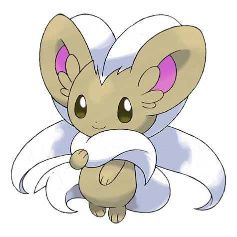
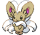
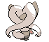
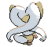

# #573 Cinccino (Scarf Pokémon)

| Official Artwork | Shiny Artwork |
|------------------|---------------|
|  |  |

**Blaze Black:** Their white fur is coated in a special oil that makes it easy for them to deflect attacks.

**Volt White:** Their white fur feels amazing to touch. Their fur repels dust and prevents static electricity from building up.

---

## Media

### Default Sprites

| Front | Shiny | Back | Shiny |
|-------|-------|------|-------|
|  |  |  |  |

### Cries

Latest (Gen VI+):

<audio controls>
<source src='../../assets/cries/cinccino/latest.ogg' type='audio/ogg'>
  Your browser does not support the audio element.
</audio>

Legacy:

<audio controls>
<source src='../../assets/cries/cinccino/legacy.ogg' type='audio/ogg'>
  Your browser does not support the audio element.
</audio>

---

## Pokédex Data

| National № | Type(s) | Height | Weight | Abilities | Local № |
|------------|---------|--------|--------|-----------|---------|
| #573 | {: width="48"} | 0.5 m / 1.6 ft | 7.5 kg / 16.5 lbs | 1. Skill Link 2. Technician | N/A |

---

## Base Stats
|   | HP | Attack | Defense | Sp. Atk | Sp. Def | Speed |
|---|----|--------|---------|---------|---------|-------|
| **Base** | 75 | 105 | 60 | 65 | 60 | 115 |
| **Min** | 260 | 193 | 112 | 121 | 112 | 211 |
| **Max** | 354 | 339 | 240 | 251 | 240 | 361 |

The ranges shown above are for a level 100 Pokémon. Maximum values are based on a beneficial nature, 252 EVs, 31 IVs; minimum values are based on a hindering nature, 0 EVs, 0 IVs.

---

## Forms & Evolutions

!!! warning "WARNING"

    Information on evolutions may not be 100% accurate; differences between evolution methods across generations are not accounted for.

### Forms

Cinccino has no alternate forms.

### Evolution Line

1. [Minccino](minccino.md/)
    1. Use Item: [Cinccino](cinccino.md/)

---

## Training

| EV Yield | Catch Rate | Base Friendship | Base Exp. | Growth Rate | Held Items |
|----------|------------|-----------------|-----------|-------------|------------|
| 2 Spd | 60 | 50 | 165 | Fast | Chesto Berry (50%) |

---

## Breeding

| Egg Groups | Egg Cycles | Gender | Dimorphic | Color | Shape |
|------------|------------|--------|-----------|-------|-------|
| 1. Ground | 15 | 25.0% Male 75.0% Female | False | Gray | Quadruped |

---

## Moves

!!! warning "WARNING"

    Specific move information may be incorrect. However, the general movepool should be accurate; this includes changes made in Blaze Black and Volt White.

### Level Up Moves

| Lv. | Move | Type | Cat. | Power | Acc. | PP |
| --- | --- | --- | --- | --- | --- | --- |
| 1 | Bullet Seed | {: width="48"} | {: width="36"} | 25 | 100 | 30 |
| 1 | Helping Hand | {: width="48"} | {: width="36"} | — | — | 20 |
| 1 | Icicle Spear | {: width="48"} | {: width="36"} | 25 | 100 | 30 |
| 1 | Rock Blast | {: width="48"} | {: width="36"} | 25 | 90 | 10 |
| 1 | Sing | {: width="48"} | {: width="36"} | — | 55 | 15 |
| 1 | Tail Slap | {: width="48"} | {: width="36"} | 25 | 85 | 10 |
| 1 | Tickle | {: width="48"} | {: width="36"} | — | 100 | 20 |
| 29 | Magic Coat | {: width="48"} | {: width="36"} | — | — | 15 |
| 46 | Endeavor | {: width="48"} | {: width="36"} | — | 100 | 5 |

### TM Moves

| TM | Move | Type | Cat. | Power | Acc. | PP |
| --- | --- | --- | --- | --- | --- | --- |
| TM04 | Calm Mind | {: width="48"} | {: width="36"} | — | — | 20 |
| TM06 | Toxic | {: width="48"} | {: width="36"} | — | 90 | 10 |
| TM10 | Hidden Power | {: width="48"} | {: width="36"} | 60 | 100 | 15 |
| TM11 | Sunny Day | {: width="48"} | {: width="36"} | — | — | 5 |
| TM15 | Hyper Beam | {: width="48"} | {: width="36"} | 150 | 90 | 5 |
| TM16 | Light Screen | {: width="48"} | {: width="36"} | — | — | 30 |
| TM17 | Protect | {: width="48"} | {: width="36"} | — | — | 10 |
| TM18 | Rain Dance | {: width="48"} | {: width="36"} | — | — | 5 |
| TM20 | Safeguard | {: width="48"} | {: width="36"} | — | — | 25 |
| TM21 | Frustration | {: width="48"} | {: width="36"} | — | 100 | 20 |
| TM24 | Thunderbolt | {: width="48"} | {: width="36"} | 90 | 100 | 15 |
| TM25 | Thunder | {: width="48"} | {: width="36"} | 110 | 70 | 10 |
| TM27 | Return | {: width="48"} | {: width="36"} | — | 100 | 20 |
| TM28 | Dig | {: width="48"} | {: width="36"} | 100 | 100 | 10 |
| TM32 | Double Team | {: width="48"} | {: width="36"} | — | — | 15 |
| TM42 | Facade | {: width="48"} | {: width="36"} | 70 | 100 | 20 |
| TM44 | Rest | {: width="48"} | {: width="36"} | — | — | 5 |
| TM45 | Attract | {: width="48"} | {: width="36"} | — | 100 | 15 |
| TM48 | Round | {: width="48"} | {: width="36"} | 60 | 100 | 15 |
| TM49 | Echoed Voice | {: width="48"} | {: width="36"} | 40 | 100 | 15 |
| TM52 | Focus Blast | {: width="48"} | {: width="36"} | 120 | 70 | 5 |
| TM56 | Fling | {: width="48"} | {: width="36"} | — | 100 | 10 |
| TM67 | Retaliate | {: width="48"} | {: width="36"} | 70 | 100 | 5 |
| TM68 | Giga Impact | {: width="48"} | {: width="36"} | 150 | 90 | 5 |
| TM73 | Thunder Wave | {: width="48"} | {: width="36"} | — | 90 | 20 |
| TM83 | Work Up | {: width="48"} | {: width="36"} | — | — | 30 |
| TM86 | Grass Knot | {: width="48"} | {: width="36"} | — | 100 | 20 |
| TM87 | Swagger | {: width="48"} | {: width="36"} | — | 85 | 15 |
| TM89 | U Turn | {: width="48"} | {: width="36"} | 70 | 100 | 20 |
| TM90 | Substitute | {: width="48"} | {: width="36"} | — | — | 10 |

### Egg Moves

Cinccino cannot learn any moves by breeding.
### Tutor Moves

Cinccino cannot learn any moves from tutors.
