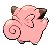

# #035 Clefairy (Fairy Pokémon)

| Official Artwork | Shiny Artwork |
| --- | --- |
|  |  |

It is said that happiness will come to those who see a gathering of Clefairy dancing under a full moon.

---

## Media

### Default Sprites

| Front | Back | Front Shiny | Back Shiny |
| --- | --- | --- | --- |
|  |  |  |  |

### Cries

Latest (Gen VI+):

<audio controls>
<source src='../../assets/cries/clefairy/latest.ogg' type='audio/ogg'>
  Your browser does not support the audio element.
</audio>

Legacy:

<audio controls>
<source src='../../assets/cries/clefairy/legacy.ogg' type='audio/ogg'>
  Your browser does not support the audio element.
</audio>

---

## Pokédex Data

| National № | Type(s) | Height | Weight | Abilities | Local № |
|------------|---------|--------|--------|-----------|---------|
| #35 | {: width='48'} | 0.6 m | 7.5 kg | 1. Cute-Charm 2. Magic-Guard | N/A |

---

## Base Stats
|   | HP | Attack | Defense | Sp. Atk | Sp. Def | Speed |
|---|----|--------|---------|---------|---------|-------|
| **Base** | 70 | 45 | 48 | 60 | 65 | 35 |
| **Min** | 250 | 85 | 90 | 112 | 121 | 67 |
| **Max** | 344 | 207 | 214 | 240 | 251 | 185 |

The ranges shown above are for a level 100 Pokémon. Maximum values are based on a beneficial nature, 252 EVs, 31 IVs; minimum values are based on a hindering nature, 0 EVs, 0 IVs.

---

## Forms & Evolutions

!!! warning "WARNING"

    Information on evolutions may not be 100% accurate; differences between evolution methods across generations are not accounted for.

### Forms

Clefairy has no alternate forms.

### Evolution Line

1. [Cleffa](cleffa.md/)
    1. Level Up: [Clefairy](clefairy.md/)
        1. Use Item: [Clefable](clefable.md/)

---

## Training

| EV Yield | Catch Rate | Base Friendship | Base Exp. | Growth Rate | Held Items |
|----------|------------|-----------------|-----------|-------------|------------|
| 2 Hp | 150 | 140 | 113 | Fast | moon-stone (5%) leppa-berry (50%) comet-shard (1%) |

---

## Breeding

| Egg Groups | Egg Cycles | Gender | Dimorphic | Color | Shape |
|------------|------------|--------|-----------|-------|-------|
| 1. Fairy | 10 | 25.0% Male 75.0% Female | False | Pink | Upright |

---

## Moves

!!! warning "WARNING"

    Specific move information may be incorrect. However, the general movepool should be accurate; this includes changes made in Blaze Black and Volt White.

### Level Up Moves

| Lv. | Move | Type | Cat. | Power | Acc. | PP |
| --- | --- | --- | --- | --- | --- | --- |
| 1 | Growl | {: width='48'} | {: width='36'} | — | 100 | 40 |
| 1 | Metronome | {: width='48'} | {: width='36'} | — | — | 10 |
| 1 | Pound | {: width='48'} | {: width='36'} | 40 | 100 | 35 |
| 4 | Encore | {: width='48'} | {: width='36'} | — | 100 | 5 |
| 7 | Sing | {: width='48'} | {: width='36'} | — | 55 | 15 |
| 10 | Double Slap | {: width='48'} | {: width='36'} | 15 | 85 | 10 |
| 13 | Defense Curl | {: width='48'} | {: width='36'} | — | — | 40 |
| 16 | Follow Me | {: width='48'} | {: width='36'} | — | — | 20 |
| 19 | Minimize | {: width='48'} | {: width='36'} | — | — | 10 |
| 22 | Wake Up Slap | {: width='48'} | {: width='36'} | 70 | 100 | 10 |
| 25 | Bestow | {: width='48'} | {: width='36'} | — | — | 15 |
| 28 | Cosmic Power | {: width='48'} | {: width='36'} | — | — | 20 |
| 31 | Lucky Chant | {: width='48'} | {: width='36'} | — | — | 30 |
| 34 | Aromatherapy | {: width='48'} | {: width='36'} | — | — | 5 |
| 37 | Gravity | {: width='48'} | {: width='36'} | — | — | 5 |
| 40 | Moonlight | {: width='48'} | {: width='36'} | — | — | 5 |
| 43 | Stored Power | {: width='48'} | {: width='36'} | 20 | 100 | 10 |
| 46 | Light Screen | {: width='48'} | {: width='36'} | — | — | 30 |
| 49 | Healing Wish | {: width='48'} | {: width='36'} | — | — | 10 |
| 52 | After You | {: width='48'} | {: width='36'} | — | — | 15 |
| 55 | Meteor Mash | {: width='48'} | {: width='36'} | 90 | 90 | 10 |

### TM Moves

| TM | Move | Type | Cat. | Power | Acc. | PP |
| --- | --- | --- | --- | --- | --- | --- |
| HM04 | Strength | {: width='48'} | {: width='36'} | 100 | 100 | 15 |
| TM03 | Psyshock | {: width='48'} | {: width='36'} | 80 | 100 | 10 |
| TM04 | Calm Mind | {: width='48'} | {: width='36'} | — | — | 20 |
| TM06 | Toxic | {: width='48'} | {: width='36'} | — | 90 | 10 |
| TM10 | Hidden Power | {: width='48'} | {: width='36'} | 60 | 100 | 15 |
| TM11 | Sunny Day | {: width='48'} | {: width='36'} | — | — | 5 |
| TM13 | Ice Beam | {: width='48'} | {: width='36'} | 90 | 100 | 10 |
| TM14 | Blizzard | {: width='48'} | {: width='36'} | 110 | 70 | 5 |
| TM16 | Light Screen | {: width='48'} | {: width='36'} | — | — | 30 |
| TM17 | Protect | {: width='48'} | {: width='36'} | — | — | 10 |
| TM18 | Rain Dance | {: width='48'} | {: width='36'} | — | — | 5 |
| TM19 | Telekinesis | {: width='48'} | {: width='36'} | — | — | 15 |
| TM20 | Safeguard | {: width='48'} | {: width='36'} | — | — | 25 |
| TM21 | Frustration | {: width='48'} | {: width='36'} | — | 100 | 20 |
| TM22 | Solar Beam | {: width='48'} | {: width='36'} | 120 | 100 | 10 |
| TM24 | Thunderbolt | {: width='48'} | {: width='36'} | 90 | 100 | 15 |
| TM25 | Thunder | {: width='48'} | {: width='36'} | 110 | 70 | 10 |
| TM27 | Return | {: width='48'} | {: width='36'} | — | 100 | 20 |
| TM28 | Dig | {: width='48'} | {: width='36'} | 100 | 100 | 10 |
| TM29 | Psychic | {: width='48'} | {: width='36'} | 90 | 100 | 10 |
| TM30 | Shadow Ball | {: width='48'} | {: width='36'} | 90 | 100 | 15 |
| TM31 | Brick Break | {: width='48'} | {: width='36'} | 75 | 100 | 15 |
| TM32 | Double Team | {: width='48'} | {: width='36'} | — | — | 15 |
| TM33 | Reflect | {: width='48'} | {: width='36'} | — | — | 20 |
| TM35 | Flamethrower | {: width='48'} | {: width='36'} | 90 | 100 | 15 |
| TM38 | Fire Blast | {: width='48'} | {: width='36'} | 110 | 85 | 5 |
| TM42 | Facade | {: width='48'} | {: width='36'} | 70 | 100 | 20 |
| TM44 | Rest | {: width='48'} | {: width='36'} | — | — | 5 |
| TM45 | Attract | {: width='48'} | {: width='36'} | — | 100 | 15 |
| TM48 | Round | {: width='48'} | {: width='36'} | 60 | 100 | 15 |
| TM49 | Echoed Voice | {: width='48'} | {: width='36'} | 40 | 100 | 15 |
| TM56 | Fling | {: width='48'} | {: width='36'} | — | 100 | 10 |
| TM57 | Charge Beam | {: width='48'} | {: width='36'} | 50 | 90 | 10 |
| TM59 | Incinerate | {: width='48'} | {: width='36'} | 50 | 100 | 15 |
| TM67 | Retaliate | {: width='48'} | {: width='36'} | 70 | 100 | 5 |
| TM70 | Flash | {: width='48'} | {: width='36'} | — | 100 | 20 |
| TM73 | Thunder Wave | {: width='48'} | {: width='36'} | — | 90 | 20 |
| TM77 | Psych Up | {: width='48'} | {: width='36'} | — | — | 10 |
| TM83 | Work Up | {: width='48'} | {: width='36'} | — | — | 30 |
| TM85 | Dream Eater | {: width='48'} | {: width='36'} | 100 | 100 | 15 |
| TM86 | Grass Knot | {: width='48'} | {: width='36'} | — | 100 | 20 |
| TM87 | Swagger | {: width='48'} | {: width='36'} | — | 85 | 15 |
| TM90 | Substitute | {: width='48'} | {: width='36'} | — | — | 10 |
| TM94 | Rock Smash | {: width='48'} | {: width='36'} | 60 | 100 | 15 |

### Egg Moves

Clefairy cannot learn any moves by breeding.
### Tutor Moves

Clefairy cannot learn any moves from tutors.
