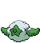

# #546 Cottonee (Cotton Puff Pokémon)

| Official Artwork | Shiny Artwork |
| --- | --- |
|  |  |

**Blaze Black:** When attacked, it escapes by shooting cotton from its body. The cotton serves as a decoy to distract the attacker.

**Volt White:** They go wherever the wind takes them. On rainy days, their bodies are heavier, so they take shelter beneath big trees.

---

## Media

### Default Sprites

| Front | Back | Front Shiny | Back Shiny |
| --- | --- | --- | --- |
|  |  |  |  |

### Cries

Latest (Gen VI+):

<audio controls>
<source src='../../assets/cries/cottonee/latest.ogg' type='audio/ogg'>
  Your browser does not support the audio element.
</audio>

Legacy:

<audio controls>
<source src='../../assets/cries/cottonee/legacy.ogg' type='audio/ogg'>
  Your browser does not support the audio element.
</audio>

---

## Pokédex Data

| National № | Type(s) | Height | Weight | Abilities | Local № |
|------------|---------|--------|--------|-----------|---------|
| #546 | {: width="48"} {: width="48"} | 0.3 m / 1.0 ft | 0.6 kg / 1.3 lbs |  | 1. Prankster 2. Infiltrator | #52 |

---

## Base Stats
|   | HP | Attack | Defense | Sp. Atk | Sp. Def | Speed |
|---|----|--------|---------|---------|---------|-------|
| **Base** | 40 | 27 | 60 | 37 | 50 | 66 |
| **Min** | 190 | 53 | 112 | 71 | 94 | 123 |
| **Max** | 284 | 168 | 240 | 190 | 218 | 254 |

The ranges shown above are for a level 100 Pokémon. Maximum values are based on a beneficial nature, 252 EVs, 31 IVs; minimum values are based on a hindering nature, 0 EVs, 0 IVs.

---

## Forms & Evolutions

!!! warning "WARNING"

    Information on evolutions may not be 100% accurate; differences between evolution methods across generations are not accounted for.

### Forms

Cottonee has no alternate forms.

### Evolution Line

1. [Cottonee](cottonee.md/)
    1. Use Item: [Whimsicott](whimsicott.md/)

---

## Training

| EV Yield | Catch Rate | Base Friendship | Base Exp. | Growth Rate | Held Items |
|----------|------------|-----------------|-----------|-------------|------------|
| 1 Spd | 190 | 50 | 56 | Mediu |

---

## Breeding

| Egg Groups | Egg Cycles | Gender | Dimorphic | Color | Shape |
|------------|------------|--------|-----------|-------|-------|
| 1. Plant 2. Fairy | 20 | 50.0% Male 50.0% Female | False | Green | Ball |

---

## Moves

!!! warning "WARNING"

    Specific move information may be incorrect. However, the general movepool should be accurate; this includes changes made in Blaze Black and Volt White.

### Level Up Moves

| Lv. | Move | Type | Cat. | Power | Acc. | PP |
| --- | --- | --- | --- | --- | --- | --- |
| 1 | Absorb | {: width="48"} | {: width="36"} | 50 | 100 | 25 |
| 4 | Growth | {: width="48"} | {: width="36"} | — | — | 20 |
| 8 | Leech Seed | {: width="48"} | {: width="36"} | — | 90 | 10 |
| 10 | Stun Spore | {: width="48"} | {: width="36"} | — | 75 | 30 |
| 13 | Mega Drain | {: width="48"} | {: width="36"} | 50 | 100 | 15 |
| 17 | Cotton Spore | {: width="48"} | {: width="36"} | — | 100 | 40 |
| 19 | Razor Leaf | {: width="48"} | {: width="36"} | 55 | 95 | 25 |
| 22 | Poison Powder | {: width="48"} | {: width="36"} | — | 75 | 35 |
| 26 | Giga Drain | {: width="48"} | {: width="36"} | 75 | 100 | 10 |
| 28 | Charm | {: width="48"} | {: width="36"} | — | 100 | 20 |
| 31 | Helping Hand | {: width="48"} | {: width="36"} | — | — | 20 |
| 35 | Energy Ball | {: width="48"} | {: width="36"} | 90 | 100 | 10 |
| 37 | Cotton Guard | {: width="48"} | {: width="36"} | — | — | 10 |
| 40 | Sunny Day | {: width="48"} | {: width="36"} | — | — | 5 |
| 44 | Endeavor | {: width="48"} | {: width="36"} | — | 100 | 5 |
| 46 | Solar Beam | {: width="48"} | {: width="36"} | 120 | 100 | 10 |

### TM Moves

| TM | Move | Type | Cat. | Power | Acc. | PP |
| --- | --- | --- | --- | --- | --- | --- |
| TM06 | Toxic | {: width="48"} | {: width="36"} | — | 90 | 10 |
| TM10 | Hidden Power | {: width="48"} | {: width="36"} | 60 | 100 | 15 |
| TM11 | Sunny Day | {: width="48"} | {: width="36"} | — | — | 5 |
| TM12 | Taunt | {: width="48"} | {: width="36"} | — | 100 | 20 |
| TM17 | Protect | {: width="48"} | {: width="36"} | — | — | 10 |
| TM20 | Safeguard | {: width="48"} | {: width="36"} | — | — | 25 |
| TM21 | Frustration | {: width="48"} | {: width="36"} | — | 100 | 20 |
| TM22 | Solar Beam | {: width="48"} | {: width="36"} | 120 | 100 | 10 |
| TM27 | Return | {: width="48"} | {: width="36"} | — | 100 | 20 |
| TM32 | Double Team | {: width="48"} | {: width="36"} | — | — | 15 |
| TM42 | Facade | {: width="48"} | {: width="36"} | 70 | 100 | 20 |
| TM44 | Rest | {: width="48"} | {: width="36"} | — | — | 5 |
| TM45 | Attract | {: width="48"} | {: width="36"} | — | 100 | 15 |
| TM48 | Round | {: width="48"} | {: width="36"} | 60 | 100 | 15 |
| TM53 | Energy Ball | {: width="48"} | {: width="36"} | 90 | 100 | 10 |
| TM70 | Flash | {: width="48"} | {: width="36"} | — | 100 | 20 |
| TM85 | Dream Eater | {: width="48"} | {: width="36"} | 100 | 100 | 15 |
| TM86 | Grass Knot | {: width="48"} | {: width="36"} | — | 100 | 20 |
| TM87 | Swagger | {: width="48"} | {: width="36"} | — | 85 | 15 |
| TM90 | Substitute | {: width="48"} | {: width="36"} | — | — | 10 |

### Egg Moves

| Move | Type | Cat. | Power | Acc. | PP |
| --- | --- | --- | --- | --- | --- |
| Encore | {: width="48"} | {: width="36"} | — | 100 | 5 |
| Beat Up | {: width="48"} | {: width="36"} | — | 100 | 10 |
| Memento | {: width="48"} | {: width="36"} | — | 100 | 10 |
| Fake Tears | {: width="48"} | {: width="36"} | — | 100 | 20 |
| Grass Whistle | {: width="48"} | {: width="36"} | — | 55 | 15 |
| Tickle | {: width="48"} | {: width="36"} | — | 100 | 20 |
| Natural Gift | {: width="48"} | {: width="36"} | — | 100 | 15 |
| Worry Seed | {: width="48"} | {: width="36"} | — | 100 | 10 |
| Switcheroo | {: width="48"} | {: width="36"} | — | 100 | 10 |

### Tutor Moves

Cottonee cannot learn any moves from tutors.
