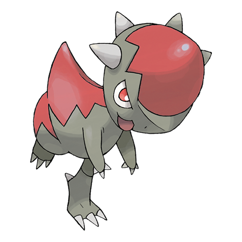
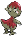

# #408 Cranidos (Head Butt Pokémon)

| Official Artwork | Shiny Artwork |
|------------------|---------------|
|  |  |

A lifelong jungle dweller from 100 million years ago, it would snap obstructing trees with head butts.

---

## Media

### Default Sprites

| Front | Shiny | Back | Shiny |
|-------|-------|------|-------|
|  |  |  |  |

### Cries

Latest (Gen VI+):

<audio controls>
<source src='../../assets/cries/cranidos/latest.ogg' type='audio/ogg'>
  Your browser does not support the audio element.
</audio>

Legacy:

<audio controls>
<source src='../../assets/cries/cranidos/legacy.ogg' type='audio/ogg'>
  Your browser does not support the audio element.
</audio>

---

## Pokédex Data

| National № | Type(s) | Height | Weight | Abilities | Local № |
|------------|---------|--------|--------|-----------|---------|
| #408 | {: width="48"} | 0.9 m / 3.0 ft | 31.5 kg / 69.4 lbs | 1. Mold Breaker 2. Sheer Force | #36 |

---

## Base Stats
|   | HP | Attack | Defense | Sp. Atk | Sp. Def | Speed |
|---|----|--------|---------|---------|---------|-------|
| **Base** | 67 | 125 | 40 | 30 | 30 | 58 |
| **Min** | 244 | 229 | 76 | 58 | 58 | 108 |
| **Max** | 338 | 383 | 196 | 174 | 174 | 236 |

The ranges shown above are for a level 100 Pokémon. Maximum values are based on a beneficial nature, 252 EVs, 31 IVs; minimum values are based on a hindering nature, 0 EVs, 0 IVs.

---

## Forms & Evolutions

!!! warning "WARNING"

    Information on evolutions may not be 100% accurate; differences between evolution methods across generations are not accounted for.

### Forms

Cranidos has no alternate forms.

### Evolution Line

1. [Cranidos](cranidos.md/)
    1. Level Up: [Rampardos](rampardos.md/)

---

## Training

| EV Yield | Catch Rate | Base Friendship | Base Exp. | Growth Rate | Held Items |
|----------|------------|-----------------|-----------|-------------|------------|
| 1 Atk | 45 | 70 | 70 | Slow Then Very Fast | N/A |

---

## Breeding

| Egg Groups | Egg Cycles | Gender | Dimorphic | Color | Shape |
|------------|------------|--------|-----------|-------|-------|
| 1. Monster | 30 | 87.5% Male 12.5% Female | False | Blue | Upright |

---

## Moves

!!! warning "WARNING"

    Specific move information may be incorrect. However, the general movepool should be accurate; this includes changes made in Blaze Black and Volt White.

### Level Up Moves

| Lv. | Move | Type | Cat. | Power | Acc. | PP |
| --- | --- | --- | --- | --- | --- | --- |
| 1 | Headbutt | {: width="48"} | {: width="36"} | 70 | 100 | 15 |
| 1 | Leer | {: width="48"} | {: width="36"} | — | 100 | 30 |
| 6 | Focus Energy | {: width="48"} | {: width="36"} | — | — | 30 |
| 10 | Pursuit | {: width="48"} | {: width="36"} | 40 | 100 | 20 |
| 15 | Take Down | {: width="48"} | {: width="36"} | 90 | 85 | 20 |
| 19 | Scary Face | {: width="48"} | {: width="36"} | — | 100 | 10 |
| 24 | Assurance | {: width="48"} | {: width="36"} | 60 | 100 | 10 |
| 28 | Chip Away | {: width="48"} | {: width="36"} | 70 | 100 | 20 |
| 33 | Ancient Power | {: width="48"} | {: width="36"} | 60 | 100 | 5 |
| 37 | Zen Headbutt | {: width="48"} | {: width="36"} | 80 | 90 | 15 |
| 42 | Screech | {: width="48"} | {: width="36"} | — | 85 | 40 |
| 46 | Head Smash | {: width="48"} | {: width="36"} | 150 | 80 | 5 |
| 50 | Crunch | {: width="48"} | {: width="36"} | 80 | 100 | 15 |
| 55 | Hammer Arm | {: width="48"} | {: width="36"} | 100 | 90 | 10 |

### TM Moves

| TM | Move | Type | Cat. | Power | Acc. | PP |
| --- | --- | --- | --- | --- | --- | --- |
| HM04 | Strength | {: width="48"} | {: width="36"} | 100 | 100 | 15 |
| TM05 | Roar | {: width="48"} | {: width="36"} | — | — | 20 |
| TM06 | Toxic | {: width="48"} | {: width="36"} | — | 90 | 10 |
| TM10 | Hidden Power | {: width="48"} | {: width="36"} | 60 | 100 | 15 |
| TM11 | Sunny Day | {: width="48"} | {: width="36"} | — | — | 5 |
| TM13 | Ice Beam | {: width="48"} | {: width="36"} | 90 | 100 | 10 |
| TM14 | Blizzard | {: width="48"} | {: width="36"} | 110 | 70 | 5 |
| TM17 | Protect | {: width="48"} | {: width="36"} | — | — | 10 |
| TM18 | Rain Dance | {: width="48"} | {: width="36"} | — | — | 5 |
| TM21 | Frustration | {: width="48"} | {: width="36"} | — | 100 | 20 |
| TM23 | Smack Down | {: width="48"} | {: width="36"} | 50 | 100 | 15 |
| TM24 | Thunderbolt | {: width="48"} | {: width="36"} | 90 | 100 | 15 |
| TM25 | Thunder | {: width="48"} | {: width="36"} | 110 | 70 | 10 |
| TM26 | Earthquake | {: width="48"} | {: width="36"} | 100 | 100 | 10 |
| TM27 | Return | {: width="48"} | {: width="36"} | — | 100 | 20 |
| TM28 | Dig | {: width="48"} | {: width="36"} | 100 | 100 | 10 |
| TM32 | Double Team | {: width="48"} | {: width="36"} | — | — | 15 |
| TM35 | Flamethrower | {: width="48"} | {: width="36"} | 90 | 100 | 15 |
| TM37 | Sandstorm | {: width="48"} | {: width="36"} | — | — | 10 |
| TM38 | Fire Blast | {: width="48"} | {: width="36"} | 110 | 85 | 5 |
| TM39 | Rock Tomb | {: width="48"} | {: width="36"} | 60 | 95 | 15 |
| TM42 | Facade | {: width="48"} | {: width="36"} | 70 | 100 | 20 |
| TM44 | Rest | {: width="48"} | {: width="36"} | — | — | 5 |
| TM45 | Attract | {: width="48"} | {: width="36"} | — | 100 | 15 |
| TM46 | Thief | {: width="48"} | {: width="36"} | 60 | 100 | 25 |
| TM48 | Round | {: width="48"} | {: width="36"} | 60 | 100 | 15 |
| TM56 | Fling | {: width="48"} | {: width="36"} | — | 100 | 10 |
| TM59 | Incinerate | {: width="48"} | {: width="36"} | 50 | 100 | 15 |
| TM66 | Payback | {: width="48"} | {: width="36"} | 50 | 100 | 10 |
| TM69 | Rock Polish | {: width="48"} | {: width="36"} | — | — | 20 |
| TM71 | Stone Edge | {: width="48"} | {: width="36"} | 100 | 80 | 5 |
| TM75 | Swords Dance | {: width="48"} | {: width="36"} | — | — | 20 |
| TM78 | Bulldoze | {: width="48"} | {: width="36"} | 80 | 100 | 20 |
| TM80 | Rock Slide | {: width="48"} | {: width="36"} | 75 | 90 | 10 |
| TM87 | Swagger | {: width="48"} | {: width="36"} | — | 85 | 15 |
| TM90 | Substitute | {: width="48"} | {: width="36"} | — | — | 10 |
| TM94 | Rock Smash | {: width="48"} | {: width="36"} | 60 | 100 | 15 |

### Egg Moves

| Move | Type | Cat. | Power | Acc. | PP |
| --- | --- | --- | --- | --- | --- |
| Whirlwind | {: width="48"} | {: width="36"} | — | — | 20 |
| Slam | {: width="48"} | {: width="36"} | 80 | 75 | 20 |
| Stomp | {: width="48"} | {: width="36"} | 65 | 100 | 20 |
| Thrash | {: width="48"} | {: width="36"} | 120 | 100 | 10 |
| Double Edge | {: width="48"} | {: width="36"} | 120 | 100 | 15 |
| Leer | {: width="48"} | {: width="36"} | — | 100 | 30 |
| Curse | {: width="48"} | {: width="36"} | — | — | 10 |
| Iron Tail | {: width="48"} | {: width="36"} | 100 | 75 | 15 |
| Crunch | {: width="48"} | {: width="36"} | 80 | 100 | 15 |
| Hammer Arm | {: width="48"} | {: width="36"} | 100 | 90 | 10 |
| Iron Head | {: width="48"} | {: width="36"} | 80 | 100 | 15 |

### Tutor Moves

Cranidos cannot learn any moves from tutors.
