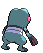

# #453 Croagunk (Toxic Mouth Pokémon)

| Official Artwork | Shiny Artwork |
| --- | --- |
|  |  |

It rarely fights fairly, but that is strictly to ensure survival. It is popular as a mascot.

---

## Media

### Sprites

| Front | Back | Front Shiny | Back Shiny |
| --- | --- | --- | --- |
|  |  |  |  |

### Female Sprites

| Front | Back | Front Shiny | Back Shiny |
| --- | --- | --- | --- |
|  |  |  |  |

### Cries

Latest (Gen VI+):

<audio controls>
<source src='../../assets/cries/croagunk/latest.ogg' type='audio/ogg'>
  Your browser does not support the audio element.
</audio>

Legacy:

<audio controls>
<source src='../../assets/cries/croagunk/legacy.ogg' type='audio/ogg'>
  Your browser does not support the audio element.
</audio>

---

## Pokédex Data

| National № | Type(s) | Height | Weight | Abilities | Local № |
|------------|---------|--------|--------|-----------|---------|
| #453 | {: width='48'} {: width='48'} | 0.7 m | 23.0 kg | 1. Poison-Touch 2. Dry-Skin | N/A |

---

## Base Stats
|   | HP | Attack | Defense | Sp. Atk | Sp. Def | Speed |
|---|----|--------|---------|---------|---------|-------|
| **Base** | 48 | 61 | 40 | 61 | 40 | 50 |
| **Min** | 206 | 114 | 76 | 114 | 76 | 94 |
| **Max** | 300 | 243 | 196 | 243 | 196 | 218 |

The ranges shown above are for a level 100 Pokémon. Maximum values are based on a beneficial nature, 252 EVs, 31 IVs; minimum values are based on a hindering nature, 0 EVs, 0 IVs.

---

## Forms & Evolutions

!!! warning "WARNING"

    Information on evolutions may not be 100% accurate; differences between evolution methods across generations are not accounted for.

### Forms

Croagunk has no alternate forms.

### Evolution Line

1. [Croagunk](croagunk.md/)
    1. Level Up: [Toxicroak](toxicroak.md/)

### Evolution Changes

---

## Training

| EV Yield | Catch Rate | Base Friendship | Base Exp. | Growth Rate | Held Items |
|----------|------------|-----------------|-----------|-------------|------------|
| 1 Attack | 140 | 100 | 60 | Medium | Black Sludge (5%) |

---

## Breeding

| Egg Groups | Egg Cycles | Gender | Dimorphic | Color | Shape |
|------------|------------|--------|-----------|-------|-------|
| 1. Humanshape | 10 | 50.0% Male 50.0% Female | True | Blue | Humanoid |

---

## Moves

!!! warning "WARNING"

    Specific move information may be incorrect. However, the general movepool should be accurate; this includes changes made in Blaze Black and Volt White.

### Level Up Moves

| Lv. | Move | Type | Cat. | Power | Acc. | PP |
| --- | --- | --- | --- | --- | --- | --- |
| 1 | Astonish | {: width='48'} | {: width='36'} | 30 | 100 | 15 |
| 3 | Mud Slap | {: width='48'} | {: width='36'} | 20 | 100 | 10 |
| 8 | Poison Sting | {: width='48'} | {: width='36'} | 15 | 100 | 35 |
| 10 | Taunt | {: width='48'} | {: width='36'} | — | 100 | 20 |
| 15 | Pursuit | {: width='48'} | {: width='36'} | 40 | 100 | 20 |
| 17 | Feint Attack | {: width='48'} | {: width='36'} | 60 | — | 20 |
| 22 | Revenge | {: width='48'} | {: width='36'} | 60 | 100 | 10 |
| 24 | Swagger | {: width='48'} | {: width='36'} | — | 85 | 15 |
| 26 | Drain Punch | {: width='48'} | {: width='36'} | 75 | 100 | 10 |
| 29 | Mud Bomb | {: width='48'} | {: width='36'} | 65 | 85 | 10 |
| 31 | Sucker Punch | {: width='48'} | {: width='36'} | 70 | 100 | 5 |
| 33 | Cross Chop | {: width='48'} | {: width='36'} | 100 | 80 | 5 |
| 36 | Venoshock | {: width='48'} | {: width='36'} | 65 | 100 | 10 |
| 38 | Nasty Plot | {: width='48'} | {: width='36'} | — | — | 20 |
| 43 | Poison Jab | {: width='48'} | {: width='36'} | 80 | 100 | 20 |
| 45 | Sludge Bomb | {: width='48'} | {: width='36'} | 90 | 100 | 10 |
| 50 | Flatter | {: width='48'} | {: width='36'} | — | 100 | 15 |
| 55 | Gunk Shot | {: width='48'} | {: width='36'} | 120 | 80 | 5 |

### TM Moves

| TM | Move | Type | Cat. | Power | Acc. | PP |
| --- | --- | --- | --- | --- | --- | --- |
| HM04 | Strength | {: width='48'} | {: width='36'} | 85 | 100 | 15 |
| TM06 | Toxic | {: width='48'} | {: width='36'} | — | 90 | 10 |
| TM08 | Bulk Up | {: width='48'} | {: width='36'} | — | — | 20 |
| TM09 | Venoshock | {: width='48'} | {: width='36'} | 65 | 100 | 10 |
| TM10 | Hidden Power | {: width='48'} | {: width='36'} | 60 | 100 | 15 |
| TM11 | Sunny Day | {: width='48'} | {: width='36'} | — | — | 5 |
| TM12 | Taunt | {: width='48'} | {: width='36'} | — | 100 | 20 |
| TM17 | Protect | {: width='48'} | {: width='36'} | — | — | 10 |
| TM18 | Rain Dance | {: width='48'} | {: width='36'} | — | — | 5 |
| TM21 | Frustration | {: width='48'} | {: width='36'} | — | 100 | 20 |
| TM26 | Earthquake | {: width='48'} | {: width='36'} | 100 | 100 | 10 |
| TM27 | Return | {: width='48'} | {: width='36'} | — | 100 | 20 |
| TM28 | Dig | {: width='48'} | {: width='36'} | 100 | 100 | 10 |
| TM30 | Shadow Ball | {: width='48'} | {: width='36'} | 90 | 100 | 15 |
| TM31 | Brick Break | {: width='48'} | {: width='36'} | 75 | 100 | 15 |
| TM32 | Double Team | {: width='48'} | {: width='36'} | — | — | 15 |
| TM34 | Sludge Wave | {: width='48'} | {: width='36'} | 95 | 100 | 10 |
| TM36 | Sludge Bomb | {: width='48'} | {: width='36'} | 90 | 100 | 10 |
| TM39 | Rock Tomb | {: width='48'} | {: width='36'} | 60 | 95 | 15 |
| TM41 | Torment | {: width='48'} | {: width='36'} | — | 100 | 15 |
| TM42 | Facade | {: width='48'} | {: width='36'} | 70 | 100 | 20 |
| TM44 | Rest | {: width='48'} | {: width='36'} | — | — | 5 |
| TM45 | Attract | {: width='48'} | {: width='36'} | — | 100 | 15 |
| TM46 | Thief | {: width='48'} | {: width='36'} | 60 | 100 | 25 |
| TM47 | Low Sweep | {: width='48'} | {: width='36'} | 65 | 100 | 20 |
| TM48 | Round | {: width='48'} | {: width='36'} | 60 | 100 | 15 |
| TM52 | Focus Blast | {: width='48'} | {: width='36'} | 120 | 70 | 5 |
| TM56 | Fling | {: width='48'} | {: width='36'} | — | 100 | 10 |
| TM63 | Embargo | {: width='48'} | {: width='36'} | — | 100 | 15 |
| TM66 | Payback | {: width='48'} | {: width='36'} | 50 | 100 | 10 |
| TM67 | Retaliate | {: width='48'} | {: width='36'} | 70 | 100 | 5 |
| TM78 | Bulldoze | {: width='48'} | {: width='36'} | 80 | 100 | 20 |
| TM80 | Rock Slide | {: width='48'} | {: width='36'} | 80 | 95 | 10 |
| TM81 | X Scissor | {: width='48'} | {: width='36'} | 80 | 100 | 15 |
| TM83 | Work Up | {: width='48'} | {: width='36'} | — | — | 30 |
| TM84 | Poison Jab | {: width='48'} | {: width='36'} | 80 | 100 | 20 |
| TM87 | Swagger | {: width='48'} | {: width='36'} | — | 85 | 15 |
| TM90 | Substitute | {: width='48'} | {: width='36'} | — | — | 10 |
| TM94 | Rock Smash | {: width='48'} | {: width='36'} | 40 | 100 | 15 |

### Egg Moves

| Move | Type | Cat. | Power | Acc. | PP |
| --- | --- | --- | --- | --- | --- |
| Headbutt | {: width='48'} | {: width='36'} | 70 | 100 | 15 |
| Counter | {: width='48'} | {: width='36'} | — | 100 | 20 |
| Meditate | {: width='48'} | {: width='36'} | — | — | 40 |
| Dynamic Punch | {: width='48'} | {: width='36'} | 100 | 50 | 5 |
| Fake Out | {: width='48'} | {: width='36'} | 40 | 100 | 10 |
| Smelling Salts | {: width='48'} | {: width='36'} | 70 | 100 | 10 |
| Wake Up Slap | {: width='48'} | {: width='36'} | 70 | 100 | 10 |
| Feint | {: width='48'} | {: width='36'} | 30 | 100 | 10 |
| Acupressure | {: width='48'} | {: width='36'} | — | — | 30 |
| Me First | {: width='48'} | {: width='36'} | — | — | 20 |
| Vacuum Wave | {: width='48'} | {: width='36'} | 40 | 100 | 30 |
| Bullet Punch | {: width='48'} | {: width='36'} | 40 | 100 | 30 |

### Tutor Moves

Croagunk cannot learn any moves from tutors.
