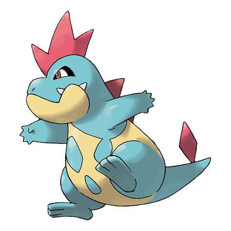
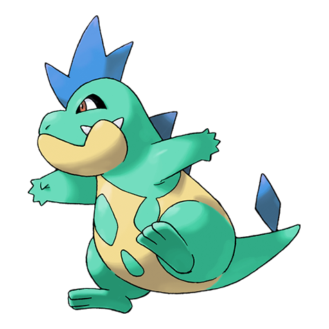

# #159 Croconaw (Big Jaw Pokémon)

| Official Artwork | Shiny Artwork |
| --- | --- |
|  |  |

Once it bites down, it won’t let go until it loses its fangs. New fangs quickly grow into place.

---

## Media

### Sprites

| Front | Back | Front Shiny | Back Shiny |
| --- | --- | --- | --- |
|  |  |  |  |

### Cries

Latest (Gen VI+):

<audio controls>
  <source src='../assets/cries/croconaw/latest.ogg' type='audio/ogg'>
  Your browser does not support the audio element.
</audio>

Legacy:

<audio controls>
  <source src='../assets/cries/croconaw/legacy.ogg' type='audio/ogg'>
  Your browser does not support the audio element.
</audio>

---

## Pokédex Data

| National № | Type(s) | Height | Weight | Abilities | Local № |
|------------|---------|--------|--------|-----------|---------|
| #159 | {: width='48'} | 1.1 m | 25.0 kg | 1. Torrent 2. Sheer-Force | #N/A |

---

## Base Stats
---

## Base Stats
|   | HP | Attack | Defense | Sp. Atk | Sp. Def | Speed |
|---|----|--------|---------|---------|---------|-------|
| **Base** | 65 | 80 | 80 | 59 | 63 | 58 |
| **Min** | 240 | 148 | 148 | 110 | 117 | 108 |
| **Max** | 334 | 284 | 284 | 238 | 247 | 236 |

The ranges shown above are for a level 100 Pokémon. Maximum values are based on a beneficial nature, 252 EVs, 31 IVs; minimum values are based on a hindering nature, 0 EVs, 0 IVs.

---

## Forms & Evolutions

!!! warning "WARNING"

    Some forms may not be available in Blaze Black/Volt White. Also information on evolutions may not be 100% accurate; it is currently quite complex to track generational evolution data.

### Forms

Croconaw has no alternate forms.

### Evolution Line

1. [Totodile](totodile.md/)
1. Level Up: [Croconaw](croconaw.md/)
1. Level Up: [Feraligatr](feraligatr.md/)

---

## Training

| EV Yield | Catch Rate | Base Friendship | Base Exp. | Growth Rate | Held Items |
|----------|------------|-----------------|-----------|-------------|------------|
| 1 Attack 1 Defense | 45 | 70 | 142 | Medium-Slow | N/A |

---

## Breeding

| Egg Groups | Egg Cycles | Gender | Dimorphic | Color | Shape |
|------------|------------|--------|-----------|-------|-------|
| 1. Monster 2. Water1 | 20 | 87.5% Male 12.5% Female | False | Blue | Upright |

---

## Moves

!!! warning "WARNING"

    Specific move information may be incorrect. However, the general movepool should be accurate (including changes to learnset).

### Level Up Moves

Lv. | Move | Type | Cat. | Power | Acc. | PP
--- | --- | --- | --- | --- | --- | ---
| 1 | Leer | {: width='48'} | {: width='36'} | — | 100 | 30 |
| 1 | Scratch | {: width='48'} | {: width='36'} | 40 | 100 | 35 |
| 1 | Water Gun | {: width='48'} | {: width='36'} | 40 | 100 | 25 |
| 6 | Water Gun | {: width='48'} | {: width='36'} | 40 | 100 | 25 |
| 8 | Rage | {: width='48'} | {: width='36'} | 20 | 100 | 20 |
| 13 | Bite | {: width='48'} | {: width='36'} | 60 | 100 | 25 |
| 15 | Scary Face | {: width='48'} | {: width='36'} | — | 100 | 10 |
| 21 | Ice Fang | {: width='48'} | {: width='36'} | 75 | 95 | 15 |
| 24 | Flail | {: width='48'} | {: width='36'} | — | 100 | 15 |
| 30 | Crunch | {: width='48'} | {: width='36'} | 80 | 100 | 15 |
| 33 | Chip Away | {: width='48'} | {: width='36'} | 70 | 100 | 20 |
| 39 | Slash | {: width='48'} | {: width='36'} | 70 | 100 | 20 |
| 42 | Screech | {: width='48'} | {: width='36'} | — | 85 | 40 |
| 48 | Thrash | {: width='48'} | {: width='36'} | 120 | 100 | 10 |
| 51 | Aqua Tail | {: width='48'} | {: width='36'} | 90 | 90 | 10 |
| 57 | Superpower | {: width='48'} | {: width='36'} | 120 | 100 | 5 |
| 60 | Hydro Pump | {: width='48'} | {: width='36'} | 110 | 80 | 5 |
| 64 | Dragon Dance | {: width='48'} | {: width='36'} | — | — | 20 |

### TM Moves

TM | Move | Type | Cat. | Power | Acc. | PP
--- | --- | --- | --- | --- | --- | ---
| HM01 | Cut | {: width='48'} | {: width='36'} | 60 | 100 | 20 |
| HM03 | Surf | {: width='48'} | {: width='36'} | 90 | 100 | 15 |
| HM04 | Strength | {: width='48'} | {: width='36'} | 85 | 100 | 15 |
| HM05 | Waterfall | {: width='48'} | {: width='36'} | 85 | 100 | 15 |
| HM06 | Dive | {: width='48'} | {: width='36'} | 100 | 100 | 10 |
| TM01 | Hone Claws | {: width='48'} | {: width='36'} | — | — | 15 |
| TM02 | Dragon Claw | {: width='48'} | {: width='36'} | 80 | 100 | 15 |
| TM05 | Roar | {: width='48'} | {: width='36'} | — | — | 20 |
| TM06 | Toxic | {: width='48'} | {: width='36'} | — | 90 | 10 |
| TM07 | Hail | {: width='48'} | {: width='36'} | — | — | 10 |
| TM10 | Hidden Power | {: width='48'} | {: width='36'} | 60 | 100 | 15 |
| TM13 | Ice Beam | {: width='48'} | {: width='36'} | 90 | 100 | 10 |
| TM14 | Blizzard | {: width='48'} | {: width='36'} | 110 | 70 | 5 |
| TM17 | Protect | {: width='48'} | {: width='36'} | — | — | 10 |
| TM18 | Rain Dance | {: width='48'} | {: width='36'} | — | — | 5 |
| TM21 | Frustration | {: width='48'} | {: width='36'} | — | 100 | 20 |
| TM27 | Return | {: width='48'} | {: width='36'} | — | 100 | 20 |
| TM28 | Dig | {: width='48'} | {: width='36'} | 100 | 100 | 10 |
| TM31 | Brick Break | {: width='48'} | {: width='36'} | 75 | 100 | 15 |
| TM32 | Double Team | {: width='48'} | {: width='36'} | — | — | 15 |
| TM39 | Rock Tomb | {: width='48'} | {: width='36'} | 60 | 95 | 15 |
| TM40 | Aerial Ace | {: width='48'} | {: width='36'} | 60 | — | 20 |
| TM42 | Facade | {: width='48'} | {: width='36'} | 70 | 100 | 20 |
| TM44 | Rest | {: width='48'} | {: width='36'} | — | — | 5 |
| TM45 | Attract | {: width='48'} | {: width='36'} | — | 100 | 15 |
| TM48 | Round | {: width='48'} | {: width='36'} | 60 | 100 | 15 |
| TM55 | Scald | {: width='48'} | {: width='36'} | 80 | 100 | 15 |
| TM56 | Fling | {: width='48'} | {: width='36'} | — | 100 | 10 |
| TM65 | Shadow Claw | {: width='48'} | {: width='36'} | 80 | 100 | 15 |
| TM75 | Swords Dance | {: width='48'} | {: width='36'} | — | — | 20 |
| TM80 | Rock Slide | {: width='48'} | {: width='36'} | 80 | 95 | 10 |
| TM87 | Swagger | {: width='48'} | {: width='36'} | — | 85 | 15 |
| TM90 | Substitute | {: width='48'} | {: width='36'} | — | — | 10 |
| TM94 | Rock Smash | {: width='48'} | {: width='36'} | 40 | 100 | 15 |

### Egg Moves

Croconaw cannot learn any moves by breeding.
### Tutor Moves

Move | Type | Cat. | Power | Acc. | PP
--- | --- | --- | --- | --- | ---
| Water Pledge | {: width='48'} | {: width='36'} | 100 | 100 | 10 |

