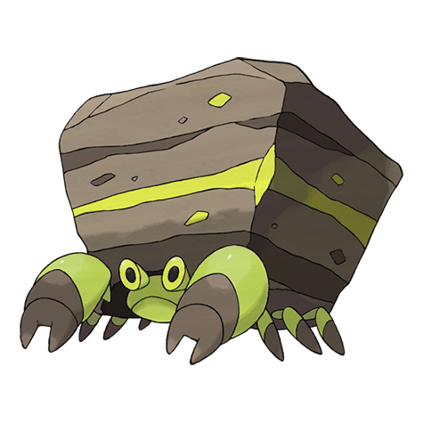

# #558 Crustle (Stone Home Pokémon)

| Official Artwork | Shiny Artwork |
| --- | --- |
|  |  |

**Blaze Black:** Competing for territory, Crustle fight viciously. The one whose boulder is broken is the loser of the battle.

**Volt White:** It possesses legs of enormous strength, enabling it to carry heavy slabs for many days, even when crossing arid land.

---

## Media

### Default Sprites

| Front | Back | Front Shiny | Back Shiny |
| --- | --- | --- | --- |
|  |  |  |  |

### Cries

Latest (Gen VI+):

<audio controls>
<source src='../../assets/cries/crustle/latest.ogg' type='audio/ogg'>
  Your browser does not support the audio element.
</audio>

Legacy:

<audio controls>
<source src='../../assets/cries/crustle/legacy.ogg' type='audio/ogg'>
  Your browser does not support the audio element.
</audio>

---

## Pokédex Data

| National № | Type(s) | Height | Weight | Abilities | Local № |
|------------|---------|--------|--------|-----------|---------|
| #558 | {: width='48'} {: width='48'} | 1.4 m | 200.0 kg | 1. Sturdy 2. Shell-Armor | #64 |

---

## Base Stats
|   | HP | Attack | Defense | Sp. Atk | Sp. Def | Speed |
|---|----|--------|---------|---------|---------|-------|
| **Base** | 70 | 105 | 125 | 65 | 75 | 45 |
| **Min** | 250 | 193 | 229 | 121 | 139 | 85 |
| **Max** | 344 | 339 | 383 | 251 | 273 | 207 |

The ranges shown above are for a level 100 Pokémon. Maximum values are based on a beneficial nature, 252 EVs, 31 IVs; minimum values are based on a hindering nature, 0 EVs, 0 IVs.

---

## Forms & Evolutions

!!! warning "WARNING"

    Information on evolutions may not be 100% accurate; differences between evolution methods across generations are not accounted for.

### Forms

Crustle has no alternate forms.

### Evolution Line

1. [Dwebble](dwebble.md/)
    1. Level Up: [Crustle](crustle.md/)

---

## Training

| EV Yield | Catch Rate | Base Friendship | Base Exp. | Growth Rate | Held Items |
|----------|------------|-----------------|-----------|-------------|------------|
| 2 Defense | 75 | 50 | 170 | Medium | rare-bone (1%) hard-stone (5%) |

---

## Breeding

| Egg Groups | Egg Cycles | Gender | Dimorphic | Color | Shape |
|------------|------------|--------|-----------|-------|-------|
| 1. Bug 2. Mineral | 20 | 50.0% Male 50.0% Female | False | Red | Armor |

---

## Moves

!!! warning "WARNING"

    Specific move information may be incorrect. However, the general movepool should be accurate; this includes changes made in Blaze Black and Volt White.

### Level Up Moves

| Lv. | Move | Type | Cat. | Power | Acc. | PP |
| --- | --- | --- | --- | --- | --- | --- |
| 1 | Rock Blast | {: width='48'} | {: width='36'} | 25 | 90 | 10 |
| 1 | Sand Attack | {: width='48'} | {: width='36'} | — | 100 | 15 |
| 1 | Shell Smash | {: width='48'} | {: width='36'} | — | — | 15 |
| 1 | Withdraw | {: width='48'} | {: width='36'} | — | — | 40 |
| 5 | Rock Blast | {: width='48'} | {: width='36'} | 25 | 90 | 10 |
| 7 | Withdraw | {: width='48'} | {: width='36'} | — | — | 40 |
| 11 | Sand Attack | {: width='48'} | {: width='36'} | — | 100 | 15 |
| 13 | Feint Attack | {: width='48'} | {: width='36'} | 60 | — | 20 |
| 17 | Smack Down | {: width='48'} | {: width='36'} | 50 | 100 | 15 |
| 19 | Rock Polish | {: width='48'} | {: width='36'} | — | — | 20 |
| 23 | Bug Bite | {: width='48'} | {: width='36'} | 60 | 100 | 20 |
| 24 | Stealth Rock | {: width='48'} | {: width='36'} | — | — | 20 |
| 29 | Rock Slide | {: width='48'} | {: width='36'} | 75 | 90 | 10 |
| 31 | Slash | {: width='48'} | {: width='36'} | 70 | 100 | 20 |
| 33 | Night Slash | {: width='48'} | {: width='36'} | 70 | 100 | 15 |
| 38 | X Scissor | {: width='48'} | {: width='36'} | 80 | 100 | 15 |
| 43 | Shell Smash | {: width='48'} | {: width='36'} | — | — | 15 |
| 50 | Flail | {: width='48'} | {: width='36'} | — | 100 | 15 |
| 55 | Rock Wrecker | {: width='48'} | {: width='36'} | 150 | 90 | 5 |

### TM Moves

| TM | Move | Type | Cat. | Power | Acc. | PP |
| --- | --- | --- | --- | --- | --- | --- |
| HM01 | Cut | {: width='48'} | {: width='36'} | 60 | 100% | 25 |
| HM04 | Strength | {: width='48'} | {: width='36'} | 100 | 100 | 15 |
| TM01 | Hone Claws | {: width='48'} | {: width='36'} | — | — | 15 |
| TM06 | Toxic | {: width='48'} | {: width='36'} | — | 90 | 10 |
| TM10 | Hidden Power | {: width='48'} | {: width='36'} | 60 | 100 | 15 |
| TM15 | Hyper Beam | {: width='48'} | {: width='36'} | 150 | 90 | 5 |
| TM17 | Protect | {: width='48'} | {: width='36'} | — | — | 10 |
| TM21 | Frustration | {: width='48'} | {: width='36'} | — | 100 | 20 |
| TM22 | Solar Beam | {: width='48'} | {: width='36'} | 120 | 100 | 10 |
| TM23 | Smack Down | {: width='48'} | {: width='36'} | 50 | 100 | 15 |
| TM26 | Earthquake | {: width='48'} | {: width='36'} | 100 | 100 | 10 |
| TM27 | Return | {: width='48'} | {: width='36'} | — | 100 | 20 |
| TM28 | Dig | {: width='48'} | {: width='36'} | 100 | 100 | 10 |
| TM32 | Double Team | {: width='48'} | {: width='36'} | — | — | 15 |
| TM37 | Sandstorm | {: width='48'} | {: width='36'} | — | — | 10 |
| TM39 | Rock Tomb | {: width='48'} | {: width='36'} | 60 | 95 | 15 |
| TM40 | Aerial Ace | {: width='48'} | {: width='36'} | 60 | — | 20 |
| TM42 | Facade | {: width='48'} | {: width='36'} | 70 | 100 | 20 |
| TM44 | Rest | {: width='48'} | {: width='36'} | — | — | 5 |
| TM45 | Attract | {: width='48'} | {: width='36'} | — | 100 | 15 |
| TM48 | Round | {: width='48'} | {: width='36'} | 60 | 100 | 15 |
| TM65 | Shadow Claw | {: width='48'} | {: width='36'} | 80 | 100 | 15 |
| TM68 | Giga Impact | {: width='48'} | {: width='36'} | 150 | 90 | 5 |
| TM69 | Rock Polish | {: width='48'} | {: width='36'} | — | — | 20 |
| TM71 | Stone Edge | {: width='48'} | {: width='36'} | 100 | 80 | 5 |
| TM75 | Swords Dance | {: width='48'} | {: width='36'} | — | — | 20 |
| TM76 | Struggle Bug | {: width='48'} | {: width='36'} | 50 | 100 | 20 |
| TM78 | Bulldoze | {: width='48'} | {: width='36'} | 80 | 100 | 20 |
| TM80 | Rock Slide | {: width='48'} | {: width='36'} | 75 | 90 | 10 |
| TM81 | X Scissor | {: width='48'} | {: width='36'} | 80 | 100 | 15 |
| TM84 | Poison Jab | {: width='48'} | {: width='36'} | 80 | 100 | 20 |
| TM87 | Swagger | {: width='48'} | {: width='36'} | — | 85 | 15 |
| TM90 | Substitute | {: width='48'} | {: width='36'} | — | — | 10 |
| TM94 | Rock Smash | {: width='48'} | {: width='36'} | 60 | 100 | 15 |

### Egg Moves

Crustle cannot learn any moves by breeding.
### Tutor Moves

Crustle cannot learn any moves from tutors.
