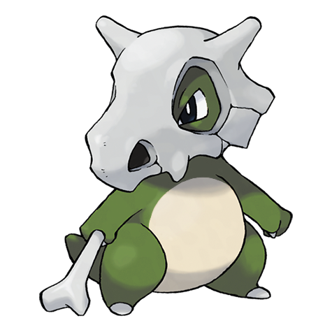

# #104 Cubone (Lonely Pokémon)

| Official Artwork | Shiny Artwork |
| --- | --- |
|  |  |

When it thinks of its dead mother, it cries. Its crying makes the skull it wears rattle hollowly.

---

## Media

### Sprites

| Front | Back | Front Shiny | Back Shiny |
| --- | --- | --- | --- |
|  |  |  |  |

### Cries

Latest (Gen VI+):

<audio controls>
<source src='../../assets/cries/cubone/latest.ogg' type='audio/ogg'>
  Your browser does not support the audio element.
</audio>

Legacy:

<audio controls>
<source src='../../assets/cries/cubone/legacy.ogg' type='audio/ogg'>
  Your browser does not support the audio element.
</audio>

---

## Pokédex Data

| National № | Type(s) | Height | Weight | Abilities | Local № |
|------------|---------|--------|--------|-----------|---------|
| #104 | {: width='48'} | 0.4 m | 6.5 kg | 1. Rock-Head 2. Mold-Breaker | N/A |

---

## Base Stats
|   | HP | Attack | Defense | Sp. Atk | Sp. Def | Speed |
|---|----|--------|---------|---------|---------|-------|
| **Base** | 50 | 50 | 95 | 40 | 50 | 35 |
| **Min** | 210 | 94 | 175 | 76 | 94 | 67 |
| **Max** | 304 | 218 | 317 | 196 | 218 | 185 |

The ranges shown above are for a level 100 Pokémon. Maximum values are based on a beneficial nature, 252 EVs, 31 IVs; minimum values are based on a hindering nature, 0 EVs, 0 IVs.

---

## Forms & Evolutions

!!! warning "WARNING"

    Information on evolutions may not be 100% accurate; differences between evolution methods across generations are not accounted for.

### Forms

Cubone has no alternate forms.

### Evolution Line

1. [Cubone](cubone.md/)
    1. Level Up: [Marowak](marowak.md/)

### Evolution Changes

---

## Training

| EV Yield | Catch Rate | Base Friendship | Base Exp. | Growth Rate | Held Items |
|----------|------------|-----------------|-----------|-------------|------------|
| 1 Defense | 190 | 50 | 64 | Medium | Thick Club (5%) |

---

## Breeding

| Egg Groups | Egg Cycles | Gender | Dimorphic | Color | Shape |
|------------|------------|--------|-----------|-------|-------|
| 1. Monster | 20 | 50.0% Male 50.0% Female | False | Brown | Upright |

---

## Moves

!!! warning "WARNING"

    Specific move information may be incorrect. However, the general movepool should be accurate; this includes changes made in Blaze Black and Volt White.

### Level Up Moves

| Lv. | Move | Type | Cat. | Power | Acc. | PP |
| --- | --- | --- | --- | --- | --- | --- |
| 1 | Growl | {: width='48'} | {: width='36'} | — | 100 | 40 |
| 3 | Tail Whip | {: width='48'} | {: width='36'} | — | 100 | 30 |
| 7 | Bone Club | {: width='48'} | {: width='36'} | 65 | 85 | 20 |
| 11 | Headbutt | {: width='48'} | {: width='36'} | 70 | 100 | 15 |
| 13 | Leer | {: width='48'} | {: width='36'} | — | 100 | 30 |
| 17 | Focus Energy | {: width='48'} | {: width='36'} | — | — | 30 |
| 21 | Bonemerang | {: width='48'} | {: width='36'} | 50 | 90 | 10 |
| 23 | Rage | {: width='48'} | {: width='36'} | 20 | 100 | 20 |
| 27 | False Swipe | {: width='48'} | {: width='36'} | 40 | 100 | 40 |
| 31 | Thrash | {: width='48'} | {: width='36'} | 120 | 100 | 10 |
| 33 | Fling | {: width='48'} | {: width='36'} | — | 100 | 10 |
| 37 | Bone Rush | {: width='48'} | {: width='36'} | 25 | 90 | 10 |
| 41 | Endeavor | {: width='48'} | {: width='36'} | — | 100 | 5 |
| 43 | Double Edge | {: width='48'} | {: width='36'} | 120 | 100 | 15 |
| 47 | Retaliate | {: width='48'} | {: width='36'} | 70 | 100 | 5 |
| 51 | Belly Drum | {: width='48'} | {: width='36'} | — | — | 10 |
| 55 | Perish Song | {: width='48'} | {: width='36'} | — | — | 5 |

### TM Moves

| TM | Move | Type | Cat. | Power | Acc. | PP |
| --- | --- | --- | --- | --- | --- | --- |
| HM04 | Strength | {: width='48'} | {: width='36'} | 85 | 100 | 15 |
| TM06 | Toxic | {: width='48'} | {: width='36'} | — | 90 | 10 |
| TM10 | Hidden Power | {: width='48'} | {: width='36'} | 60 | 100 | 15 |
| TM11 | Sunny Day | {: width='48'} | {: width='36'} | — | — | 5 |
| TM13 | Ice Beam | {: width='48'} | {: width='36'} | 90 | 100 | 10 |
| TM14 | Blizzard | {: width='48'} | {: width='36'} | 110 | 70 | 5 |
| TM17 | Protect | {: width='48'} | {: width='36'} | — | — | 10 |
| TM21 | Frustration | {: width='48'} | {: width='36'} | — | 100 | 20 |
| TM23 | Smack Down | {: width='48'} | {: width='36'} | 50 | 100 | 15 |
| TM26 | Earthquake | {: width='48'} | {: width='36'} | 100 | 100 | 10 |
| TM27 | Return | {: width='48'} | {: width='36'} | — | 100 | 20 |
| TM28 | Dig | {: width='48'} | {: width='36'} | 100 | 100 | 10 |
| TM31 | Brick Break | {: width='48'} | {: width='36'} | 75 | 100 | 15 |
| TM32 | Double Team | {: width='48'} | {: width='36'} | — | — | 15 |
| TM35 | Flamethrower | {: width='48'} | {: width='36'} | 90 | 100 | 15 |
| TM37 | Sandstorm | {: width='48'} | {: width='36'} | — | — | 10 |
| TM38 | Fire Blast | {: width='48'} | {: width='36'} | 110 | 85 | 5 |
| TM39 | Rock Tomb | {: width='48'} | {: width='36'} | 60 | 95 | 15 |
| TM40 | Aerial Ace | {: width='48'} | {: width='36'} | 60 | — | 20 |
| TM42 | Facade | {: width='48'} | {: width='36'} | 70 | 100 | 20 |
| TM44 | Rest | {: width='48'} | {: width='36'} | — | — | 5 |
| TM45 | Attract | {: width='48'} | {: width='36'} | — | 100 | 15 |
| TM46 | Thief | {: width='48'} | {: width='36'} | 60 | 100 | 25 |
| TM48 | Round | {: width='48'} | {: width='36'} | 60 | 100 | 15 |
| TM49 | Echoed Voice | {: width='48'} | {: width='36'} | 40 | 100 | 15 |
| TM54 | False Swipe | {: width='48'} | {: width='36'} | 40 | 100 | 40 |
| TM56 | Fling | {: width='48'} | {: width='36'} | — | 100 | 10 |
| TM59 | Incinerate | {: width='48'} | {: width='36'} | 50 | 100 | 15 |
| TM67 | Retaliate | {: width='48'} | {: width='36'} | 70 | 100 | 5 |
| TM75 | Swords Dance | {: width='48'} | {: width='36'} | — | — | 20 |
| TM78 | Bulldoze | {: width='48'} | {: width='36'} | 80 | 100 | 20 |
| TM80 | Rock Slide | {: width='48'} | {: width='36'} | 80 | 95 | 10 |
| TM87 | Swagger | {: width='48'} | {: width='36'} | — | 85 | 15 |
| TM90 | Substitute | {: width='48'} | {: width='36'} | — | — | 10 |
| TM94 | Rock Smash | {: width='48'} | {: width='36'} | 40 | 100 | 15 |

### Egg Moves

| Move | Type | Cat. | Power | Acc. | PP |
| --- | --- | --- | --- | --- | --- |
| Double Kick | {: width='48'} | {: width='36'} | 30 | 100 | 30 |
| Screech | {: width='48'} | {: width='36'} | — | 85 | 40 |
| Skull Bash | {: width='48'} | {: width='36'} | 130 | 100 | 10 |
| Belly Drum | {: width='48'} | {: width='36'} | — | — | 10 |
| Perish Song | {: width='48'} | {: width='36'} | — | — | 5 |
| Detect | {: width='48'} | {: width='36'} | — | — | 5 |
| Endure | {: width='48'} | {: width='36'} | — | — | 10 |
| Ancient Power | {: width='48'} | {: width='36'} | 60 | 100 | 5 |
| Iron Head | {: width='48'} | {: width='36'} | 80 | 100 | 15 |
| Chip Away | {: width='48'} | {: width='36'} | 70 | 100 | 20 |

### Tutor Moves

Cubone cannot learn any moves from tutors.
