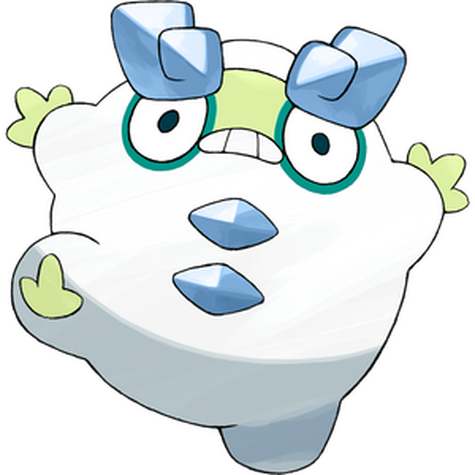
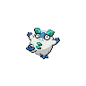
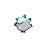
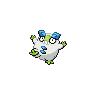
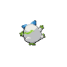

# #10176 Darumaka Galar (Zen Charm Pokémon)

| Official Artwork | Shiny Artwork |
| --- | --- |
|  |  |

**Blaze Black:** When its internal fire is burning, it cannot calm down and it runs around. When the fire diminishes, it falls asleep.

**Volt White:** Darumaka’s droppings are hot, so people used to put them in their clothes to keep themselves warm.

---

## Media

### Sprites

| Front | Back | Front Shiny | Back Shiny |
| --- | --- | --- | --- |
|  |  |  |  |

### Cries

Latest (Gen VI+):

<audio controls>
  <source src='../assets/cries/darumaka-galar/latest.ogg' type='audio/ogg'>
  Your browser does not support the audio element.
</audio>

---

## Pokédex Data

| National № | Type(s) | Height | Weight | Abilities | Local № |
|------------|---------|--------|--------|-----------|---------|
| #10176 | {: width='48'} | 0.7 m | 40.0 kg | 1. Hustle 2. Inner-Focus | #60 |

---

## Base Stats
---

## Base Stats
|   | HP | Attack | Defense | Sp. Atk | Sp. Def | Speed |
|---|----|--------|---------|---------|---------|-------|
| **Base** | 70 | 90 | 45 | 15 | 45 | 50 |
| **Min** | 250 | 166 | 85 | 31 | 85 | 94 |
| **Max** | 344 | 306 | 207 | 141 | 207 | 218 |

The ranges shown above are for a level 100 Pokémon. Maximum values are based on a beneficial nature, 252 EVs, 31 IVs; minimum values are based on a hindering nature, 0 EVs, 0 IVs.

---

## Forms & Evolutions

!!! warning "WARNING"

    Some forms may not be available in Blaze Black/Volt White. Also information on evolutions may not be 100% accurate; it is currently quite complex to track generational evolution data.

### Forms

1. [Darumaka](darumaka.md/)
2. [Darumaka-Galar](darumaka-galar.md/)

### Evolution Line

1. [Darumaka](darumaka.md/)
1. Use Item: [Darmanitan-Galar-Standard](darmanitan-galar-standard.md/)

    1. Use Item: [Darmanitan-Galar-Zen](darmanitan-galar-zen.md/)

    1. Use Item: [Darmanitan-Standard](darmanitan-standard.md/)

    1. Use Item: [Darmanitan-Zen](darmanitan-zen.md/)

---

## Training

| EV Yield | Catch Rate | Base Friendship | Base Exp. | Growth Rate | Held Items |
|----------|------------|-----------------|-----------|-------------|------------|
| 1 Attack | 120 | 50 | 63 | Medium-Slow | N/A |

---

## Breeding

| Egg Groups | Egg Cycles | Gender | Dimorphic | Color | Shape |
|------------|------------|--------|-----------|-------|-------|
| 1. Ground | 20 | 50.0% Male 50.0% Female | False | Red | Humanoid |

---

## Moves

!!! warning "WARNING"

    Specific move information may be incorrect. However, the general movepool should be accurate (including changes to learnset).

### Level Up Moves

Lv. | Move | Type | Cat. | Power | Acc. | PP
--- | --- | --- | --- | --- | --- | ---
| 1 | Powder Snow | {: width='48'} | {: width='36'} | 40 | 100 | 25 |
| 1 | Tackle | {: width='48'} | {: width='36'} | 40 | 100 | 35 |
| 4 | Taunt | {: width='48'} | {: width='36'} | — | 100 | 20 |
| 8 | Bite | {: width='48'} | {: width='36'} | 60 | 100 | 25 |
| 12 | Avalanche | {: width='48'} | {: width='36'} | 60 | 100 | 10 |
| 16 | Work Up | {: width='48'} | {: width='36'} | — | — | 30 |
| 20 | Ice Fang | {: width='48'} | {: width='36'} | 75 | 95 | 15 |
| 24 | Headbutt | {: width='48'} | {: width='36'} | 70 | 100 | 15 |
| 28 | Ice Punch | {: width='48'} | {: width='36'} | 80 | 100 | 15 |
| 32 | Uproar | {: width='48'} | {: width='36'} | 90 | 100 | 10 |
| 36 | Belly Drum | {: width='48'} | {: width='36'} | — | — | 10 |
| 40 | Blizzard | {: width='48'} | {: width='36'} | 110 | 70 | 5 |
| 44 | Thrash | {: width='48'} | {: width='36'} | 120 | 100 | 10 |
| 48 | Superpower | {: width='48'} | {: width='36'} | 120 | 100 | 5 |

### TM Moves

TM | Move | Type | Cat. | Power | Acc. | PP
--- | --- | --- | --- | --- | --- | ---
| TM00 | Mega Punch | {: width='48'} | {: width='36'} | 80 | 85 | 20 |
| TM01 | Mega Kick | {: width='48'} | {: width='36'} | 120 | 75 | 5 |
| TM03 | Fire Punch | {: width='48'} | {: width='36'} | 80 | 100 | 15 |
| TM04 | Ice Punch | {: width='48'} | {: width='36'} | 80 | 100 | 15 |
| TM11 | Solar Beam | {: width='48'} | {: width='36'} | 120 | 100 | 10 |
| TM13 | Fire Spin | {: width='48'} | {: width='36'} | 35 | 85 | 15 |
| TM15 | Dig | {: width='48'} | {: width='36'} | 100 | 100 | 10 |
| TM21 | Rest | {: width='48'} | {: width='36'} | — | — | 5 |
| TM22 | Rock Slide | {: width='48'} | {: width='36'} | 80 | 95 | 10 |
| TM23 | Thief | {: width='48'} | {: width='36'} | 60 | 100 | 25 |
| TM24 | Snore | {: width='48'} | {: width='36'} | 50 | 100 | 15 |
| TM25 | Protect | {: width='48'} | {: width='36'} | — | — | 10 |
| TM31 | Attract | {: width='48'} | {: width='36'} | — | 100 | 15 |
| TM34 | Sunny Day | {: width='48'} | {: width='36'} | — | — | 5 |
| TM38 | Will O Wisp | {: width='48'} | {: width='36'} | — | 85 | 15 |
| TM39 | Facade | {: width='48'} | {: width='36'} | 70 | 100 | 20 |
| TM43 | Brick Break | {: width='48'} | {: width='36'} | 75 | 100 | 15 |
| TM48 | Rock Tomb | {: width='48'} | {: width='36'} | 60 | 95 | 15 |
| TM56 | U Turn | {: width='48'} | {: width='36'} | 70 | 100 | 20 |
| TM59 | Fling | {: width='48'} | {: width='36'} | — | 100 | 10 |
| TM64 | Avalanche | {: width='48'} | {: width='36'} | 60 | 100 | 10 |
| TM67 | Ice Fang | {: width='48'} | {: width='36'} | 75 | 95 | 15 |
| TM68 | Fire Fang | {: width='48'} | {: width='36'} | 75 | 95 | 15 |
| TM76 | Round | {: width='48'} | {: width='36'} | 60 | 100 | 15 |
| TR02 | Flamethrower | {: width='48'} | {: width='36'} | 90 | 100 | 15 |
| TR05 | Ice Beam | {: width='48'} | {: width='36'} | 90 | 100 | 10 |
| TR06 | Blizzard | {: width='48'} | {: width='36'} | 110 | 70 | 5 |
| TR13 | Focus Energy | {: width='48'} | {: width='36'} | — | — | 30 |
| TR15 | Fire Blast | {: width='48'} | {: width='36'} | 110 | 85 | 5 |
| TR20 | Substitute | {: width='48'} | {: width='36'} | — | — | 10 |
| TR26 | Endure | {: width='48'} | {: width='36'} | — | — | 10 |
| TR27 | Sleep Talk | {: width='48'} | {: width='36'} | — | — | 10 |
| TR30 | Encore | {: width='48'} | {: width='36'} | — | 100 | 5 |
| TR35 | Uproar | {: width='48'} | {: width='36'} | 90 | 100 | 10 |
| TR36 | Heat Wave | {: width='48'} | {: width='36'} | 95 | 90 | 10 |
| TR37 | Taunt | {: width='48'} | {: width='36'} | — | 100 | 20 |
| TR39 | Superpower | {: width='48'} | {: width='36'} | 120 | 100 | 5 |
| TR43 | Overheat | {: width='48'} | {: width='36'} | 130 | 90 | 5 |
| TR52 | Gyro Ball | {: width='48'} | {: width='36'} | — | 100 | 5 |
| TR55 | Flare Blitz | {: width='48'} | {: width='36'} | 120 | 100 | 15 |
| TR69 | Zen Headbutt | {: width='48'} | {: width='36'} | 80 | 90 | 15 |
| TR77 | Grass Knot | {: width='48'} | {: width='36'} | — | 100 | 20 |
| TR85 | Work Up | {: width='48'} | {: width='36'} | — | — | 30 |

### Egg Moves

Move | Type | Cat. | Power | Acc. | PP
--- | --- | --- | --- | --- | ---
| Take Down | {: width='48'} | {: width='36'} | 90 | 85 | 20 |
| Flame Wheel | {: width='48'} | {: width='36'} | 75 | 100 | 25 |
| Focus Punch | {: width='48'} | {: width='36'} | 150 | 100 | 20 |
| Yawn | {: width='48'} | {: width='36'} | — | — | 10 |
| Hammer Arm | {: width='48'} | {: width='36'} | 100 | 90 | 10 |
| Incinerate | {: width='48'} | {: width='36'} | 50 | 100 | 15 |
| Freeze Dry | {: width='48'} | {: width='36'} | 70 | 100 | 20 |
| Power Up Punch | {: width='48'} | {: width='36'} | 40 | 100 | 20 |

### Tutor Moves

Darumaka Galar cannot learn any moves from tutors.
