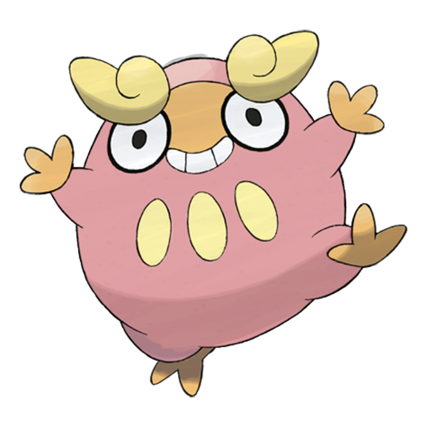

# #554 Darumaka (Zen Charm Pokémon)

| Official Artwork | Shiny Artwork |
| --- | --- |
|  |  |

**Blaze Black:** When its internal fire is burning, it cannot calm down and it runs around. When the fire diminishes, it falls asleep.

**Volt White:** Darumaka’s droppings are hot, so people used to put them in their clothes to keep themselves warm.

---

## Media

### Default Sprites

| Front | Back | Front Shiny | Back Shiny |
| --- | --- | --- | --- |
|  |  |  |  |

### Cries

Latest (Gen VI+):

<audio controls>
<source src='../../assets/cries/darumaka/latest.ogg' type='audio/ogg'>
  Your browser does not support the audio element.
</audio>

Legacy:

<audio controls>
<source src='../../assets/cries/darumaka/legacy.ogg' type='audio/ogg'>
  Your browser does not support the audio element.
</audio>

---

## Pokédex Data

| National № | Type(s) | Height | Weight | Abilities | Local № |
|------------|---------|--------|--------|-----------|---------|
| #554 | {: width="48"} | 0.6 m / 2.0 ft | 37.5 kg / 82.7 lbs | Hustle Rattled | #60 |

---

## Base Stats
|   | HP | Attack | Defense | Sp. Atk | Sp. Def | Speed |
|---|----|--------|---------|---------|---------|-------|
| **Base** | 70 | 90 | 45 | 15 | 45 | 50 |
| **Min** | 250 | 166 | 85 | 31 | 85 | 94 |
| **Max** | 344 | 306 | 207 | 141 | 207 | 218 |

The ranges shown above are for a level 100 Pokémon. Maximum values are based on a beneficial nature, 252 EVs, 31 IVs; minimum values are based on a hindering nature, 0 EVs, 0 IVs.

---

## Forms & Evolutions

!!! warning "WARNING"

    Information on evolutions may not be 100% accurate; differences between evolution methods across generations are not accounted for.

### Forms

Darumaka has no alternate forms.

### Evolution Line

1. [Darumaka](darumaka.md/)
    1. Use Item: [Darmanitan Standard](darmanitan-standard.md/)

    1. Use Item: [Darmanitan Zen](darmanitan-zen.md/)

---

## Training

| EV Yield | Catch Rate | Base Friendship | Base Exp. | Growth Rate | Held Items |
|----------|------------|-----------------|-----------|-------------|------------|
| 1 Attack | 120 | 50 | 63 | Medium Slow | Rawst Berry (50%) |

---

## Breeding

| Egg Groups | Egg Cycles | Gender | Dimorphic | Color | Shape |
|------------|------------|--------|-----------|-------|-------|
| 1. Ground | 20 | 50.0% Male 50.0% Female | False | Red | Humanoid |

---

## Moves

!!! warning "WARNING"

    Specific move information may be incorrect. However, the general movepool should be accurate; this includes changes made in Blaze Black and Volt White.

### Level Up Moves

| Lv. | Move | Type | Cat. | Power | Acc. | PP |
| --- | --- | --- | --- | --- | --- | --- |
| 1 | Tackle | {: width="48"} | {: width="36"} | 40 | 100 | 35 |
| 1 | Yawn | {: width="48"} | {: width="36"} | — | — | 10 |
| 3 | Rollout | {: width="48"} | {: width="36"} | 30 | 90 | 20 |
| 6 | Incinerate | {: width="48"} | {: width="36"} | 50 | 100 | 15 |
| 9 | Rage | {: width="48"} | {: width="36"} | 20 | 100 | 20 |
| 11 | Fire Fang | {: width="48"} | {: width="36"} | 75 | 95 | 15 |
| 14 | Headbutt | {: width="48"} | {: width="36"} | 70 | 100 | 15 |
| 17 | Uproar | {: width="48"} | {: width="36"} | 90 | 100 | 10 |
| 19 | Facade | {: width="48"} | {: width="36"} | 70 | 100 | 20 |
| 22 | Fire Punch | {: width="48"} | {: width="36"} | 80 | 100 | 15 |
| 25 | Work Up | {: width="48"} | {: width="36"} | — | — | 30 |
| 27 | Thrash | {: width="48"} | {: width="36"} | 120 | 100 | 10 |
| 30 | Belly Drum | {: width="48"} | {: width="36"} | — | — | 10 |
| 33 | Flare Blitz | {: width="48"} | {: width="36"} | 120 | 100 | 15 |
| 35 | Taunt | {: width="48"} | {: width="36"} | — | 100 | 20 |
| 39 | Superpower | {: width="48"} | {: width="36"} | 120 | 100 | 5 |
| 42 | Overheat | {: width="48"} | {: width="36"} | 130 | 90 | 5 |

### TM Moves

| TM | Move | Type | Cat. | Power | Acc. | PP |
| --- | --- | --- | --- | --- | --- | --- |
| HM04 | Strength | {: width="48"} | {: width="36"} | 100 | 100 | 15 |
| TM05 | Roar | {: width="48"} | {: width="36"} | — | — | 20 |
| TM06 | Toxic | {: width="48"} | {: width="36"} | — | 90 | 10 |
| TM10 | Hidden Power | {: width="48"} | {: width="36"} | 60 | 100 | 15 |
| TM11 | Sunny Day | {: width="48"} | {: width="36"} | — | — | 5 |
| TM12 | Taunt | {: width="48"} | {: width="36"} | — | 100 | 20 |
| TM17 | Protect | {: width="48"} | {: width="36"} | — | — | 10 |
| TM21 | Frustration | {: width="48"} | {: width="36"} | — | 100 | 20 |
| TM22 | Solar Beam | {: width="48"} | {: width="36"} | 120 | 100 | 10 |
| TM27 | Return | {: width="48"} | {: width="36"} | — | 100 | 20 |
| TM28 | Dig | {: width="48"} | {: width="36"} | 100 | 100 | 10 |
| TM31 | Brick Break | {: width="48"} | {: width="36"} | 75 | 100 | 15 |
| TM32 | Double Team | {: width="48"} | {: width="36"} | — | — | 15 |
| TM35 | Flamethrower | {: width="48"} | {: width="36"} | 90 | 100 | 15 |
| TM38 | Fire Blast | {: width="48"} | {: width="36"} | 110 | 85 | 5 |
| TM39 | Rock Tomb | {: width="48"} | {: width="36"} | 60 | 95 | 15 |
| TM42 | Facade | {: width="48"} | {: width="36"} | 70 | 100 | 20 |
| TM43 | Flame Charge | {: width="48"} | {: width="36"} | 50 | 100 | 20 |
| TM44 | Rest | {: width="48"} | {: width="36"} | — | — | 5 |
| TM45 | Attract | {: width="48"} | {: width="36"} | — | 100 | 15 |
| TM46 | Thief | {: width="48"} | {: width="36"} | 60 | 100 | 25 |
| TM48 | Round | {: width="48"} | {: width="36"} | 60 | 100 | 15 |
| TM50 | Overheat | {: width="48"} | {: width="36"} | 130 | 90 | 5 |
| TM56 | Fling | {: width="48"} | {: width="36"} | — | 100 | 10 |
| TM59 | Incinerate | {: width="48"} | {: width="36"} | 50 | 100 | 15 |
| TM61 | Will O Wisp | {: width="48"} | {: width="36"} | — | 85 | 15 |
| TM74 | Gyro Ball | {: width="48"} | {: width="36"} | — | 100 | 5 |
| TM80 | Rock Slide | {: width="48"} | {: width="36"} | 75 | 90 | 10 |
| TM83 | Work Up | {: width="48"} | {: width="36"} | — | — | 30 |
| TM86 | Grass Knot | {: width="48"} | {: width="36"} | — | 100 | 20 |
| TM87 | Swagger | {: width="48"} | {: width="36"} | — | 85 | 15 |
| TM89 | U Turn | {: width="48"} | {: width="36"} | 70 | 100 | 20 |
| TM90 | Substitute | {: width="48"} | {: width="36"} | — | — | 10 |
| TM94 | Rock Smash | {: width="48"} | {: width="36"} | 60 | 100 | 15 |

### Egg Moves

| Move | Type | Cat. | Power | Acc. | PP |
| --- | --- | --- | --- | --- | --- |
| Take Down | {: width="48"} | {: width="36"} | 90 | 85 | 20 |
| Focus Energy | {: width="48"} | {: width="36"} | — | — | 30 |
| Flame Wheel | {: width="48"} | {: width="36"} | 75 | 100 | 15 |
| Endure | {: width="48"} | {: width="36"} | — | — | 10 |
| Sleep Talk | {: width="48"} | {: width="36"} | — | — | 10 |
| Encore | {: width="48"} | {: width="36"} | — | 100 | 5 |
| Focus Punch | {: width="48"} | {: width="36"} | 150 | 100 | 20 |
| Yawn | {: width="48"} | {: width="36"} | — | — | 10 |
| Hammer Arm | {: width="48"} | {: width="36"} | 100 | 90 | 10 |

### Tutor Moves

Darumaka cannot learn any moves from tutors.
