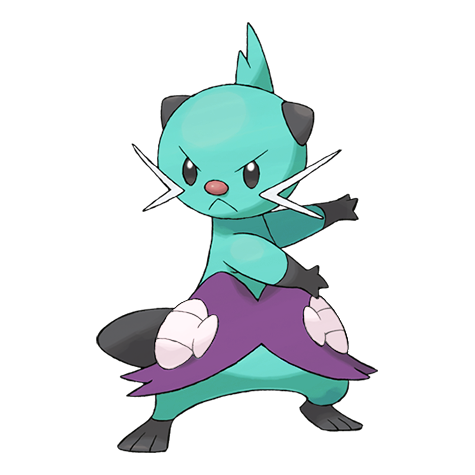

# Dewott (Discipline Pokémon)

| Official Artwork | Shiny Artwork |
| --- | --- |
|  |  |

**Blaze Black:** Strict training is how it learns its flowing double-scalchop technique.

**Volt White:** Scalchop techniques differ from one Dewott to another. It never neglects maintaining its scalchops.

---

## Media

### Default Sprites

| Front | Back | Front Shiny | Back Shiny |
| --- | --- | --- | --- |
|  |  |  |  |

### Cries

Latest (Gen VI+):

<audio controls>
<source src='../../assets/cries/dewott/latest.ogg' type='audio/ogg'>
  Your browser does not support the audio element.
</audio>

Legacy:

<audio controls>
<source src='../../assets/cries/dewott/legacy.ogg' type='audio/ogg'>
  Your browser does not support the audio element.
</audio>

---

## Pokédex Data

| National № | Type(s) | Height | Weight | Abilities | Local № |
|------------|---------|--------|--------|-----------|---------|
| #502 | {: width='48'} {: width='48'} | 0.8 m | 24.5 kg | 1. Torrent 2. Vital-Spirit | #8 |

---

## Base Stats
|   | HP | Attack | Defense | Sp. Atk | Sp. Def | Speed |
|---|----|--------|---------|---------|---------|-------|
| **Base** | 75 | 75 | 60 | 83 | 60 | 60 |
| **Min** | 260 | 139 | 112 | 153 | 112 | 112 |
| **Max** | 354 | 273 | 240 | 291 | 240 | 240 |

The ranges shown above are for a level 100 Pokémon. Maximum values are based on a beneficial nature, 252 EVs, 31 IVs; minimum values are based on a hindering nature, 0 EVs, 0 IVs.

---

## Forms & Evolutions

!!! warning "WARNING"

    Information on evolutions may not be 100% accurate; differences between evolution methods across generations are not accounted for.

### Forms

Dewott has no alternate forms.

### Evolution Line

1. [Oshawott](oshawott.md/)
    1. Level Up: [Dewott](dewott.md/)
        1. Level Up: [Samurott](samurott.md/)

---

## Training

| EV Yield | Catch Rate | Base Friendship | Base Exp. | Growth Rate | Held Items |
|----------|------------|-----------------|-----------|-------------|------------|
| 2 Special Attack | 45 | 70 | 145 | Medium-Slow | N/A |

---

## Breeding

| Egg Groups | Egg Cycles | Gender | Dimorphic | Color | Shape |
|------------|------------|--------|-----------|-------|-------|
| 1. Ground | 20 | 87.5% Male 12.5% Female | False | Blue | Upright |

---

## Moves

!!! warning "WARNING"

    Specific move information may be incorrect. However, the general movepool should be accurate; this includes changes made in Blaze Black and Volt White.

### Level Up Moves

| Lv. | Move | Type | Cat. | Power | Acc. | PP |
| --- | --- | --- | --- | --- | --- | --- |
| 1 | Tackle | {: width='48'} | {: width='36'} | 40 | 100 | 35 |
| 1 | Tail Whip | {: width='48'} | {: width='36'} | — | 100 | 30 |
| 1 | Water Gun | {: width='48'} | {: width='36'} | 40 | 100 | 25 |
| 1 | Water Sport | {: width='48'} | {: width='36'} | — | — | 15 |
| 5 | Tail Whip | {: width='48'} | {: width='36'} | — | 100 | 30 |
| 7 | Water Gun | {: width='48'} | {: width='36'} | 40 | 100 | 25 |
| 11 | Water Sport | {: width='48'} | {: width='36'} | — | — | 15 |
| 13 | Focus Energy | {: width='48'} | {: width='36'} | — | — | 30 |
| 17 | Karate Chop | {: width='48'} | {: width='36'} | 50 | 100 | 25 |
| 17 | Razor Shell | {: width='48'} | {: width='36'} | 75 | 95 | 10 |
| 20 | Fury Cutter | {: width='48'} | {: width='36'} | 40 | 95 | 20 |
| 25 | Water Pulse | {: width='48'} | {: width='36'} | 60 | 100 | 20 |
| 28 | Revenge | {: width='48'} | {: width='36'} | 60 | 100 | 10 |
| 33 | Aqua Jet | {: width='48'} | {: width='36'} | 40 | 100 | 20 |
| 36 | Encore | {: width='48'} | {: width='36'} | — | 100 | 5 |
| 41 | Aqua Tail | {: width='48'} | {: width='36'} | 90 | 90 | 10 |
| 44 | Retaliate | {: width='48'} | {: width='36'} | 70 | 100 | 5 |
| 49 | Swords Dance | {: width='48'} | {: width='36'} | — | — | 20 |
| 52 | Hydro Pump | {: width='48'} | {: width='36'} | 110 | 80 | 5 |
| 55 | Close Combat | {: width='48'} | {: width='36'} | 120 | 100 | 5 |

### TM Moves

| TM | Move | Type | Cat. | Power | Acc. | PP |
| --- | --- | --- | --- | --- | --- | --- |
| HM01 | Cut | {: width='48'} | {: width='36'} | 60 | 100% | 25 |
| HM03 | Surf | {: width='48'} | {: width='36'} | 90 | 100 | 15 |
| HM05 | Waterfall | {: width='48'} | {: width='36'} | 85 | 100 | 15 |
| HM06 | Dive | {: width='48'} | {: width='36'} | 80 | 100 | 10 |
| TM06 | Toxic | {: width='48'} | {: width='36'} | — | 90 | 10 |
| TM07 | Hail | {: width='48'} | {: width='36'} | — | — | 10 |
| TM10 | Hidden Power | {: width='48'} | {: width='36'} | 60 | 100 | 15 |
| TM12 | Taunt | {: width='48'} | {: width='36'} | — | 100 | 20 |
| TM13 | Ice Beam | {: width='48'} | {: width='36'} | 90 | 100 | 10 |
| TM14 | Blizzard | {: width='48'} | {: width='36'} | 110 | 70 | 5 |
| TM17 | Protect | {: width='48'} | {: width='36'} | — | — | 10 |
| TM18 | Rain Dance | {: width='48'} | {: width='36'} | — | — | 5 |
| TM21 | Frustration | {: width='48'} | {: width='36'} | — | 100 | 20 |
| TM27 | Return | {: width='48'} | {: width='36'} | — | 100 | 20 |
| TM28 | Dig | {: width='48'} | {: width='36'} | 100 | 100 | 10 |
| TM32 | Double Team | {: width='48'} | {: width='36'} | — | — | 15 |
| TM40 | Aerial Ace | {: width='48'} | {: width='36'} | 60 | — | 20 |
| TM42 | Facade | {: width='48'} | {: width='36'} | 70 | 100 | 20 |
| TM44 | Rest | {: width='48'} | {: width='36'} | — | — | 5 |
| TM45 | Attract | {: width='48'} | {: width='36'} | — | 100 | 15 |
| TM48 | Round | {: width='48'} | {: width='36'} | 60 | 100 | 15 |
| TM54 | False Swipe | {: width='48'} | {: width='36'} | 40 | 100 | 40 |
| TM55 | Scald | {: width='48'} | {: width='36'} | 80 | 100 | 15 |
| TM56 | Fling | {: width='48'} | {: width='36'} | — | 100 | 10 |
| TM67 | Retaliate | {: width='48'} | {: width='36'} | 70 | 100 | 5 |
| TM75 | Swords Dance | {: width='48'} | {: width='36'} | — | — | 20 |
| TM81 | X Scissor | {: width='48'} | {: width='36'} | 80 | 100 | 15 |
| TM86 | Grass Knot | {: width='48'} | {: width='36'} | — | 100 | 20 |
| TM87 | Swagger | {: width='48'} | {: width='36'} | — | 85 | 15 |
| TM90 | Substitute | {: width='48'} | {: width='36'} | — | — | 10 |
| TM94 | Rock Smash | {: width='48'} | {: width='36'} | 60 | 100 | 15 |

### Egg Moves

Dewott cannot learn any moves by breeding.
### Tutor Moves

| Move | Type | Cat. | Power | Acc. | PP |
| --- | --- | --- | --- | --- | --- |
| Water Pledge | {: width='48'} | {: width='36'} | 80 | 100 | 10 |

