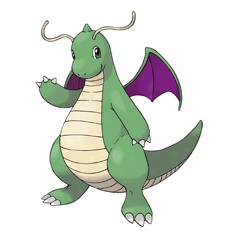

# #149 Dragonite (Dragon Pokémon)

| Official Artwork | Shiny Artwork |
| --- | --- |
|  |  |

It is said to make its home somewhere in the sea. It guides crews of shipwrecks to shore.

---

## Media

### Default Sprites

| Front | Back | Front Shiny | Back Shiny |
| --- | --- | --- | --- |
|  |  |  |  |

### Cries

Latest (Gen VI+):

<audio controls>
<source src='../../assets/cries/dragonite/latest.ogg' type='audio/ogg'>
  Your browser does not support the audio element.
</audio>

Legacy:

<audio controls>
<source src='../../assets/cries/dragonite/legacy.ogg' type='audio/ogg'>
  Your browser does not support the audio element.
</audio>

---

## Pokédex Data

| National № | Type(s) | Height | Weight | Abilities | Local № |
|------------|---------|--------|--------|-----------|---------|
| #149 | {: width='48'} {: width='48'} | 2.2 m | 210.0 kg | 1. Multiscale 2. Marvel-Scale | N/A |

---

## Base Stats
|   | HP | Attack | Defense | Sp. Atk | Sp. Def | Speed |
|---|----|--------|---------|---------|---------|-------|
| **Base** | 91 | 134 | 95 | 100 | 100 | 80 |
| **Min** | 292 | 245 | 175 | 184 | 184 | 148 |
| **Max** | 386 | 403 | 317 | 328 | 328 | 284 |

The ranges shown above are for a level 100 Pokémon. Maximum values are based on a beneficial nature, 252 EVs, 31 IVs; minimum values are based on a hindering nature, 0 EVs, 0 IVs.

---

## Forms & Evolutions

!!! warning "WARNING"

    Information on evolutions may not be 100% accurate; differences between evolution methods across generations are not accounted for.

### Forms

Dragonite has no alternate forms.

### Evolution Line

1. [Dratini](dratini.md/)
    1. Level Up: [Dragonair](dragonair.md/)
        1. Level Up: [Dragonite](dragonite.md/)

---

## Training

| EV Yield | Catch Rate | Base Friendship | Base Exp. | Growth Rate | Held Items |
|----------|------------|-----------------|-----------|-------------|------------|
| 3 Attack | 45 | 35 | 300 | Slow | dragon-scale (5%) |

---

## Breeding

| Egg Groups | Egg Cycles | Gender | Dimorphic | Color | Shape |
|------------|------------|--------|-----------|-------|-------|
| 1. Water1 2. Dragon | 40 | 50.0% Male 50.0% Female | False | Brown | Upright |

---

## Moves

!!! warning "WARNING"

    Specific move information may be incorrect. However, the general movepool should be accurate; this includes changes made in Blaze Black and Volt White.

### Level Up Moves

| Lv. | Move | Type | Cat. | Power | Acc. | PP |
| --- | --- | --- | --- | --- | --- | --- |
| 1 | Extreme Speed | {: width='48'} | {: width='36'} | 80 | 100 | 5 |
| 1 | Fire Punch | {: width='48'} | {: width='36'} | 80 | 100 | 15 |
| 1 | Hydro Pump | {: width='48'} | {: width='36'} | 110 | 80 | 5 |
| 1 | Leer | {: width='48'} | {: width='36'} | — | 100 | 30 |
| 1 | Roost | {: width='48'} | {: width='36'} | — | — | 5 |
| 1 | Thunder Punch | {: width='48'} | {: width='36'} | 80 | 100 | 15 |
| 1 | Thunder Wave | {: width='48'} | {: width='36'} | — | 90 | 20 |
| 1 | Hurricane | {: width='48'} | {: width='36'} | 50 | 70 | 10 |
| 1 | Wrap | {: width='48'} | {: width='36'} | 15 | 90 | 20 |
| 5 | Thunder Wave | {: width='48'} | {: width='36'} | — | 90 | 20 |
| 11 | Hurricane | {: width='48'} | {: width='36'} | 50 | 70 | 10 |
| 15 | Dragon Rage | {: width='48'} | {: width='36'} | — | 100 | 10 |
| 21 | Slam | {: width='48'} | {: width='36'} | 80 | 75 | 20 |
| 25 | Agility | {: width='48'} | {: width='36'} | — | — | 30 |
| 33 | Dragon Tail | {: width='48'} | {: width='36'} | 60 | 90 | 10 |
| 39 | Aqua Tail | {: width='48'} | {: width='36'} | 90 | 90 | 10 |
| 47 | Dragon Rush | {: width='48'} | {: width='36'} | 100 | 75 | 10 |
| 53 | Safeguard | {: width='48'} | {: width='36'} | — | — | 25 |
| 55 | Wing Attack | {: width='48'} | {: width='36'} | 75 | 100 | 35 |
| 61 | Dragon Dance | {: width='48'} | {: width='36'} | — | — | 20 |
| 67 | Outrage | {: width='48'} | {: width='36'} | 120 | 100 | 10 |
| 75 | Dragon Pulse | {: width='48'} | {: width='36'} | 85 | 100 | 10 |
| 81 | Hurricane | {: width='48'} | {: width='36'} | 110 | 70 | 10 |
| 89 | Hyper Beam | {: width='48'} | {: width='36'} | 150 | 90 | 5 |

### TM Moves

| TM | Move | Type | Cat. | Power | Acc. | PP |
| --- | --- | --- | --- | --- | --- | --- |
| HM01 | Cut | {: width='48'} | {: width='36'} | 60 | 100% | 25 |
| HM02 | Fly | {: width='48'} | {: width='36'} | 100 | 100% | 15 |
| HM03 | Surf | {: width='48'} | {: width='36'} | 90 | 100 | 15 |
| HM04 | Strength | {: width='48'} | {: width='36'} | 100 | 100 | 15 |
| HM05 | Waterfall | {: width='48'} | {: width='36'} | 85 | 100 | 15 |
| HM06 | Dive | {: width='48'} | {: width='36'} | 80 | 100 | 10 |
| TM01 | Hone Claws | {: width='48'} | {: width='36'} | — | — | 15 |
| TM02 | Dragon Claw | {: width='48'} | {: width='36'} | 80 | 100 | 15 |
| TM05 | Roar | {: width='48'} | {: width='36'} | — | — | 20 |
| TM06 | Toxic | {: width='48'} | {: width='36'} | — | 90 | 10 |
| TM07 | Hail | {: width='48'} | {: width='36'} | — | — | 10 |
| TM10 | Hidden Power | {: width='48'} | {: width='36'} | 60 | 100 | 15 |
| TM11 | Sunny Day | {: width='48'} | {: width='36'} | — | — | 5 |
| TM13 | Ice Beam | {: width='48'} | {: width='36'} | 90 | 100 | 10 |
| TM14 | Blizzard | {: width='48'} | {: width='36'} | 110 | 70 | 5 |
| TM15 | Hyper Beam | {: width='48'} | {: width='36'} | 150 | 90 | 5 |
| TM16 | Light Screen | {: width='48'} | {: width='36'} | — | — | 30 |
| TM17 | Protect | {: width='48'} | {: width='36'} | — | — | 10 |
| TM18 | Rain Dance | {: width='48'} | {: width='36'} | — | — | 5 |
| TM20 | Safeguard | {: width='48'} | {: width='36'} | — | — | 25 |
| TM21 | Frustration | {: width='48'} | {: width='36'} | — | 100 | 20 |
| TM24 | Thunderbolt | {: width='48'} | {: width='36'} | 90 | 100 | 15 |
| TM25 | Thunder | {: width='48'} | {: width='36'} | 110 | 70 | 10 |
| TM26 | Earthquake | {: width='48'} | {: width='36'} | 100 | 100 | 10 |
| TM27 | Return | {: width='48'} | {: width='36'} | — | 100 | 20 |
| TM31 | Brick Break | {: width='48'} | {: width='36'} | 75 | 100 | 15 |
| TM32 | Double Team | {: width='48'} | {: width='36'} | — | — | 15 |
| TM35 | Flamethrower | {: width='48'} | {: width='36'} | 90 | 100 | 15 |
| TM37 | Sandstorm | {: width='48'} | {: width='36'} | — | — | 10 |
| TM38 | Fire Blast | {: width='48'} | {: width='36'} | 110 | 85 | 5 |
| TM39 | Rock Tomb | {: width='48'} | {: width='36'} | 60 | 95 | 15 |
| TM40 | Aerial Ace | {: width='48'} | {: width='36'} | 60 | — | 20 |
| TM42 | Facade | {: width='48'} | {: width='36'} | 70 | 100 | 20 |
| TM44 | Rest | {: width='48'} | {: width='36'} | — | — | 5 |
| TM45 | Attract | {: width='48'} | {: width='36'} | — | 100 | 15 |
| TM48 | Round | {: width='48'} | {: width='36'} | 60 | 100 | 15 |
| TM52 | Focus Blast | {: width='48'} | {: width='36'} | 120 | 70 | 5 |
| TM56 | Fling | {: width='48'} | {: width='36'} | — | 100 | 10 |
| TM58 | Sky Drop | {: width='48'} | {: width='36'} | 80 | 100 | 10 |
| TM59 | Incinerate | {: width='48'} | {: width='36'} | 50 | 100 | 15 |
| TM68 | Giga Impact | {: width='48'} | {: width='36'} | 150 | 90 | 5 |
| TM71 | Stone Edge | {: width='48'} | {: width='36'} | 100 | 80 | 5 |
| TM73 | Thunder Wave | {: width='48'} | {: width='36'} | — | 90 | 20 |
| TM78 | Bulldoze | {: width='48'} | {: width='36'} | 80 | 100 | 20 |
| TM80 | Rock Slide | {: width='48'} | {: width='36'} | 75 | 90 | 10 |
| TM82 | Dragon Tail | {: width='48'} | {: width='36'} | 60 | 90 | 10 |
| TM87 | Swagger | {: width='48'} | {: width='36'} | — | 85 | 15 |
| TM90 | Substitute | {: width='48'} | {: width='36'} | — | — | 10 |
| TM94 | Rock Smash | {: width='48'} | {: width='36'} | 60 | 100 | 15 |

### Egg Moves

Dragonite cannot learn any moves by breeding.
### Tutor Moves

| Move | Type | Cat. | Power | Acc. | PP |
| --- | --- | --- | --- | --- | --- |
| Draco Meteor | {: width='48'} | {: width='36'} | 130 | 90 | 5 |

